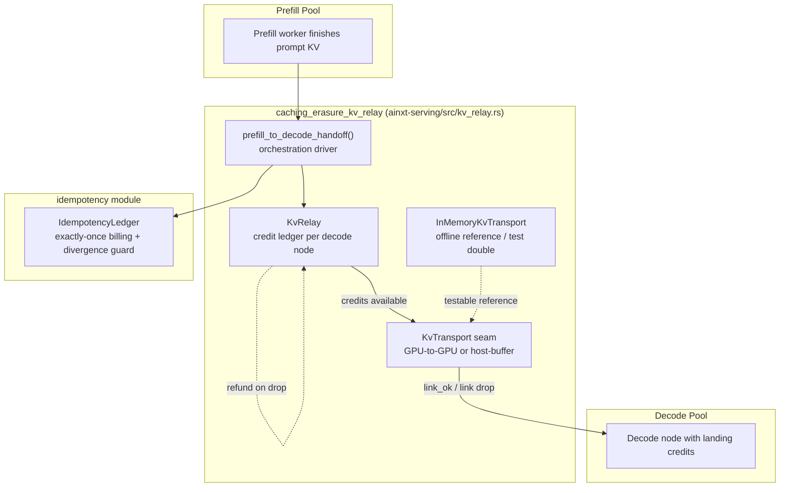
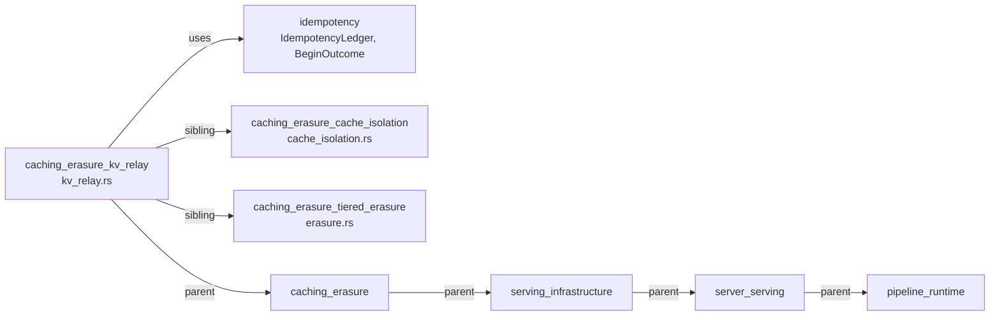
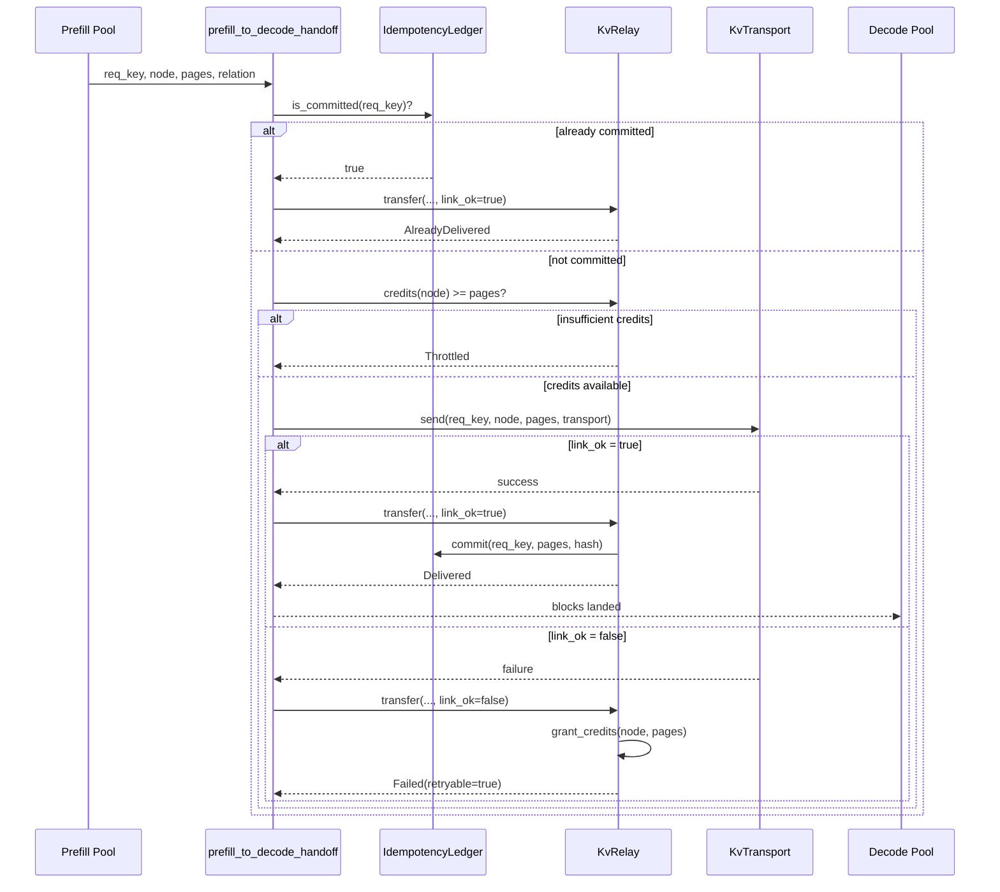
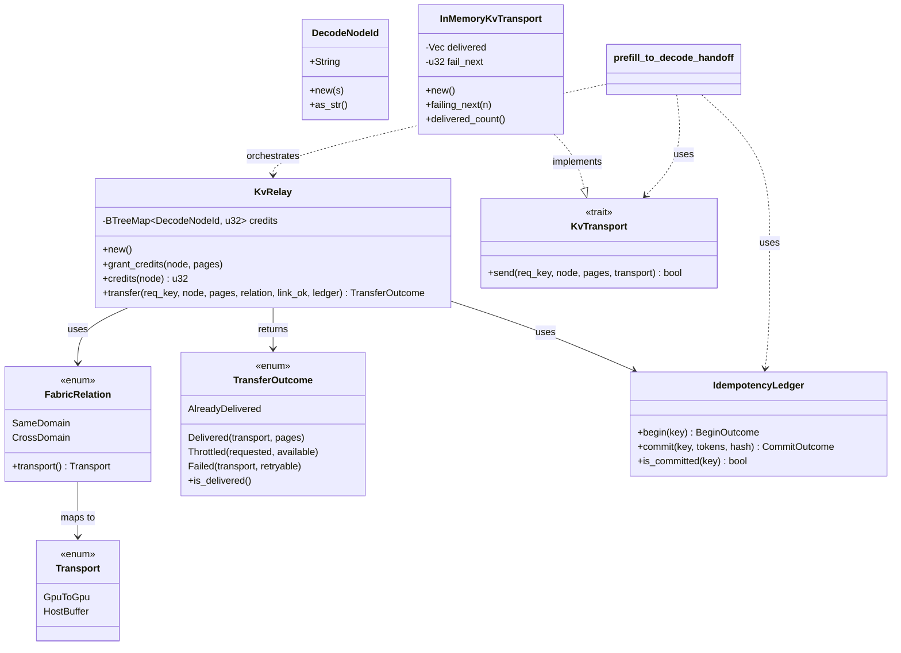
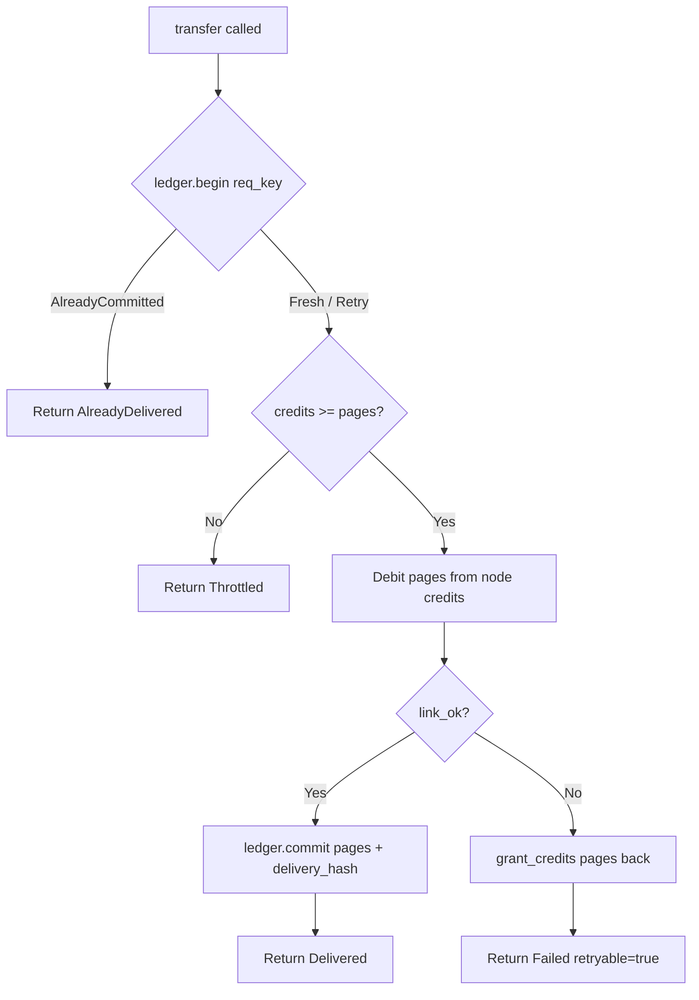

# caching_erasure_kv_relay

## Brief Introduction

The `caching_erasure_kv_relay` module implements the **disaggregated prefill→decode KV-cache relay** for the serving infrastructure. In modern LLM serving, prefill (compute-bound, parallel over prompt tokens) and decode (bandwidth-bound, one token at a time) have opposing hardware profiles, so they are split into independently scaled pools. When the prefill pool finishes processing a prompt, the resulting paged KV-cache blocks must be moved to the decode pool that will generate the response tokens.

This module provides the **pure policy core** of that handoff. It is deterministic, clock-free, and I/O-free: it models decode-node landing capacity as **credits**, selects the transport path based on **fabric topology**, and guarantees **idempotent, exactly-once billing** through the shared idempotency ledger. The physical GPU-to-GPU movement is abstracted behind the [`KvTransport`](#kvtransport) seam, with [`InMemoryKvTransport`](#inmemorykvtransport) serving as the testable reference implementation.

The module closes serving-ops gap **SRV-03** (missing KV relay) and gap **SRV-06** (missing physical handoff driver) documented in `SERVING_OPS.md` §1.

---

## Core Concepts

| Concept | Description |
|--------|-------------|
| **Credit-based flow control** | Decode nodes advertise free KV-page landing capacity as credits. The relay never pushes more pages than credited, bounding decode-pool memory pressure under prefill bursts. |
| **Fabric-aware transport** | Same fabric domain → zero-copy `GpuToGpu`. Cross-domain burst capacity → `HostBuffer` fallback. The fallback is explicit and reported, not a silent tax. |
| **Idempotent retry** | Every handoff is keyed by a request idempotency key. A link/node drop refunds credits and leaves the ledger attempt open, so retry is safe and pages are billed exactly once. |
| **Physical transport seam** | [`KvTransport`](#kvtransport) abstracts NVLink/RDMA or host-buffer relay. The orchestration is proven offline; live interconnects are plugged in at the seam. |

---

## Architecture



### Component Responsibilities

- **[`DecodeNodeId`](#decodenodeid)** — Opaque identifier for a decode-pool node that receives KV blocks.
- **[`FabricRelation`](#fabricrelation)** — Models whether prefill and decode nodes share an interconnect fabric domain (`SameDomain` vs `CrossDomain`).
- **[`Transport`](#transport)** — The concrete path used: `GpuToGpu` (zero-copy) or `HostBuffer` (fallback).
- **[`TransferOutcome`](#transferoutcome)** — The result of one transfer attempt: delivered, throttled, failed/retryable, or already delivered.
- **[`KvRelay`](#kvrelay)** — Credit ledger and transfer policy core.
- **[`KvTransport`](#kvtransport)** — Physical block-movement seam.
- **[`InMemoryKvTransport`](#inmemorykvtransport)** — Deterministic test double that can model link drops.
- **[`prefill_to_decode_handoff`](#prefill_to_decode_handoff)** — End-to-end handoff driver composing credit admission, physical send, and idempotency settlement.

---

## Dependencies



### Direct Dependency: `idempotency`

The relay relies on `idempotency` for exactly-once request semantics:

- `IdempotencyLedger::begin` detects duplicate or in-flight requests.
- `IdempotencyLedger::commit` bills KV pages exactly once and pins a delivery hash.
- `IdempotencyLedger::is_committed` lets the handoff driver short-circuit already-delivered requests before touching the fabric.

See idempotency.md for the full contract, including the divergence guard and drain disposition behavior.

### Sibling Modules

- **[caching_erasure_cache_isolation](caching_erasure_cache_isolation.md)** — Tenant-isolated KV cache pages (`KvCacheIsolation`, `PartitionKey`). Works with the relay to ensure that cached blocks remain scoped to the correct principal/tenant during handoff.
- **[caching_erasure_tiered_erasure](caching_erasure_tiered_erasure.md)** — Tiered cache erasure policy (`TieredCacheErasure`, `ErasureRequest`). Governs how KV blocks are removed from cache tiers, which the relay may trigger after a successful decode handoff or a drop.

---

## Data Flow: Prefill → Decode Handoff



### Key Invariants

1. **No fabric touch on duplicate or throttled requests.** If the idempotency key is already committed or the decode node lacks credits, the physical `KvTransport::send` is never invoked.
2. **Credits bound decode memory.** A push is only admitted when `credits(node) >= pages`.
3. **Transient drops refund capacity.** A failed transfer returns the debited credits so the decode node is not permanently shrunk.
4. **Exactly-once billing.** The ledger commits only on successful delivery; retries of the same key do not double-bill.

---

## Component Interaction



---

## Process Flow: `KvRelay::transfer`



---

## API Reference

### `DecodeNodeId`

Opaque identifier for a decode-pool node.

```rust
pub struct DecodeNodeId(pub String);

impl DecodeNodeId {
    pub fn new(s: impl Into<String>) -> Self;
    pub fn as_str(&self) -> &str;
}
```

### `FabricRelation`

Whether prefill and decode nodes share a high-bandwidth interconnect domain.

```rust
pub enum FabricRelation {
    SameDomain,
    CrossDomain,
}

impl FabricRelation {
    pub fn transport(self) -> Transport;
}
```

- `SameDomain` → [`Transport::GpuToGpu`](#transport)
- `CrossDomain` → [`Transport::HostBuffer`](#transport)

### `Transport`

Concrete transport path selected by the fabric relation.

```rust
pub enum Transport {
    GpuToGpu,
    HostBuffer,
}
```

### `TransferOutcome`

Result of one relay transfer attempt.

```rust
pub enum TransferOutcome {
    Delivered { transport: Transport, pages: u32 },
    Throttled { requested: u32, available: u32 },
    Failed { transport: Transport, retryable: bool },
    AlreadyDelivered,
}

impl TransferOutcome {
    pub fn is_delivered(&self) -> bool;
}
```

### `KvRelay`

Credit-based KV relay for one prefill→decode fabric.

```rust
#[derive(Debug, Clone, Default)]
pub struct KvRelay {
    credits: BTreeMap<DecodeNodeId, u32>,
}

impl KvRelay {
    pub fn new() -> Self;
    pub fn grant_credits(&mut self, node: &DecodeNodeId, pages: u32);
    pub fn credits(&self, node: &DecodeNodeId) -> u32;
    pub fn transfer(
        &mut self,
        req_key: &str,
        node: &DecodeNodeId,
        pages: u32,
        relation: FabricRelation,
        link_ok: bool,
        ledger: &mut IdempotencyLedger,
    ) -> TransferOutcome;
}
```

### `KvTransport`

Physical KV-block transport seam. Production implementations plug in NVLink/RDMA or host-buffer relay here.

```rust
pub trait KvTransport {
    fn send(&mut self, req_key: &str, node: &DecodeNodeId, pages: u32, transport: Transport) -> bool;
}
```

### `InMemoryKvTransport`

Deterministic, test-only transport that records deliveries and can model a configurable number of link drops.

```rust
#[derive(Debug, Clone, Default)]
pub struct InMemoryKvTransport {
    delivered: Vec<(String, DecodeNodeId, u32, Transport)>,
    fail_next: u32,
}

impl InMemoryKvTransport {
    pub fn new() -> Self;
    pub fn failing_next(mut self, n: u32) -> Self;
    pub fn delivered_count(&self) -> usize;
}
```

### `prefill_to_decode_handoff`

End-to-end driver that composes credit admission, physical transport, and idempotency settlement.

```rust
pub fn prefill_to_decode_handoff(
    relay: &mut KvRelay,
    transport: &mut dyn KvTransport,
    ledger: &mut IdempotencyLedger,
    req_key: &str,
    node: &DecodeNodeId,
    pages: u32,
    relation: FabricRelation,
) -> TransferOutcome;
```

Behavior:
1. If `ledger.is_committed(req_key)`, route through `relay.transfer` with `link_ok=true` to return `AlreadyDelivered`.
2. If `relay.credits(node) < pages`, route through `relay.transfer` with `link_ok=true` to return `Throttled` without touching the fabric.
3. Otherwise, call `transport.send(...)` and settle via `relay.transfer` with the actual `link_ok` result.

---

## How It Fits into the System

The `caching_erasure_kv_relay` module sits at the intersection of three serving-infrastructure concerns:

1. **Disaggregated serving** (`server_serving` → `serving_infrastructure`) — It enables independent scaling of prefill and decode pools by defining how their KV state is handed off.
2. **Cache isolation** (`caching_erasure_cache_isolation`) — The blocks being relayed are tenant-scoped pages; the relay assumes the cache isolation layer has already partitioned them correctly.
3. **Tiered erasure** (`caching_erasure_tiered_erasure`) — After a successful handoff, or after a drop that invalidates cached state, the erasure layer may be asked to remove blocks from cache tiers according to retention policy.
4. **Idempotency** (`idempotency`) — Shared with inference-call retry logic, so the same exactly-once billing and divergence-guard contract applies to both generation and KV relay.

Upstream callers (e.g., the runtime engine in `runtime_engine` or the server surface in `server_serving_core`) invoke `prefill_to_decode_handoff` after a prefill worker produces KV blocks and a placement decision has selected a decode node. Downstream, the decode pool consumes the landed blocks and begins token generation.

---

## Testing Strategy

The module is designed for deterministic unit testing without GPUs or network:

- Use [`InMemoryKvTransport`](#inmemorykvtransport) to simulate both successful transfers and link drops (`failing_next`).
- Use a fresh `IdempotencyLedger` to verify exactly-once billing and duplicate suppression.
- Assert credit invariants: throttled pushes debit nothing, delivered pushes debit exactly `pages`, failed transfers refund `pages`.
- Assert transport selection: `SameDomain` yields `GpuToGpu`, `CrossDomain` yields `HostBuffer`.

The included tests cover the four core scenarios:

1. **Credit bounding** — a 6-page burst against 4 credits is throttled and debits nothing.
2. **Transport selection** — same-domain vs cross-domain produce the expected transport.
3. **Link-drop retry safety** — credits refund, retry succeeds, total billed is exactly once.
4. **Duplicate suppression** — already-delivered keys are refused and not re-billed.

---

## Related Documentation

- idempotency.md — Exactly-once billing ledger and drain disposition.
- [caching_erasure_cache_isolation.md](caching_erasure_cache_isolation.md) — Tenant-scoped KV cache isolation.
- [caching_erasure_tiered_erasure.md](caching_erasure_tiered_erasure.md) — Tiered cache erasure policies.
- [server_serving_core.md](server_serving_core.md) — HTTP/server surface that routes requests into serving infrastructure.
- [runtime_engine.md](runtime_engine.md) — Core engine that orchestrates turns and may invoke the relay.
