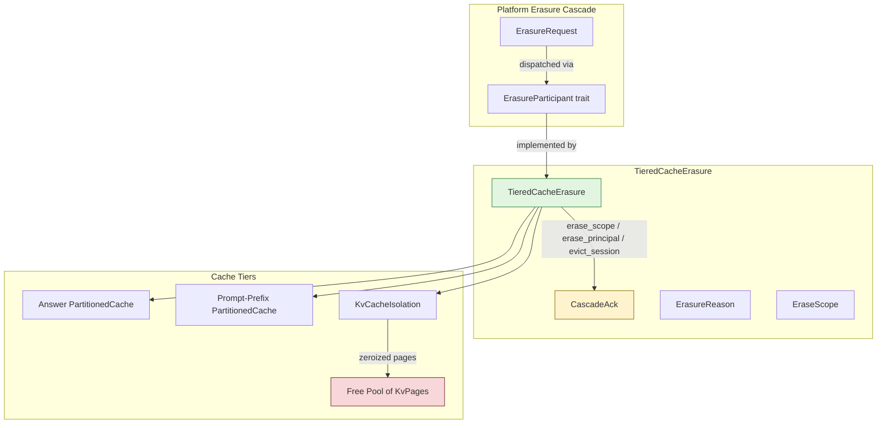
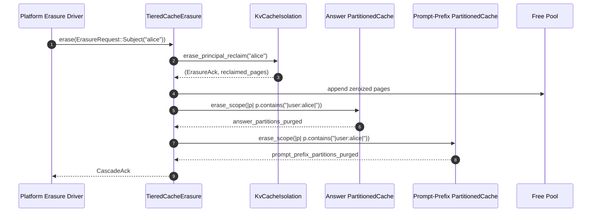
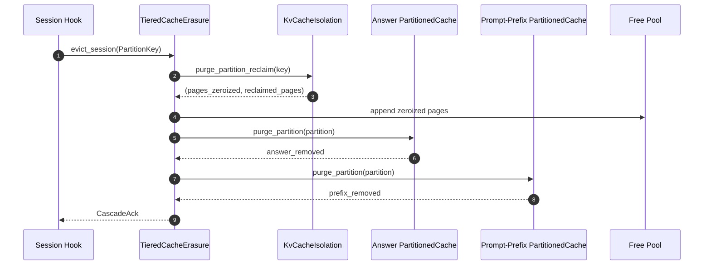
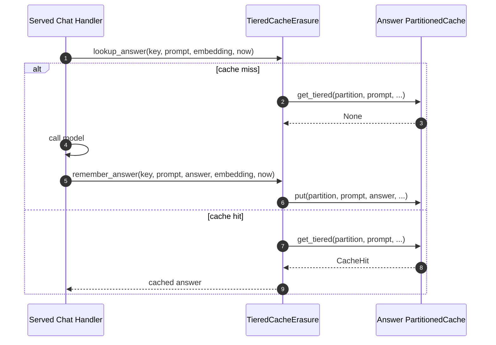
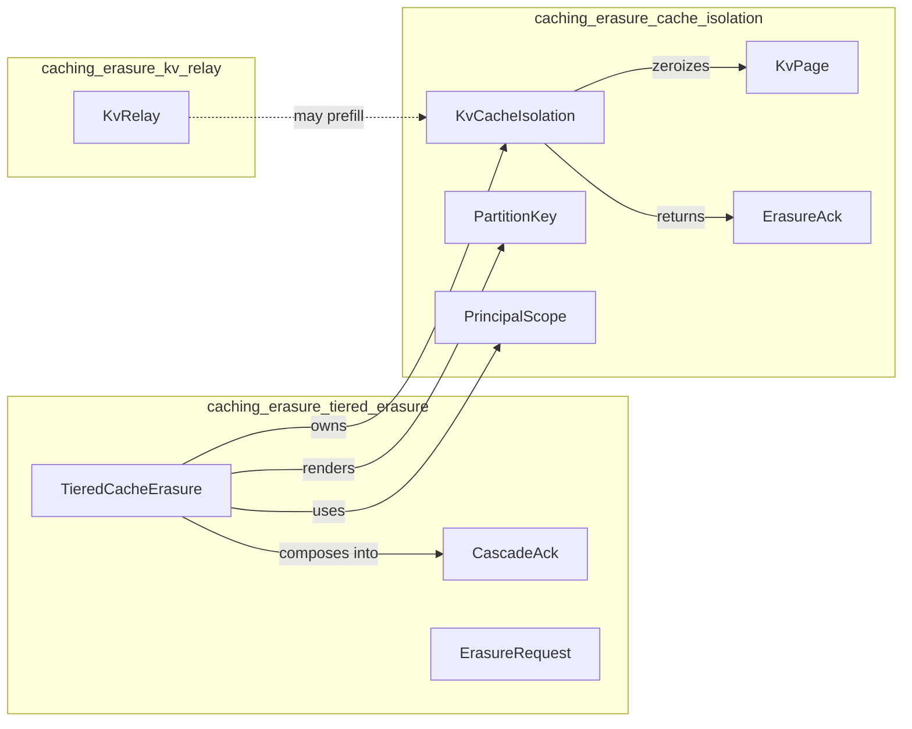
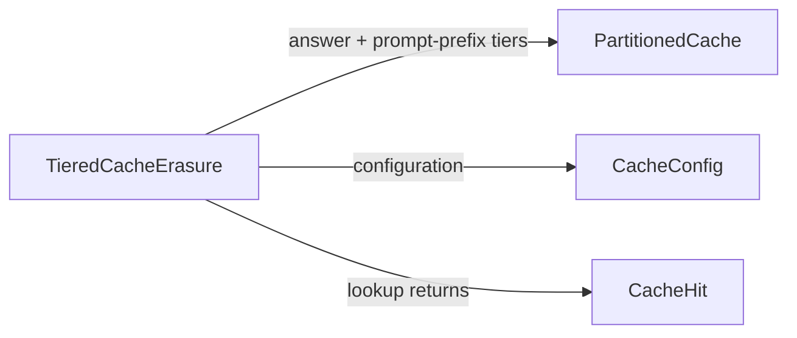
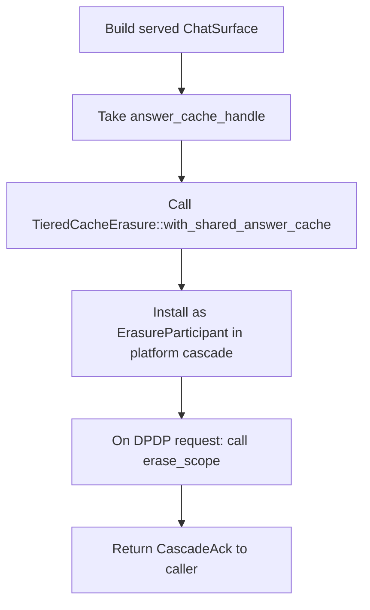
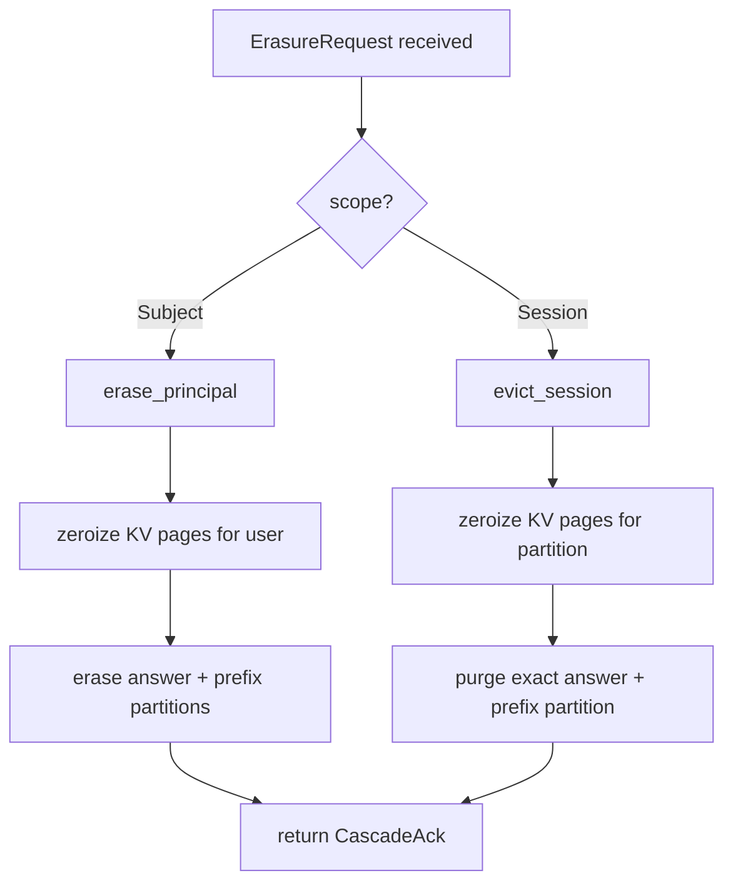

# `caching_erasure_tiered_erasure` — Tiered Cache Erasure Cascade

## Brief Introduction

The `caching_erasure_tiered_erasure` module implements the **tiered cache erasure cascade** for the serving layer. It is the single composition point that coordinates purging across the three cache tiers defined in `SERVING_OPS.md` §6:

1. **Coarse-answer cache** — cached final answers returned to callers.
2. **Prompt-prefix cache** — cached system/prompt prefixes.
3. **KV cache** — resident GPU-style key/value pages that must be **zeroized before reuse**.

The module was introduced to close an audit gap: the underlying erasure primitives in [`caching_erasure_cache_isolation`](caching_erasure_cache_isolation.md) and the external `ainxt-cache` crate were fully implemented, but no caller composed them. A DPDP right-to-erasure that only reached the database or answer tier would silently leave KV residue in GPU memory. `TieredCacheErasure` is that composer: it drives all three tiers together, returns a [`CascadeAck`] that proves the purge reached the KV tier, and keeps reclaimed KV pages in a zeroized free pool.

The module is deterministic, pure, and has no clock, GPU, or RNG dependencies — making it suitable for exhaustive unit testing of the erasure invariant.

---

## Core Responsibilities

| Responsibility | Description |
| --- | --- |
| **Cross-tier erasure composition** | Owns the answer, prompt-prefix, and KV tiers and purges them with a single call. |
| **Zeroize-before-free enforcement** | Ensures every KV page is zeroized before its slot returns to the free pool. |
| **Live-path cache sharing** | Provides `with_shared_answer_cache` so the erasure organ operates on the **same** `PartitionedCache` instance that the served chat path populates. |
| **DPDP cascade participant** | Implements [`ErasureParticipant`] so the platform erasure driver can reach GPU/KV residue through a stable trait object. |
| **Bounded scope safety** | Uses delimited scope tokens so `alice` never matches `alice2` during principal erasure. |

---

## Architecture

### Component Overview

### Key Types

| Type | Role |
| --- | --- |
| [`TieredCacheErasure`] | The orchestrator that owns all three cache tiers and exposes the erase/remember/lookup API. |
| [`CascadeAck`] | Combined acknowledgement returned after a tiered purge; proves the KV tier was reached. |
| [`ErasureRequest`] | Resolved DPDP request containing an [`EraseScope`] and an [`ErasureReason`]. |
| [`EraseScope`] | What to erase: either every per-user partition for a subject, or one exact session partition. |
| [`ErasureReason`] | Why the erasure is happening: right-to-erasure, session end, or retention expiry. |
| [`ErasureParticipant`] | Trait implemented by downstream tiers so the platform cascade can drive them uniformly. |

---

## Data Flow

### Right-to-Erasure / Erase-on-Logout

### Erase-on-Evict / Session End

### Live Serving Path (Cache Populate + Lookup)

---

## Component Interactions

### Within `caching_erasure`

### External Dependencies

> See [`core_interaction`](../core_infrastructure/core_interaction.md) for documentation of the `ainxt-cache` crate (`PartitionedCache`, `CacheConfig`, `CacheHit`).

---

## Process Flows

### Building a Production-Ready Cascade

The **critical R16 fix** is step C: without sharing the same `Arc<Mutex<PartitionedCache>>`, the erasure organ would drain a private cache that the live serving path never wrote to, producing a vacuous ack while real cached answers remain intact.

### Erasure Scope Dispatch

---

## API Reference

### `TieredCacheErasure`

| Method | Purpose |
| --- | --- |
| `new(cfg: CacheConfig) -> Self` | Standalone/offline constructor with private answer cache. |
| `with_shared_answer_cache(answer, cfg) -> Self` | **Production constructor** that shares the live answer cache. |
| `answer() / prompt_prefix() / kv()` | Tier accessors for the live serving path. |
| `remember_answer(...)` | Cache a served answer under a partition key. |
| `lookup_answer(...) -> Option<CacheHit>` | Lookup an answer within a partition key. |
| `live_answer_entries() -> usize` | Diagnostic: total live answer-cache entries. |
| `erase_principal(user_id) -> CascadeAck` | Right-to-erasure for one user. |
| `evict_session(key) -> CascadeAck` | Session-end eviction for one partition. |
| `erase_scope(req) -> CascadeAck` | Single entrypoint for the platform cascade. |
| `free_pool() -> &[KvPage]` | Zeroized pages reclaimed after erasure. |

### `CascadeAck`

| Field / Method | Meaning |
| --- | --- |
| `answer_partitions_purged` | Coarse-answer partitions removed. |
| `prompt_prefix_partitions_purged` | Prompt-prefix partitions removed. |
| `kv` | [`ErasureAck`](caching_erasure_cache_isolation.md) from the KV tier. |
| `total_partitions_purged()` | Sum across all tiers. |
| `kv_pages_zeroized()` | Pages explicitly zeroized before free. |
| `touched_any_tier()` | True if anything was actually purged. |

### `ErasureRequest`

| Constructor | Use Case |
| --- | --- |
| `right_to_erasure(subject)` | DPDP data-subject erasure. |
| `session_end(key)` | Single session partition eviction. |

---

## Safety & Compliance Properties

1. **Zeroize-before-free**: every KV page returned to the free pool satisfies `KvPage::is_zeroized()` byte-for-byte.
2. **No cross-principal leakage**: the scope token `|user:{id}|` is delimited, so `alice` does not match `alice2`.
3. **Department aggregates preserved**: `EraseScope::Subject` only removes per-user partitions; department-scoped aggregate partitions are left intact.
4. **Idempotent**: erasing an already-empty scope returns a clean no-op `CascadeAck`.
5. **Deterministic & pure**: no clock, GPU, or RNG — fully unit-testable.

---

## Relationship to the Overall System

`caching_erasure_tiered_erasure` sits in the **serving infrastructure** layer under [`server_serving`](server_serving.md). It is called by:

- The platform DPDP erasure cascade (via [`ErasureParticipant`]) — see [`governance_compliance`](../governance_compliance/governance_compliance.md) and [`lifecycle`](../governance_compliance/lifecycle.md).
- Session-end hooks in the runtime/serving path.
- The served chat handler for cache populate/lookup.

It depends on:

- [`caching_erasure_cache_isolation`](caching_erasure_cache_isolation.md) for KV cache isolation, zeroization, and partition keys.
- [`caching_erasure_kv_relay`](caching_erasure_kv_relay.md) for KV prefill/relay operations that may populate the KV tier.
- [`core_interaction`](../core_infrastructure/core_interaction.md) (`ainxt-cache`) for the `PartitionedCache` answer/prompt-prefix tiers.

---

## Testing Notes

The module's unit tests verify the three critical invariants:

1. **R3 — KV residue zeroized on cascade**: a full `erase_principal` zeroizes all of a principal's KV pages, deletes answer/prefix entries, leaves other principals untouched, and every reclaimed page is all-zero.
2. **R3 — erase-on-evict zeroizes a single session**: `evict_session` purges exactly one partition and zeroizes its KV pages.
3. **Scope boundary safety**: `alice` erasure does not affect `alice2`.

These tests are deterministic and do not require a GPU.
