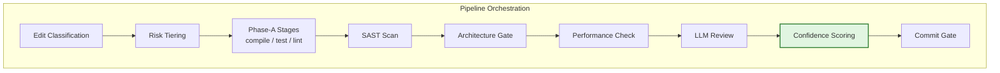
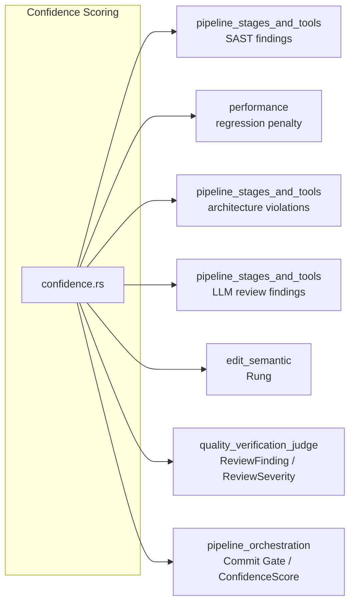
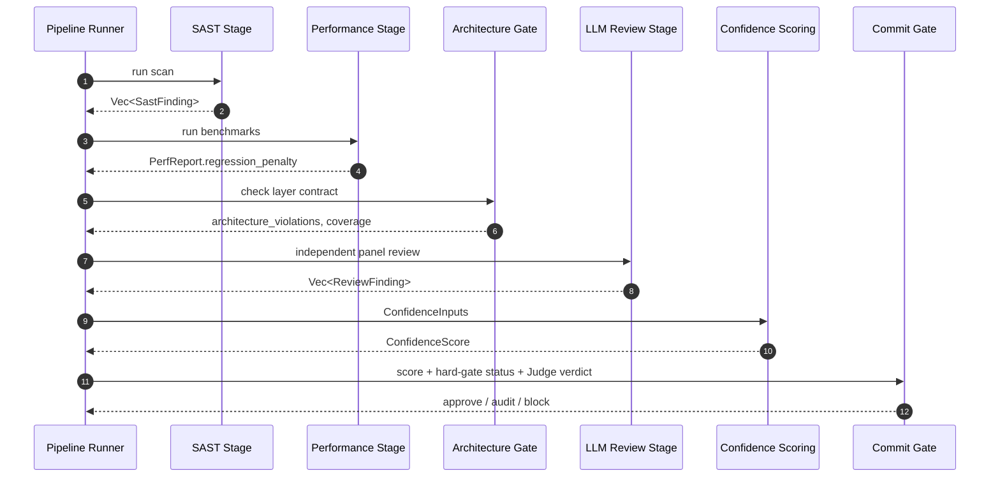
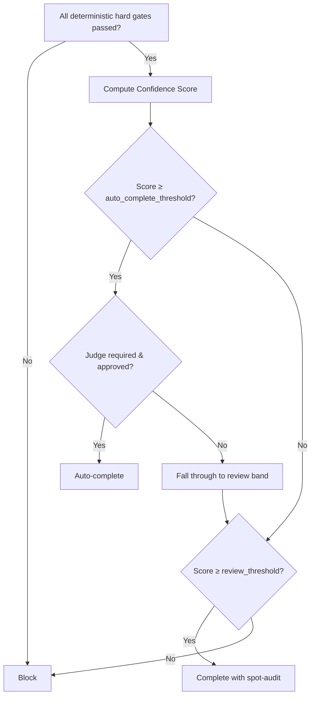

# Classification and Risk — Confidence Scoring

## Brief Introduction

The **Confidence Scoring** module (`crates/ainxt-pipeline/src/confidence.rs`) computes a deterministic, auditable residual-risk score for an edit after every deterministic gate in the code-review pipeline has passed. It answers the question: *"Given that compile, test, lint, SAST hard-blocks, and architecture hard-blocks all passed, how much residual risk remains?"*

The score is intentionally **not** a model judgment. It is a weighted arithmetic function over structured, verifiable signals produced by earlier pipeline stages. Two anti-sycophancy properties are load-bearing:

1. **The LLM Judge's verdict is not an input to the arithmetic.** The Judge acts as a separate gate in the [pipeline_orchestration](pipeline_orchestration.md) Commit Gate; no term in the confidence function can be inflated by model judgment.
2. **A skipped stage is a penalty, not neutral.** Otherwise the cheapest path to a high score would be to run fewer checks.

The module returns both a numeric score (`0–100`) and a full human-readable breakdown of every deduction, so reviewers and regulators can see *why* a score is what it is.

---

## Role in the System

This module sits inside the [pipeline_orchestration](pipeline_orchestration.md) → [classification_and_risk](classification_and_risk.md) subsystem. Its relationship to sibling modules is:

- It consumes outputs from [classification_and_risk_edit_classification](classification_and_risk_edit_classification.md) (blast radius, rung), [classification_and_risk_risk_tiering](classification_and_risk_risk_tiering.md) (tier), [pipeline_stages_and_tools](pipeline_stages_and_tools.md) (SAST, architecture, review), and [performance](performance.md) (regression penalty).
- It feeds its `ConfidenceScore` into the [pipeline_orchestration](pipeline_orchestration.md) Commit Gate, which combines the score with the Judge verdict and hard-gate status to decide whether an edit auto-completes, completes with spot-audit, or is blocked.
- It is called by the pipeline runner after deterministic stages finish and before the optional Judge gate is evaluated.

---

## Core Components

### `ConfidenceInputs`

A structured bundle of every signal that contributes to the score. All fields are deterministic and produced by earlier stages.

| Field | Source Stage | Meaning |
|-------|--------------|---------|
| `sast` | SAST scan | Medium/low findings only. Critical/high findings hard-block before scoring. |
| `perf_regression_penalty` | Performance stage | `0–25` penalty derived from benchmark regression and complexity growth. |
| `architecture_violations` | Architecture gate | Count of unremediated deterministic boundary violations. |
| `blast_radius_test_coverage` | Regression/semantic gate | Fraction `[0,1]` of the touched blast radius reached by tests. |
| `review_findings` | LLM Review stage | Unresolved review findings from an independent Judge panel. |
| `skipped_stages` | Stage runner | Number of stages that returned `Skipped(no_tool)` instead of a real verdict. |
| `rung` | Edit engine / semantic ladder | Lowest (least-trusted) edit-engine rung used across the edit set. |

### `ConfidenceScore`

The result of the computation.

| Field | Meaning |
|-------|---------|
| `score` | Integer `0–100`. Higher is less residual risk. |
| `breakdown` | One human-readable line per deduction, in application order. If no deductions apply, it contains `"no deductions"`. |

### `compute`

The deterministic scoring function. It starts at `100` and applies deductions in a fixed order:

1. **SAST medium/low findings** — capped at `40`.
2. **Performance regression** — capped at `25`.
3. **Architecture boundary violations** — `15` points each.
4. **Regression risk** — `30 × (1 - blast_radius_test_coverage)`.
5. **Unresolved review findings** — severity-weighted, capped at `30`.
6. **Skipped stages** — `5` points each.
7. **Edit-engine rung** — penalty depends on the least-trusted rung used.

The final score is clamped to `[0, 100]`.

```mermaid
flowchart LR
    Start([score = 100]) --> SAST
    SAST["SAST medium/low<br/>cap 40"] --> Perf
    Perf["Performance regression<br/>cap 25"] --> Arch
    Arch["Architecture violations<br/>-15 each"] --> Cov
    Cov["Regression risk<br/>30 × (1 - coverage)"] --> Review
    Review["Review findings<br/>cap 30"] --> Skip
    Skip["Skipped stages<br/>-5 each"] --> Rung
    Rung["Edit-engine rung<br/>LSP/Ast/Structured/Text"] --> Clamp["clamp(0, 100)"]
    Clamp --> Out([ConfidenceScore])
```

---

## Scoring Terms in Detail

### SAST Findings

Only `Medium` and `Low` severity findings are scored. `Critical` and `High` findings are assumed to have been handled by the hard-block gate in [pipeline_stages_and_tools](pipeline_stages_and_tools.md) and must never reach the confidence scorer. The per-finding penalty is defined by the `Severity::score_penalty` method in the SAST module. The total is capped at `SAST_CAP = 40`.

### Performance Regression

The performance stage produces a pre-computed `regression_penalty` in the range `0–25`. This module simply clamps and applies it. See [performance](performance.md) for how benchmark slowdown and complexity growth are translated into the penalty.

### Architecture Violations

Each unremediated deterministic architecture boundary violation deducts `15` points. These violations are produced by the semantic architecture gate described in [pipeline_stages_and_tools](pipeline_stages_and_tools.md). If the count is non-zero, the commit gate will normally hard-block; the confidence score still reflects the residual risk for reporting and audit purposes.

### Regression Risk (Blast Radius Coverage)

The uncovered fraction of the blast radius is multiplied by `30` and rounded. This is the largest single term, reflecting that tests passing but leaving a large fraction of affected code untested is a major residual risk. The coverage value is clamped to `[0, 1]` before use.

### Review Findings

Unresolved findings from an independent LLM review panel are weighted by severity:

| Severity | Penalty |
|----------|---------|
| `Critical` | `10` |
| `Major` | `6` |
| `Minor` | `3` |
| `Info` | `2` |

The total is capped at `REVIEW_CAP = 30`.

### Skipped Stages

Every stage that honestly reports `Skipped(no_tool)` deducts `5` points. This prevents the system from rewarding configurations that omit checks. Skips are distinct from failures: a failure would have blocked earlier, while a skip means the check could not run.

### Edit-Engine Rung

The edit engine's semantic ladder defines fidelity. The lowest (least-trusted) rung used across the edit set applies a fixed penalty:

| Rung | Typical Penalty | Rationale |
|------|-----------------|-----------|
| `Lsp` | lowest | Language-server refactor; highest fidelity. |
| `Ast` | low | tree-sitter AST transform. |
| `StructuredPatch` | moderate | Anchored structured search/replace. |
| `TextPatch` | highest | Raw text patch; last resort. |

The exact penalty values are defined by `Rung::confidence_penalty` in the [edit_semantic](edit_semantic.md) module.

---

## Dependencies

### Direct crate dependencies

- `ainxt_judge` — `ReviewFinding`, `ReviewSeverity` (see [quality_verification_judge](../ai_engine/quality_verification_judge.md)).
- `ainxt_semantic` — `Rung` from the edit-engine ladder (see [edit_semantic](edit_semantic.md)).
- `crate::sast` — `SastFinding`, `Severity` (see [pipeline_stages_and_tools](pipeline_stages_and_tools.md)).

---

## Data Flow

---

## Integration with the Commit Gate

The confidence score is one of three inputs to the commit gate:

1. **Hard gates** — Phase-A failures, critical/high SAST findings, and architecture violations block regardless of score.
2. **Confidence score** — Determines the approval band once hard gates pass.
3. **Judge verdict** — Required for Tier 2+ edits; must come from an independent panel.

The `GatePolicy` defines the thresholds:

- `auto_complete_threshold` — score at/above which the edit auto-completes (if Judge approves when required).
- `review_threshold` — score at/above which the edit completes but is flagged for post-commit spot-audit.
- `trivial_auto_approve_floor` — special fast path for `Trivial` tier edits that clear all hard gates.

See classification_and_risk_commit_gate for the full gate logic.

---

## Anti-Sycophancy and Auditability

The module is designed to resist two common failure modes in automated review systems:

- **Model-grade inflation:** Because the Judge verdict is not an input to `compute`, a model cannot "talk up" a low score by declaring the edit safe. The score is purely a function of measurable signals.
- **Omitted-check inflation:** Because skipped stages deduct points, disabling a stage to improve the score always makes the score worse, not better.

Every deduction is recorded in `breakdown` with a human-readable explanation. This supports:

- Post-commit spot-audit prioritization.
- Regulatory review (e.g., NPCI-style audits).
- Debugging why an edit failed to auto-complete.

---

## Testing Strategy

The module includes unit tests that verify:

- A perfect edit scores `100` with `"no deductions"`.
- Uncovered blast radius reduces the score even when all gates pass.
- Skipped stages strictly lower the score.
- Lower-fidelity rungs cost more than higher-fidelity rungs.
- Medium SAST findings are scored; high/critical findings are not expected at this stage.
- Review findings are capped.
- The score clamps at `0`.
- Every deduction appears in the breakdown.

These tests encode the policy invariants and should be updated whenever scoring weights or caps change.

---

## Related Documentation

- [classification_and_risk](classification_and_risk.md) — parent module overview.
- [classification_and_risk_edit_classification](classification_and_risk_edit_classification.md) — how edits are classified and blast radius is computed.
- [classification_and_risk_risk_tiering](classification_and_risk_risk_tiering.md) — how risk tiers are assigned.
- classification_and_risk_commit_gate — how the confidence score is combined with Judge verdicts and hard gates.
- [pipeline_stages_and_tools](pipeline_stages_and_tools.md) — SAST, architecture, and review stages that feed the scorer.
- [performance](performance.md) — performance regression penalty computation.
- [edit_semantic](edit_semantic.md) — the semantic edit ladder and `Rung` penalties.
- [quality_verification_judge](../ai_engine/quality_verification_judge.md) — the independent Judge panel and review findings.
