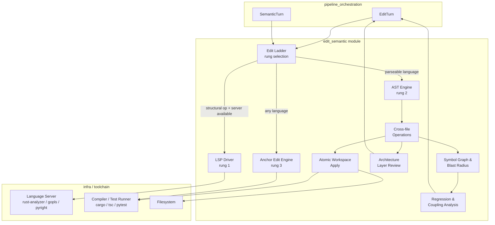
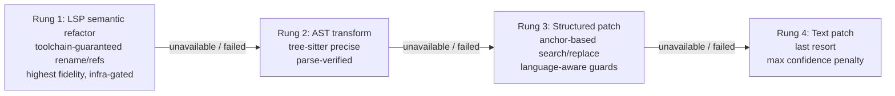
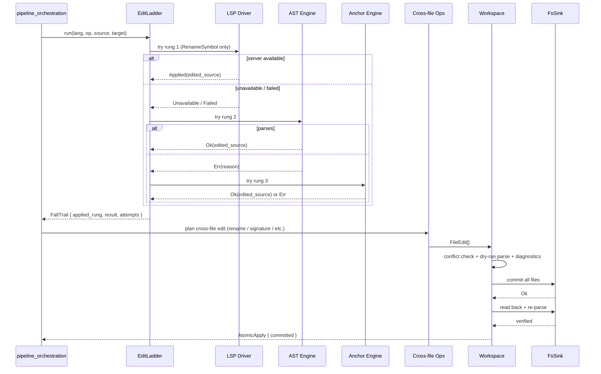

# edit_semantic Module

## Overview

The `edit_semantic` module is the code-editing substrate of the `pipeline_runtime` system. It provides deterministic, safety-first tools for applying model-generated edits to real source files, escalating from conservative text anchors up to language-server-grade semantic refactors. The module is designed around a single invariant: **a half-applied or silently-corrupt edit is worse than no edit at all**. Every operation therefore fails loudly with structured errors rather than guessing, and every multi-file operation is transactional.

The module sits between the higher-level [pipeline_orchestration](pipeline_orchestration.md) (which decides *what* to edit and how risky it is) and the raw source tree. It is consumed by turns such as `EditTurn` and `SemanticTurn` in the pipeline, and by the served runtime when autonomous edits must be committed to disk.

## Core Responsibilities

1. **Anchor-based text editing** (`ainxt-edit`) — conservative, language-aware search/replace with exact and whitespace-insensitive anchor matching, plus guards against common SDLC bugs (dropped imports, unsafe field renames, call-site misidentification).
2. **AST-precise single-file editing** (`ainxt-semantic` core) — tree-sitter-backed function replacement that can never mistake a call site for a definition and refuses any edit that would introduce a parse error.
3. **Symbol/call/import graph analysis** (`graph` + `regression`) — deterministic blast-radius sizing, test-coverage cross-checks, and git-history change-coupling advisories.
4. **Edit ladder orchestration** (`ladder` + `lsp`) — tries the highest-fidelity rung available (LSP → AST → structured patch → text patch), falls down on failure, and records the full trail.
5. **Cross-file semantic operations** (`ops` + `workspace` + `arch`) — atomic rename, signature change, extract/inline/move, architecture-layer violation detection, and rollback on regression.

## Architecture

### Edit Fidelity Ladder

## Sub-modules

| Sub-module | Purpose | Key Documentation |
|---|---|---|
| **edit_semantic_edit_engine** | Conservative anchor-based text editing and toolchain seams (LSP client, compile/test verification). | [edit_semantic_edit_engine.md](edit_semantic_edit_engine.md) |
| **edit_semantic_ast_engine** | Tree-sitter AST parsing, definition location, byte-precise function replacement, and parse gates. | [edit_semantic_ast_engine.md](edit_semantic_ast_engine.md) |
| **edit_semantic_graph_risk** | Symbol/call/import graph construction, blast-radius computation, regression detection, and change-coupling advisories. | [edit_semantic_graph_risk.md](edit_semantic_graph_risk.md) |
| **edit_semantic_edit_ladder** | Multi-rung edit orchestration and the real LSP JSON-RPC driver. | [edit_semantic_edit_ladder.md](edit_semantic_edit_ladder.md) |
| **edit_semantic_workspace_ops** | Cross-file semantic operations, atomic workspace apply with rollback, and architecture-layer violation review. | [edit_semantic_workspace_ops.md](edit_semantic_workspace_ops.md) |

## Module Boundaries & Dependencies

`edit_semantic` depends on:

- **tree-sitter grammars** (`tree-sitter-rust`, `tree-sitter-python`, `tree-sitter-go`, `tree-sitter-javascript`, `tree-sitter-typescript`, `tree-sitter-java`) for the AST rung.
- **serde / serde_json** for structured edit envelopes and LSP wire format.
- **pipeline_orchestration** for the turn types that drive the ladder (`EditTurn`, `SemanticTurn`).
- **infra** for live LSP servers, compilers, test runners, and the filesystem.

It does **not** depend on the higher-level runtime, serving, or governance modules; the dependency arrow points upward from the pipeline into this module.

## Data Flow: Applying a Model-Generated Edit

## Safety Invariants

1. **All-or-nothing apply** — a multi-file edit set is either fully committed or fully rolled back; partial writes are detected and undone.
2. **No fabricated green** — offline toolchain stand-ins report `ToolchainUnavailable` / `Inconclusive`, never a fake pass.
3. **Declaration-preferring location** — AST and span finders match only definition nodes, never call sites.
4. **Parse-before-commit** — every proposed file is parsed before write; a previously-clean file that would become unparseable is refused.
5. **Post-write re-verify** — after commit, files are read back and re-parsed; mismatches trigger automatic rollback.
6. **Architecture-layer enforcement** — new import edges that violate the declared layer contract are deterministic violations, attributed only to the current edit.

## Confidence & Risk Integration

The pipeline's confidence score consumes signals from this module:

- `Rung::confidence_penalty()` — lower rungs reduce confidence (structured patch = −3, text patch = −8).
- `BlastRadius::fan_out` — direct caller count sizes the risk of a change.
- `RegressionReport::uncovered_fraction` — touched symbols with no covering test increase regression risk.
- `ArchViolation` — forbidden cross-layer imports are hard blockers.
- `CouplingAdvisory` — historically co-changed files missing from the edit are non-blocking advisories.

See [pipeline_orchestration](pipeline_orchestration.md) for how these signals feed the review gate.

## Related Documentation

- [edit_semantic_edit_engine.md](edit_semantic_edit_engine.md) — anchor-based text editing and toolchain seams.
- [edit_semantic_ast_engine.md](edit_semantic_ast_engine.md) — tree-sitter AST parsing and byte-precise replacement.
- [edit_semantic_graph_risk.md](edit_semantic_graph_risk.md) — symbol graph, blast radius, and regression detection.
- [edit_semantic_edit_ladder.md](edit_semantic_edit_ladder.md) — multi-rung edit orchestration and LSP driver.
- [edit_semantic_workspace_ops.md](edit_semantic_workspace_ops.md) — cross-file operations, atomic apply, and architecture review.
- [pipeline_orchestration](pipeline_orchestration.md) — the pipeline layer that drives this module.
