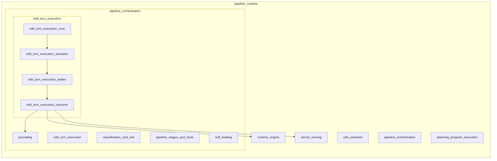
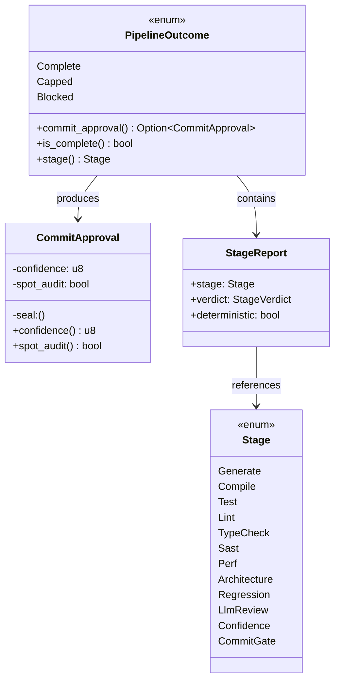
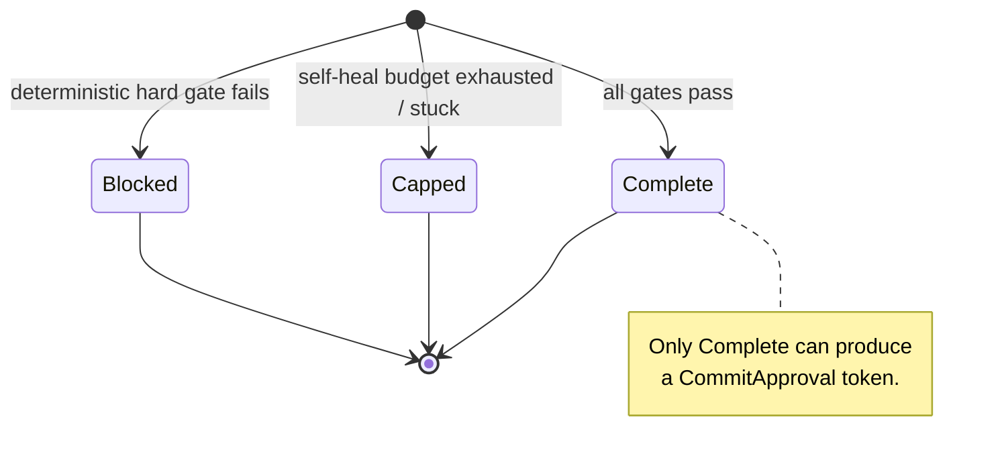
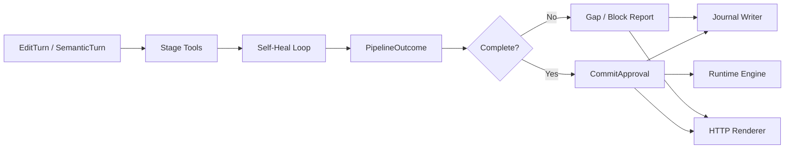
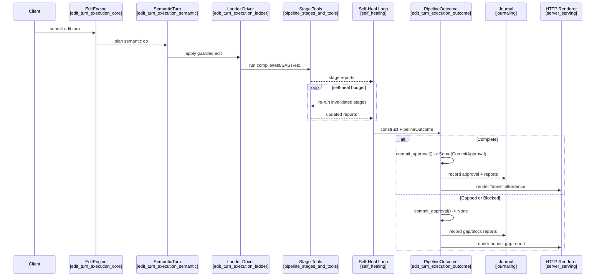

# `edit_turn_execution_outcome`

## Brief Introduction

The `edit_turn_execution_outcome` module is the **typed result boundary** of the code-editing pipeline. It defines the final verdict that an edit turn can produce and, crucially, controls whether a "commit" affordance can ever be presented to a user or downstream system.

The module's single source file, `crates/ainxt-pipeline/src/outcome.rs`, exposes two public types:

- **`PipelineOutcome`** — the exhaustive, serializable result of one edit turn.
- **`CommitApproval`** — the unforgeable token that authorizes a renderer to say "done" and allow a commit.

The design encodes the pipeline's central anti-sycophancy rule directly in the type system:

> **A commit affordance can only exist when the pipeline is `Complete`.**

There is no "mostly done" variant, no soft success, and no way for a renderer to construct a `CommitApproval` on its own. This makes the "never declare done until the gate succeeds" rule structural rather than a convention or a prompt.

---

## Where This Module Fits

`edit_turn_execution_outcome` sits at the end of the **edit turn execution** sub-tree inside `pipeline_orchestration`:



- **[edit_turn_execution_core](edit_turn_execution_core.md)** produces the raw edit set (`EditTurn`, `EditEngine`).
- **[edit_turn_execution_semantic](edit_turn_execution_semantic.md)** plans and runs semantic operations (`SemanticTurn`).
- **[edit_turn_execution_ladder](edit_turn_execution_ladder.md)** applies guarded, multi-rung edits (`WiredReplace`, `GuardedApply`).
- **`edit_turn_execution_outcome`** consumes the verified stage reports and emits the final, typed verdict.

---

## Core Concepts

### `PipelineOutcome`

`PipelineOutcome` is an exhaustive `enum` with exactly three variants:

| Variant | Meaning | Commit Allowed? |
|---|---|---|
| `Complete { confidence, spot_audit, report }` | All gates passed. | **Yes** |
| `Capped { blocking_stage, reason, rounds_exhausted, gap_report }` | The self-heal budget or stuck detector ran out before the gate cleared. | No |
| `Blocked { stage, deterministic_failure }` | A deterministic hard gate failed (e.g., compile error, SAST critical). | No |

The absence of a fourth "partial success" variant is intentional. A turn is either fully verified or it is not.

### `CommitApproval`

`CommitApproval` is the only type that represents permission to commit. It has:

- `confidence()` — the confidence score that cleared the gate.
- `spot_audit()` — whether the commit is flagged for post-commit human spot-audit.
- A **private `seal: ()` field**, which makes the struct unconstructible outside this module.

The only way to obtain a `CommitApproval` is through `PipelineOutcome::commit_approval()`, which returns `Some` **only** for the `Complete` variant.

```rust
pub fn commit_approval(&self) -> Option<CommitApproval> {
    match self {
        PipelineOutcome::Complete { confidence, spot_audit, .. } => Some(CommitApproval { ... }),
        _ => None,
    }
}
```

This pattern guarantees that no renderer, journal writer, or HTTP handler can accidentally synthesize a success signal from a `Capped` or `Blocked` outcome.

### Relationship to Stages

`PipelineOutcome` carries `StageReport` values from the [pipeline_stages_and_tools](pipeline_stages_and_tools.md) module. Each `StageReport` records:

- `stage: Stage` — which pipeline stage ran.
- `verdict: StageVerdict` — `Pass`, `Fail`, `Skipped`, or `Advisory`.
- `deterministic: bool` — whether the verdict came from a deterministic tool or model judgment.

The `Stage` enum (also from `pipeline_stages_and_tools`) includes all pipeline phases: `Generate`, `Compile`, `Test`, `Lint`, `TypeCheck`, `Sast`, `Perf`, `Architecture`, `Regression`, `LlmReview`, `Confidence`, and `CommitGate`.

`PipelineOutcome::stage()` returns the stage that owns the outcome:

- `Complete` → `Stage::CommitGate`
- `Capped` → the `blocking_stage`
- `Blocked` → the failing `stage`

---

## Architecture

### Component Diagram



### State Machine

A `PipelineOutcome` can only transition from "no outcome" to one of the three terminal states. There are no transitions between the variants.



---

## Data Flow

The outcome is produced at the end of the self-heal loop and then consumed by journaling, serving, and runtime surfaces.



1. The turn starts with an edit request (see [edit_turn_execution_core](edit_turn_execution_core.md)).
2. Each [pipeline_stages_and_tools](pipeline_stages_and_tools.md) stage produces a `StageReport`.
3. The [self_healing](self_healing.md) loop retries failed stages within a budget.
4. When the loop ends, it constructs a `PipelineOutcome`.
5. Consumers call `commit_approval()` to learn whether a commit is allowed.
6. The outcome and any approval token are recorded in the journal (see [journaling](journaling.md)) and surfaced through the server (see [server_serving](server_serving.md)) or runtime engine (see [runtime_engine](runtime_engine.md)).

---

## Component Interaction

The following sequence diagram shows how the outcome module enforces the commit invariant across the turn lifecycle.



---

## Public API

### `CommitApproval`

| Item | Description |
|---|---|
| `confidence() -> u8` | The confidence score that cleared the gate. |
| `spot_audit() -> bool` | Whether the commit is flagged for sampled post-commit human review. |

No public constructor exists. The private `seal` field prevents external construction.

### `PipelineOutcome`

| Variant | Fields |
|---|---|
| `Complete` | `confidence: u8`, `spot_audit: bool`, `report: Vec<StageReport>` |
| `Capped` | `blocking_stage: Stage`, `reason: String`, `rounds_exhausted: u8`, `gap_report: Vec<StageReport>` |
| `Blocked` | `stage: Stage`, `deterministic_failure: String` |

| Method | Description |
|---|---|
| `commit_approval() -> Option<CommitApproval>` | Returns `Some` only for `Complete`. |
| `is_complete() -> bool` | `true` only for `Complete`. |
| `stage() -> Stage` | Returns the stage that owns the outcome. |

`PipelineOutcome` also implements `Serialize` and `Deserialize` with an externally tagged representation (`"outcome": "complete" | "capped" | "blocked"`), making it safe to persist in journals and transmit over the wire.

---

## Design Rationale

### Anti-Sycophancy Invariant

The module's most important responsibility is preventing the system from "agreeing" that an edit is done when it is not. By making `CommitApproval` unforgeable and tying it exclusively to `PipelineOutcome::Complete`, the type system closes every code path that could render a false success.

### Exhaustive Outcomes

Limiting `PipelineOutcome` to three variants removes ambiguity:

- `Complete` → commit.
- `Capped` → honest hand-off to a human; no commit.
- `Blocked` → deterministic failure; no commit.

There is no "partial commit," "soft approve," or "needs review but go ahead" state. Those concerns are handled by the `spot_audit` flag inside `Complete`.

### Confidence and Spot Audit

The `confidence` score is produced by the [classification_and_risk](classification_and_risk.md) module (see `ConfidenceScore`). When the score lands in the review band, `spot_audit` is set to `true`, enabling a "trust but verify" tier without blocking the commit.

---

## Testing

The module includes unit tests that verify the core invariants:

1. **Only `Complete` yields a `CommitApproval`.** `Capped` and `Blocked` outcomes return `None` from `commit_approval()`.
2. **`is_complete()` matches the variant.** Only `Complete` returns `true`.
3. **Serde round-trips correctly.** The tagged JSON representation preserves the variant.

These tests are lightweight and fast because the invariants are enforced by the type system; the tests mainly guard against accidental exposure of the private constructor.

---

## Related Modules

| Module | Relationship |
|---|---|
| [edit_turn_execution_core](edit_turn_execution_core.md) | Defines `EditTurn` and `EditEngine`, which initiate the turn that eventually produces a `PipelineOutcome`. |
| [edit_turn_execution_semantic](edit_turn_execution_semantic.md) | Plans semantic operations whose results feed into the stage reports carried by the outcome. |
| [edit_turn_execution_ladder](edit_turn_execution_ladder.md) | Applies guarded edits; its success or failure determines many of the stage verdicts. |
| [pipeline_stages_and_tools](pipeline_stages_and_tools.md) | Defines `Stage`, `StageReport`, and the tools whose verdicts populate the outcome. |
| [classification_and_risk](classification_and_risk.md) | Produces the `ConfidenceScore` used in `Complete` outcomes and the risk inputs that influence gating. |
| [self_healing](self_healing.md) | Runs the retry loop and constructs the final `PipelineOutcome` via `SelfHealOutcome`. |
| [journaling](journaling.md) | Persists `PipelineOutcome` and any `CommitApproval` for audit and replay. |
| [runtime_engine](runtime_engine.md) | Consumes outcomes to drive turn-level execution and routing. |
| [server_serving](server_serving.md) | Surfaces outcomes to clients through HTTP and wire APIs. |

---

## Summary

`edit_turn_execution_outcome` is a small but critical module. It does not perform edits, run tools, or heal failures. Instead, it **types the boundary between "still working" and "done."** By making `CommitApproval` unforgeable and `PipelineOutcome` exhaustive, it ensures that the pipeline can never silently declare victory and that every non-complete turn is rendered as an honest gap or block report.
