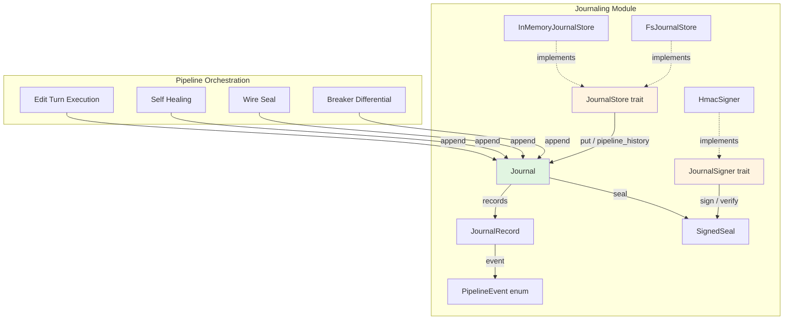
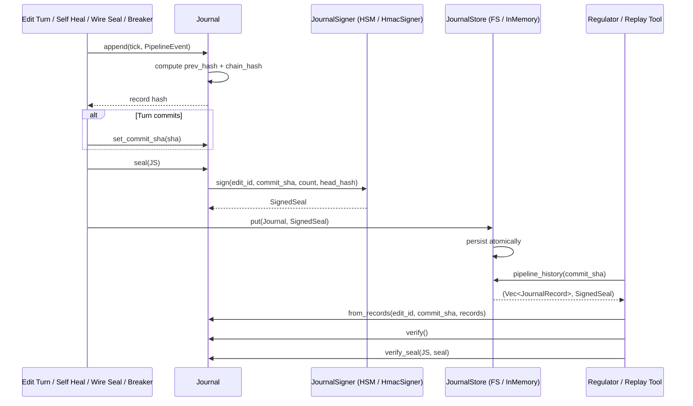
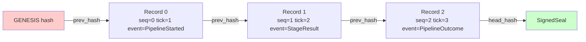
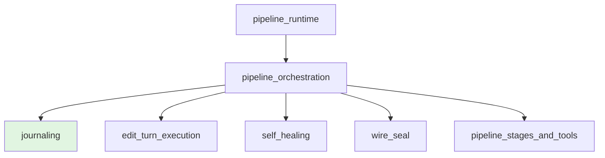

# Journaling Module

The **journaling module** provides an append-only, hash-chained, cryptographically sealed event log for every pipeline edit. It records every stage transition, self-heal round, risk reclassification, judge verdict, and final outcome so that a regulator can later reconstruct a complete, tamper-evident, and tamper-proof audit trail from patch generation to commit.

This module lives inside the [pipeline orchestration](pipeline_orchestration.md) subsystem of the [pipeline runtime](pipeline_runtime.md). It is consumed by the edit-turn execution, self-healing, wire-seal, and breaker stages to persist forensic evidence, and it is queried by regulators and replay tooling through `pipeline_history(commit_sha)`.

---

## Core Responsibilities

1. **Event capture** — Define a strongly typed `PipelineEvent` vocabulary covering the full lifecycle of an edit.
2. **Hash chaining** — Bind every event to its predecessor with SHA-256 so any mutation, reordering, or deletion is detectable.
3. **Deterministic replay** — Rely on caller-supplied monotonic ticks rather than wall clocks, so the same sequence reproduces byte-identical hashes.
4. **Cryptographic sealing** — Sign the chain head with a pluggable `JournalSigner`, making the trail tamper-proof, not merely tamper-evident.
5. **Durable storage** — Persist sealed journals through a pluggable `JournalStore`, with offline in-memory and crash-atomic filesystem implementations.
6. **Forensic query** — Answer `pipeline_history(commit_sha)` and `by_edit_id(edit_id)` with the full record trail and its signed seal.

---

## Architecture



The `Journal` is the central value type. It receives `PipelineEvent` values from the surrounding pipeline stages, converts each into a `JournalRecord` that chains to the previous record's hash, and can produce a `SignedSeal` over the chain head. The seal and records are then handed to a `JournalStore` for durable persistence and later forensic retrieval.

---

## Component Reference

### `PipelineEvent`

A tagged enum that enumerates every significant occurrence in an edit's lifecycle. Key variants include:

- `PipelineStarted` — edit identity, initial risk tier, blast radius, and edit-engine rung.
- `StageStarted` / `StageResult` — entry and exit of each pipeline stage, including the `StageVerdict` and determinism flag.
- `SelfHealTriggered` — a self-heal round was entered for a stage.
- `RoundCapped` — self-heal rounds were exhausted or the stuck detector fired.
- `RiskReclassified` — **escalation-only** tier change during self-heal; the tier can only move up, never down.
- `WirePolicySealed` — a wire-supplied policy field was discarded and replaced at the request boundary.
- `JudgeVerdict` — approval decision, judge model, and context-isolation confirmation.
- `BreakerDifferential` — Tier-3 breaker differential/invariant run results.
- `PipelineOutcome` — final outcome string and confidence score.

See [pipeline orchestration](pipeline_orchestration.md) and [self healing](self_healing.md) for how these events are produced.

### `JournalRecord`

A single hash-chained entry containing:

- `seq` — zero-based sequence number.
- `tick` — caller-supplied monotonic tick for deterministic replay.
- `event` — the `PipelineEvent` payload.
- `prev_hash` — hash of the previous record (or the genesis hash).
- `hash` — hash of this record computed from `prev_hash`, `seq`, `tick`, `edit_id`, and the serialized event.

### `Journal`

The append-only journal for one edit. It provides:

- `new(edit_id)` — create an empty journal.
- `from_records(...)` — reconstruct a read-only journal from stored records (regulator replay path).
- `append(tick, event)` — append a new event and return its hash.
- `verify()` — recompute the entire chain and return the first broken sequence number, if any.
- `head_hash()` — the current chain head (last record's hash, or genesis).
- `set_commit_sha(sha)` / `commit_sha()` — bind and retrieve the commit produced by this edit.
- `seal(signer)` — produce a `SignedSeal` over the chain head.
- `verify_seal(signer, seal)` — verify a seal against the current journal state.

### `SignedSeal`

A cryptographic signature binding:

- `edit_id`
- `commit_sha` (optional until commit)
- `record_count`
- `head_hash`

The signature is computed over `edit_id ⧉ commit_sha ⧉ record_count ⧉ head_hash`. Because each record's hash chains its predecessor, signing the head transitively authenticates every record in the trail.

### `JournalSigner`

The seam for real evidentiary signers such as HSMs, KMS, or cloud signing services. It exposes:

- `sign(payload: &[u8]) -> String`
- `verify(payload: &[u8], signature: &str) -> bool`

Swapping the concrete signer is the crypto-agility knob (ADR-023); neither the hash-chain link nor the signature algorithm is hard-coded above this trait.

### `HmacSigner`

A deterministic offline `JournalSigner` using HMAC-SHA256. It is suitable for tests and air-gapped runs but is honest about its limitations: the key lives in-process, so it protects against accidental or after-the-fact tampering, not against a key-compromising attacker.

### `JournalStore`

The durable storage seam. It defines:

- `put(journal, seal)` — persist a sealed journal, overwriting by `edit_id`.
- `pipeline_history(commit_sha)` — retrieve the full trail and seal for the edit that produced a commit SHA.
- `by_edit_id(edit_id)` — retrieve the trail and seal for a specific edit.

The production backend is expected to be Postgres plus WORM object storage; the trait allows the query and signing logic to be proven against offline implementations.

### `InMemoryJournalStore`

An offline, deterministic `JournalStore` that maintains two indexes (by edit id and by commit sha) over cloned records and seals. It is useful for tests and in-process replays.

### `FsJournalStore`

A crash-atomic filesystem-backed `JournalStore`. Each sealed journal is written as `<root>/<edit_id>.jnl.json` using a write-temp-then-rename pattern so a crash mid-write never leaves a torn record. On reopening, it re-reads every persisted journal, making `pipeline_history` and `by_edit_id` available from cold storage.

---

## Data Flow



1. A pipeline stage appends an event to the edit's `Journal`.
2. The journal computes the chain hash and returns the new record hash.
3. When the turn finishes (or at any durable checkpoint), the journal is sealed with a `JournalSigner`.
4. The sealed journal is persisted through a `JournalStore`.
5. A regulator later queries by commit SHA, reconstructs the `Journal`, verifies the chain, and verifies the seal.

---

## Hash Chain Construction



Each record's `hash` is computed as:

```text
SHA256(prev_hash || 0x1F || seq || tick || edit_id || 0x1F || event_json)
```

The genesis previous-hash is a 64-character string of zeros. Because `edit_id`, `seq`, `tick`, and the serialized event all feed into the hash, two different edits with identical events produce different chains, and reordering or mutating any record breaks verification at the first affected sequence number.

---

## Integration with the Pipeline

The journaling module does not drive the pipeline; it is a passive, append-only observer that surrounding stages write to. The main producers of `PipelineEvent`s are:

- **Edit turn execution** — emits `PipelineStarted`, `StageStarted`, `StageResult`, and `PipelineOutcome`. See [edit turn execution](edit_turn_execution.md).
- **Self healing** — emits `SelfHealTriggered`, `RoundCapped`, and `RiskReclassified`. See [self healing](self_healing.md).
- **Wire seal** — emits `WirePolicySealed` when a wire-supplied policy field is discarded and replaced. See [wire_seal](wire_seal.md).
- **Breaker differential** — emits `BreakerDifferential` during Tier-3 invariant/differential runs. See [pipeline orchestration](pipeline_orchestration.md) and the broader [scenario service](../scenario_service/scenario_service.md) for breaker concepts.

The final `SignedSeal` binds the entire trail to the commit SHA produced by the edit, enabling `pipeline_history(commit_sha)` to serve as a structured query in the same shape as the rest of the runtime's event log.

---

## Dependencies

The journaling module depends on:

- `serde` and `serde_json` for event serialization.
- `sha2` for SHA-256 hashing.
- `crate::stage::{Stage, StageVerdict}` for the stage vocabulary used in events.

It is consumed by:

- [pipeline orchestration](pipeline_orchestration.md)
- [edit turn execution](edit_turn_execution.md)
- [self healing](self_healing.md)
- [wire_seal](wire_seal.md)
- regulator replay and compliance tooling

---

## Determinism and Forensic Guarantees

- **No wall clock** — The caller supplies `tick`, so replay with the same ticks yields byte-identical hashes.
- **Tamper-evident** — `Journal::verify` recomputes the chain and reports the first broken sequence number.
- **Tamper-proof** — `SignedSeal` signs the chain head with a pluggable signer; an attacker cannot re-sign without the key.
- **Crash-atomic persistence** — `FsJournalStore` writes to a temp file and renames it into place.
- **Escalation-only risk reclassification** — The `RiskReclassified` event can only raise the tier, never lower it, leaving a clear regulator trail of why an edit became higher risk.

---

## Module Placement



The journaling module is one of several submodules under [pipeline orchestration](pipeline_orchestration.md), alongside edit-turn execution, self-healing, wire-seal, and the stage/tool framework. It provides the durable, verifiable event log that makes the entire orchestration auditable.
