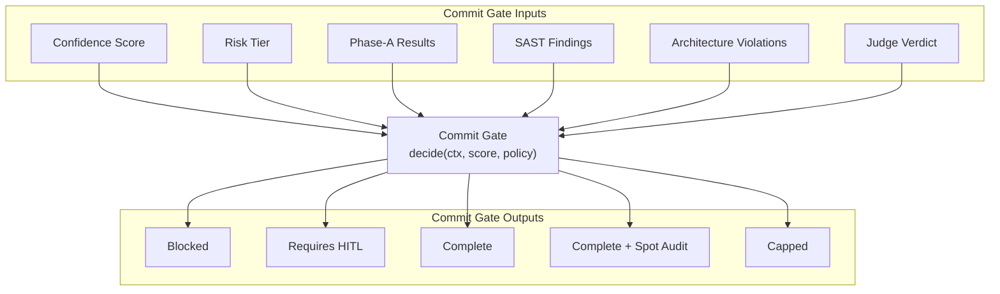
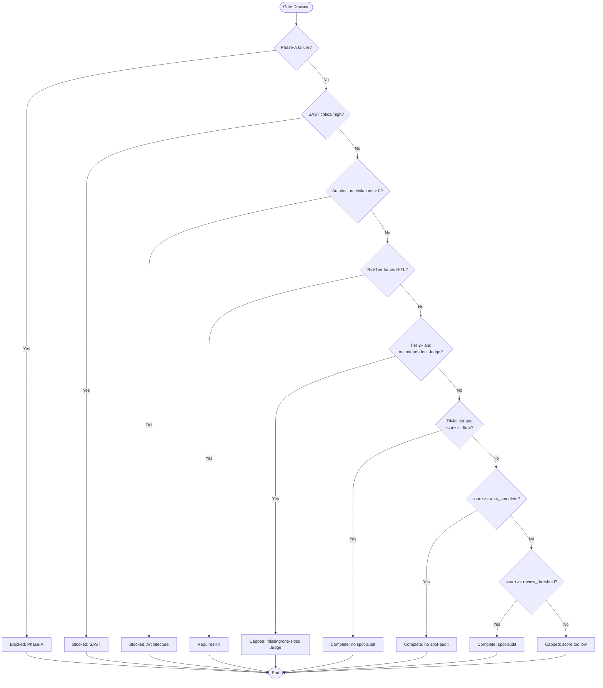
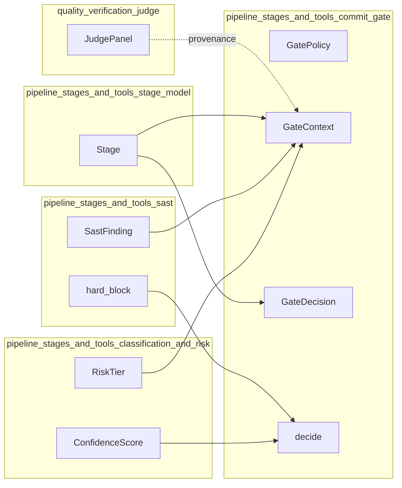
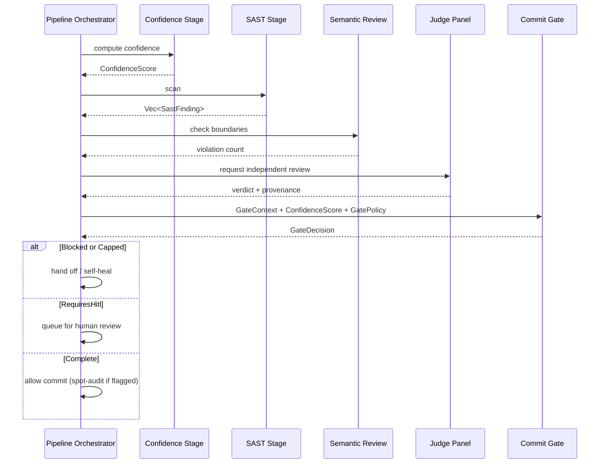

# pipeline_stages_and_tools_commit_gate

## Brief Introduction

The **Commit Gate** is the final policy decision point in the AI-native code-review pipeline. It consumes the Confidence Score produced by earlier stages, together with every deterministic hard gate (Phase-A results, SAST findings, architecture violations, and independent Judge verdicts), and emits a typed decision: auto-complete, complete with spot-audit, require human-in-the-loop (HITL), or block.

The gate enforces a strict, non-negotiable ordering: deterministic failures always win before the score is consulted. A critical secret leak or compile failure at Confidence 100 still blocks the commit. Only after all hard gates clear does the score drive the outcome, and high-risk edits always force human review regardless of score.

---

## Core Components

### `GatePolicy`

Tunable thresholds that define the score bands. Defaults follow the pipeline design's illustrative values.

| Field | Type | Default | Purpose |
|-------|------|---------|---------|
| `auto_complete_threshold` | `u8` | `90` | Score at/above which an edit auto-completes (Judge, if run, must also approve). |
| `review_threshold` | `u8` | `70` | Score at/above which an edit completes but is flagged for post-commit spot-audit. |
| `trivial_auto_approve_floor` | `u8` | `60` | Trivial edits (doc/comment/formatting only, zero blast radius) that clear every hard gate auto-complete without spot-audit. Never bypasses a hard gate. |

### `GateContext`

Everything the gate needs beyond the score.

| Field | Type | Description |
|-------|------|-------------|
| `tier` | `RiskTier` | Risk classification of the edit. |
| `phase_a_failure` | `Option<(Stage, String)>` | Any unresolved Phase-A (compile/test/lint/type) failure. `Some(...)` blocks. |
| `sast` | `&[SastFinding]` | Findings from the [SAST](pipeline_stages_and_tools_sast.md) stage. |
| `architecture_violations` | `u32` | Count of unremediated deterministic architecture boundary violations. |
| `judge_approved` | `Option<bool>` | Whether the [Judge](../ai_engine/quality_verification_judge.md) ran and approved. `None` means it did not run. |
| `judge_independent` | `bool` | Whether the approval came from a genuine, context-isolated independent Judge panel. |

### `GateDecision`

The typed outcome of the gate.

| Variant | Meaning |
|---------|---------|
| `Blocked { stage, deterministic_failure }` | A deterministic hard gate failed; no score computed. |
| `RequiresHitl { score, judge_ran }` | Tier 3 / critical-path: commit needs a human even at a perfect score. |
| `Complete { score, spot_audit }` | The gate cleared. `spot_audit` marks the "trust but verify" band. |
| `Capped { blocking_stage, reason, score }` | Score below the review band, or the Judge withheld approval — hand to human, keep self-healing. |

### `decide`

```rust
pub fn decide(ctx: &GateContext, score: &ConfidenceScore, policy: GatePolicy) -> GateDecision
```

The central decision function. It evaluates hard gates in fixed order, then applies score bands and tier-specific rules.

---

## Architecture

The Commit Gate sits at the end of the pipeline orchestration layer. It does not perform analysis itself; it aggregates signals from upstream stages and applies policy.



---

## Decision Flow

The gate applies a fixed, ordered evaluation:



### Ordering Rules

1. **Phase-A failures block first.** Compile, test, lint, or type errors stop the commit before scoring.
2. **SAST critical/high hard-blocks.** Security findings from [pipeline_stages_and_tools_sast](pipeline_stages_and_tools_sast.md) override any confidence score.
3. **Architecture violations block.** Unremediated boundary violations from [pipeline_stages_and_tools_semantic_review](pipeline_stages_and_tools_semantic_review.md) stop the commit.
4. **Tier 3 forces HITL.** Even a perfect score cannot auto-complete a high-risk edit.
5. **Tier 2+ requires an independent Judge.** A genuine, context-isolated [Judge panel](../ai_engine/quality_verification_judge.md) verdict is mandatory for moderate-and-above edits.
6. **Trivial auto-approve floor.** Doc/comment-only edits that cleared all hard gates can auto-complete at a lower score, without spot-audit.
7. **Score bands.** Only after all hard gates clear does the confidence score determine completion, review-band completion, or capping.

---

## Dependencies

The Commit Gate depends on components from sibling modules in the pipeline orchestration layer:



| Dependency | Module | Role in Commit Gate |
|------------|--------|---------------------|
| `ConfidenceScore` | pipeline_stages_and_tools_classification_and_risk | Score input used only after hard gates clear. |
| `RiskTier` | pipeline_stages_and_tools_classification_and_risk | Drives tier-specific mandatory rules (HITL, Judge). |
| `SastFinding` / `hard_block` | [pipeline_stages_and_tools_sast](pipeline_stages_and_tools_sast.md) | Deterministic security hard gate. |
| `Stage` | [pipeline_stages_and_tools_stage_model](pipeline_stages_and_tools_stage_model.md) | Identifies which stage caused a block or cap. |
| `JudgePanel` | [quality_verification_judge](../ai_engine/quality_verification_judge.md) | Source of independent Judge verdict provenance. |

---

## Component Interaction

During a pipeline run, the Commit Gate receives a populated `GateContext` and a `ConfidenceScore`. The orchestrator (e.g., [pipeline_stages_and_tools_pipeline_orchestrator](pipeline_stages_and_tools_pipeline_orchestrator.md)) is responsible for running prior stages and assembling the context.



---

## Policy Defaults and Tuning

The default policy values are illustrative and can be tuned per deployment:

```rust
GatePolicy {
    auto_complete_threshold: 90,
    review_threshold: 70,
    trivial_auto_approve_floor: 60,
}
```

Operators can adjust these thresholds to change the strictness of the gate. However, the hard-gate ordering and tier-specific mandates (Tier 3 HITL, Tier 2+ independent Judge) are invariant — they are not configurable through `GatePolicy`.

---

## Edge Cases and Invariants

| Scenario | Outcome | Rationale |
|----------|---------|-----------|
| Confidence 100 + Phase-A failure | `Blocked` | Deterministic failures always win. |
| Confidence 100 + SAST critical | `Blocked` | Security hard-block. |
| Confidence 100 + Tier 3 | `RequiresHitl` | High-risk edits always need human review. |
| Tier 2 + no Judge verdict | `Capped` | Independent Judge is mandatory at Tier 2+. |
| Tier 2 + self-asserted approval | `Capped` | One-sided approval violates independence rule. |
| Trivial edit + score 65 | `Complete` (no spot-audit) | Trivial floor applies after hard gates clear. |
| Trivial edit + SAST finding | `Blocked` | Trivial floor never bypasses a hard gate. |
| Judge withheld approval + high score | `Capped` | Judge verdict is a gate the score cannot buy back. |

---

## How It Fits into the System

The Commit Gate is the capstone of [pipeline_orchestration](pipeline_orchestration.md) within the broader [pipeline_runtime](pipeline_runtime.md). It translates the outputs of classification, risk assessment, SAST, semantic review, and quality verification into an actionable commit decision.

It is closely related to:

- [pipeline_stages_and_tools_stage_execution](pipeline_stages_and_tools_stage_execution.md) — runs the individual stages whose outputs feed the gate.
- pipeline_stages_and_tools_classification_and_risk — supplies `ConfidenceScore` and `RiskTier`.
- [pipeline_stages_and_tools_sast](pipeline_stages_and_tools_sast.md) — supplies security findings.
- [pipeline_stages_and_tools_semantic_review](pipeline_stages_and_tools_semantic_review.md) — supplies architecture violation signals.
- [quality_verification_judge](../ai_engine/quality_verification_judge.md) — supplies the independent panel verdict required at higher tiers.
- [edit_turn_execution](edit_turn_execution.md) — consumes the gate decision to determine whether to apply an edit.

By centralizing the final decision in one policy function, the system ensures consistent, auditable, and safe commit behavior across all pipeline runs.
