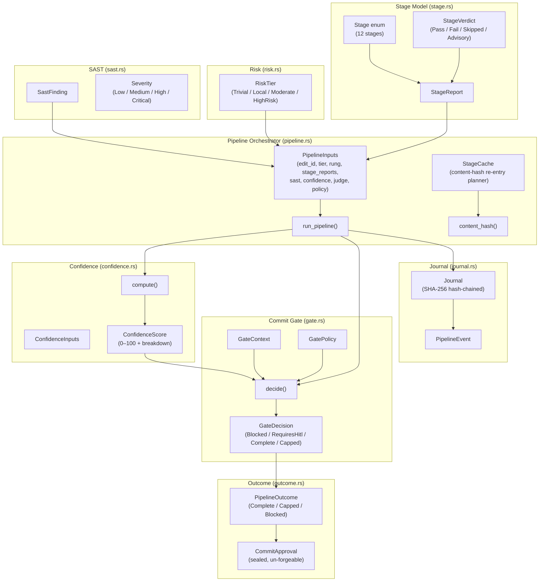
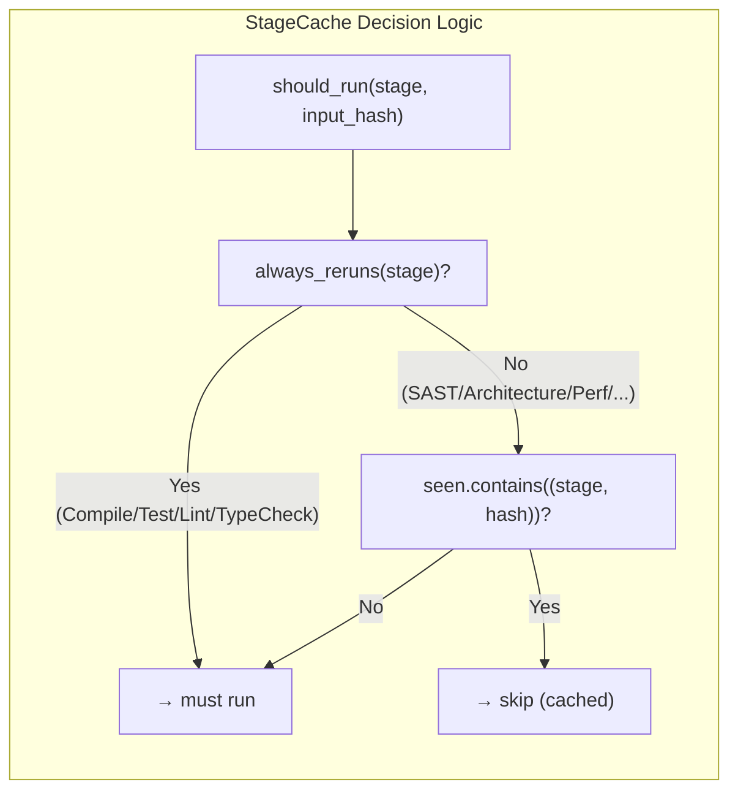
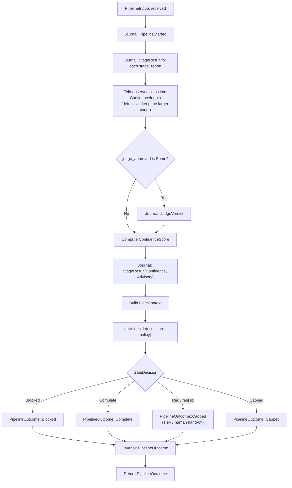
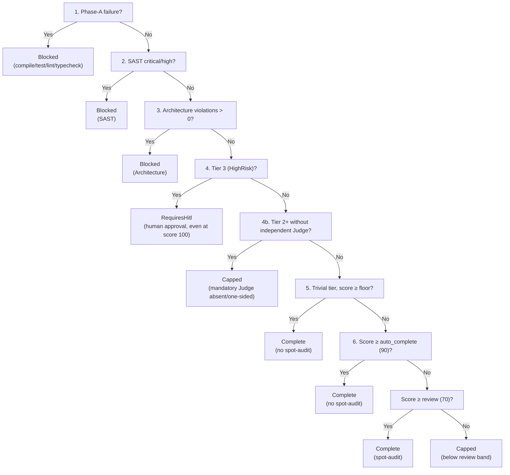
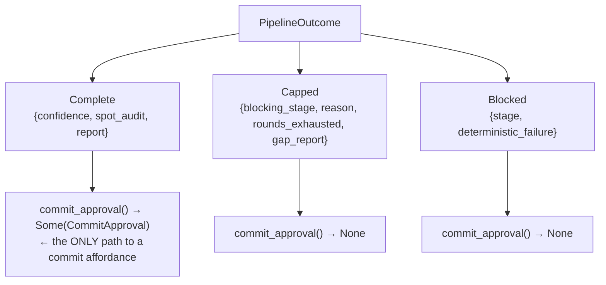
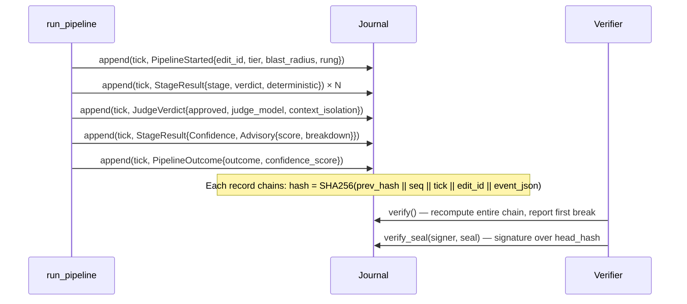
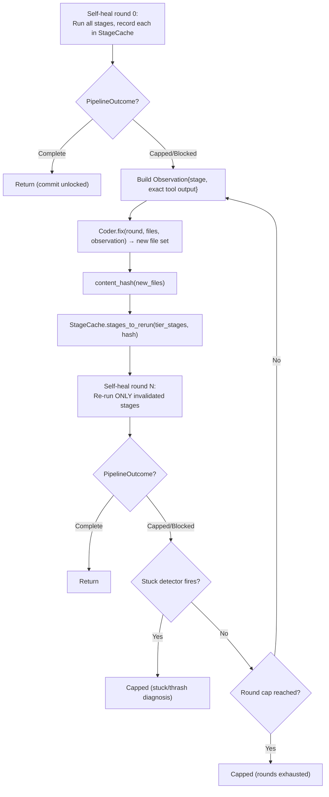
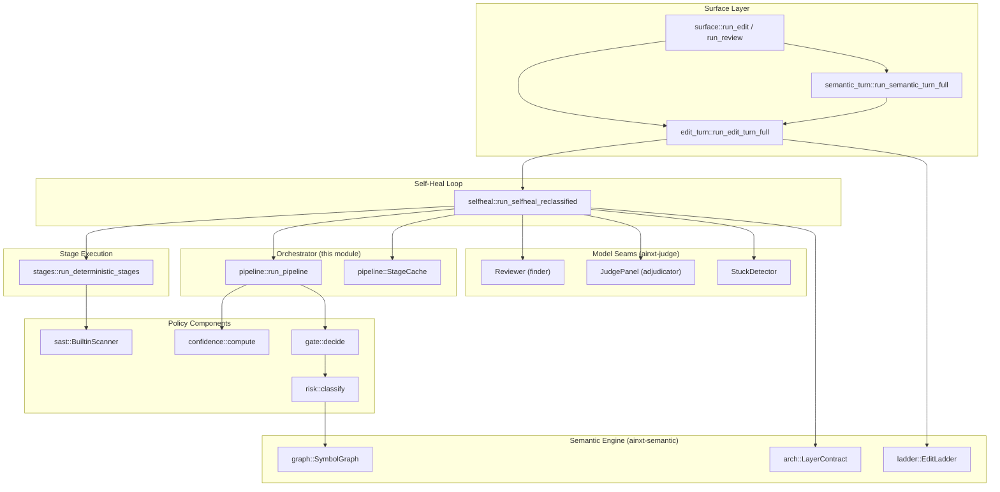
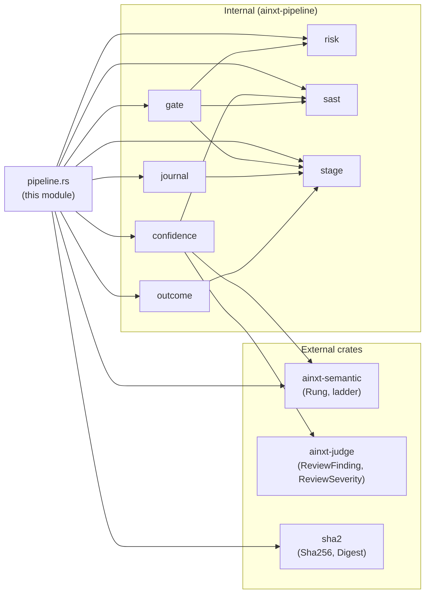

# Pipeline Orchestrator (`pipeline_stages_and_tools_pipeline_orchestrator`)

> **Source file:** `crates/ainxt-pipeline/src/pipeline.rs`
>
> **Core components:** `PipelineInputs`, `StageCache`
>
> **Key function:** `run_pipeline`

## 1. Purpose

The pipeline orchestrator is the **single composition point** that binds every stage of the Code-Review Pipeline — risk classification, deterministic Phase-A stages, SAST hard-block, Confidence Score, and Commit Gate — into one typed [`PipelineOutcome`]. It is the heart of the system's anti-sycophancy design: an agent may never declare "done" about a code change except through a `Complete` outcome, and the orchestrator is the only code path that produces one.

The orchestrator does **not** itself shell out to compilers, LSPs, or LLMs. Those are stage seams whose results the caller feeds in (already deterministic-first per the pipeline's ordering rules). What lives here is the **policy composition** and the **invariants**:

- A Phase-A failure (compile / test / lint / type-check) or a SAST critical/high finding can **never** reach `Complete`.
- A Tier-3 (critical-path) edit is handed to a human **even at a perfect Confidence Score**.
- Every step is journaled to a SHA-256 hash-chained [`Journal`] for tamper-evident regulator replay.

The module also implements the **self-heal re-entry planner** (`StageCache`), which uses content-hash stage caching to ensure that a self-heal fix confined to one file does not needlessly re-run expensive stages (Architecture, Perf, SAST) on unrelated files whose content hash hasn't changed — while compile, test, lint, and type-check **always** re-run for any touched file.

## 2. Architecture Overview

## 3. Core Components

### 3.1 `PipelineInputs<'a>`

The inputs to one pipeline pass. Phase-A stage results are supplied already-run (deterministic first, cheapest-most-likely-to-fail first — the ordering is the caller's responsibility, typically handled by the [stage execution module](pipeline_stages_and_tools_stage_execution.md)).

| Field | Type | Description |
|---|---|---|
| `edit_id` | `String` | Unique identifier for this edit, used as the journal key. |
| `tier` | `RiskTier` | The (possibly escalated) risk tier driving the Commit Gate. See [classification and risk](classification_and_risk.md). |
| `rung` | `Rung` | The edit-engine rung used (LSP / AST / StructuredPatch / TextPatch). Drives the Confidence Score's fidelity penalty. |
| `blast_fan_out` | `usize` | Direct 1-hop fan-out of the touched symbols. Journaled on `PipelineStarted`. |
| `stage_reports` | `Vec<StageReport>` | The Phase-A + optional later stage reports already produced this pass. |
| `sast` | `&'a [SastFinding]` | SAST findings from this pass. Critical/high hard-block; medium/low are scored. |
| `confidence` | `ConfidenceInputs<'a>` | Structured inputs to the Confidence Score computation. |
| `architecture_violations` | `u32` | Unremediated deterministic architecture boundary violations. Hard-blocks if > 0. |
| `judge_approved` | `Option<bool>` | Whether the Judge ran and approved. `None` = did not run (allowed only below Tier 2). |
| `judge_independent` | `bool` | Whether the verdict came from a genuine context-isolated independent panel. Required `true` for Tier-2+ commit. |
| `policy` | `GatePolicy` | The Commit Gate thresholds (auto-complete, review, trivial-floor). |

### 3.2 `StageCache`

A content-hash cache that tracks which `(stage, input-content-hash)` pairs have already been computed during a pipeline run. It implements the self-heal re-entry strategy: **re-enter at the earliest invalidated stage, not stage 1**.

**Key methods:**

| Method | Description |
|---|---|
| `new()` | Create an empty cache. |
| `should_run(stage, input_hash)` | Whether `stage` must run given its input file set's `input_hash`. Phase-A stages always return `true`. |
| `record(stage, input_hash)` | Record that `stage` ran against `input_hash`. |
| `stages_to_rerun(tier_stages, input_hash)` | Plan the earliest-invalidated re-entry: the subset of `tier_stages` that must re-run, preserving stage order. |

**Always-rerun stages** (never cached, regardless of content hash):
- `Compile`, `Test`, `Lint`, `TypeCheck`

These are the "basics" that always re-run for any touched file, however small the fix — never trust a small change to skip the basics.

### 3.3 `content_hash(files)`

A deterministic SHA-256 content hash over a `BTreeMap<String, String>` (sorted path → content pairs). Used by `StageCache` to detect whether a self-heal round's file set has actually changed. Stable across replays and sensitive to any content change.

### 3.4 `run_pipeline(inp, journal) -> PipelineOutcome`

The main orchestration function. It is **deterministic**: journal ticks are a monotonic counter within the pass (no wall clock).

## 4. The Commit Gate Decision Flow

The orchestrator delegates the final policy decision to [`gate::decide`](pipeline_stages_and_tools_commit_gate.md), which applies a strict, non-negotiable ordering:

**Hard gates** (checked before the score is even consulted):
1. **Phase-A failures** — an unresolved compile/test/lint/type-check failure blocks immediately.
2. **SAST critical/high** — a secret leak or PAN-in-log hard-blocks regardless of score.
3. **Architecture violations** — unremediated boundary violations block.

**Tier-driven gates:**
4. **Tier 3 (HighRisk)** — forces human-in-the-loop even at Confidence 100.
4b. **Tier 2+ (Moderate/HighRisk)** — requires a genuine, context-isolated independent Judge panel verdict. A self-asserted `judge_approved = Some(true)` with `judge_independent = false` is "one-sided" and does not satisfy the mandate.

**Score-driven bands** (defaults from `GatePolicy::default()`):
- `≥ 90` → auto-complete (no spot-audit)
- `≥ 70` → complete with post-commit spot-audit
- `< 70` → capped (human hand-off)
- Trivial tier (`≥ 60` floor) → auto-complete without spot-audit

## 5. The Three Pipeline Outcomes

The orchestrator produces exactly one of three typed outcomes. There is **no fourth "mostly done" variant** by design.

| Outcome | When | Commit? | Rendered as |
|---|---|---|---|
| **Complete** | All hard gates cleared, score in auto-complete or review band, Judge (if required) approved. | ✅ Yes (via `CommitApproval`) | "done" / commit affordance |
| **Capped** | Score below review band, Judge withheld, self-heal budget exhausted, or mandatory Judge absent/one-sided at Tier 2+. | ❌ No | Honest gap report + human hand-off |
| **Blocked** | A deterministic hard gate failed (Phase-A failure, SAST critical/high, architecture violation). | ❌ No | Hard block with exact failure detail |

The `CommitApproval` is a **sealed type** with no public constructor — it can only be obtained from `PipelineOutcome::commit_approval()`, which returns `Some` exclusively for `Complete`. This makes the anti-sycophancy invariant structural: a renderer has no code path to a "done" signal without a real `Complete` in hand.

## 6. Journaling and Tamper-Evidence

Every step of the pipeline pass is appended to a SHA-256 hash-chained [`Journal`]. The journal is the tamper-evident Event Log that a regulator reconstructs years later.

**Journal events emitted by the orchestrator:**

| Event | When |
|---|---|
| `PipelineStarted` | At the start of `run_pipeline`, carrying the edit id, risk tier, blast radius, and edit-engine rung. |
| `StageResult` | For each stage report in the inputs, plus the synthesized Confidence stage. |
| `JudgeVerdict` | If `judge_approved` is `Some`, recording the verdict and context-isolation status. |
| `PipelineOutcome` | At the end, recording the outcome label and confidence score. |

Other events (`SelfHealTriggered`, `RoundCapped`, `RiskReclassified`, `WirePolicySealed`, `BreakerDifferential`) are emitted by the [self-healing loop](self_healing.md) and the [wire seal](wire_seal.md), not by the orchestrator itself.

## 7. Self-Heal Re-Entry Planning

The `StageCache` is the mechanism that makes self-heal efficient. When the [self-healing loop](self_healing.md) runs a fix-and-reverify cycle, it consults the `StageCache` to determine which stages must re-run:

**Re-entry rules:**
- **Phase-A stages** (Compile, Test, Lint, TypeCheck) **always** re-run, regardless of content hash — never trust a small change to skip the basics.
- **Expensive stages** (SAST, Architecture, Perf, Regression) are **cached** by `(stage, content_hash)`. If the file set's content hash hasn't changed, the stage is skipped.
- A **changed file set** (different content hash) re-invalidates all stages for that hash.

This implements the design's "re-enter at the earliest invalidated stage, not stage 1" principle: a fix confined to file X does not re-run Architecture/Perf/SAST on unrelated files whose hash didn't change.

## 8. How the Orchestrator Fits Into the System

### Callers of `run_pipeline`

1. **[Self-healing loop](self_healing.md)** (`selfheal::run_selfheal_reclassified`) — the primary caller. Each self-heal round runs the deterministic stages, optionally runs perf/review/judge stages, assembles `PipelineInputs`, and calls `run_pipeline`. On `Complete` it returns; on `Capped`/`Blocked` it feeds the observation to the Coder and re-enters.

2. **[Surface review-only path](pipeline_stages_and_tools_surface_api.md)** (`surface::run_review`) — a single-pass review (no self-heal, no sink). Runs the deterministic stages + LLM Review + Judge panel, assembles `PipelineInputs`, and calls `run_pipeline` to produce the typed outcome.

3. **[Edit-turn gate](edit_turn_execution.md)** (`edit_turn::run_edit_turn_full`) — the public entrypoint for editing turns. Delegates to the self-heal loop, which in turn calls `run_pipeline`.

### What the orchestrator does NOT do

- **Does not run compilers/LLMs** — stage results are fed in by the caller.
- **Does not self-heal** — the [self-healing loop](self_healing.md) wraps `run_pipeline` in a bounded fix-and-reverify cycle.
- **Does not write to the sink** — the [edit-turn gate](edit_turn_execution.md) performs the durable write only after receiving a `CommitApproval` from a `Complete`.
- **Does not classify risk** — the [classification module](classification_and_risk.md) computes the tier before stage 1 runs; the orchestrator consumes it.
- **Does not compute architecture violations or test coverage** — the [semantic review module](pipeline_stages_and_tools_semantic_review.md) computes these from the code itself.

## 9. Dependency Graph

## 10. Key Invariants

| # | Invariant | Enforced By |
|---|---|---|
| 1 | A Phase-A failure can never reach `Complete`. | `gate::decide` step 1, called by `run_pipeline`. |
| 2 | A SAST critical/high finding can never reach `Complete`, regardless of score. | `gate::decide` step 2. |
| 3 | An architecture boundary violation can never reach `Complete`. | `gate::decide` step 3. |
| 4 | A Tier-3 edit is always handed to a human, even at Confidence 100. | `gate::decide` step 4 (`RiskTier::forces_hitl`). |
| 5 | A Tier-2+ edit without a genuine independent Judge panel verdict is never `Complete`. | `gate::decide` step 4b. |
| 6 | A skip is never free — it is folded into the Confidence Score as a penalty. | `run_pipeline` defensively updates `confidence.skipped_stages` from observed reports. |
| 7 | The Judge's verdict is not a term in the Confidence Score arithmetic. | `confidence::compute` has no Judge input; the Judge is a gate *on top of* the score. |
| 8 | `CommitApproval` is un-forgeable outside the `outcome` module. | Private `seal: ()` field; only `PipelineOutcome::commit_approval()` constructs it. |
| 9 | Every pipeline step is journaled to a hash-chained, tamper-evident trail. | `run_pipeline` appends to `Journal` with monotonic ticks. |
| 10 | Self-heal re-enters at the earliest invalidated stage, not stage 1. | `StageCache::stages_to_rerun` with content-hash caching. |
| 11 | Compile, test, lint, and type-check always re-run for any touched file. | `always_reruns()` in `StageCache::should_run`. |

## 11. Related Module Documentation

| Module | Relationship |
|---|---|
| [pipeline_stages_and_tools_stage_model](pipeline_stages_and_tools_stage_model.md) | The `Stage` enum, `StageReport`, and `StageVerdict` types consumed by the orchestrator. |
| [pipeline_stages_and_tools_stage_execution](pipeline_stages_and_tools_stage_execution.md) | The `StageTools` trait and `run_deterministic_stages` driver that produces the stage reports the orchestrator consumes. |
| [pipeline_stages_and_tools_commit_gate](pipeline_stages_and_tools_commit_gate.md) | The `GateContext`, `GatePolicy`, `GateDecision`, and `decide()` function that the orchestrator delegates the final policy decision to. |
| [pipeline_stages_and_tools_surface_api](pipeline_stages_and_tools_surface_api.md) | The `run_edit` / `run_review` entrypoints that call `run_pipeline` (review-only path) or the self-heal loop (editing path). |
| [pipeline_stages_and_tools_semantic_review](pipeline_stages_and_tools_semantic_review.md) | The `analyze_semantic_gate` function that computes architecture violations and test coverage from the code, feeding the orchestrator's `architecture_violations` and `confidence.blast_radius_test_coverage`. |
| [pipeline_stages_and_tools_sast](pipeline_stages_and_tools_sast.md) | The `BuiltinScanner` and `SastFinding` types that produce the SAST findings the orchestrator hard-blocks on. |
| [pipeline_stages_and_tools_breaker](pipeline_stages_and_tools_breaker.md) | The optional Tier-3 differential/invariant oracle. |
| [classification_and_risk](classification_and_risk.md) | The `RiskTier`, `classify()`, and `classify_edit()` that compute the tier before stage 1 runs. |
| [self_healing](self_healing.md) | The `run_selfheal_reclassified` loop that wraps `run_pipeline` in a bounded fix-and-reverify cycle, using `StageCache` for re-entry planning. |
| [edit_turn_execution](edit_turn_execution.md) | The `run_edit_turn_full` gate that binds a code-editing turn to a `PipelineOutcome` and performs the durable write only on `Complete`. |
| [journaling](journaling.md) | The `Journal`, `PipelineEvent`, `JournalRecord`, and `SignedSeal` types that provide tamper-evident regulator replay. |
| [performance](performance.md) | The `analyze_perf` stage-6 function that produces the `perf_regression_penalty` fed into `ConfidenceInputs`. |
| [wire_seal](wire_seal.md) | The `seal_wire_config` function that replaces wire-supplied policy fields with deployment-derived values before the orchestrator runs. |
