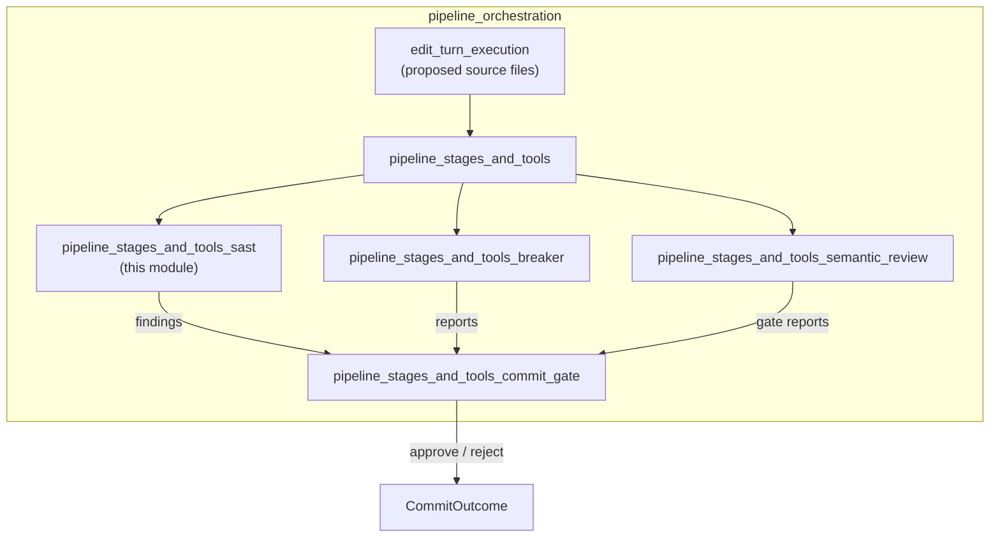
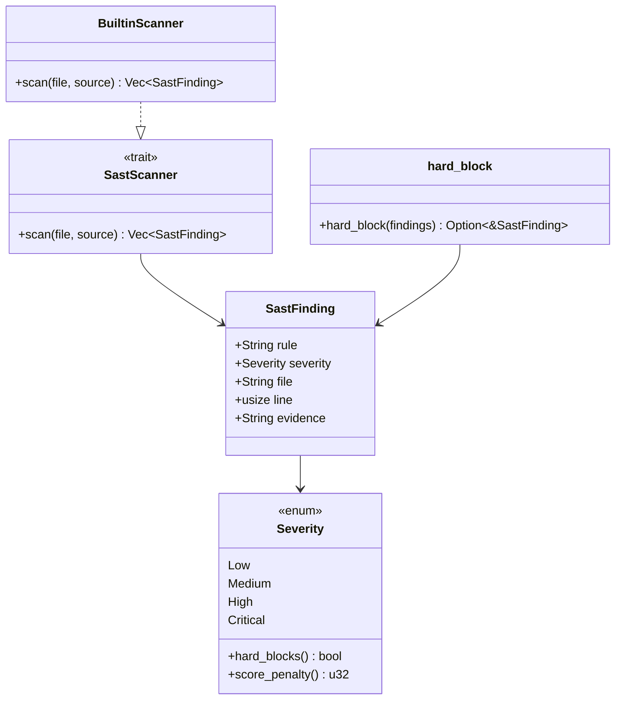
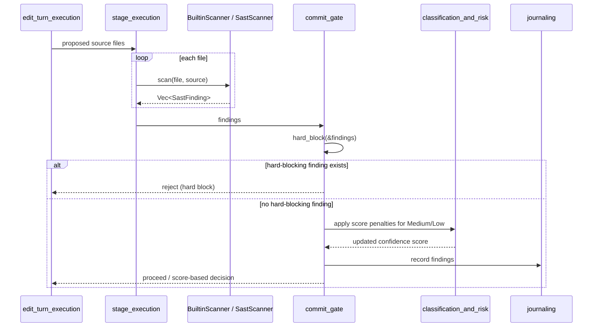
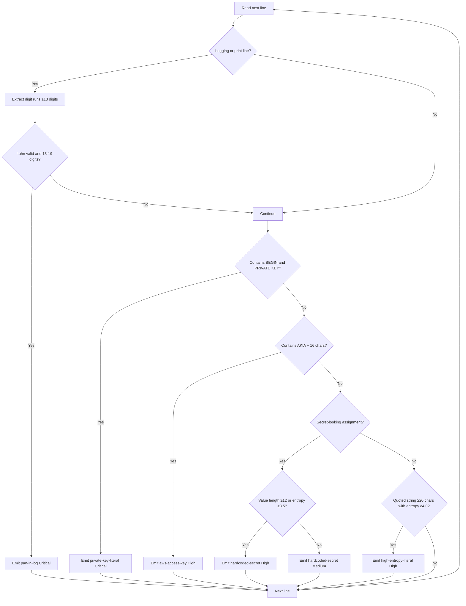
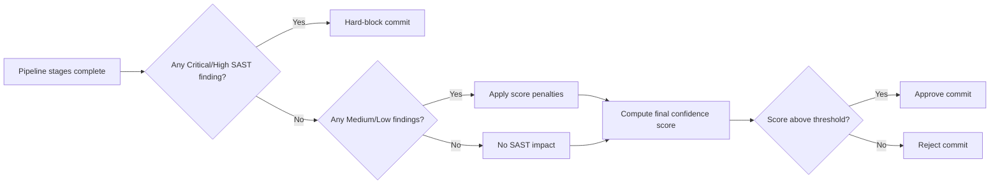

# pipeline_stages_and_tools_sast

## Brief Introduction

The **SAST (Static Application Security Testing) stage** is a security gate within the [pipeline_stages_and_tools](pipeline_stages_and_tools.md) orchestration layer. It performs deterministic, offline static analysis on source code before a commit or edit is approved. Unlike other pipeline stages that contribute to a confidence score, the SAST stage has a special mandate: **critical and high-severity findings hard-block the commit regardless of the overall confidence score**.

The module is implemented in `crates/ainxt-pipeline/src/sast.rs` and provides:

- A pluggable [`SastScanner`](pipeline_stages_and_tools_sast.md#sastscanner-trait) trait for integrating external scanners such as Semgrep, `cargo audit`, Bandit, or gosec.
- A [`BuiltinScanner`](pipeline_stages_and_tools_sast.md#builtinscanner) that runs offline and detects payments-critical security classes:
  - Accidental PAN (Primary Account Number) logging
  - Hard-coded secrets and API keys
  - Private-key literals
  - AWS access keys
  - High-entropy string literals that may indicate embedded credentials
- A [`SastFinding`](pipeline_stages_and_tools_sast.md#sastfinding) model that captures rule, severity, file location, and masked evidence.
- A [`hard_block`](pipeline_stages_and_tools_sast.md#hard_block-function) function used by the commit gate to reject changes with critical/high findings before any score is computed.

This module is the implementation of the SAST stage described in the architecture document `docs/architecture/CODE_REVIEW_PIPELINE.md` (stage 5).

---

## Core Components

### `Severity`

An ordered enum representing the severity of a SAST finding:

| Variant  | Hard-blocks commit | Score penalty |
|----------|-------------------|---------------|
| `Low`    | No                | 2             |
| `Medium` | No                | 8             |
| `High`   | **Yes**           | 20            |
| `Critical` | **Yes**         | 100           |

- `hard_blocks()` returns `true` for `Critical` and `High`.
- `score_penalty()` is used for non-blocking findings (`Medium`/`Low`) that reduce the confidence score instead of blocking.

### `SastFinding`

A structured finding produced by any [`SastScanner`](pipeline_stages_and_tools_sast.md#sastscanner-trait):

```rust
pub struct SastFinding {
    pub rule: String,      // Rule identifier, e.g. "pan-in-log"
    pub severity: Severity,
    pub file: String,      // File path
    pub line: usize,       // 1-based line number
    pub evidence: String,  // Masked or summarized matched text
}
```

The `evidence` field is never a paraphrase and never leaks sensitive values (e.g., PANs are masked, secrets are truncated).

### `SastScanner` trait

```rust
pub trait SastScanner {
    fn scan(&self, file: &str, source: &str) -> Vec<SastFinding>;
}
```

The trait abstracts over concrete scanners. The [`BuiltinScanner`](pipeline_stages_and_tools_sast.md#builtinscanner) is one implementation; production deployments can plug in Semgrep, `cargo audit`, or language-specific scanners. All findings flow into the same hard-block logic.

### `BuiltinScanner`

A deterministic, line-oriented scanner with no external dependencies. It scans source text line-by-line and emits findings for the following rule classes:

| Rule | Severity | Trigger |
|------|----------|---------|
| `pan-in-log` | `Critical` | Luhn-valid 13–19 digit run on a logging/print line |
| `private-key-literal` | `Critical` | Line contains `-----BEGIN` and `PRIVATE KEY` |
| `aws-access-key` | `High` | `AKIA` followed by ≥16 uppercase/digit characters |
| `hardcoded-secret` | `High`/`Medium` | Assignment to a secret-looking key (`secret`, `api_key`, `token`, `password`, etc.) |
| `high-entropy-literal` | `High` | Quoted string ≥20 chars with Shannon entropy ≥4.0 bits/char |

The scanner uses:
- **Luhn checksum** to discriminate real PANs from arbitrary long numbers.
- **Shannon entropy** in bits per character to detect possible embedded credentials.
- **Masked evidence** so that findings do not re-expose secrets in logs or reports.

### `hard_block` function

```rust
pub fn hard_block(findings: &[SastFinding]) -> Option<&SastFinding>
```

Returns the most severe hard-blocking finding (`Critical` or `High`), if any. The [commit gate](pipeline_stages_and_tools_commit_gate.md) consults this function before computing a confidence score, ensuring that security findings cannot be overruled by model-generated justifications.

---

## Architecture

### Position in the System

The SAST module sits inside the [pipeline_runtime](pipeline_runtime.md) → [pipeline_orchestration](pipeline_orchestration.md) → [pipeline_stages_and_tools](pipeline_stages_and_tools.md) hierarchy. It is one of several specialized stage implementations, alongside:

- [pipeline_stages_and_tools_stage_model](pipeline_stages_and_tools_stage_model.md) — stage lifecycle and reporting model
- [pipeline_stages_and_tools_stage_execution](pipeline_stages_and_tools_stage_execution.md) — generic stage execution framework
- [pipeline_stages_and_tools_pipeline_orchestrator](pipeline_stages_and_tools_pipeline_orchestrator.md) — pipeline inputs and caching
- [pipeline_stages_and_tools_surface_api](pipeline_stages_and_tools_surface_api.md) — review request/response surface
- [pipeline_stages_and_tools_semantic_review](pipeline_stages_and_tools_semantic_review.md) — semantic gate reports
- [pipeline_stages_and_tools_breaker](pipeline_stages_and_tools_breaker.md) — adversarial breaker reports
- [pipeline_stages_and_tools_commit_gate](pipeline_stages_and_tools_commit_gate.md) — final commit decision gate

The SAST stage consumes source files produced by the [edit turn execution](pipeline_orchestration.md#edit_turn_execution) layer and feeds findings into the [commit gate](pipeline_stages_and_tools_commit_gate.md).



### Component Diagram



---

## Data Flow

A typical SAST scan flows through the pipeline as follows:

1. The [edit turn execution](pipeline_orchestration.md#edit_turn_execution) layer produces a set of proposed source files.
2. The [stage execution framework](pipeline_stages_and_tools_stage_execution.md) invokes the configured [`SastScanner`](pipeline_stages_and_tools_sast.md#sastscanner-trait) for each file.
3. The scanner returns a list of [`SastFinding`](pipeline_stages_and_tools_sast.md#sastfinding) values.
4. The [commit gate](pipeline_stages_and_tools_commit_gate.md) calls [`hard_block`](pipeline_stages_and_tools_sast.md#hard_block-function):
   - If a `Critical` or `High` finding exists, the commit is rejected immediately.
   - Otherwise, `Medium`/`Low` findings are converted to confidence-score penalties by the [classification and risk](classification_and_risk.md) module.
5. Findings are recorded in the [journal](journaling.md) and may be surfaced through the [surface API](pipeline_stages_and_tools_surface_api.md).



---

## Component Interactions

### With the Commit Gate

The SAST module does not make commit decisions itself. It exports [`hard_block`](pipeline_stages_and_tools_sast.md#hard_block-function) as a pure helper so that the [commit gate](pipeline_stages_and_tools_commit_gate.md) can enforce the "security findings override score" policy. This separation keeps the SAST module deterministic and testable while the gate combines SAST output with other stage results.

### With the Stage Execution Framework

The [stage execution framework](pipeline_stages_and_tools_stage_execution.md) treats the scanner as a [`ToolResult`](pipeline_stages_and_tools_stage_execution.md#toolresult) producer. The framework is responsible for:
- Selecting the active scanner (builtin or external).
- Running scans over the file set.
- Aggregating findings into a [`StageRunOutput`](pipeline_stages_and_tools_stage_execution.md#stagerunoutput).

### With Classification and Risk

Non-blocking findings (`Medium`/`Low`) are passed to the [classification and risk](classification_and_risk.md) module, which maps severities to confidence-score penalties using [`Severity::score_penalty()`](pipeline_stages_and_tools_sast.md#severity).

### With Semantic Review and Breaker

The SAST stage operates independently from:
- [pipeline_stages_and_tools_semantic_review](pipeline_stages_and_tools_semantic_review.md) — semantic correctness and gate reports.
- [pipeline_stages_and_tools_breaker](pipeline_stages_and_tools_breaker.md) — adversarial findings and breaker reports.

All three feed into the same [commit gate](pipeline_stages_and_tools_commit_gate.md), but only SAST findings can hard-block independently of the confidence score.

---

## Process Flows

### BuiltinScanner Rule Evaluation

For each line of source code, the [`BuiltinScanner`](pipeline_stages_and_tools_sast.md#builtinscanner) applies the following checks in order:



### Commit Decision with SAST



---

## Security and Compliance Notes

- **Hard-block guarantee**: `Critical` and `High` findings bypass the confidence score. This prevents a language model from arguing away a deterministic security violation.
- **Evidence masking**: PANs are masked (`************1111`), secrets are truncated (`key = "…"`), and AWS keys are shortened (`AKIAxxxx…`). This ensures findings can be logged and reviewed without re-exposing sensitive data.
- **Offline operation**: The [`BuiltinScanner`](pipeline_stages_and_tools_sast.md#builtinscanner) requires no network access, making it suitable for CI/CD environments and local developer loops.
- **Payments-critical focus**: The rule set is tuned for financial/PCI-adjacent code, particularly accidental PAN logging.

---

## Testing

The module includes unit tests covering:
- Luhn-valid PAN detection in log lines (`critical`, hard-blocking).
- Luhn-invalid numbers are ignored.
- PANs outside logging contexts are not flagged by this stage.
- Hard-coded secret assignments are flagged with masked evidence.
- Private-key headers are flagged as `critical`.
- AWS access keys are flagged as `high`.
- Clean code yields no findings.
- `hard_block` selects the most severe finding.
- Shannon entropy behaves as expected for repetitive vs. random strings.

---

## Related Documentation

- [pipeline_stages_and_tools](pipeline_stages_and_tools.md) — parent module overview
- [pipeline_stages_and_tools_stage_model](pipeline_stages_and_tools_stage_model.md) — stage reporting model
- [pipeline_stages_and_tools_stage_execution](pipeline_stages_and_tools_stage_execution.md) — generic stage execution
- [pipeline_stages_and_tools_pipeline_orchestrator](pipeline_stages_and_tools_pipeline_orchestrator.md) — pipeline inputs and caching
- [pipeline_stages_and_tools_surface_api](pipeline_stages_and_tools_surface_api.md) — review request/response surface
- [pipeline_stages_and_tools_semantic_review](pipeline_stages_and_tools_semantic_review.md) — semantic review gate
- [pipeline_stages_and_tools_breaker](pipeline_stages_and_tools_breaker.md) — adversarial breaker stage
- [pipeline_stages_and_tools_commit_gate](pipeline_stages_and_tools_commit_gate.md) — final commit decision gate
- [classification_and_risk](classification_and_risk.md) — risk scoring and confidence penalties
- [journaling](journaling.md) — audit journaling
- [pipeline_orchestration](pipeline_orchestration.md) — orchestration layer
- [pipeline_runtime](pipeline_runtime.md) — top-level runtime module
