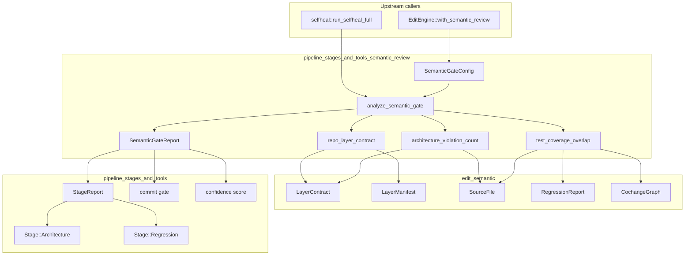
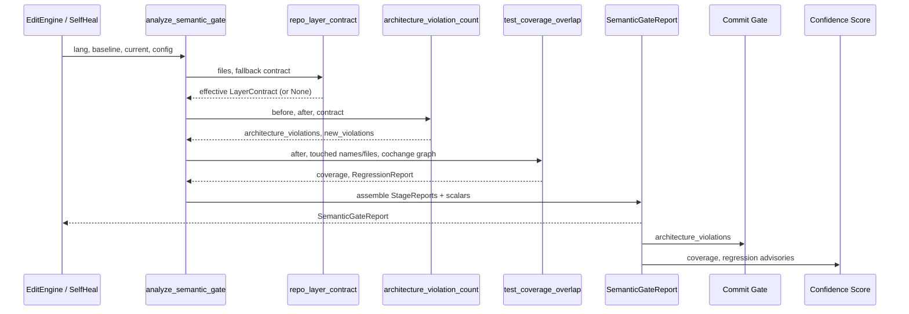
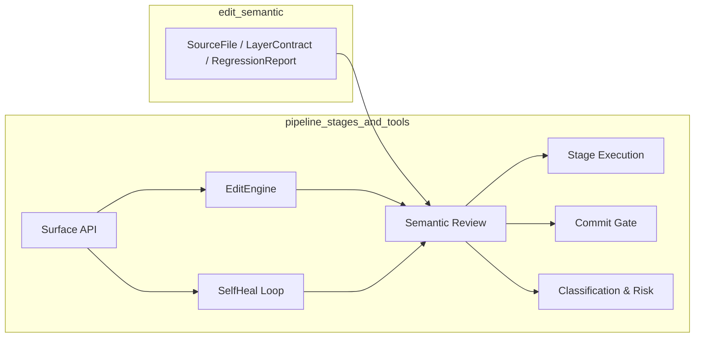

# pipeline_stages_and_tools_semantic_review

## Brief Introduction

The `pipeline_stages_and_tools_semantic_review` module implements the **Architecture Review (stage 7)** and **Regression Detection (stage 8)** seams for the live code-editing pipeline. Rather than requiring callers to invent scalar inputs such as `architecture_violations` or `blast_radius_test_coverage`, this module computes those values deterministically from the edited source files themselves. It bridges the graph-based semantic analysis provided by [`edit_semantic`](edit_semantic.md) into the scalar stage reports that the pipeline's commit gate and confidence score consume.

In short, it turns "did this edit break an architecture boundary?" and "are the changed symbols covered by tests?" from human guesses into automated, reproducible computations.

## Core Functionality

### 1. Architecture Review (Stage 7)

The module evaluates whether a candidate edit introduces new violations of a declared layering contract.

- **Contract discovery**: The effective contract is resolved from a checked-in repo manifest (`.arch.json`, `ARCH_MANIFEST_PATH`) if present; otherwise a deployment-level fallback contract is used. A malformed manifest is treated as "not declared" so the system never silently widens the boundary past what the deployment asserts.
- **Violation detection**: The post-edit import graph is diffed against the baseline graph, and only *newly introduced* forbidden edges are attributed to the edit.
- **Hard gate output**: The count of new violations is the scalar the [commit gate](pipeline_stages_and_tools_commit_gate.md) uses to block or allow the edit.

### 2. Regression Detection (Stage 8)

The module computes blast-radius test coverage and change-coupling advisories.

- **Touched blast radius**: It compares the baseline file set to the candidate file set and identifies changed files plus added, changed, or removed symbol names.
- **Coverage overlap**: It measures the fraction `[0, 1]` of the touched blast radius that is reached by tests.
- **Coupling advisories**: Using a git-history co-change graph, it surfaces historical change-coupling relationships that may indicate missing test coverage.
- **Confidence input**: The coverage overlap feeds into the classification and risk confidence score; coupling advisories are informational only.

### 3. Language-Aware Parsing

The module maps the pipeline's capability language enum onto the AST grammar supported by `ainxt-semantic`. Languages without AST support (e.g., COBOL, `Other`) produce an honest `Skipped` report rather than a false "clean" result.

## Architecture and Component Relationships

### Component Responsibilities

| Component | Responsibility |
|-----------|----------------|
| `SemanticGateConfig` | Deployment-level seam wired once and reused per turn; carries the optional layering contract, co-change graph, and coupling threshold. |
| `repo_layer_contract` | Resolves the effective `LayerContract` for the current edit from `.arch.json` or a static fallback. |
| `architecture_violation_count` | Computes the number of new architecture-boundary violations introduced by the edit. |
| `test_coverage_overlap` | Computes blast-radius test coverage and the full regression report. |
| `analyze_semantic_gate` | Orchestrates stage 7 + stage 8 analysis over one candidate file set and produces a `SemanticGateReport`. |
| `SemanticGateReport` | Aggregated output: violation count, coverage, regression report, and the two `StageReport` objects. |

## Data Flow

### Per-Stage Flow

1. **Contract resolution**: `repo_layer_contract` searches the current file set for `.arch.json`. If found and parseable, it builds a `LayerContract` from the manifest; otherwise it uses the static fallback.
2. **AST conversion**: `to_source_files` converts the baseline and candidate file tuples into `ainxt-semantic::SourceFile` instances for the detected language.
3. **Architecture diff**: `LayerContract::new_violations` compares the post-edit graph to the pre-edit graph and returns only newly introduced violations.
4. **Touched-set extraction**: `touched` compares baseline and candidate definitions to identify changed files and symbol names.
5. **Regression analysis**: `ainxt_semantic::regression::analyze` computes coverage overlap and coupling advisories over the touched set.
6. **Report assembly**: `analyze_semantic_gate` builds `StageReport` objects with appropriate verdicts (`Pass`, `Fail`, or `Advisory`) and returns the `SemanticGateReport`.

## How It Fits into the Overall System

This module sits at the intersection of the [semantic editing layer](edit_semantic.md) and the [pipeline orchestration](pipeline_stages_and_tools_pipeline_orchestrator.md) layer:

- **Downstream consumers**: The [commit gate](pipeline_stages_and_tools_commit_gate.md) consumes `architecture_violations` as a hard blocker. The classification and risk module folds `coverage` and regression advisories into the confidence score.
- **Upstream integration**: `EditEngine::with_semantic_review` wires a `SemanticGateConfig` into the engine so that every live edit turn automatically runs semantic review. The self-healing loop invokes `analyze_semantic_gate` on each candidate file set it produces.
- **Surface API**: The [surface API](pipeline_stages_and_tools_surface_api.md) exposes review requests and outcomes; semantic review provides the computed data that backs those responses.
- **Stage execution**: The generic [stage execution](pipeline_stages_and_tools_stage_execution.md) machinery receives the `StageReport` objects produced here and journals them alongside reports from other stages.

## Key Design Decisions

- **Repo-owned contracts**: The `.arch.json` manifest lives inside the repository being edited, versioned alongside the code it constrains. This avoids the operational drift of a separate daemon-level configuration.
- **Fail-closed on malformed manifests**: An unparseable `.arch.json` falls back to the static contract (or no contract), preventing a broken file from silently removing all boundary checks.
- **Only new violations count**: The architecture gate attributes only violations introduced by the current edit, not pre-existing technical debt.
- **Honest skips**: Languages without AST support produce explicit `Skipped` reports with a clear reason, rather than defaulting to "pass" values that could hide real issues.
- **Deterministic outputs**: Both stages are computed from the actual file contents and declared contracts, making results reproducible across turns and environments.

## References

- [`edit_semantic`](edit_semantic.md) — Provides `LayerContract`, `LayerManifest`, `SourceFile`, `RegressionReport`, and `CochangeGraph`.
- [`pipeline_stages_and_tools_stage_execution`](pipeline_stages_and_tools_stage_execution.md) — Generic stage runner and `StageReport` machinery.
- [`pipeline_stages_and_tools_pipeline_orchestrator`](pipeline_stages_and_tools_pipeline_orchestrator.md) — Pipeline inputs, caching, and turn orchestration.
- [`pipeline_stages_and_tools_surface_api`](pipeline_stages_and_tools_surface_api.md) — Review request/response surface.
- [`pipeline_stages_and_tools_commit_gate`](pipeline_stages_and_tools_commit_gate.md) — Consumes `architecture_violations` as a hard gate.
- `pipeline_stages_and_tools_classification_and_risk` — Consumes coverage and regression advisories for confidence scoring.
- `pipeline_stages_and_tools_self_healing` — Invokes semantic review during self-heal rounds.
