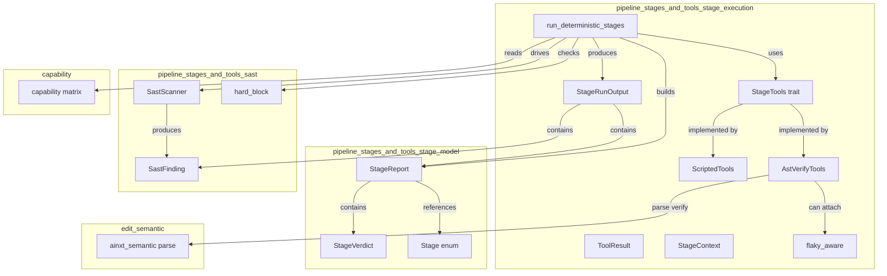
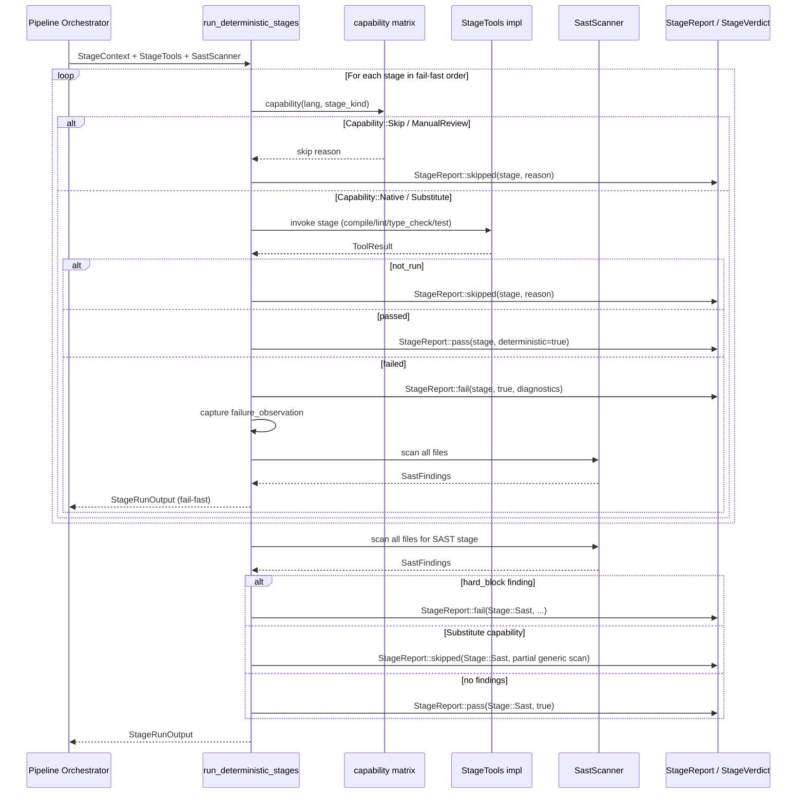
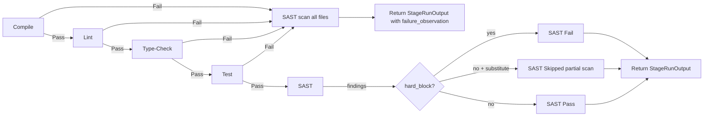

# pipeline_stages_and_tools_stage_execution

## Brief Introduction

`pipeline_stages_and_tools_stage_execution` is the **deterministic stage runner** of the code-review pipeline. It is the component that *actually executes* the deterministic Phase-A stages — Compile, Lint, Type-Check, Test, and SAST — rather than receiving pre-computed [`StageReport`](pipeline_stages_and_tools_stage_model.md)s from a caller. The module defines the trait seams that real toolchains plug into, ships offline/test implementations, and enforces fail-fast ordering, capability-aware skipping, SAST auto-scanning, and an anti-fake honesty invariant: a stage that did not run is reported as `Skipped`, never as `Pass`.

---

## Core Responsibilities

1. **Run deterministic stages in fail-fast order**  
   `compile → lint → type-check → test → SAST`. The first gating failure stops subsequent expensive stages, but SAST is still executed so security findings are never hidden behind a broken build.

2. **Provide toolchain seams**  
   The [`StageTools`](pipeline_stages_and_tools_stage_execution.md#stagetools) trait lets production deployments wire real compilers, linters, test-runners, and type-checkers, while [`ScriptedTools`](pipeline_stages_and_tools_stage_execution.md#scriptedtools) and [`AstVerifyTools`](pipeline_stages_and_tools_stage_execution.md#astverifytools) provide deterministic offline alternatives for tests and default deployments.

3. **Honest reporting**  
   A tool that did not run returns [`ToolResult::not_run`](pipeline_stages_and_tools_stage_execution.md#toolresult), which the runner converts to `StageVerdict::Skipped`. This is scored as a skip penalty and is never treated as a fabricated pass.

4. **Auto-run SAST**  
   Every file in the edit set is scanned by the injected [`SastScanner`](pipeline_stages_and_tools_sast.md). Critical/high findings hard-block at the Commit Gate.

5. **Flaky-test discipline**  
   The [`flaky_aware`](pipeline_stages_and_tools_stage_execution.md#flaky_aware) wrapper re-runs a failing Test/Lint/Type-Check hook once on identical input before filing a regression.

---

## Architecture



---

## Key Components

### `ToolResult`

The atomic result of one tool invocation.

| Field | Meaning |
|-------|---------|
| `passed: bool` | Whether the tool judged the code acceptable. |
| `ran: bool` | Whether the tool actually executed. `false` means the result must **not** be reported as `Pass`. |
| `diagnostics: Vec<String>` | Exact, un-paraphrased tool output (file, line, message). For `not_run`, this carries the honest reason. |

Constructors:

- `ToolResult::pass()` — ran and passed.
- `ToolResult::fail(diagnostics)` — ran and failed.
- `ToolResult::not_run(reason)` — did not run; converted to `Skipped` by the runner.

### `StageContext`

Input to every tool invocation.

| Field | Meaning |
|-------|---------|
| `lang: Language` | The language family of the edit set (Rust, Python, TypeScript, …). |
| `files: Vec<(String, String)>` | `(path, source)` for every file under review. |

### `StageTools`

The deterministic toolchain seam. Production implementations shell out to real tools behind the serving-ops sandbox; offline implementations are scripted.

```rust
pub trait StageTools: Send + Sync {
    fn compile(&self, ctx: &StageContext) -> ToolResult;
    fn test(&self, ctx: &StageContext) -> ToolResult;
    fn lint(&self, ctx: &StageContext) -> ToolResult;
    fn type_check(&self, ctx: &StageContext) -> ToolResult;
}
```

### `StageRunOutput`

Aggregate output of one deterministic-stage pass.

| Field | Meaning |
|-------|---------|
| `reports: Vec<StageReport>` | Stage reports in execution order, ready for [`crate::run_pipeline`](pipeline_orchestration.md). |
| `sast_findings: Vec<SastFinding>` | All SAST findings produced this pass. |
| `failure_observation: Option<(Stage, Vec<String>)>` | The earliest gating failure's exact diagnostics, fed verbatim to the self-heal Observation. |

### `ScriptedTools`

An offline [`StageTools`](pipeline_stages_and_tools_stage_execution.md#stagetools) for tests and dry-runs. Each stage passes unless its name is listed in a `*_fail` field, in which case it returns the scripted diagnostics.

### `AstVerifyTools`

A real, offline, deterministic [`StageTools`](pipeline_stages_and_tools_stage_execution.md#stagetools) implementation that provides a guaranteed parse-grade Compile gate even when no live toolchain is wired.

- **Compile**: parses every file with the pinned tree-sitter grammar and fails if any file contains an `ERROR` node. This is the deterministic floor that blocks syntactically broken edits before any score is consulted.
- **Test / Lint / Type-Check**: return `ToolResult::not_run` unless a hook is attached via `with_test`, `with_lint`, or `with_type_check`. This preserves the anti-fake invariant: no fabricated pass when the real tool was not invoked.

### `flaky_aware`

Wraps a [`StageCheckHook`](pipeline_stages_and_tools_stage_execution.md#stagecheckhook) so that a single failing run is not filed as a regression on its own.

- First run fails → invoke the hook a second time with the identical `StageContext`.
- Reproduces on second run → return the second run's `ToolResult` as a real regression.
- Does not reproduce → return `Pass`, but preserve the first run's diagnostics prefixed with `flaky:` for audit.
- Passing or `not_run` hooks are returned untouched (no extra cost on the common path).

---

## Data Flow



---

## Process Flow: Fail-Fast with SAST Guarantee



---

## Capability Integration

The runner consults the per-language capability matrix ([`crate::capability`](pipeline_stages_and_tools.md)) before invoking any tool:

| Capability | Runner behavior |
|------------|-----------------|
| `Native(tool)` | Tool is expected to be available; invoke the [`StageTools`](pipeline_stages_and_tools_stage_execution.md#stagetools) method. |
| `Substitute(reason)` | A deterministic substitute is used; for SAST this means a generic-only scan is reported as `Skipped` with a partial-scan reason. |
| `Skip(reason)` | Stage is `Skipped`; scored as a skip penalty. |
| `ManualReview(reason)` | Stage is `Skipped` with a "manual review required" reason; used for legacy languages such as COBOL. |

See [`pipeline_stages_and_tools_stage_model`](pipeline_stages_and_tools_stage_model.md) for how `StageVerdict` values are represented, and [`pipeline_stages_and_tools_sast`](pipeline_stages_and_tools_sast.md) for the SAST scanner contract and severity rules.

---

## Dependencies

| Dependency | Module Documentation | Role |
|------------|---------------------|------|
| `crate::stage` | [pipeline_stages_and_tools_stage_model](pipeline_stages_and_tools_stage_model.md) | `Stage`, `StageReport`, `StageVerdict` definitions. |
| `crate::sast` | [pipeline_stages_and_tools_sast](pipeline_stages_and_tools_sast.md) | `SastScanner`, `SastFinding`, `hard_block`. |
| `crate::capability` | [pipeline_stages_and_tools](pipeline_stages_and_tools.md) | Per-language capability matrix. |
| `ainxt_semantic` | [edit_semantic](edit_semantic.md) | Tree-sitter parsing for the parse-grade Compile gate. |
| `ainxt_edit::toolchain` | [edit_semantic](edit_semantic.md) | Real toolchain bindings can be adapted behind `StageCheckHook`. |

---

## How It Fits into the System

`pipeline_stages_and_tools_stage_execution` sits inside the larger [`pipeline_orchestration`](pipeline_orchestration.md) subsystem under [`pipeline_runtime`](pipeline_runtime.md). It is called by the pipeline orchestrator with the edit set and the configured toolchain implementation. Its output — a [`StageRunOutput`](pipeline_stages_and_tools_stage_execution.md#stagerunoutput) — feeds:

- The orchestrator's scoring and commit-gate logic.
- The self-heal subsystem, via `failure_observation`.
- The Commit Gate, via `sast_findings` and hard-blocking findings.

By separating *what* stages exist ([`pipeline_stages_and_tools_stage_model`](pipeline_stages_and_tools_stage_model.md)), *how* they are judged for security ([`pipeline_stages_and_tools_sast`](pipeline_stages_and_tools_sast.md)), and *how* they are executed (this module), the pipeline remains testable, pluggable, and honest about which checks actually ran.
