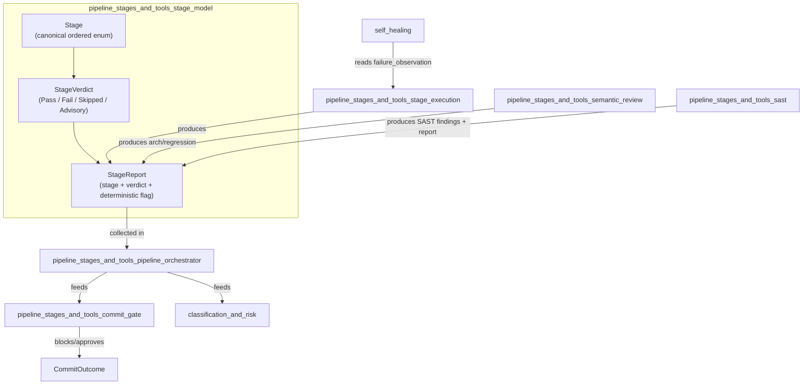
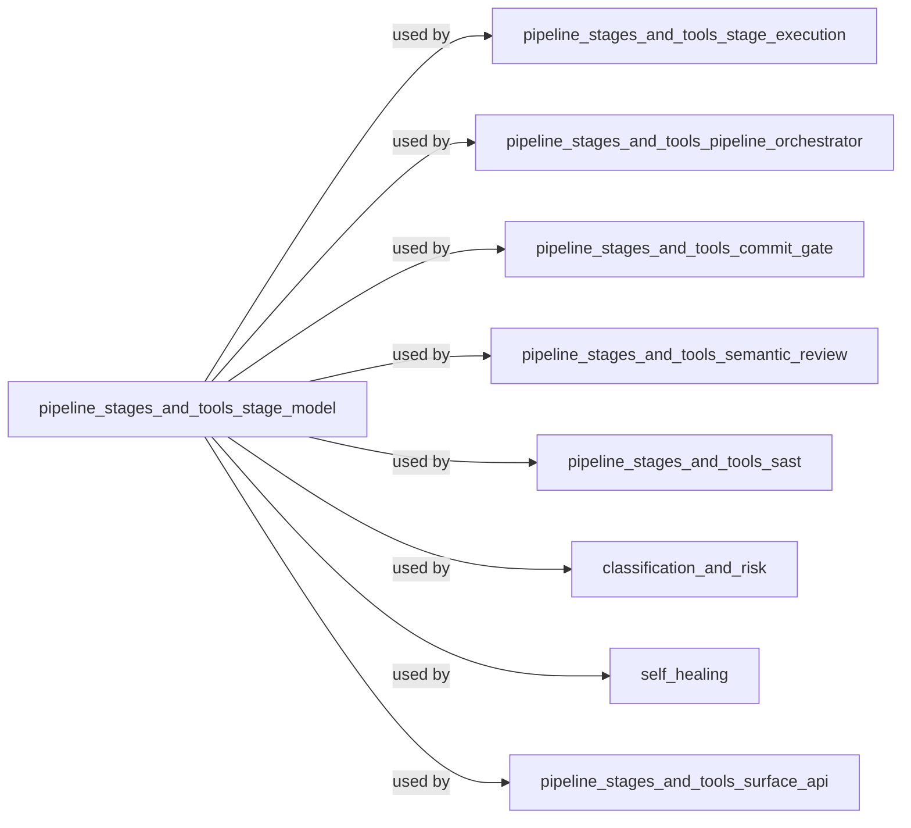
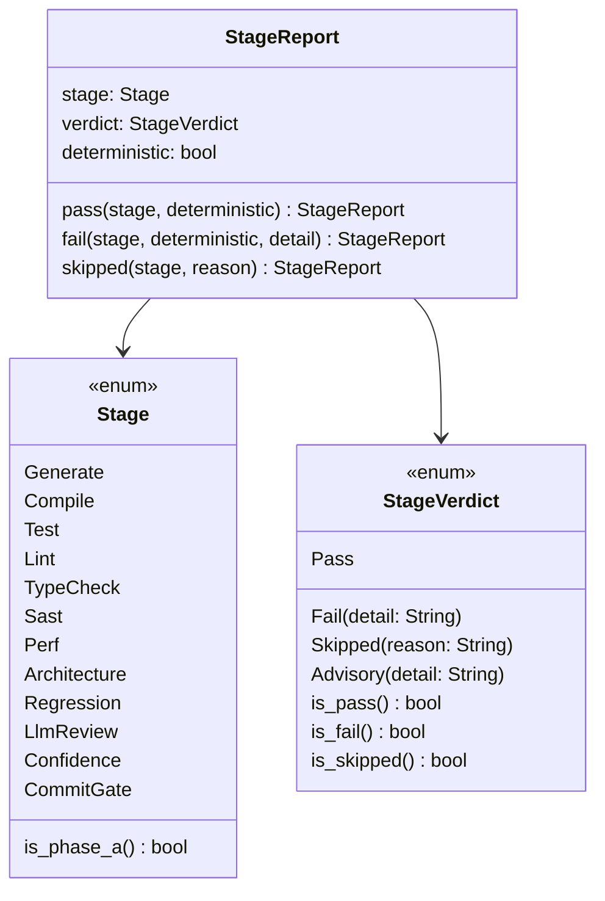
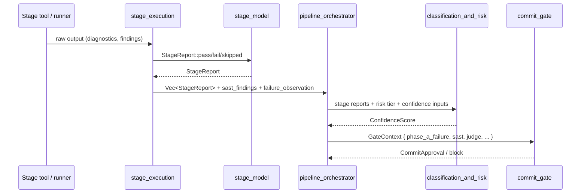
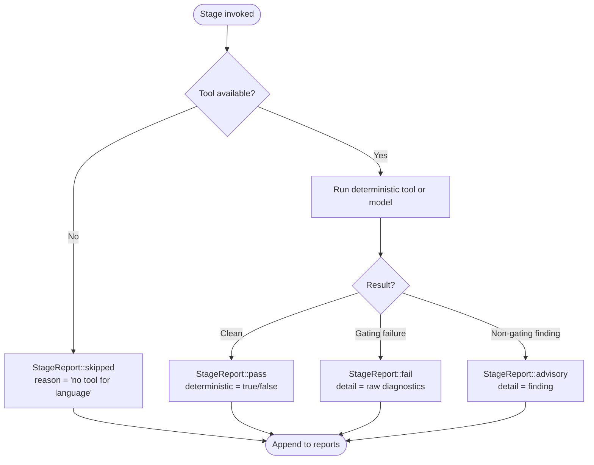
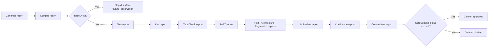

# `pipeline_stages_and_tools_stage_model`

## Brief Introduction

The `pipeline_stages_and_tools_stage_model` module is the **shared vocabulary** for the code-review/edit pipeline. It defines the canonical set of pipeline stages, the possible verdicts a stage can return, and the `StageReport` record that carries those verdicts through the rest of the system.

This module is intentionally thin: it contains no tool execution logic, no orchestration, and no gating policy. Its job is to make the pipeline’s state machine explicit, serializable, and honest. A key design invariant lives here: **`Skipped` is a first-class verdict, never silently treated as a pass**. A missing tool must not masquerade as a green check; the skip reason is preserved and feeds into downstream confidence scoring and commit-gate decisions.

---

## Purpose and Core Functionality

### What this module does

- Enumerates the **twelve canonical stages** of the edit pipeline in execution order.
- Defines the **verdict taxonomy** (`Pass`, `Fail`, `Skipped`, `Advisory`) for each stage.
- Provides the **`StageReport`** struct that records a stage, its verdict, and whether the verdict came from a deterministic tool or model judgment.
- Identifies the **Phase-A deterministic stages** whose failures block the pipeline before scoring.

### What this module does *not* do

- It does not run tools, compilers, or tests. See [`pipeline_stages_and_tools_stage_execution`](pipeline_stages_and_tools_stage_execution.md).
- It does not decide whether an edit may be committed. See [`pipeline_stages_and_tools_commit_gate`](pipeline_stages_and_tools_commit_gate.md).
- It does not compute confidence scores or risk tiers. See [`classification_and_risk`](classification_and_risk.md).
- It does not perform semantic review, SAST scanning, or self-healing. Those modules produce `StageReport` values that this module models.

---

## Core Concepts

### `Stage` — the canonical pipeline order

`Stage` is an ordered enum representing the twelve pipeline stages:

1. `Generate`
2. `Compile`
3. `Test`
4. `Lint`
5. `TypeCheck`
6. `Sast`
7. `Perf`
8. `Architecture`
9. `Regression`
10. `LlmReview`
11. `Confidence`
12. `CommitGate`

Because `Stage` derives `Ord` according to declaration order, comparisons such as `Stage::Compile < Stage::Sast` are meaningful for determining blocking precedence.

### Phase-A stages

Stages 2–5 (`Compile`, `Test`, `Lint`, `TypeCheck`, `Sast`) are the **Phase-A deterministic stages**. An unresolved failure in any Phase-A stage blocks the pipeline before later scoring stages run.

### `StageVerdict` — the honesty taxonomy

| Variant | Meaning | Gating? |
|---|---|---|
| `Pass` | The stage ran and passed. | No |
| `Fail { detail }` | The stage ran and produced a gating failure. | Yes |
| `Skipped { reason }` | The stage could not run (e.g., no tool for the language). **Not a pass.** | Treated as a non-pass; contributes to confidence skip penalty and may force manual review. |
| `Advisory { detail }` | The stage produced non-gating findings (e.g., a perf estimate). | No |

The `Skipped` variant is central to the pipeline’s honesty rule. Callers must not convert a skip into a pass; the reason is preserved so that the confidence score can apply a skip penalty and the final report can flag "manual review required" when whole languages lack tooling.

### `StageReport` — one stage’s structured entry

`StageReport` binds together:

- `stage: Stage` — which stage ran.
- `verdict: StageVerdict` — the outcome.
- `deterministic: bool` — whether the verdict came from a deterministic tool (compiler, linter, SAST scanner) versus model judgment (LLM review, confidence scoring).

Convenience constructors are provided:

- `StageReport::pass(stage, deterministic)`
- `StageReport::fail(stage, deterministic, detail)`
- `StageReport::skipped(stage, reason)`

---

## Architecture and Component Relationships

### Module dependency diagram

### Class diagram

---

## Data Flow

A single edit pass produces a sequence of `StageReport` values that flow from individual stage runners into the pipeline orchestrator, then onward to confidence scoring and the commit gate.

### Key data carriers

- `StageRunOutput` (from [`pipeline_stages_and_tools_stage_execution`](pipeline_stages_and_tools_stage_execution.md)) contains:
  - `reports: Vec<StageReport>` — the ordered stage reports.
  - `sast_findings: Vec<SastFinding>` — every SAST finding produced this pass.
  - `failure_observation: Option<(Stage, Vec<String>)>` — the earliest gating failure’s exact diagnostics, used by the self-heal loop.

- `PipelineInputs` (from [`pipeline_stages_and_tools_pipeline_orchestrator`](pipeline_stages_and_tools_pipeline_orchestrator.md)) carries the accumulated `stage_reports`, SAST findings, confidence inputs, architecture violations, and judge approval state into the final gate.

- `GateContext` (from [`pipeline_stages_and_tools_commit_gate`](pipeline_stages_and_tools_commit_gate.md)) uses the Phase-A failure state, SAST findings, architecture violations, and judge independence flag to render a commit decision.

---

## Process Flows

### How a single stage becomes a `StageReport`

### Pipeline report collection and gating

### Verdict handling rules

1. **Pass** — contributes positively; no gating effect on its own.
2. **Fail** — gating. The first Phase-A failure stops deterministic progression and is captured as `failure_observation` for self-healing.
3. **Skipped** — never converted to pass. It is recorded honestly and penalized by the confidence score. If an entire language has no tooling, the final report flags "manual review required".
4. **Advisory** — recorded but non-gating; used for guidance (e.g., performance estimates).

---

## Integration with the Rest of the System

### [`pipeline_stages_and_tools_stage_execution`](pipeline_stages_and_tools_stage_execution.md)

The stage execution module owns `StageContext`, `StageRunOutput`, `ToolResult`, and the concrete runners. It converts raw tool output into `StageReport` values using the constructors defined in this module. The anti-fake invariant in `ToolResult` (a tool that did not run must not report `Pass`) mirrors the honesty rule for `StageVerdict::Skipped` here.

### [`pipeline_stages_and_tools_pipeline_orchestrator`](pipeline_stages_and_tools_pipeline_orchestrator.md)

The orchestrator collects `StageReport` values into `PipelineInputs` and manages `StageCache` to avoid redundant work. It is the consumer of the ordered report list produced by stage execution.

### [`pipeline_stages_and_tools_commit_gate`](pipeline_stages_and_tools_commit_gate.md)

The commit gate receives a `GateContext` built from the accumulated reports. It checks for unresolved Phase-A failures, unremediated SAST findings, architecture violations, and (for Tier 2+) an independent judge approval. The `Stage` enum’s ordering is used to identify the earliest blocking stage.

### [`classification_and_risk`](classification_and_risk.md)

The confidence scorer consumes the full set of `StageReport` values plus risk tier inputs. `Skipped` verdicts apply a skip penalty, and `Advisory` verdicts may adjust the breakdown. The resulting `ConfidenceScore` is itself reported as the `Confidence` stage.

### [`pipeline_stages_and_tools_semantic_review`](pipeline_stages_and_tools_semantic_review.md)

Semantic review produces the `Architecture` and `Regression` stage reports. Its `SemanticGateReport` wraps the raw findings together with the `StageReport` entries that this module models.

### [`pipeline_stages_and_tools_sast`](pipeline_stages_and_tools_sast.md)

SAST scanning produces both `SastFinding` values and a `StageReport` for the `Sast` stage. The findings feed the commit gate; the report feeds the orchestrator.

### [`self_healing`](self_healing.md)

The self-heal loop reads `failure_observation` — the earliest Phase-A failure’s exact diagnostics — to generate repair attempts. It relies on the honesty of `StageVerdict::Fail` and `StageVerdict::Skipped` to decide whether a real failure exists to fix.

### [`quality_verification_judge`](../ai_engine/quality_verification_judge.md)

The independent LLM judge (part of the AI engine’s quality verification layer) produces the verdict that becomes the `LlmReview` stage report. Its independence flag is carried through `PipelineInputs`/`GateContext` and is required for Tier-2+ commits.

---

## Testing and Invariants

The module’s unit tests enforce three properties:

1. **Phase-A membership is exact** — only `Compile`, `Test`, `Lint`, `TypeCheck`, and `Sast` return `true` from `is_phase_a()`.
2. **Stage ordering matches pipeline order** — e.g., `Compile < Sast < CommitGate`.
3. **Skipped is not a pass** — a `StageReport` constructed with `skipped(...)` returns `is_skipped() == true` and `is_pass() == false`.
4. **Serde round-trips** — `StageVerdict` serializes and deserializes correctly using the internally tagged representation.

These tests protect the central contract: the stage model must remain an honest, ordered, serializable state machine that the rest of the pipeline can trust.

---

## References

- [`pipeline_stages_and_tools_stage_execution`](pipeline_stages_and_tools_stage_execution.md) — concrete stage runners and `ToolResult`/`StageRunOutput`.
- [`pipeline_stages_and_tools_pipeline_orchestrator`](pipeline_stages_and_tools_pipeline_orchestrator.md) — report collection, caching, and pipeline inputs.
- [`pipeline_stages_and_tools_commit_gate`](pipeline_stages_and_tools_commit_gate.md) — final commit decision and `GateContext`.
- [`classification_and_risk`](classification_and_risk.md) — confidence scoring and risk inputs.
- [`pipeline_stages_and_tools_semantic_review`](pipeline_stages_and_tools_semantic_review.md) — architecture and regression stage reports.
- [`pipeline_stages_and_tools_sast`](pipeline_stages_and_tools_sast.md) — SAST findings and stage report.
- [`self_healing`](self_healing.md) — repair loop driven by `failure_observation`.
- [`quality_verification_judge`](../ai_engine/quality_verification_judge.md) — independent LLM review that feeds the `LlmReview` stage.
- [`edit_semantic`](edit_semantic.md) — semantic analysis and edit tooling that underpins several stages.
