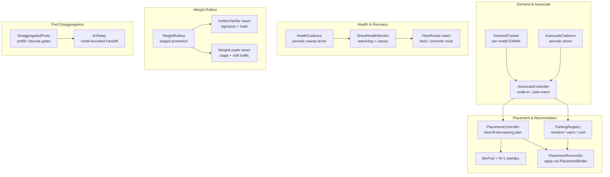
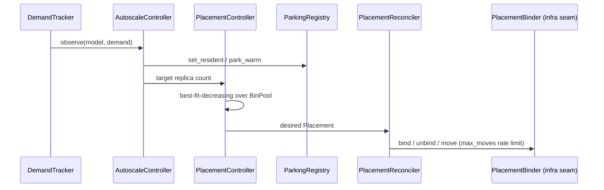
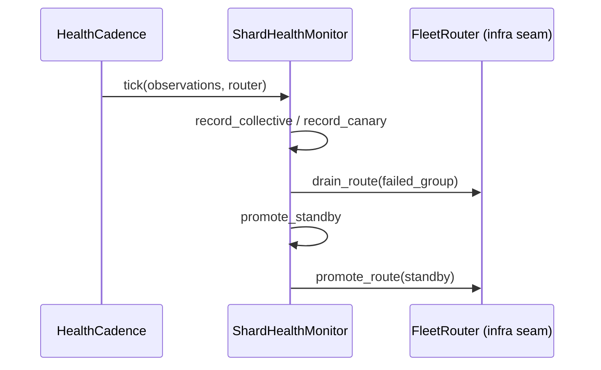
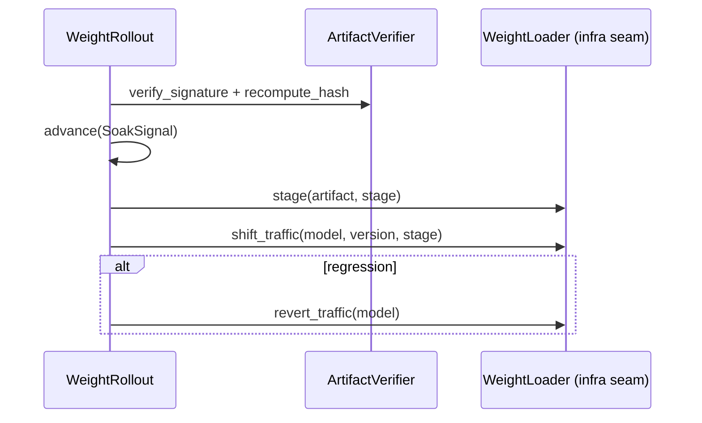

# placement_lifecycle

## Purpose

`placement_lifecycle` is the serving-infrastructure module that owns the *lifecycle* of model replicas on the GPU fleet. It decides **where** each model replica lives, **when** to scale it up or park it warm, **how** to recover from unhealthy shard groups, **how** new weight versions are staged into production, and **how** prefill and decode work are physically separated so that one cannot block the other.

The module is intentionally deterministic and infra-gated: all policy logic is pure, clock-free, and GPU-free, while the physical actions (VRAM allocation, routing-table updates, weight streaming) are isolated behind testable seams. This makes the placement and recovery policies unit-assertable while still describing exactly what the live daemon must do.

## Scope

- **GPU bin-packing placement** with best-fit-decreasing, locality, attestation-tier matching, and N+1 standby reservation.
- **Demand-driven autoscale** using per-model EWMA demand and warm-parking decisions.
- **Incremental reconciliation** of desired placement against physically bound replicas.
- **Shard health monitoring** with collective watchdog + canary correctness probe and drain-the-group recovery.
- **Signed weight rollout** with staged promotion, integrity verification, and honest rollback SLA.
- **Disaggregated prefill/decode pools** that structurally eliminate interference between the two phases.

## Architecture

## Sub-modules

| Sub-module | File | Responsibility |
|------------|------|----------------|
| [placement_lifecycle_placement](placement_lifecycle_placement.md) | `crates/ainxt-serving/src/placement.rs` | GPU bin-packing, demand-EWMA autoscale, model parking, and incremental placement reconciliation. |
| [placement_lifecycle_health](placement_lifecycle_health.md) | `crates/ainxt-serving/src/health.rs` | Two-signal shard health monitoring (collective watchdog + canary probe) and drain-the-group recovery with N+1 standby promotion. |
| [placement_lifecycle_rollout](placement_lifecycle_rollout.md) | `crates/ainxt-serving/src/rollout.rs` | Signed weight-artifact verification, staged P2→P1→P0 rollout, live-traffic quality gating, and honest rollback SLA. |
| [placement_lifecycle_disaggregation](placement_lifecycle_disaggregation.md) | `crates/ainxt-serving/src/disagg.rs` | Physical separation of prefill and decode pools and credit-bounded KV-block handoff between them. |

## Component Interactions

## Dependencies

`placement_lifecycle` sits on top of several sibling `serving_infrastructure` primitives:

- **[admission_scheduling](admission_scheduling.md)** — `ServingGate`, `PreemptionScheduler`, `FairnessLimiter`, `IdempotencyLedger`, and tenant/priority classes used by `DisaggregatedPools`.
- **[caching_erasure](caching_erasure.md)** — `KvRelay` and `KvTransport`, the fabric that joins the prefill and decode pools.
- **[attestation](attestation.md)** — `TrustTier`, attestation quote verification, and regulated-eligibility checks used by placement, rollout, and health recovery.

It also consumes configuration and model metadata from the broader runtime; see [runtime_configuration](runtime_configuration.md) and [core_infrastructure](../core_infrastructure/core_infrastructure.md) for the surrounding config and type system.

## Design Principles

1. **Fail-closed on trust.** A regulated model with no attested bin is reported as `UnplacedReason::NoAttestedCapacity` rather than silently landing on an untrusted bin. A regulated weight artifact refuses to load on an unattested node.
2. **Honest capacity accounting.** N+1 standby bins are held out of placement, unplaced items are reported explicitly, and rollback SLAs distinguish resident flip, warm reload, and cold pull.
3. **Pure policy, gated infra.** All decision logic is deterministic and unit-testable; physical side effects (VRAM allocation, routing, weight staging) live behind named seams.
4. **Structural interference elimination.** Prefill and decode pools are independent `ServingGate` instances joined only by the KV relay, so decode admission can never be gated by prefill saturation.

## Detailed Sub-module Documentation

The following files contain the detailed component-level documentation for each sub-module:

- [placement_lifecycle_placement.md](placement_lifecycle_placement.md) — GPU bin-packing, autoscale, parking, and reconciliation.
- [placement_lifecycle_health.md](placement_lifecycle_health.md) — Shard health monitoring and drain-the-group recovery.
- [placement_lifecycle_rollout.md](placement_lifecycle_rollout.md) — Weight-artifact verification, staged rollout, and rollback.
- [placement_lifecycle_disaggregation.md](placement_lifecycle_disaggregation.md) — Prefill/decode pool separation and KV handoff.
