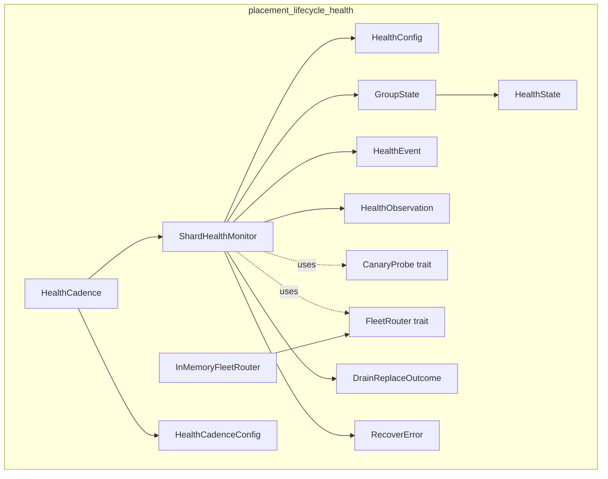
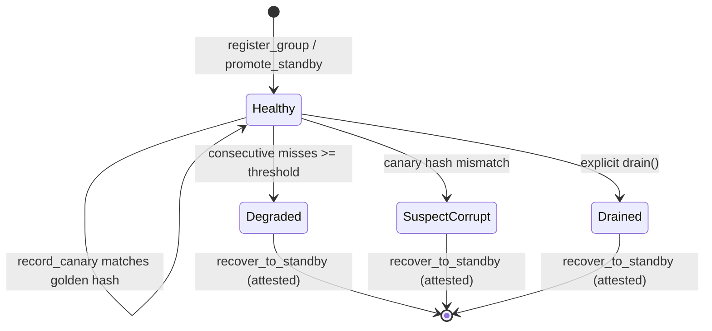
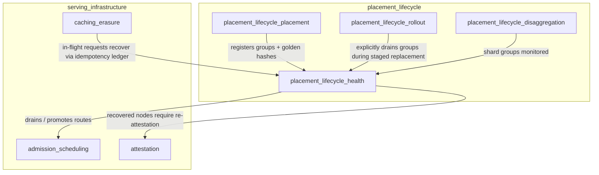
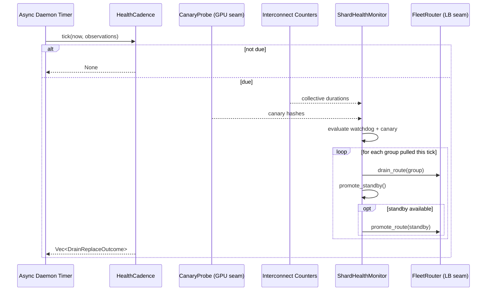
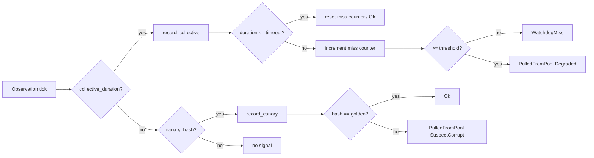

# placement_lifecycle_health

## Brief Introduction

The `placement_lifecycle_health` module is responsible for **multi-GPU shard-level health monitoring and drain-the-group recovery** within the serving infrastructure. It addresses a critical operational gap: process or container liveness is an insufficient signal for tensor/pipeline-parallel (TP/PP) shard groups, because every rank can be alive while the group is functionally dead due to a hung collective operation or silently corrupted output. This module models two independent health signals—an interconnect/collective watchdog and a deterministic canary correctness probe—and drives the physical recovery sequence that drains a failed group and promotes an N+1 standby to restore capacity.

The module is intentionally **pure and deterministic**: all health-state transitions, golden-hash comparisons, watchdog counters, and routing-table decisions are unit-testable without a GPU or wall clock. The actual GPU inference behind the canary and the physical load-balancer mutations are isolated behind small, swappable seams.

---

## Module Purpose and Core Functionality

### What Problem It Solves

In distributed LLM serving, a shard group (a set of interconnect-adjacent GPUs running one model replica) can fail in ways that process liveness never detects:

- **Hung collectives**: one rank blocks in an all-reduce; the rest wait indefinitely.
- **Silent corruption**: a numerics fault averages garbage into an otherwise-fine result.

This module provides the serving layer with:

1. **Two-signal health detection**:
   - **Interconnect/collective watchdog**: flags `Degraded` after `N` consecutive collective operations exceed a timeout tuned above measured p99.9.
   - **Canary correctness probe**: flags `SuspectCorrupt` when a deterministic request's output hash does not match the golden hash computed at placement time.

2. **Drain-the-group recovery**: a non-routable group is immediately pulled from the load-balancer's routable set and an N+1 standby is promoted to restore capacity.

3. **Cadence-driven monitoring**: a periodic driver decides when health sweeps are due, mirroring the attestation refresh cadence pattern.

### Core Design Principles

- **Never flap**: a single slow collective is a `WatchdogMiss`; only consecutive misses trigger `Degraded`.
- **Catch silent corruption**: the canary probe can fail even when liveness and collective signals are green.
- **Preserve capacity**: N+1 standby promotion restores routable capacity without waiting for a process restart.
- **Forensics-friendly**: a drained group keeps running; it is only removed from the routable set.
- **Pure offline testability**: durations are logical ticks; routing is a sorted set; GPU inference is behind a trait seam.

---

## Architecture and Component Relationships

### Component Overview



### State Machine

Only `Healthy` groups are routable. The other states are terminal until an explicit recovery action is taken.



### Key Components

| Component | Responsibility |
|-----------|----------------|
| `ShardGroupId` | Opaque identifier for a TP/PP shard group. |
| `HealthState` | Routable (`Healthy`) or non-routable (`Degraded`, `SuspectCorrupt`, `Drained`) state. |
| `HealthEvent` | Result of feeding one signal: `Ok`, `WatchdogMiss`, `PulledFromPool`, or `Ignored`. |
| `HealthConfig` | Tuning for the watchdog: collective timeout and consecutive-miss threshold. |
| `GroupState` | Internal per-group state: health state, golden hash, and consecutive miss counter. |
| `ShardHealthMonitor` | Pure state machine that tracks all groups, processes signals, and manages the standby pool. |
| `CanaryProbe` | Seam for the GPU inference that produces a deterministic output hash. |
| `FleetRouter` | Seam for mutating the live load-balancer routable set. |
| `InMemoryFleetRouter` | Deterministic offline reference implementation of `FleetRouter`. |
| `DrainReplaceOutcome` | Result of a drain-and-replace step: drained group and optional promoted standby. |
| `HealthObservation` | One tick's observations for a single group: collective duration and canary hash. |
| `HealthCadenceConfig` / `HealthCadence` | Periodic driver that gates when `monitor_tick` actually runs. |
| `RecoverError` | Reasons `recover_to_standby` can fail: not attested, unknown, or still healthy. |

---

## How It Fits into the Overall System

### Position in the Module Tree

`placement_lifecycle_health` is one of four sub-modules under `placement_lifecycle` in the `server_serving` → `serving_infrastructure` branch:

- [placement_lifecycle_placement](placement_lifecycle_placement.md) — decides which shard groups are online and computes golden hashes.
- **placement_lifecycle_health** — monitors those groups and recovers from failure.
- [placement_lifecycle_rollout](placement_lifecycle_rollout.md) — staged weight rollouts and traffic shifting.
- [placement_lifecycle_disaggregation](placement_lifecycle_disaggregation.md) — prefill/decode pool disaggregation and KV handoff.

### Dependency Diagram



### Upstream and Downstream Relationships

| Direction | Module / Component | Relationship |
|-----------|-------------------|--------------|
| **Upstream** | [placement_lifecycle_placement](placement_lifecycle_placement.md) | Creates `ShardGroupId`s and computes the `golden_hash` for each group at placement time. |
| **Upstream** | [placement_lifecycle_rollout](placement_lifecycle_rollout.md) | Calls `drain()` to pull a group out of the routable set during a staged weight rollout. |
| **Upstream** | [attestation](attestation.md) | Supplies the re-attestation precondition (`attested`) required before a recovered node can return to standby. |
| **Downstream** | [admission_scheduling](admission_scheduling.md) | The `FleetRouter` seam physically removes/adds groups from the load-balancer's routable set, which admission scheduling uses for dispatch. |
| **Downstream** | [caching_erasure](caching_erasure.md) / idempotency | In-flight requests that were routed to a drained group recover through the existing idempotency-ledger discipline; this module does not reinvent retry safety. |

---

## Data Flow

### Per-Tick Monitoring Flow



### Signal Evaluation Flow



---

## Process Flows

### 1. Collective Watchdog Detection

1. The monitor receives a `collective_duration` for a registered, routable group.
2. If the duration is within `collective_timeout`, the consecutive-miss counter resets to `0`.
3. If the duration exceeds the timeout, the counter increments.
4. When the counter reaches `consecutive_miss_threshold`, the group's state becomes `Degraded` and a `PulledFromPool` event is emitted.
5. A single slow tick never drains the group; this prevents flapping.

### 2. Canary Correctness Probe

1. At placement time, a deterministic request (temperature 0, fixed seed, fixed prompt) is run through the group and its output hash is stored as the `golden_hash`.
2. Each health tick, the canary probe seam runs the same request against the live group.
3. If the observed hash matches the golden hash, the group stays `Healthy`.
4. If the observed hash mismatches, the group becomes `SuspectCorrupt` and is pulled from the pool—even if process liveness and collective signals are green.

### 3. Drain-and-Replace Recovery

1. A group transitions to a non-routable state (`Degraded`, `SuspectCorrupt`, or explicit `Drained`).
2. `drain_and_replace` is invoked with the live `FleetRouter`.
3. The drained group is removed from the physical routable set.
4. One N+1 standby is popped from the standby reservation.
5. The standby is registered as `Healthy` in the monitor and promoted into the physical routable set.
6. A `DrainReplaceOutcome` reports the drained group and the promoted standby (or `None` if no standby remained).

### 4. Recovery to Standby

1. A drained node is repaired and re-attested (verified by the [attestation](attestation.md) gate).
2. `recover_to_standby` is called with the group's id, its golden hash, and the attestation result.
3. If attestation is missing, the recovery is rejected with `RecoverError::NotAttested`.
4. If the group is still healthy or unknown, the recovery is rejected with `StillHealthy` or `Unknown`.
5. Otherwise, the group is removed from the live groups map and pushed back into the standby reservation.

### 5. Cadence-Driven Monitoring Loop

1. `HealthCadence` owns a `next_due_at` cursor and a sweep interval.
2. The daemon's async timer calls `HealthCadence::tick` every tick.
3. If `now < next_due_at`, the call returns `None` and does nothing.
4. If due, the call runs `ShardHealthMonitor::monitor_tick` over the supplied observations, advances `next_due_at` to `now + interval`, increments the sweep counter, and returns the recovery outcomes.
5. This mirrors the pattern used by [attestation::AttestationRefresher](attestation.md) and closes the gap where a pure monitoring body existed but was not driven by any daemon cadence.

---

## Integration Points and Seams

### `CanaryProbe`

```rust
pub trait CanaryProbe {
    fn probe(&self, group: &ShardGroupId) -> u64;
}
```

- **Live implementation**: runs a deterministic request through the shard group's GPU inference and returns the output hash.
- **Test implementation**: `FixedProbe` returns a constant hash.
- This crate only consumes the hash; it never performs GPU inference.

### `FleetRouter`

```rust
pub trait FleetRouter {
    fn drain_route(&mut self, group: &ShardGroupId);
    fn promote_route(&mut self, group: &ShardGroupId) -> bool;
    fn is_routed(&self, group: &ShardGroupId) -> bool;
}
```

- **Live implementation**: mutates the live balancer's routable set (e.g., xDS push or gateway reload).
- **Test implementation**: `InMemoryFleetRouter` maintains a sorted set of routed groups.
- This isolation keeps the drain-the-group recovery sequence pure and offline-testable.

### Attestation Precondition

Recovery to standby requires `attested: true`. The actual attestation verification is performed by the [attestation](attestation.md) module; this module only receives the boolean result as a seam input. See ADR-021 §8 for the "re-earn trust" requirement.

---

## Testing Strategy

The module is designed for exhaustive offline testing:

- **No GPU required**: `CanaryProbe` is a trait; tests use `FixedProbe`.
- **No wall clock required**: all durations and cadences are logical ticks.
- **No live balancer required**: `FleetRouter` is a trait; tests use `InMemoryFleetRouter`.

Representative test scenarios include:

- Watchdog flags `Degraded` only after consecutive misses, not on a single slow tick.
- A fast collective resets the miss counter.
- A canary mismatch flags `SuspectCorrupt` despite green liveness.
- `drain_and_replace` removes the failed group and promotes a standby.
- Recovery to standby requires re-attestation.
- Unknown or already-drained group signals are ignored rather than panicking.

---

## Related Modules

- [placement_lifecycle_placement](placement_lifecycle_placement.md) — placement decisions and golden-hash computation.
- [placement_lifecycle_rollout](placement_lifecycle_rollout.md) — staged weight rollouts that explicitly drain groups.
- [placement_lifecycle_disaggregation](placement_lifecycle_disaggregation.md) — prefill/decode disaggregation and KV handoff.
- [admission_scheduling](admission_scheduling.md) — admission, preemption, WFQ, and the routable set consumed by this module's `FleetRouter` seam.
- [attestation](attestation.md) — node attestation and the re-attestation precondition for standby recovery.
- [caching_erasure](caching_erasure.md) — cache isolation and erasure; in-flight request recovery relies on the idempotency ledger.
