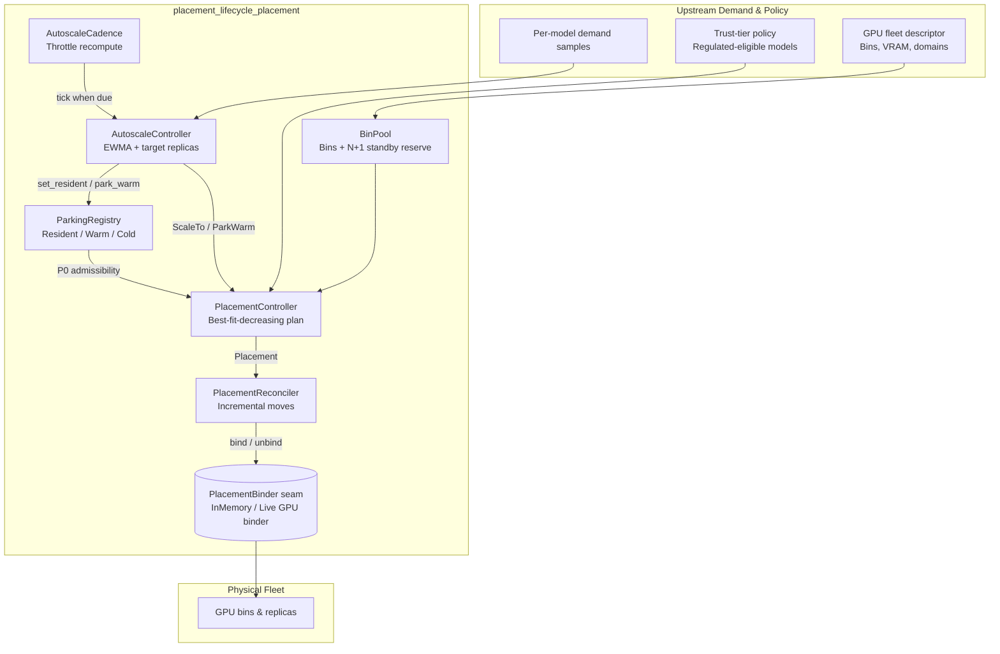
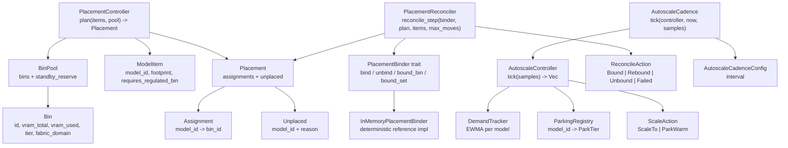
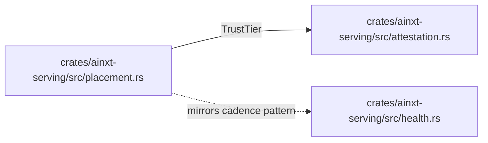
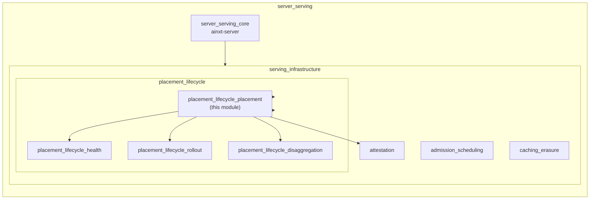
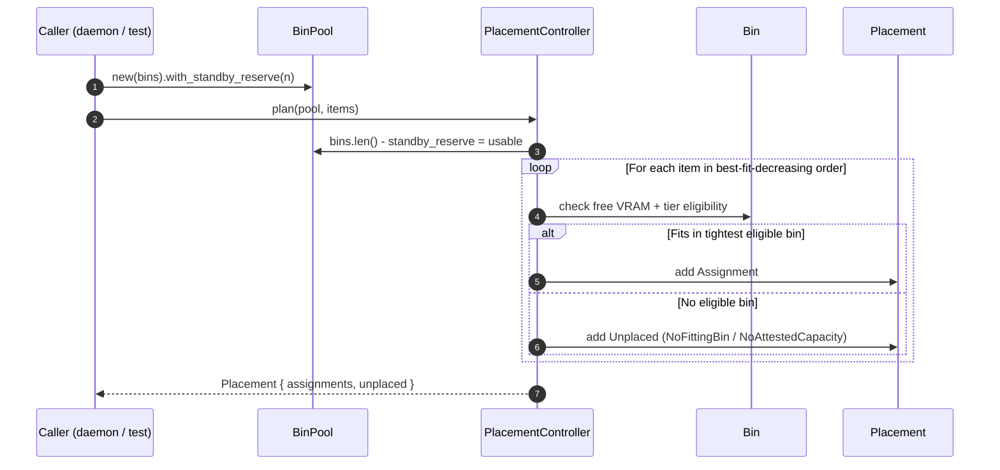
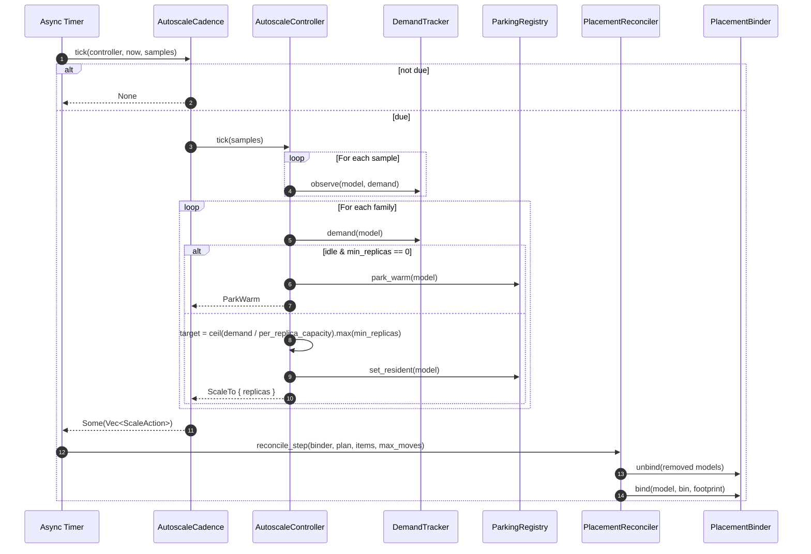
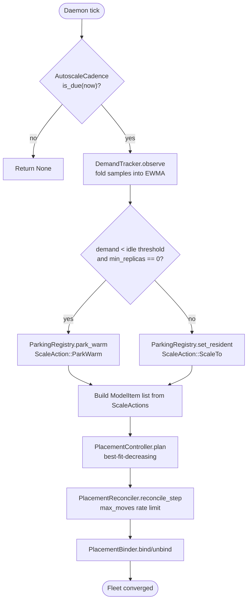
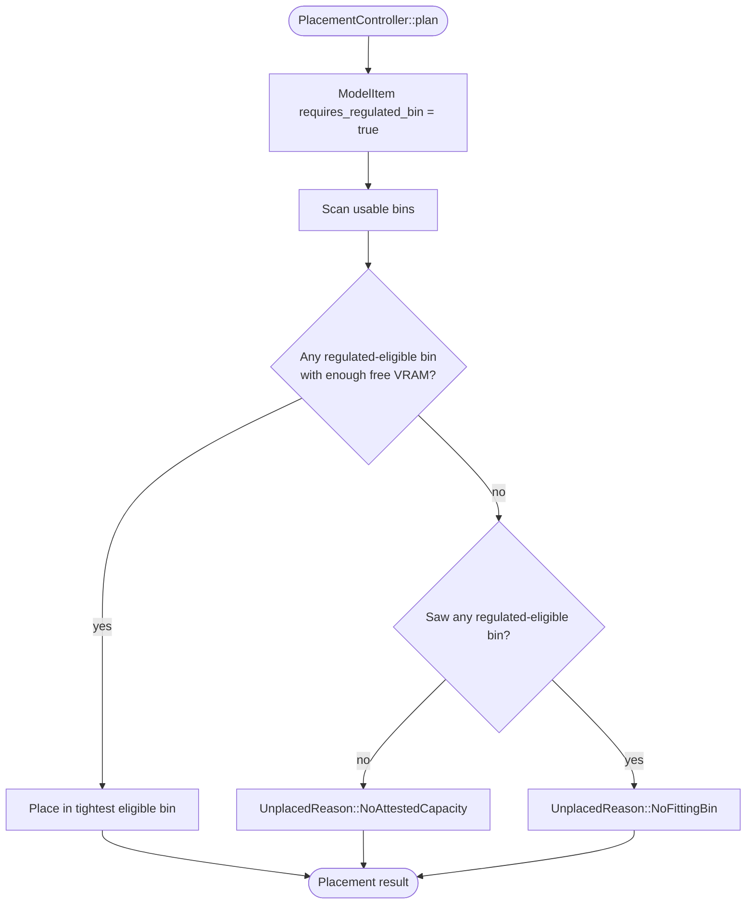

# placement_lifecycle_placement

## Brief Introduction

The `placement_lifecycle_placement` module is the GPU bin-packing, model-parking, and demand-driven autoscale policy core of the serving infrastructure. It lives inside the `placement_lifecycle` subsystem under `server_serving` → `serving_infrastructure` and is responsible for deciding **which model replicas run on which GPU bins**, **how evicted model weights are retained for fast re-warm**, and **how per-model demand signals translate into target replica counts**. The module is intentionally pure: it contains no GPU driver calls, no wall-clock timers, and no network I/O. All physical actions are isolated behind the `PlacementBinder` seam, making the placement algorithm, autoscale loop, and incremental reconciler deterministic and exhaustively testable offline.

This module directly addresses the serving-operations requirements in `SERVING_OPS.md` §3 (including gaps 26 and W) and the regulated-trust requirements in `ADR-021` §8.2 by enforcing that regulated-eligible models only land on attestation-eligible bins.

---

## Core Responsibilities

| Responsibility | Description | Key Types |
|---|---|---|
| **GPU bin-packing** | Place model replicas onto GPU bins using best-fit-decreasing, honoring locality, trust tier, and N+1 standby reserve. | `Bin`, `ModelItem`, `PlacementController`, `BinPool`, `Placement` |
| **Model parking** | Track whether a model is resident, warm-parked, or cold so re-warm cost and P0 admissibility are explicit. | `ParkingRegistry`, `ParkTier`, `ReWarmCost` |
| **Demand autoscale** | Smooth per-model demand with an EWMA and derive target replica counts. | `DemandTracker`, `AutoscaleController`, `ScaleAction` |
| **Physical binding seam** | Abstract the actual GPU allocation/warming behind a trait so the rest of the logic stays pure. | `PlacementBinder`, `InMemoryPlacementBinder`, `BindOutcome`, `BindError` |
| **Incremental reconciliation** | Drive the physical fleet toward a computed placement one rate-limited move at a time. | `PlacementReconciler`, `ReconcileAction` |
| **Cadenced driver** | Gate the autoscale decision loop on a deterministic cadence to avoid runaway recomputation. | `AutoscaleCadence`, `AutoscaleCadenceConfig` |

---

## Architecture

### High-Level Placement Architecture

The module sits between the upstream demand signal (requests per model) and the downstream physical GPU fleet. It produces a target placement, parks idle models warm, and reconciles the fleet toward that target through an infra-gated binder seam.

### Component Hierarchy

---

## Dependencies

### Internal Crate Dependencies

`placement.rs` imports `TrustTier` from the sibling `attestation` module:

- **[attestation](attestation.md)** — provides `TrustTier` and the regulated-eligibility check (`is_regulated_eligible`). The placement algorithm fails closed: a regulated model with no eligible bin is reported as `UnplacedReason::NoAttestedCapacity` rather than silently placed on an untrusted bin.
- **health** — `AutoscaleCadence` mirrors the cadence pattern used by `HealthCadence` and `AttestationRefresher`. The health subsystem supplies the fleet state (bin health, drain/replace events) that influences which bins are available for placement.

### Module Tree Context

- **[placement_lifecycle_health](placement_lifecycle_health.md)** — determines which bins are healthy and which are being drained. A drain event consumes the N+1 standby reserve that `BinPool::with_standby_reserve` holds out.
- **[placement_lifecycle_rollout](placement_lifecycle_rollout.md)** — controls traffic-weight shifts between model versions. Rollout decisions change the set of `ModelItem`s that `PlacementController` must place.
- **[placement_lifecycle_disaggregation](placement_lifecycle_disaggregation.md)** — manages prefill/decode pool splitting. Placement prefers pairing prefill and decode replicas in the same `fabric_domain`.
- **[admission_scheduling](admission_scheduling.md)** — gates incoming requests before they reach the serving path. P0 admission only routes to models that `ParkingRegistry::is_p0_admissible` returns true for.

---

## Data Flow

### Placement Planning Flow

### Autoscale Decision Flow

---

## Component Interaction

### PlacementController and BinPool

`PlacementController::plan` takes a `&BinPool` and a slice of `ModelItem`s. It does **not** mutate the pool; it returns a target `Placement`. The algorithm:

1. Computes usable bins by subtracting `standby_reserve` from the tail of the bin list.
2. Sorts items by footprint descending (best-fit-decreasing).
3. For each item, scans bins and selects the **tightest** bin that still fits and satisfies the trust-tier constraint.
4. Returns assignments sorted by `model_id` for stable diffing.

### AutoscaleController, DemandTracker, and ParkingRegistry

`AutoscaleController` owns both a `DemandTracker` and a `ParkingRegistry`. On each tick:

- Demand samples are folded into per-model EWMAs.
- Families with smoothed demand below `AUTOSCALE_IDLE_THRESHOLD` and no P0 floor are parked warm.
- All other families are marked resident and scaled to `ceil(demand / per_replica_capacity).max(min_replicas)`.

### PlacementReconciler and PlacementBinder

`PlacementReconciler::reconcile_step` applies at most `max_moves` moves toward a target `Placement`:

1. Unbinds models that are bound but no longer in the plan (frees VRAM first).
2. Binds or moves remaining models in deterministic `model_id` order.
3. Reports physical bind failures explicitly via `ReconcileAction::Failed`.

`InMemoryPlacementBinder` is the deterministic reference implementation used in tests and offline simulations. A live GPU binder would implement the same trait using CUDA/driver allocation.

---

## Key Types and Behaviors

### Bin

Represents one interconnect-adjacent GPU group. A whole model replica must fit within a single bin (locality constraint). Fields:

- `id`: bin identifier.
- `vram_total`: total VRAM.
- `vram_used`: already consumed VRAM.
- `tier`: `TrustTier` from the attestation gate.
- `fabric_domain`: placement hint for prefill/decode pairing.

### ModelItem

A request to place one replica of a model:

- `model_id`: model identifier.
- `footprint`: VRAM required for one replica.
- `requires_regulated_bin`: if true, the item may only be placed on a bin whose tier is regulated-eligible.

### PlacementController

Pure function `plan(pool, items) -> Placement`. Best-fit-decreasing with deterministic tie-breaking by bin index. Regulated models fail closed.

### BinPool

Wraps `Vec<Bin>` and an optional N+1 standby reserve. The reserve is taken from the tail of the bin vector so it is deterministic.

### ParkingRegistry and ParkTier

Tracks each model's parking tier:

- `Resident`: in GPU VRAM, servable now.
- `Warm`: parked in fast local tier (host RAM/NVMe), minutes-scale re-warm.
- `Cold`: only in object store, tens-of-minutes cold pull.

`ParkingRegistry::is_p0_admissible` returns true only for `Resident` or `Warm` models, ensuring P0 requests never wait on a cold pull.

### DemandTracker

Per-model EWMA with smoothing factor `alpha`. Provides:

- `observe(model, demand)`: update EWMA.
- `demand(model)`: current smoothed demand.
- `target_replicas(model, per_replica_capacity, min_replicas)`: compute target count.

### AutoscaleController

Composes `DemandTracker` and `ParkingRegistry` into the per-tick autoscale loop. Produces `ScaleAction::ScaleTo` or `ScaleAction::ParkWarm` for every known family.

### AutoscaleCadence

Stateful driver that gates `AutoscaleController::tick` on a logical cadence. A tick before the next due point returns `None`. Mirrors the pattern in `attestation::AttestationRefresher` and `health::HealthCadence`.

### PlacementBinder, InMemoryPlacementBinder, PlacementReconciler

The infra-gated seam. `PlacementBinder` defines physical bind/unbind operations. `InMemoryPlacementBinder` tracks per-bin VRAM and the model→bin map deterministically. `PlacementReconciler` sequences moves toward a target placement.

---

## Process Flows

### Full Autoscale + Placement + Reconcile Cycle

### Handling a Regulated Model with No Eligible Bin

---

## Trust and Safety Properties

1. **Fails closed for regulated models**: A model with `requires_regulated_bin = true` is never placed on an untrusted bin. If no eligible bin exists, it is reported as `NoAttestedCapacity`.
2. **N+1 standby reserve**: `BinPool::with_standby_reserve` holds bins out of placement so drain/replace events have headroom.
3. **No silent cold pulls on P0 paths**: `ParkingRegistry::is_p0_admissible` excludes cold models, and the autoscale controller parks idle models warm rather than evicting them cold.
4. **Deterministic output**: Placement and reconciliation produce deterministic results for the same inputs, enabling offline testing and reproducible fleet plans.
5. **Explicit failures**: Physical bind failures are surfaced as `ReconcileAction::Failed` rather than swallowed.

---

## Testing and Offline Simulation

The module is designed for deterministic testing:

- `PlacementController::plan` is a pure function.
- `InMemoryPlacementBinder` provides a genuine free-VRAM check without GPU hardware.
- `AutoscaleCadence` uses logical ticks (`u64`) instead of wall-clock time.
- The test suite in `placement.rs` covers best-fit-decreasing, regulated-model fail-closed behavior, N+1 standby, parking tiers, and demand EWMA target replicas.

---

## References

- **[attestation](attestation.md)** — `TrustTier` and regulated-eligibility checks.
- **health** — fleet health, drain/replace events, and cadence patterns.
- **[placement_lifecycle_health](placement_lifecycle_health.md)** — bin health and drain semantics.
- **[placement_lifecycle_rollout](placement_lifecycle_rollout.md)** — traffic-weight rollout decisions that change the placement target.
- **[placement_lifecycle_disaggregation](placement_lifecycle_disaggregation.md)** — prefill/decode disaggregation and fabric-domain pairing.
- **[admission_scheduling](admission_scheduling.md)** — request admission and P0 routing constraints.
