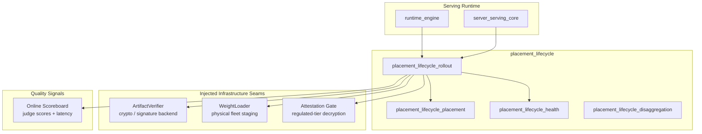
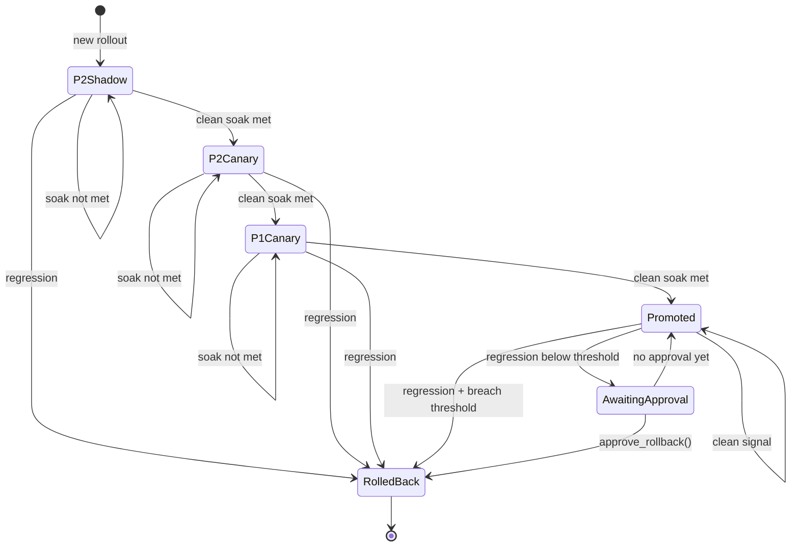
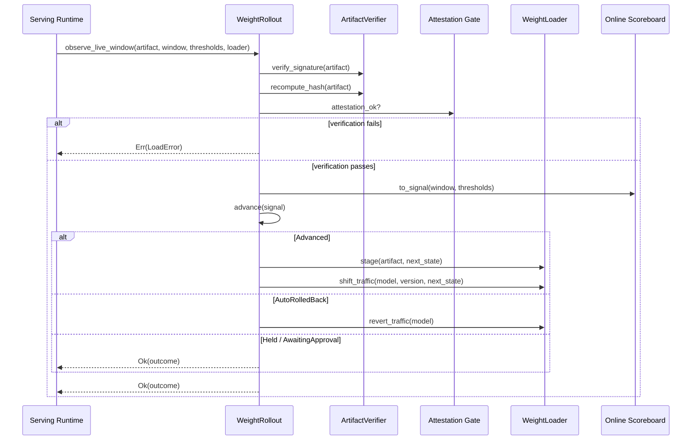
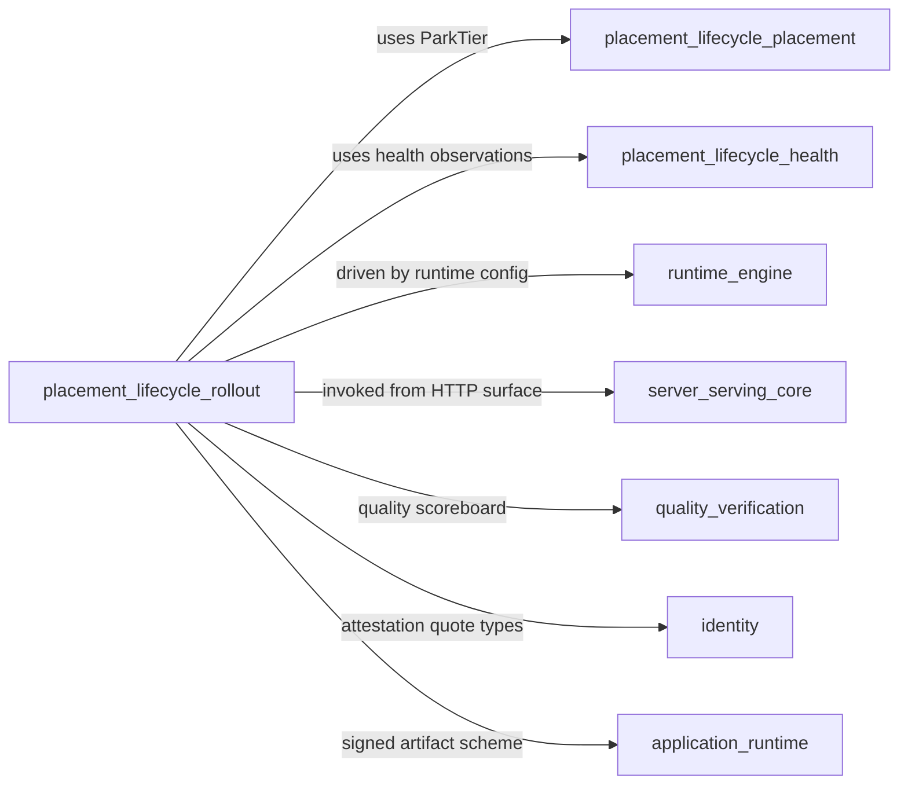
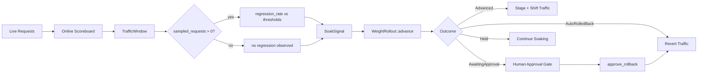
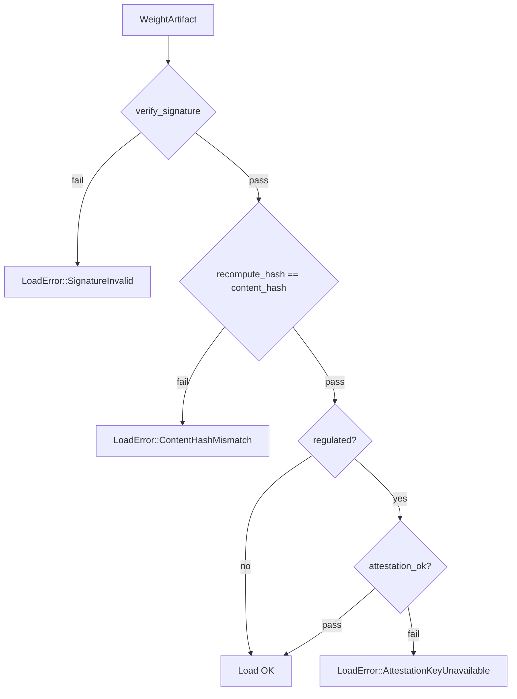

# placement_lifecycle_rollout

## Brief Introduction

The `placement_lifecycle_rollout` module implements the **signed, staged, integrity-verified weight rollout controller** for model serving. It lives inside the `placement_lifecycle` family of the serving infrastructure and is responsible for safely promoting a new model weight version from zero traffic all the way to full production, with automatic rollback on regression and honest rollback-SLA reporting.

The module is intentionally **pure and deterministic**: it contains no crypto implementation, no GPU code, and no clock. Instead, it defines clean seams (`ArtifactVerifier`, `WeightLoader`) so that real cryptographic verification, attestation checks, and physical fleet operations can be injected while the rollout policy logic remains fully testable offline.

Key responsibilities:

- **Fail-closed load verification** — signature, content-hash, and attestation-bound decryption are re-verified on every load.
- **Staged promotion ladder** — `P2Shadow → P2Canary → P1Canary → Promoted`, gated on clean soak windows.
- **Automatic rollback** — any regression at a canary stage rolls back immediately; P0 regression rolls back automatically only if a breach threshold is crossed, otherwise it awaits an approval gate.
- **Honest rollback SLA** — reports resident-flip, warm-reload, or cold-pull times based on the incumbent's actual parking tier.
- **Live-traffic enforcement** — derives rollout decisions from real quality metrics windows rather than hand-set booleans.

---

## Architecture

### Module Position

`placement_lifecycle_rollout` is one of four siblings under `placement_lifecycle`:

- [placement_lifecycle_placement](placement_lifecycle_placement.md) — bins, pools, demand tracking, and parking tiers.
- [placement_lifecycle_health](placement_lifecycle_health.md) — fleet health observations and drain/replace logic.
- **placement_lifecycle_rollout** — staged weight promotion and rollback (this document).
- [placement_lifecycle_disaggregation](placement_lifecycle_disaggregation.md) — disaggregated prefill/decode pools.

It is consumed by the higher-level serving runtime ([server_serving_core](server_serving_core.md)) and by the runtime configuration surfaces ([runtime_engine](runtime_engine.md)).

### High-Level Architecture Diagram

### Core Components

| Component | Type | Purpose |
|-----------|------|---------|
| `WeightArtifact` | struct | Signed model artifact: weights, tokenizer, config, content hash, signature, regulated flag. |
| `ArtifactVerifier` | trait | Seam for signature verification and content-hash recomputation. |
| `AllowListArtifactVerifier` | struct | Deterministic reference verifier used in tests and offline validation. |
| `LoadError` | enum | Reasons a weight load can be refused: bad signature, hash mismatch, missing attestation. |
| `RolloutState` | enum | Staged ladder: `P2Shadow`, `P2Canary`, `P1Canary`, `Promoted`, `RolledBack`. |
| `SoakSignal` | struct | One observation: no regression, soak elapsed, P0 breach threshold crossed. |
| `AdvanceOutcome` | enum | Result of one advance step: advanced, held, auto-rolled-back, awaiting approval. |
| `WeightRollout` | struct | The staged rollout state machine and load-verification logic. |
| `CutoverPath` | enum | Zero-downtime strategy: `BlueGreen` or `StagedGroupByGroup`. |
| `RollbackPath` | enum | Physical rollback class: `ResidentFlip`, `WarmReload`, `ColdPull`. |
| `RollbackPlan` | struct | Honest bounded rollback estimate derived from the incumbent's `ParkTier`. |
| `WeightLoader` | trait | Physical staging seam: stage blob, shift traffic, revert traffic. |
| `InMemoryWeightLoader` | struct | Deterministic offline reference implementation of `WeightLoader`. |
| `StageOutcome` | enum | Physical staging result: `Staged` or `Refused`. |
| `TrafficWindow` | struct | One window of live-traffic quality metrics. |
| `RolloutThresholds` | struct | Thresholds for regression rate and P0 breach rate. |

---

## Component Relationships

### Rollout State Machine

### Verification, Staging, and Traffic Shift

### Dependencies on Other Modules

---

## Data Flow

### Live-Traffic Rollout Decision Flow

### Load Verification Data Flow

---

## Process Flows

### Staged Promotion with Soak Gating

1. A new `WeightArtifact` is registered for rollout.
2. `WeightRollout::new()` starts the candidate in `P2Shadow`.
3. For each soak window:
   - `TrafficWindow` is sampled from the online scoreboard.
   - `TrafficWindow::to_signal` converts metrics into a `SoakSignal`.
   - `WeightRollout::observe_live_window` re-verifies the artifact, then advances the state machine.
4. If the signal is clean and soak time is met, the candidate advances to the next stage.
5. If a regression is observed at any canary stage, the candidate is auto-rolled-back.
6. At `Promoted`, a minor regression awaits human approval; a breach-threshold regression auto-rolls-back.

### Rollback SLA Planning

1. The incumbent version is parked in one of the tiers defined by [placement_lifecycle_placement](placement_lifecycle_placement.md): `Resident`, `Warm`, or `Cold`.
2. `RollbackPlan::for_state` maps the parking tier to a rollback path:
   - `Resident` → `ResidentFlip` (~0 minutes).
   - `Warm` → `WarmReload` (bounded warm-reload SLA).
   - `Cold` → `ColdPull` (warm SLA + object-store transfer time).
3. The plan is reported honestly; cold fallbacks never claim the warm number.

### Zero-Downtime Cutover Planning

1. `CutoverPath::plan(footprint, free_vram)` decides how to swap versions.
2. If `free_vram >= 2 × footprint`, use `BlueGreen` (both versions resident, instant traffic flip).
3. Otherwise, use `StagedGroupByGroup` (capacity dips but never reaches zero).

---

## How It Fits into the Overall System

`placement_lifecycle_rollout` is the **policy core** that closes the serving-ops gap around safe model promotion. It sits between:

- **Higher-level orchestration** ([server_serving_core](server_serving_core.md), [runtime_engine](runtime_engine.md)) that decides *when* to start a rollout and *which* artifact to promote.
- **Lower-level placement and health** ([placement_lifecycle_placement](placement_lifecycle_placement.md), [placement_lifecycle_health](placement_lifecycle_health.md)) that provide parking tiers, node candidates, and health observations.
- **Quality verification** ([quality_verification](../ai_engine/quality_verification.md)) that supplies the judge scores and latency regressions consumed as `TrafficWindow` metrics.
- **Identity and attestation** ([identity](../governance_compliance/identity.md)) that provide the attestation quote verdict required for regulated-tier decryption.
- **Physical infrastructure** (injected via `WeightLoader` and `ArtifactVerifier`) that performs the actual blob staging, decryption, and traffic shifting.

By keeping the policy pure and pushing all I/O, crypto, and GPU operations into injected seams, the module can be exhaustively unit-tested offline while still enforcing the same logic in production.

---

## Key Design Decisions

- **Re-verify at every load**: Signature and content hash are checked on every call to `verify_load`, not just at first install. A signing key compromised after deployment does not grandfather a running model.
- **Attestation-bound regulated decryption**: Regulated artifacts refuse to load on a node that is not currently attested, even if the signature is valid.
- **Fail-closed staging**: `advance_with_loader` verifies the artifact *before* calling the `WeightLoader`; a bad blob leaves state and fleet state unchanged.
- **Honest rollback SLA**: The module reports realistic rollback times based on the actual parking tier, avoiding the "instant rollback" anti-pattern.
- **Live-traffic enforcement**: `observe_live_window` derives decisions from real metrics windows, closing the gap between library logic and production enforcement.

---

## References

- [placement_lifecycle_placement](placement_lifecycle_placement.md) — parking tiers and placement model used by `RollbackPlan`.
- [placement_lifecycle_health](placement_lifecycle_health.md) — fleet health observations that inform rollout safety.
- [placement_lifecycle_disaggregation](placement_lifecycle_disaggregation.md) — disaggregated pool management.
- [server_serving_core](server_serving_core.md) — HTTP surface and top-level serving state that drives rollouts.
- [runtime_engine](runtime_engine.md) — runtime configuration and surfaces such as `ServingRolloutConfig`.
- [quality_verification](../ai_engine/quality_verification.md) — judge panels, quality assessors, and synthesis that produce the scoreboard metrics.
- [identity](../governance_compliance/identity.md) — attestation quote and workload identity infrastructure.
- [application_runtime](../core_infrastructure/application_runtime.md) — signed plugin/skill artifact scheme reused for weight artifacts.
- [serving_infrastructure](serving_infrastructure.md) — parent module covering admission, scheduling, placement, caching, and attestation.
