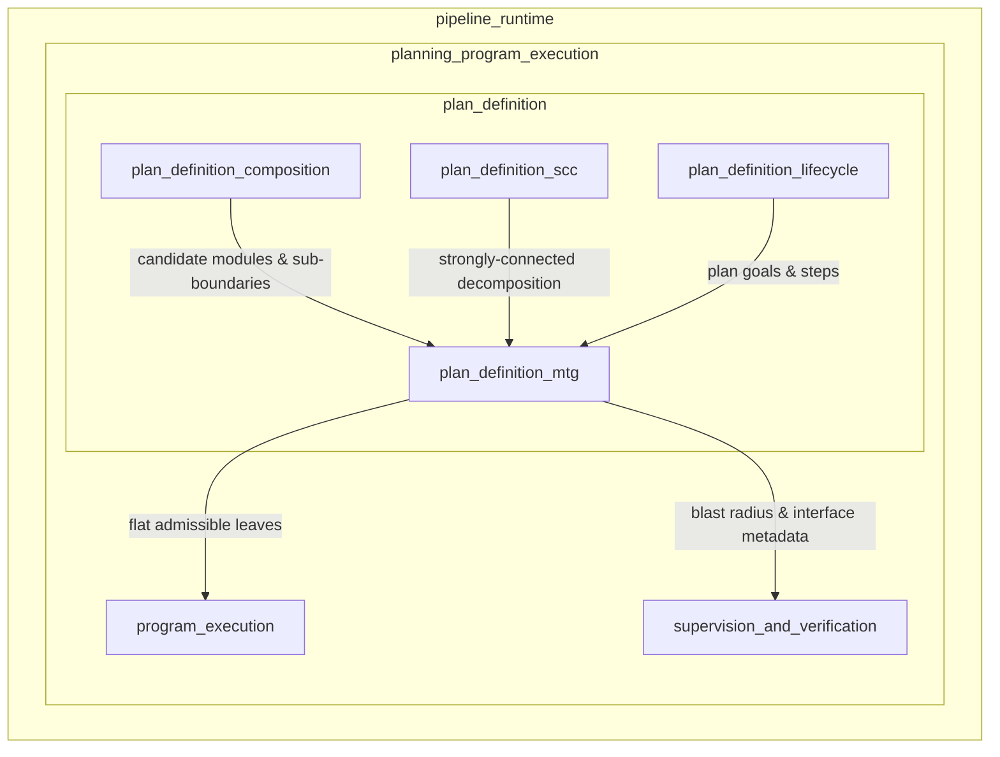
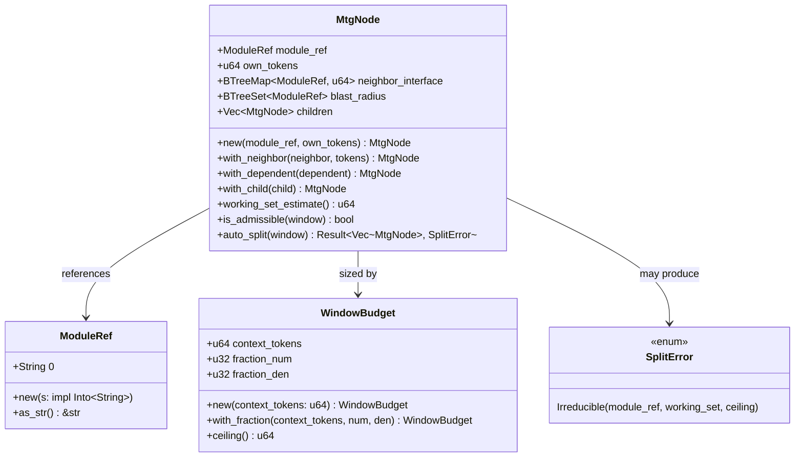
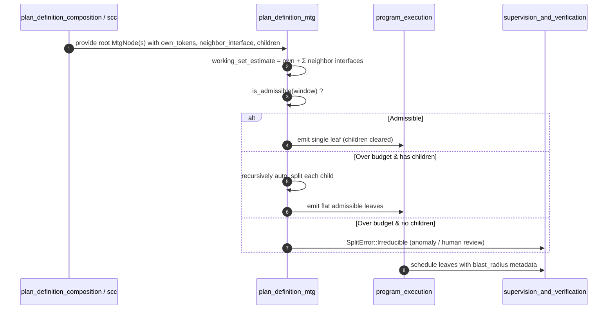
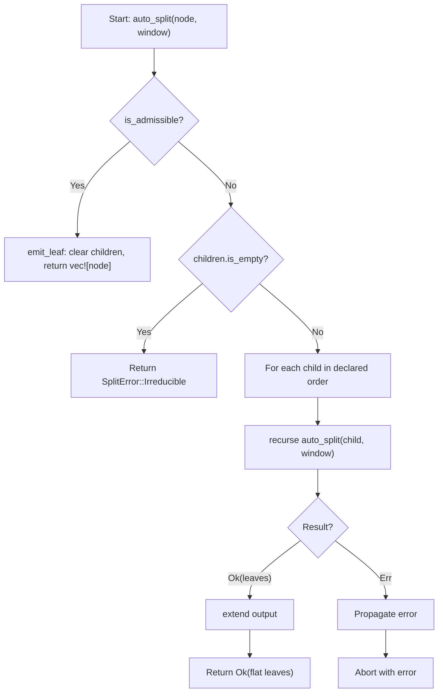
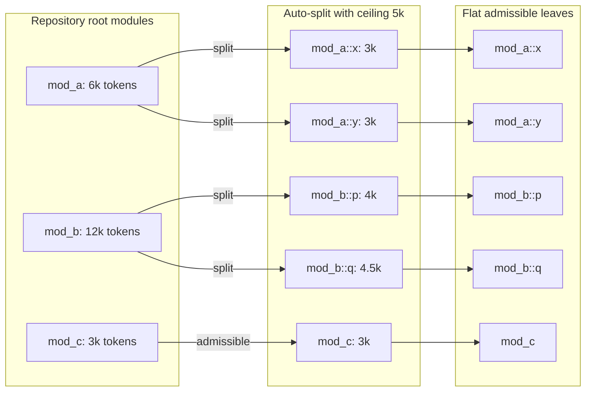

# plan_definition_mtg

## Brief Introduction

The `plan_definition_mtg` module implements the **Module Task Graph (MTG) window-sizing invariant** for long-horizon program planning. It is the pure, deterministic core that guarantees no single migration node ever exceeds a configured fraction of the target model's context budget. By representing each migration unit as an [`MtgNode`](plan_definition_mtg.md#mtgnode) with its own source tokens and the interface-slice tokens of its 1-hop neighbors, the module can recursively split oversized nodes along pre-discovered sub-boundaries until every emitted leaf fits within the [`WindowBudget`](plan_definition_mtg.md#windowbudget) ceiling.

This invariant is the load-bearing property that makes 1M-LOC program migrations feasible: total repository size only affects the *number* of scheduled nodes, never the per-node context size. The module performs no I/O, draws no randomness, and reads no clock, so all guarantees are unit-testable on concrete values.

---

## Architecture

### Position in the System

`plan_definition_mtg` sits inside the **plan_definition** submodule of **planning_program_execution**, which is part of the broader **pipeline_runtime** domain. It receives candidate migration units from [plan_definition_composition](plan_definition_composition.md) and [plan_definition_scc](plan_definition_scc.md), and emits a flat, admissible set of leaves that [program_execution](planning_program_execution.md#program-execution) and [supervision_and_verification](planning_program_execution.md#supervision-and-verification) can schedule and execute.

### Core Components

---

## Component Relationships

### `WindowBudget`

[`WindowBudget`](plan_definition_mtg.md#windowbudget) defines the target model's usable context and the admissible fraction a single node may occupy. The default is **≤ 50%** of the context, represented as an exact integer ratio (`1/2`) to avoid floating-point drift. The `ceiling()` method computes `floor(context_tokens * num / den)` in `u128` arithmetic, preventing overflow and guaranteeing deterministic results across platforms.

### `MtgNode`

An [`MtgNode`](plan_definition_mtg.md#mtgnode) is a candidate migration unit annotated with:

- **`own_tokens`**: the token cost of the module's own source.
- **`neighbor_interface`**: a map of 1-hop neighbors to the token cost of their **interface slices** (signatures and contracts only).
- **`blast_radius`**: dependents discovered from the call/import graph, used by downstream rollback and seam-integration logic.
- **`children`**: sub-boundaries along which the node can be split if it exceeds the window.

The structural absence of a "neighbor body" field enforces the **interface-not-implementation invariant**: a neighbor's implementation size can never leak into the working-set estimate.

### `SplitError`

When an oversized node has no remaining `children` boundaries, [`SplitError::Irreducible`](plan_definition_mtg.md#spliterror) is returned. This is an honest failure surface that surfaces the offending module, its working set, and the ceiling, so that human decomposition or an anomaly checkpoint can be triggered rather than silently emitting an over-budget node.

---

## Data Flow

1. **Input**: root nodes are produced by composition and SCC analysis, each carrying cost metadata and optional split boundaries.
2. **Estimate**: `MtgNode::working_set_estimate` sums `own_tokens` and neighbor interface slices using saturating arithmetic.
3. **Admissibility check**: the estimate is compared against `WindowBudget::ceiling`.
4. **Split or emit**: admissible nodes become leaves; oversized nodes recurse into `children`.
5. **Irreducible detection**: a leaf that still exceeds the ceiling raises `SplitError::Irreducible`.
6. **Output**: a deterministic, ordered list of admissible leaves passed to execution and supervision.

---

## Process Flows

### Auto-Split Algorithm

### Decomposition of a Repository

---

## Integration with Adjacent Modules

| Adjacent Module | Relationship |
|-----------------|--------------|
| [plan_definition](plan_definition.md) | Parent module; MTG is one of four plan-definition submodules. |
| [plan_definition_lifecycle](plan_definition_lifecycle.md) | Supplies plan goals, steps, and templates that MTG-sized nodes will fulfill. |
| [plan_definition_composition](plan_definition_composition.md) | Produces `SuperNode`, `FabricModule`, and module graphs that MTG converts into cost-aware nodes. |
| [plan_definition_scc](plan_definition_scc.md) | Provides Tarjan-based strongly-connected decomposition, which can pre-break cycles before MTG window-sizing. |
| [planning_program_execution](planning_program_execution.md) | Consumes the flat leaf set as `ProgramNode` inputs for deterministic execution. |
| [pipeline_orchestration](pipeline_orchestration.md) | Higher-level orchestration that may invoke planning before edit-turn execution. |

---

## Key Design Invariants

1. **Interface-not-implementation**: `MtgNode` has no field for neighbor bodies; only interface-slice tokens are representable.
2. **Exact integer arithmetic**: `WindowBudget` uses a `num/den` ratio and `u128` intermediates to avoid rounding and overflow.
3. **Determinism**: `auto_split` processes roots and children in declared order; no randomness or clock dependence.
4. **Honest failure**: irreducible nodes raise `SplitError` rather than silently exceeding the budget.
5. **Repo-size independence**: total repository size changes only the *count* of emitted leaves, never the per-leaf ceiling.

---

## API Surface

### Types

- `ModuleRef` — opaque string reference to a migration unit.
- `WindowBudget` — context budget and admissible fraction.
- `MtgNode` — candidate node with cost metadata and split boundaries.
- `SplitError` — irreducible-node failure evidence.

### Free Functions

- `decompose_modules(roots: &[MtgNode], window: &WindowBudget) -> Result<Vec<MtgNode>, SplitError>` — flatten an entire repository into admissible leaves.
- `all_admissible(nodes: &[MtgNode], window: &WindowBudget) -> bool` — acceptance invariant for tests and checkpoints.
- `max_working_set(nodes: &[MtgNode]) -> u64` — p100 per-Run context measurement.

### `MtgNode` Builders

- `MtgNode::new(module_ref, own_tokens)` — create a leaf node.
- `.with_neighbor(neighbor, interface_tokens)` — add a 1-hop interface cost.
- `.with_dependent(dependent)` — add a blast-radius entry.
- `.with_child(child)` — add a split boundary.

---

## Testing Strategy

The module's test suite pins the structural guarantees directly:

- `ceiling_is_exact_integer_arithmetic` — verifies integer-ratio math and zero-denominator coercion.
- `working_set_is_own_plus_interface_only_never_bodies` — enforces the interface-not-body invariant.
- `admissible_node_is_emitted_as_a_single_leaf_not_split` — confirms no unnecessary splitting.
- `oversized_node_splits_until_every_leaf_fits` — validates recursive splitting and deterministic order.
- `split_recurses_when_a_child_is_still_too_big` — checks multi-level decomposition.
- `irreducible_leaf_is_an_honest_error_not_a_silent_overflow` — ensures honest failure.
- `total_repo_size_only_changes_node_count_not_per_node_ceiling` — proves the §5 repo-size independence property.

---

## References

- [plan_definition](plan_definition.md)
- [plan_definition_lifecycle](plan_definition_lifecycle.md)
- [plan_definition_composition](plan_definition_composition.md)
- [plan_definition_scc](plan_definition_scc.md)
- [planning_program_execution](planning_program_execution.md)
- [pipeline_orchestration](pipeline_orchestration.md)
