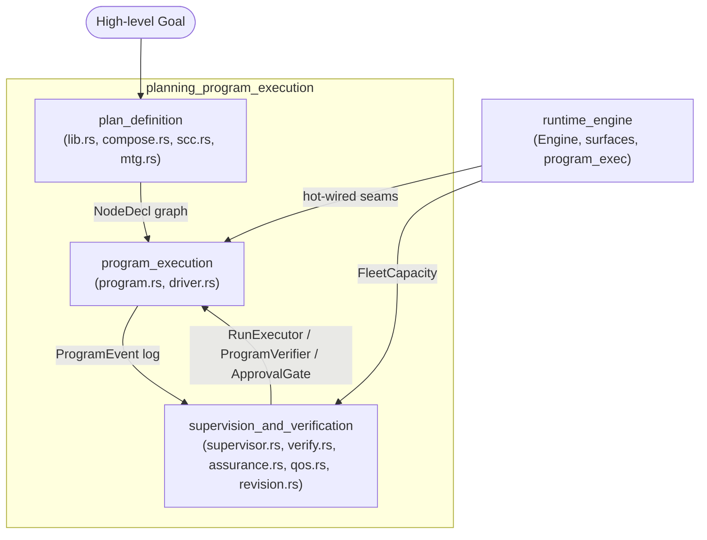
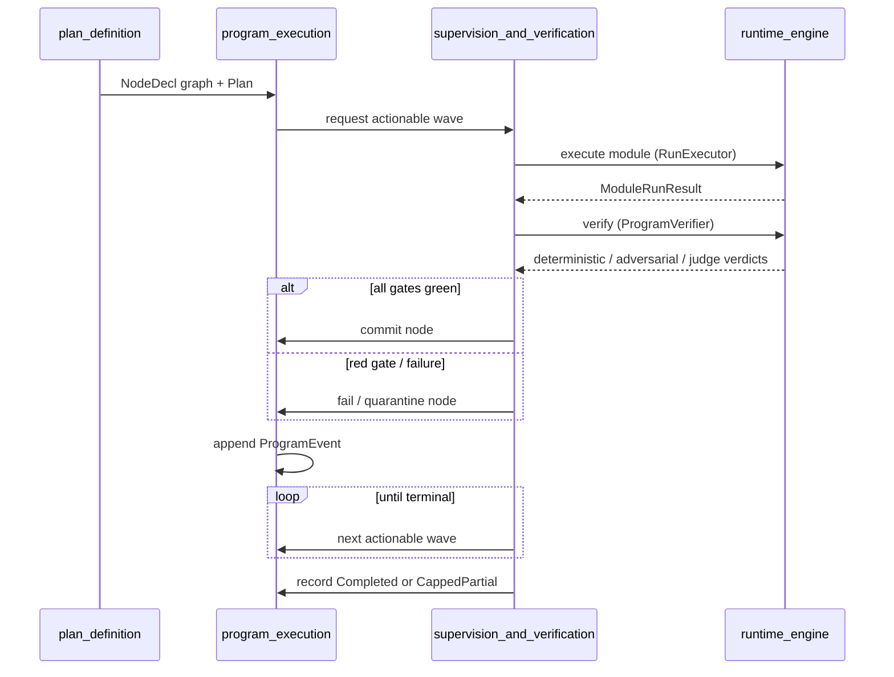

# `planning_program_execution` module overview

## Purpose

`planning_program_execution` is the long-horizon program subsystem inside `pipeline_runtime`. It turns large, multi-step engineering objectives (e.g., multi-service refactors, million-line migrations) into durable, verifiable, and resumable programs.

The module closes the gap between short-lived AI Runs and work that spans days or weeks by providing:

- **Goal decomposition** – breaking high-level goals into dependency-ordered steps.
- **Durable execution** – event-sourced program state that survives restarts.
- **Three-way verification** – requiring deterministic, adversarial, and cross-model semantic proofs before any work is considered complete.
- **Failure isolation** – quarantining failed nodes so independent branches can keep progressing.
- **Human governance** – staging approvals, budget checks, and anti-thrash controls.

## Architecture

The module is split into three core sub-modules:

### Sub-module responsibilities

| Sub-module | Key files | Responsibility |
|------------|-----------|----------------|
| `plan_definition` | `lib.rs`, `compose.rs`, `scc.rs`, `mtg.rs` | Decompose goals into plans, build dependency-ordered module task graphs, handle cycles, and guarantee window-sized nodes. |
| `program_execution` | `program.rs`, `driver.rs` | Maintain durable event-sourced program state and drive the verified execution loop. |
| `supervision_and_verification` | `supervisor.rs`, `verify.rs`, `assurance.rs`, `qos.rs`, `revision.rs` | Schedule modules, enforce the three-way gate, govern cost, stage human checkpoints, and prevent plan thrash. |

## Data flow

## Core components documentation

- [`plan_definition.md`](plan_definition.md) – plan lifecycle, goal decomposition, module graph composition, SCC handling, and window-sized module task graphs.
- [`program_execution.md`](program_execution.md) – durable Program state machine, verified drive loop, resumability, rollback, and child-program composition.
- [`supervision_and_verification.md`](supervision_and_verification.md) – program supervisor, three-way gate, assurance breaker/judge, GPU QoS admission, and plan anti-thrash.

## See also

- [`pipeline_runtime`](pipeline_runtime.md) – parent runtime module.
- [`runtime_engine`](runtime_engine.md) – supplies the base-loop Engine and verification backends.
- [`edit_semantic`](edit_semantic.md) – provides the semantic-editing ladder enforced at commit gates.
- [`governance_compliance`](../governance_compliance/governance_compliance.md) – durable event log, approval gates, identity, and audit.