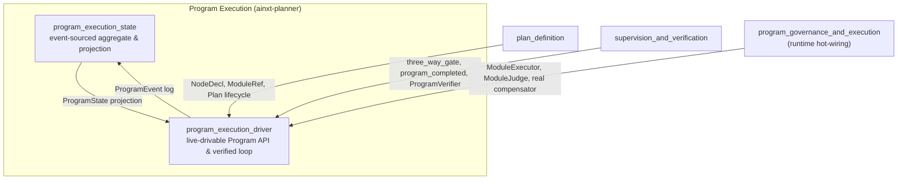
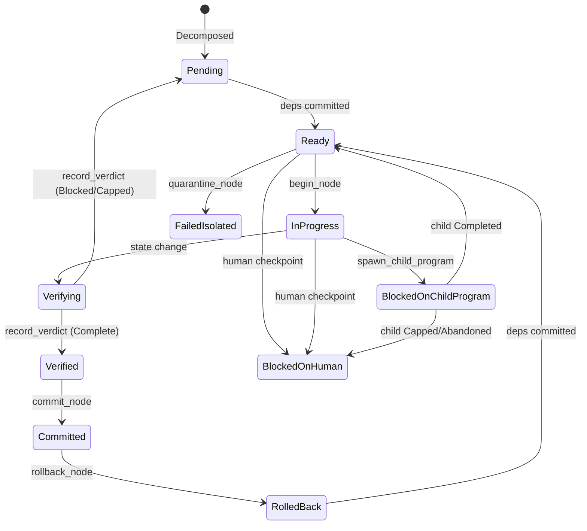
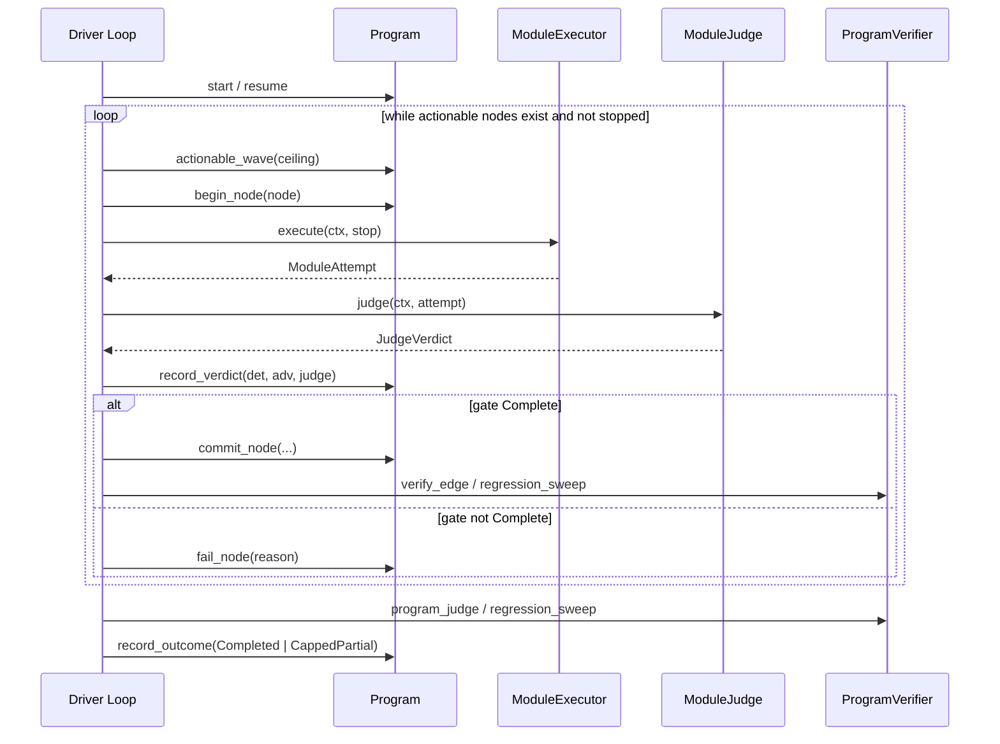

# Program Execution

The **program_execution** module implements the durable, verifiable execution engine for long-horizon migration programs. It sits inside the broader [`planning_program_execution`](planning_program_execution.md) subsystem of [`pipeline_runtime`](pipeline_runtime.md) and is responsible for turning a statically declared module graph into a running, resumable, auditable program whose progress is proven rather than self-reported.

Detailed documentation for the two sub-modules is available in [`program_execution_state`](program_execution_state.md) (the event-sourced aggregate) and [`program_execution_driver`](program_execution_driver.md) (the live-drivable Program API and verified drive loop).

## Purpose

A *Program* is a multi-step, multi-week migration or refactoring task that is too large to complete in a single model turn. The program_execution module provides:

- **Durable, event-sourced state** — every state change is an append-only, hash-chained event; the live projection is folded from the log.
- **Resumability** — a program can stop on Friday and resume on Monday by replaying its durable log, never re-executing already-committed work.
- **Three-way verification** — no node is considered done until independent deterministic, adversarial, and cross-model semantic verdicts all pass.
- **Program-scale verification** — the whole program is declared `Completed` only after per-edge integration checks, a regression sweep, and an independent program-level judge all pass.
- **Honest partial completion** — when a node cannot be proven, the program seals a `CappedPartial` outcome and produces a deployable report of what *did* commit.
- **Single-module rollback** — a just-committed node that breaks an already-good neighbor can be rolled back, cascading only its own committed dependents.
- **Poison-node quarantine** — a persistently failing node is isolated so independent branches can keep progressing.
- **Child-program composition** — a node can spawn a nested Program, blocking the parent until the child reaches a terminal outcome.
- **Edit-ladder floor enforcement** — critical-path nodes can forbid low-rung (e.g. raw text-patch) edits even when the three-way gate is green.

The design is intentionally **pure and deterministic**: no clock, no I/O, no threads. All real-world side effects (git commits, MR creation, model inference, compensation) are injected through traits that the runtime hot-wires in production.

## Architecture Overview

The module is split into two tightly coupled but conceptually distinct layers:

| Sub-module | File | Responsibility |
|------------|------|----------------|
| [`program_execution_state`](program_execution_state.md) | `crates/ainxt-planner/src/program.rs` | The pure event-sourced aggregate: `ProgramState`, `ProgramEvent`, node lifecycle, decomposition validation, hash chain, rollback/quarantine planning, partial-completion reports. |
| [`program_execution_driver`](program_execution_driver.md) | `crates/ainxt-planner/src/driver.rs` | The live-drivable `Program` API, the verified drive loop, `StopSignal`, and the injected seams (`ModuleExecutor`, `ModuleJudge`, `ProgramVerifier`). |

## Core Concepts

### Node Contract

Every node in a program carries a contract derived from the ADR-027 §3 specification:

- `id` and `node_class` (`MigrationRun`, `Shim`, `Integration`, `ChildProgram`, …)
- `deps` — dependency graph edges
- `blast_radius` — dependents from the call/import graph
- `working_set_estimate` — token budget for admissibility checks
- `verification_plan` — seams/tests that gate the node
- `checkpoint_class` — whether a human gate is required
- `edit_ladder_floor` — minimum safe Semantic-Editing rung (`Lsp`, `Ast`, `StructuredPatch`, `TextPatch`)

### Node State Machine

### Three-Way Gate

A node is `Verified` only when all three independent proofs are `Complete`:

1. **Deterministic verdict** — compiles, tests pass, no SAST hard-blocks.
2. **Adversarial verdict** — no Breaker counterexamples.
3. **Judge verdict** — cross-model semantic review above threshold and completed.

The gate is recomputed from the durable event on every replay; there is no "mark verified" command.

### Program-Scale Gate

After all nodes are committed, the program is `Completed` only when:

1. Every leaf is committed with a `Complete` proof.
2. Every committed edge integration is green.
3. The regression sweep over all committed work is green.
4. The independent, cross-model program judge passes.

Anything else yields an honest `CappedPartial`.

## Verified Drive Loop

The [`drive_program_verified`](program_execution_driver.md) family of functions is the main entry point for running a program:

Variants of the loop support:

- Sequential execution (`drive_program_verified`)
- Parallel fan-out (`drive_program_verified_fanout`)
- Durable rollback on red edges (`drive_program_verified_reopening`)
- Resumable user-stop (`drive_program_verified_resumable`, `resume_program_verified`)

## Durability & Resume

The [`ProgramEvent`](program_execution_state.md) log is the single source of truth. Two resume paths are supported:

- [`Program::resume`](program_execution_driver.md) — full replay from the log.
- [`Program::resume_from_checkpoint`](program_execution_driver.md) — replay only the tail onto a [`ProgramCheckpoint`](program_execution_driver.md) snapshot.

Both yield byte-identical state. A `Committed` node is never schedulable again, so resumed programs never re-execute committed work.

## Relationships to Other Modules

- **[`plan_definition`](plan_definition.md)** — supplies the `NodeDecl` graph, `ModuleRef` identities, and `Plan` lifecycle escalation used by the driver.
- **[`supervision_and_verification`](supervision_and_verification.md)** — supplies the `three_way_gate`, `program_completed`, and `ProgramVerifier` abstractions that the driver calls.
- **[`program_governance_and_execution`](program_governance_and_execution.md)** — the runtime layer that hot-wires real `ModuleExecutor`, `ModuleJudge`, and compensator implementations onto the pure driver seams.
- **[`edit_semantic`](edit_semantic.md)** — provides the Semantic-Editing ladder (`Lsp`, `Ast`, …) whose rung is enforced at the commit gate.

## See Also

- [`program_execution_state.md`](program_execution_state.md) — detailed documentation of the event-sourced aggregate.
- [`program_execution_driver.md`](program_execution_driver.md) — detailed documentation of the live-drivable Program API and verified drive loop.
