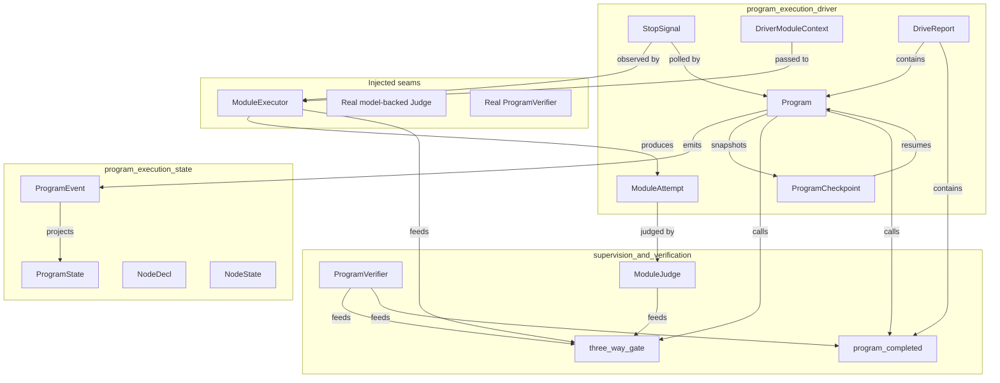
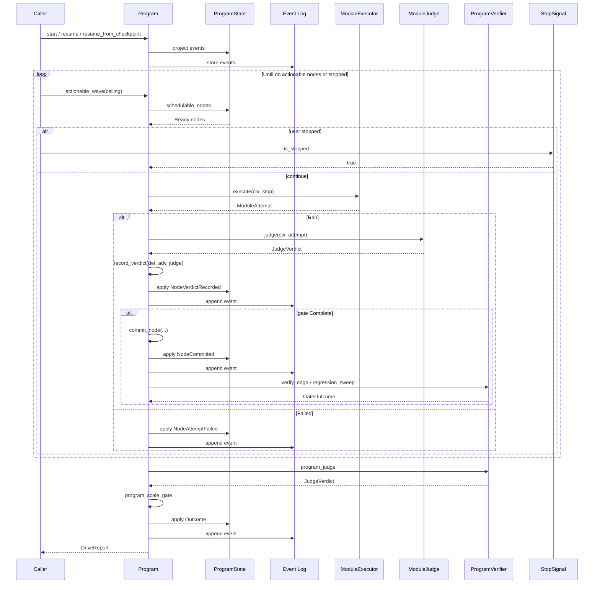
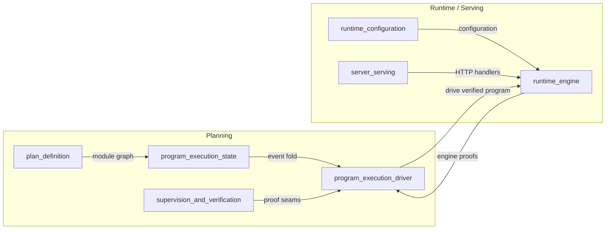

# program_execution_driver

The **program execution driver** is the live-drivable, durable, and resumable command surface over the [`program_execution_state`](program_execution_state.md) aggregate. It turns a static module graph into a long-horizon, event-sourced program that can be advanced one command at a time, snapshotted mid-flight, and resumed from a durable log without re-executing committed work. The driver enforces the system's three-way verification gate at the seam and provides the entrypoints used by served runtimes, tests, and UI handlers.

This module lives under [`planning_program_execution`](planning_program_execution.md) and is the runtime-facing half of program execution. While [`program_execution_state`](program_execution_state.md) defines the pure event fold and [`supervision_and_verification`](supervision_and_verification.md) supplies batch supervision and proof seams, the driver adds:

- A mutable, command-by-command `Program` object.
- Checkpoint/resume semantics for crash recovery and Friday→Monday durability.
- A verified drive loop that wires engine-derived proofs, a cross-model judge, and program-scale verification together.
- User-stop, parallel fan-out, rollback-on-red, and child-program composition policies.

---

## Architecture

### Component responsibilities

| Component | Responsibility |
|-----------|----------------|
| `Program` | The live aggregate. Accepts commands (`decompose`, `begin_node`, `record_verdict`, `commit_node`, `rollback_node`, `quarantine_node`, etc.), emits durable `ProgramEvent`s, and projects `ProgramState`. |
| `ProgramCheckpoint` | A snapshot of `ProgramState` at a log offset. Used to resume by replaying only the tail of events. |
| `StopSignal` | A cheaply-clonable, cooperative user-stop flag shared between the driver loop and the in-flight module executor. |
| `DriverModuleContext` | Context handed to executors and judges for one module attempt: program id, node id, class, goal, and attempt counter. |
| `ModuleAttempt` | The engine-derived result of a module run: either `Ran` with deterministic/adversarial verdicts and commit metadata, or `Failed`. |
| `ModuleExecutor` | Injected seam for the real engine that runs a module and returns engine-derived proofs. |
| `ModuleJudge` | Injected seam for the cross-model semantic judge. Separated from the executor so the judge cannot be self-reported. |
| `ProgramVerifier` | Injected seam for program-scale verification: edge integration, regression sweep, program judge, and rollback compensation. |
| `DriveReport` | Terminal report containing the final `Program`, sealed outcome, program-scale gate, stop status, committed nodes, and any non-compensable rollbacks. |

---

## Core concepts

### Event-sourced durability

`Program` is the only mutable object most callers need. Every command first folds an event into the projected `ProgramState` and only appends it to the in-memory log if the fold succeeds. This guarantees that the durable log never contains an event the state machine would reject on replay. Rehydration is pure:

- `Program::resume(log)` rebuilds state by folding the entire log.
- `Program::resume_from_checkpoint(cp, tail)` rebuilds from a checkpoint plus tail events, yielding byte-identical state to a full replay.
- `Program::checkpoint()` snapshots current state at the current offset.

Because `Committed` nodes are not schedulable, a resumed program never re-executes committed work.

### Three-way verification at the seam

The driver enforces verification through the API itself, not through self-reporting:

1. The executor supplies a `DeterministicVerdict` (compile, tests, SAST).
2. The executor supplies an `AdversarialVerdict` (breaker counterexamples).
3. The separate `ModuleJudge` supplies a `JudgeVerdict` (cross-model semantic review).

`Program::record_verdict` recomputes [`three_way_gate`](supervision_and_verification.md) from all three proofs. The only route to `Verified` is a `Complete` gate outcome. There is no "mark verified" command. `Program::commit_node` refuses to commit a node that lacks a durable `Complete` proof (`ProgramError::NodeNotProven`).

### Program-scale completion gate

Before a program is declared `Completed`, the driver runs the program-scale gate via [`program_completed`](supervision_and_verification.md):

- Every leaf node is committed and proven.
- Every committed edge integration is green.
- The regression sweep over all committed work is green.
- The independent program-level judge passes cross-model and threshold checks.

If any of these fail, the outcome is honestly reported as `CappedPartial`.

### User-stop

`StopSignal` is a cooperative flag cloned into the executor. The driver polls it before each module and again after each module turn. A stop breaks the loop between modules, never orphaning an in-flight commit, and allows an in-flight turn to cancel itself. Stopped runs under the resumable policy stay non-terminal so they can be resumed later.

### Parallel fan-out

`drive_program_verified_fanout` admits a whole *wave* of independent `Ready` nodes (up to `fan_out_ceiling`) each scheduling round. All verification guarantees are preserved; only admission width changes. This is the mechanism that makes large migrations time-feasible by progressing independent branches concurrently.

### Durable rollback and quarantine

`drive_program_verified_reopening` enables ADR-027 §9 durable single-module rollback: when a just-committed node breaks an integration edge with an already-good neighbor or fails the regression sweep, that node is rolled back (cascading its own committed dependents) and re-attempted. The `ProgramVerifier::compensate` seam performs the real-world side effect (e.g., git revert, MR close); if compensation fails, the rollback is surfaced honestly as `non_compensable_rollbacks` rather than silently swallowed.

`Program::quarantine_node` isolates a persistently-failing poison node to `FailedIsolated` and raises every un-terminal transitive dependent to `BlockedOnHuman`, each as a durable event. Independent branches continue progressing.

### Child-program composition

A node can be declared as a `child-program` class. `Program::spawn_child_program` records the durable parent-side link and blocks the node on the child's terminal outcome. `Program::resolve_child_program` maps the child's terminal `ChildOutcome` back onto the parent node. The driver crate never instantiates the child itself; the served daemon hot-wires a real nested `Program` instance.

---

## Data flow

---

## Public API

### `Program` commands

| Method | Description |
|--------|-------------|
| `Program::start(id, goal)` | Create a fresh program, emitting `Created`. |
| `Program::resume(log)` | Rehydrate purely from a durable event log. |
| `Program::resume_from_checkpoint(cp, tail)` | Rehydrate from a checkpoint plus tail events. |
| `Program::checkpoint()` | Snapshot current state at current offset. |
| `Program::decompose(nodes)` | Validate and record the module graph. |
| `Program::approve(approver)` | Record plan approval. |
| `Program::begin_node(node)` | Transition `Ready → InProgress`. |
| `Program::record_verdict(node, det, adv, judge)` | Recompute and record the three-way gate. |
| `Program::record_verdict_with_rung(node, det, adv, judge, rung)` | Record verdict with explicit semantic-editing rung. |
| `Program::commit_node(node, shas, ledger_key, by_model)` | Commit a proven node. |
| `Program::fail_node(node, reason)` | Record a failed attempt. |
| `Program::rollback_node(node)` | Durable single-module rollback with dependent cascade. |
| `Program::quarantine_node(node)` | Isolate a poison node and route around it. |
| `Program::spawn_child_program(node, child_id)` | Record a child-program link. |
| `Program::resolve_child_program(node, outcome)` | Map child terminal outcome onto parent. |
| `Program::record_outcome(outcome)` | Seal a terminal outcome. |
| `Program::actionable()` / `actionable_wave(ceiling)` | Query schedulable nodes. |
| `Program::is_proven(node)` | Check durable `Complete` proof. |
| `Program::state()` / `Program::log()` | Access projection and durable log. |

### Verified drive entrypoints

| Function | Behavior |
|----------|----------|
| `drive_program_verified` | Sequential verified drive; always seals terminal outcome. |
| `drive_program_verified_reopening` | Enables durable rollback-on-red for known-broken commits. |
| `drive_program_verified_fanout` | Parallel wave admission up to `fan_out_ceiling`. |
| `drive_program_verified_resumable` | Stopped runs stay non-terminal for later resume. |
| `resume_program_verified` | Resume from a durable log; interrupted in-flight nodes are re-opened as failed attempts. |

---

## Dependencies

The driver depends on sibling modules within [`planning_program_execution`](planning_program_execution.md):

- [`program_execution_state`](program_execution_state.md) — the pure event fold (`ProgramState`, `ProgramEvent`, `NodeDecl`, `NodeState`, `ProgramOutcome`).
- [`supervision_and_verification`](supervision_and_verification.md) — the `ProgramVerifier` trait and the `three_way_gate` / `program_completed` functions.
- [`plan_definition`](plan_definition.md) — `Plan`, `Step`, `Goal`, and `ReplanOutcome`, used to confirm anti-thrash escalation before quarantining a poison node.

It does **not** depend on `ainxt-runtime` or model providers. Real engines, judges, and cancel tokens are injected at the daemon composition root through the `ModuleExecutor`, `ModuleJudge`, and `ProgramVerifier` seams.

---

## Integration with the broader system

The program execution driver sits at the boundary between planning and runtime execution:

- [`runtime_engine`](runtime_engine.md) and [`runtime_configuration`](runtime_configuration.md) hot-wire the real `ModuleExecutor`, `ModuleJudge`, and `ProgramVerifier` implementations.
- [`server_serving`](server_serving.md) exposes program-run HTTP endpoints that ultimately invoke the driver's verified loop.
- [`plan_definition`](plan_definition.md) produces the `NodeDecl` graph consumed by `Program::decompose`.
- [`supervision_and_verification`](supervision_and_verification.md) defines the proof semantics the driver enforces.

---

## Design rationale

- **No self-reported verification.** The API deliberately lacks a "mark verified" command. Verification is always recomputed from three independent proofs.
- **Log is the source of truth.** All state changes are durable events; the mutable object is disposable.
- **Resume safety.** Committed nodes are excluded from `actionable`, so resuming never re-executes finished work.
- **Honest partial outcomes.** Red edges, failed judges, user-stops, and non-compensable rollbacks all surface as `CappedPartial` or `Blocked` rather than silently progressing.
- **Separation of concerns.** The driver is pure and deterministic; all I/O, clocks, RNG, and model calls live in injected seams.
