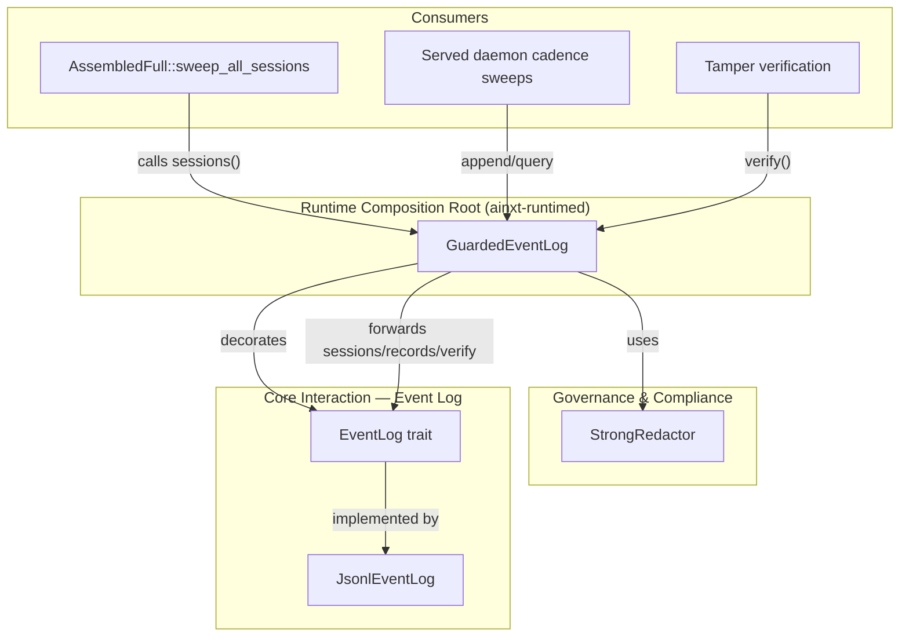
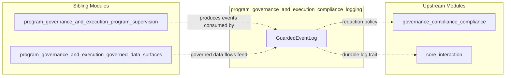
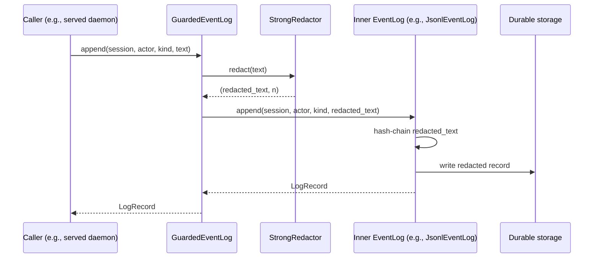
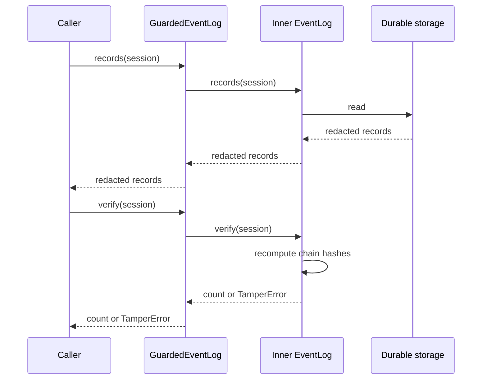
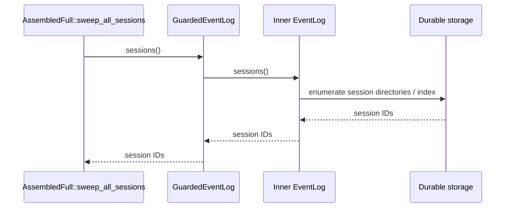
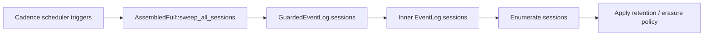

# Program Governance and Execution — Compliance Logging

## Brief Introduction

The **Compliance Logging** submodule is the runtime seam where durable event logging meets data-protection policy. It provides [`GuardedEventLog`](program_governance_and_execution_compliance_logging.md#guardedeventlog), a decorator around any [`EventLog`](../core_infrastructure/core_interaction.md#eventlog) that guarantees cardholder data (CHD), personally identifiable information (PII), and other secrets are redacted **before** the record is hash-chained and persisted. This guarantee is enforced by construction rather than by post-hoc audit: the only constructor for a guarded log installs a [`StrongRedactor`](../governance_compliance/compliance.md#strongredactor), and the inner log is never exposed unguarded.

This module sits at the composition root of the served daemon (`ainxt-runtimed`) because the underlying crates cannot form a direct dependency cycle: `ainxt-eventlog` cannot depend on `ainxt-compliance`, and `ainxt-compliance` cannot reach into the runtime's wiring. `GuardedEventLog` resolves that cycle by applying the sink-guard at the point where both crates are legitimately available.

---

## Core Purpose

- **FI-01 compliance**: Ensure no raw PAN, secret, or CHD-bearing text is ever written to the durable, tamper-evident event log.
- **Cycle-free architecture**: Keep the event-log crate free of compliance dependencies while still enforcing strong redaction in production.
- **Transparent decorator**: Preserve the full `EventLog` contract — append, query, verification, and session enumeration — so callers cannot accidentally bypass the guard.
- **Audit correctness**: Make the hash-chain commit to redacted bytes, so tamper verification remains valid and CHD-free.

---

## Architecture

### Component Overview

### Dependency Context

---

## Core Components

### `GuardedEventLog`

`GuardedEventLog<L: EventLog>` is a generic decorator that wraps an inner `EventLog` and a `StrongRedactor`. It is the only production path for durable event logging in the served runtime.

| Aspect | Description |
|--------|-------------|
| **Location** | `crates/ainxt-runtimed/src/guarded_log.rs` |
| **Generic parameter** | `L: EventLog` — any type implementing the `EventLog` trait |
| **Constructor** | `GuardedEventLog::new(inner: L)` — the only way to obtain an instance; installs `StrongRedactor` |
| **Redaction target** | `text` field of every `append` call |
| **Behavior** | Redacts `text`, then delegates the redacted string to the inner log |
| **Transparency** | Forwards `records`, `sessions`, and `verify` unchanged |

#### Why the `sessions()` override matters

The `EventLog` trait provides a default `sessions()` implementation that returns an empty vector. If `GuardedEventLog` did not explicitly forward `sessions()` to the inner log, the served daemon's `AssembledFull::sweep_all_sessions` would enumerate zero sessions on every deployment — because the runtime always wraps the real `JsonlEventLog` in a `GuardedEventLog`. The explicit override closes this functional gap.

---

## Data Flow

### Append Flow

### Read / Verify Flow

### Session Enumeration Flow

---

## Component Interactions

### With Governance & Compliance

`GuardedEventLog` imports [`StrongRedactor`](../governance_compliance/compliance.md#strongredactor) from `ainxt_compliance`. The redactor is responsible for recognizing and masking CHD, PII, and secrets. For details on redaction strength, configuration, and the `GuardedSink` equivalent, see the [Compliance module documentation](../governance_compliance/compliance.md).

### With Core Interaction — Event Log

`GuardedEventLog` implements the [`EventLog`](../core_infrastructure/core_interaction.md#eventlog) trait from `ainxt_eventlog`. The inner log handles hash-chaining, durable serialization, and tamper detection. For the underlying log record format, hash-chain semantics, and verification behavior, see the [Core Interaction documentation](../core_infrastructure/core_interaction.md).

### With Program Supervision

Program execution surfaces in [`program_governance_and_execution_program_supervision`](program_governance_and_execution_program_supervision.md) produce runtime events (program starts, team runs, turn observations, flywheel sweeps) that ultimately flow through the guarded log. The supervision module owns *what* is logged; the compliance logging module owns *how safely* it is persisted.

### With Governed Data Surfaces

[`program_governance_and_execution_governed_data_surfaces`](program_governance_and_execution_governed_data_surfaces.md) defines the governed query and fabric tools that may emit audit events. Those events are appended through `GuardedEventLog` so that any sensitive values returned by governed data tools are redacted before durable storage.

---

## Process Flows

### Production Wiring

```mermaid
flowchart LR
    A[Server boots] --> B[Load configuration]
    B --> C[Construct JsonlEventLog]
    C --> D[Wrap in GuardedEventLog::new]
    D --> E[Inject into AppState / AssembledFull]
    E --> F[Serve requests]
    F --> G[Runtime events generated]
    G --> H[GuardedEventLog.append]
    H --> I[StrongRedactor.redact]
    I --> J[Inner EventLog append + hash-chain]
    J --> K[Durable CHD-free record]
```

### Cadence Sweep

---

## Design Rationale

### Why not put the guard inside `ainxt-eventlog`?

`ainxt-eventlog` is a low-level crate in the `core_interaction` subsystem. If it depended on `ainxt-compliance` (which sits in `governance_compliance`), it would create a dependency cycle through the runtime and tool layers. Keeping `ainxt-eventlog` generic and policy-agnostic lets it be reused in tests, CLI tools, and constrained environments where compliance redaction is not required.

### Why apply the guard at the composition root?

The composition root (`ainxt-runtimed`) is the only place where:

1. The concrete `EventLog` implementation is chosen.
2. The `StrongRedactor` is available.
3. The guarantee can be made global for the served daemon.

By exposing only `GuardedEventLog::new(inner)`, the API makes it impossible to obtain a production event log that skips redaction.

---

## Testing

The module includes an integration-style unit test (`wire2_fi01_guarded_eventlog_redacts_chd_before_durable_write`) that verifies:

1. A raw PAN placeholder (`[REDACTED]` in the test string) does not survive into the returned `LogRecord`.
2. The on-disk record retrieved via `records()` is also free of the raw secret.
3. Tamper verification still succeeds because the hash-chain committed the redacted bytes.
4. Benign text is stored verbatim, proving redaction is targeted rather than lossy.

---

## References

- [Core Interaction](../core_infrastructure/core_interaction.md) — `EventLog`, `JsonlEventLog`, `LogRecord`, tamper verification.
- [Governance & Compliance — Compliance](../governance_compliance/compliance.md) — `StrongRedactor`, `GuardedSink`, redaction policy.
- [Program Governance and Execution — Program Supervision](program_governance_and_execution_program_supervision.md) — program run events and runtime supervision.
- [Program Governance and Execution — Governed Data Surfaces](program_governance_and_execution_governed_data_surfaces.md) — governed query tools and fabric surfaces that feed audit events.
