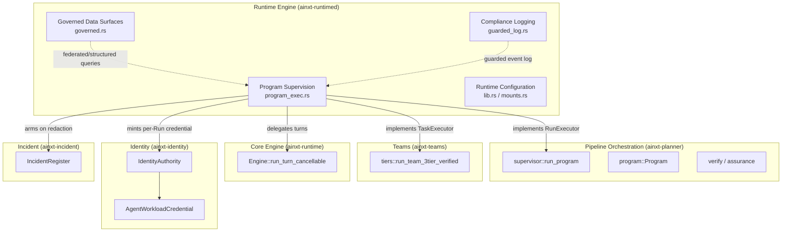
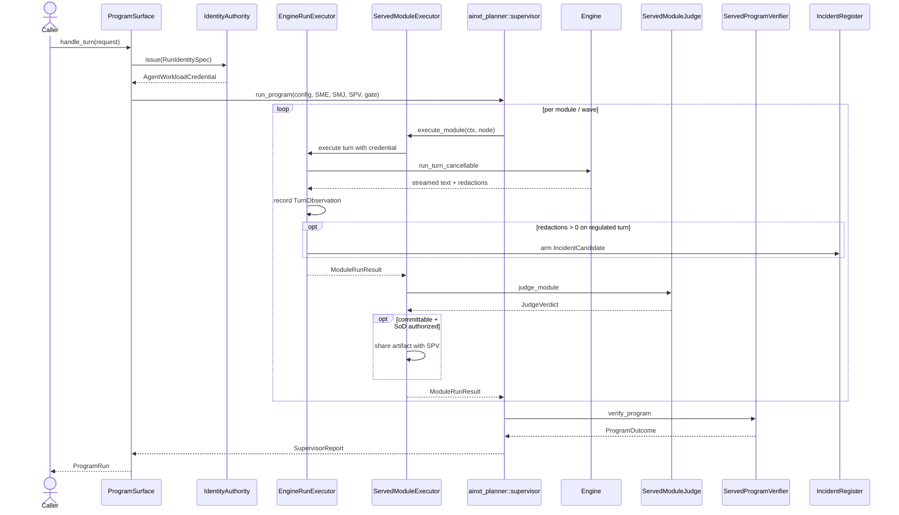
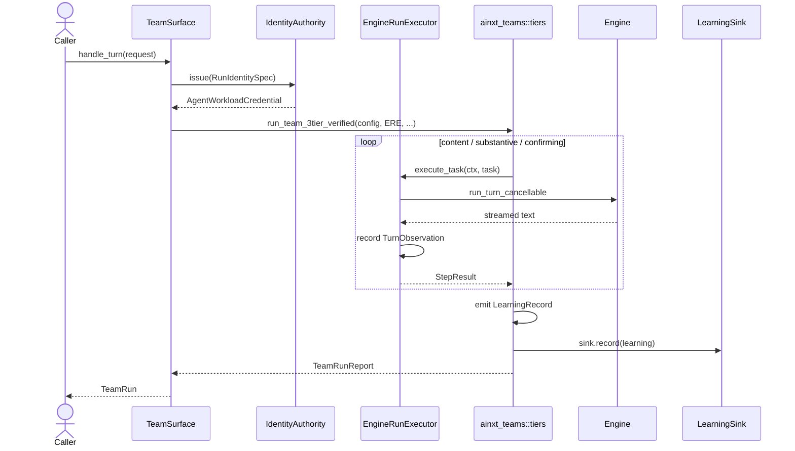
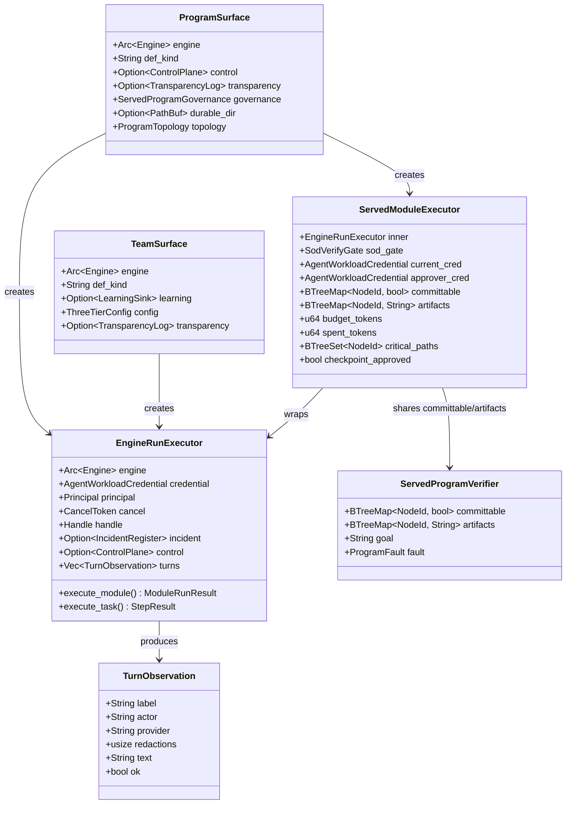
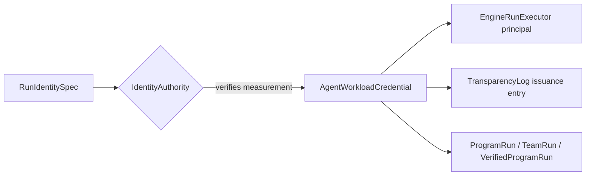
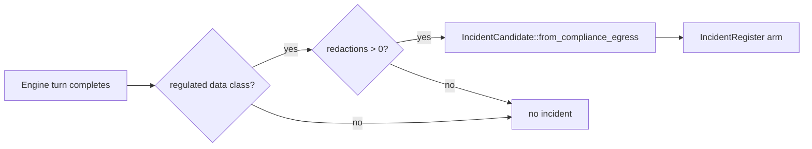
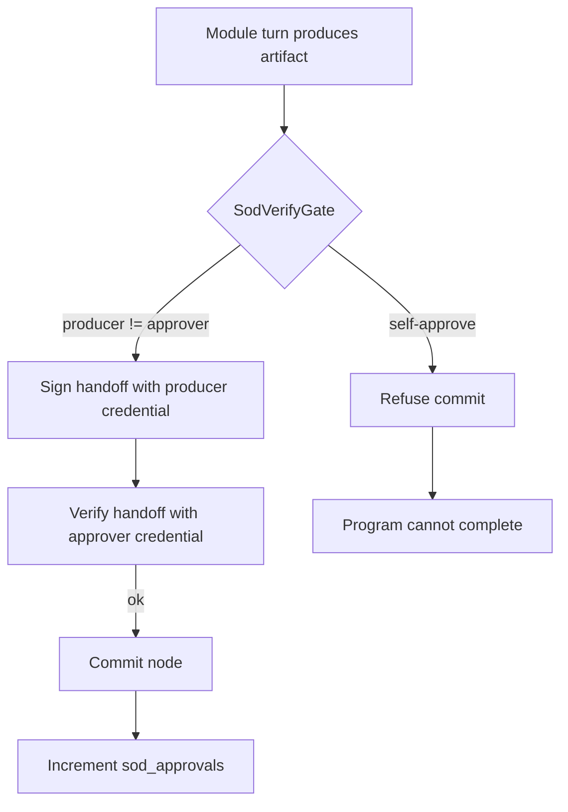
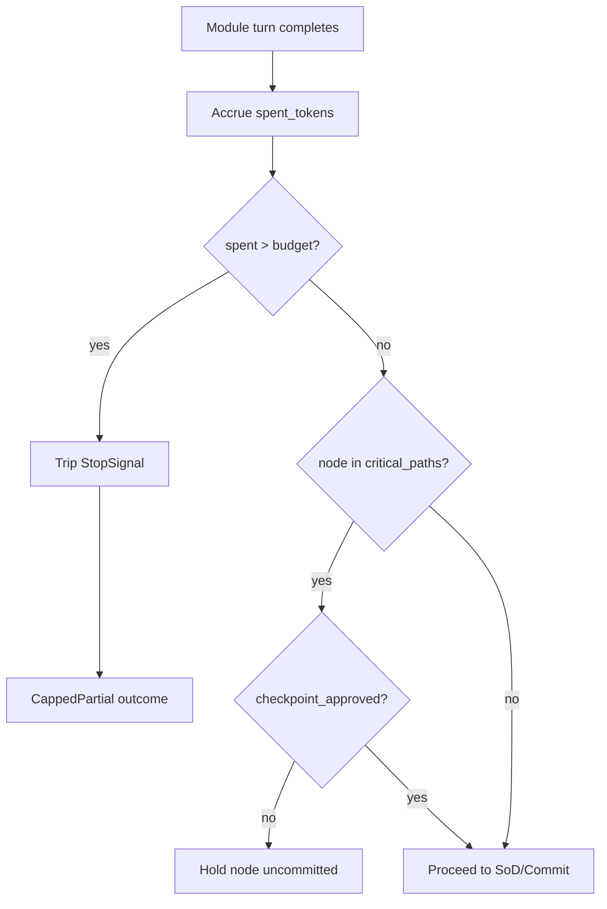

# Program Governance and Execution — Program Supervision

## Brief Introduction

The **Program Supervision** module (`crates/ainxt-runtimed/src/program_exec.rs`) is the composition boundary that makes the long-horizon planning and team-execution subsystems reachable from the live serving runtime. It closes the "built but unreachable" gap between:

* [`ainxt-planner`](pipeline_orchestration.md) — the deterministic Program Supervisor loop that drives a graph of program modules toward a goal.
* [`ainxt-teams`](../governance_compliance/teams.md) — the hierarchical 3-tier team loop that executes tasks through content, substantive, and confirming roles.
* [`ainxt-runtime::Engine`](core_engine.md) — the async turn engine that actually dispatches model calls.

The module provides a single synchronous adapter, [`EngineRunExecutor`](#enginerunexecutor), that implements both the planner's `RunExecutor` seam and the teams' `TaskExecutor` seam by delegating each module or task to a real `Engine::run_turn_cancellable` call. It also mints per-Run workload credentials, arms statutory incident clocks on regulated-content redactions, routes learning records, and supports durable, crash-resumable program execution.

This document focuses on the **supervision** facet of program governance: how programs and teams are executed, verified, budgeted, and audited at runtime. For the governed data-surface and compliance-logging facets, see [program_governance_and_execution_governed_data_surfaces.md](program_governance_and_execution_governed_data_surfaces.md) and [program_governance_and_execution_compliance_logging.md](program_governance_and_execution_compliance_logging.md).

---

## Architecture

### High-level placement

### Core design principles

1. **Sync ↔ async bridge** — The planner and team loops are intentionally synchronous and deterministic for testability. The engine is async. Program Supervision runs the synchronous driver on a dedicated OS thread and uses `Handle::block_on` for each engine turn, avoiding Tokio worker starvation.
2. **One adapter, two seams** — [`EngineRunExecutor`](#enginerunexecutor) implements both `RunExecutor` and `TaskExecutor`, so the same credentialing, observation, and cancellation machinery serves both program modules and team tasks.
3. **Fail-closed governance** — On the served/durable path, critical-path nodes and SoD commits default to unapproved; the runtime never fabricates human approval.
4. **Engine-derived proofs** — Judges and verifiers score real produced artifacts shared from the executor, not fabricated passes.
5. **Observability by design** — Every turn produces a [`TurnObservation`](#turnobservation) carrying the full composite actor label, provider, redactions, and outcome.

---

## Core Components

### `RunIdentitySpec`

The identity inputs required to mint a per-Run [`AgentWorkloadCredential`](../governance_compliance/identity.md). It captures:

* `def_kind`, `def_id`, `def_version` — the git-rooted definition facets of the program or team.
* `run_id` — the ephemeral per-Run identifier, also used as the Program id.
* `data_class` — the sensitivity class the run operates on; drives model eligibility and the FI-02 detector.
* `obo_user_id`, `obo_department`, `obo_ad_level`, `obo_can_approve` — the human on whose behalf the agent acts.
* `measurement` — the attested workload measurement verified by the Agent Identity Authority before issuance.

### `EngineRunExecutor`

The central adapter that bridges the synchronous planner/team drivers to the async `Engine`. It owns:

* A shared `Arc<Engine>`.
* The per-Run `AgentWorkloadCredential` and derived `Principal`.
* A `CancelToken` for cooperative cancellation.
* Optional `IncidentRegister` (FI-02) and `ControlPlane` (§17/§19 kill-switch/revocation) references.
* A vector of [`TurnObservation`](#turnobservation) and a monotonic turn sequence.

For each module or task, it:

1. Consults the control plane kill-switch/revocation before dispatch.
2. Builds the turn request with the per-Run principal as the actor.
3. Runs `Engine::run_turn_cancellable` to completion via `Handle::block_on`.
4. Collects streamed text and records a `TurnObservation`.
5. If `redactions > 0` on a regulated turn, arms an `IncidentCandidate::from_compliance_egress`.
6. Returns a `ModuleRunResult` or `StepResult` to the synchronous driver.

### `ProgramSurface`

The served-protocol entry point for program runs. It holds:

* The shared `Engine`.
* `def_kind` for credential labeling (e.g. `"program"`, `"sdlc"`).
* Optional shared `ControlPlane` and `TransparencyLog`.
* [`ServedProgramGovernance`](#servedprogramgovernance) — budget, checkpoint approval, and fleet fan-out slots.
* Optional `durable_dir` for crash-resumable execution.
* `ProgramTopology` selector for node topology composition.

`ProgramSurface::handle_turn` assembles the program, mints the credential, and dispatches to either the governed in-memory driver or the durable hash-chained JSONL path.

### `ServedProgramGovernance`

Governance knobs for served program runs:

* `budget_tokens` — per-Run token ceiling (0 = unbounded).
* `critical_path_approved` — whether human checkpoint approval has been granted; default `false` on served paths.
* `fleet_slots` — concurrent module fleet slots fed to `ElasticFanoutPolicy`; `None` keeps execution strictly sequential.

### `ServedModuleExecutor`

A wrapper around `EngineRunExecutor` used on the governed served path. It adds:

* SoD authorization via `SodVerifyGate` and separate producer/approver credentials.
* Per-node `committable` and `artifacts` maps shared with `ServedModuleJudge` and `ServedProgramVerifier`.
* Token-budget accrual and `StopSignal` tripping when the ceiling is exceeded.
* Critical-path node holding until `checkpoint_approved` is true.
* Credential renewal tracking (`renewals`, `sod_approvals`).

### `ServedModuleJudge` / `ServedProgramVerifier`

These implement the planner's `ModuleJudge` and `ProgramVerifier` seams for the served path. They score real artifacts shared from `ServedModuleExecutor::artifacts`, ensuring proofs are engine-derived rather than fabricated. `ServedProgramVerifier` also records per-node committability and scores goal relevance through a `RubricJudge`.

### `DurableServedExecutor`

Mirrors `ServedModuleExecutor` for the durable execution path. It shares `committable` and `artifacts` maps with its paired `ServedProgramVerifier` and writes a hash-chained JSONL program event log so a crashed Run can be resumed.

### `ProgramRun` / `TeamRun` / `VerifiedProgramRun`

Outcome structs returned to callers:

* `ProgramRun` — the `SupervisorReport`, credential, all turn observations, and durable program events.
* `TeamRun` — the `TeamRunReport`, credential, and all turn observations.
* `VerifiedProgramRun` — a fully verified program outcome including the proven `Program`, credential, turn observations, JIT renewal count, SoD approval count, and final `ProgramOutcome`.

### `TurnObservation`

The canonical audit record for a single module or task turn:

* `label` — `module:<node>` or `task:<id>`.
* `actor` — the full composite `actor_label` from the per-Run credential (regulator-answerable "who did this?").
* `provider` — the provider that served the turn.
* `redactions` — compliance redactions; the FI-02 signal when > 0 on regulated content.
* `text` — the streamed text collected from the turn.
* `ok` — whether the turn completed without a terminal engine error.

### `TeamSurface`

The served-protocol entry point for 3-tier team runs. It owns:

* The shared `Engine`.
* `def_kind` for credential labeling (e.g. `"team"`).
* An optional `LearningSink` for LOOP-13 learning-record routing.
* `ThreeTierConfig` bounds (self-heal/stuck/round caps + cost ceiling).
* Optional `TransparencyLog` for credential issuance auditing.

### `FlywheelCurationSweep` / `FlywheelSweepResult`

A learning-curation helper that consumes `LearningRecord`s from an `InMemoryLearningSink` and produces:

* `eval_cases` — evaluation cases for role/tuning feedback.
* `template_priors` — per-task prior updates.
* `role_tuning` — per-role tuning recommendations.
* `records_curated` — observability count proving the sweep consumed real records.

### `InMemoryLearningSink`

A simple `Mutex<Vec<LearningRecord>>` sink used for testing and for the default flywheel curation path.

### Verifier / judge helpers

* `PermissiveProgramVerifier` — always approves; used for tests and the durable AutoApprove path.
* `GitRevertingProgramVerifier` — wraps an inner verifier and reverts the working tree on verification failure.
* `ConfirmingGoalJudge` — a goal-judge implementation for the 3-tier confirming tier.
* `ServedProgramApprovalGate` — a served-path approval gate that defaults `critical_path_approved` to `false`.
* `ProgramProofSeams` — fault-injection seam for module judges and program-scale proofs.

### `ProgramRuntime`

A lightweight runtime helper that holds the `Engine` and accumulates report strings.

---

## Data Flow

### Program run (governed served path)

### Team run (3-tier path)

---

## Component Interaction

---

## Process Flows

### Per-Run credential minting (IDN-03)

The credential is minted at a deterministic logical tick (`RUN_MINT_TICK = 1`) because the identity crate never reads a wall clock and a supervised run is a logical unit. The credential's `actor_label` becomes the §14 actor of record for every turn.

### FI-02 statutory incident arming

The detector is fail-safe: it arms early when regulated content is redacted, before downstream processing can mask the event.

### Separation-of-Duties commit flow

A self-approving misconfiguration refuses every commit, keeping `sod_approvals` at 0 and preventing program completion.

### Budget and checkpoint enforcement

---

## How It Fits into the Overall System

Program Supervision sits at the **runtime composition root** inside `ainxt-runtimed`. It is the bridge that turns the independently tested planner and team crates into live, served capabilities:

* **Upstream**: it is invoked by [`ainxt-server`](server_serving_core.md) HTTP handlers and by the [`ainxt-runtime::Engine`](core_engine.md) assembly in `lib.rs`.
* **Downstream**: it drives [`ainxt-planner`](pipeline_orchestration.md), [`ainxt-teams`](../governance_compliance/teams.md), and the [`Engine`](core_engine.md).
* **Sideways**: it integrates with [`ainxt-identity`](../governance_compliance/identity.md) for credentials, [`ainxt-incident`](../governance_compliance/incident.md) for statutory clocks, [`ainxt-eventlog`](program_governance_and_execution_compliance_logging.md) for durable hash-chained logs, and [`ainxt-teams::flywheel`](../governance_compliance/teams.md) for learning curation.

The module is intentionally split into three sibling facets under `program_governance_and_execution`:

| Facet | File | Concern |
|-------|------|---------|
| Program Supervision | `program_exec.rs` | Execute, verify, budget, and audit programs/teams. |
| Governed Data Surfaces | `governed.rs` | Federated, structured, and fabric query surfaces. |
| Compliance Logging | `guarded_log.rs` | Guarded, tamper-evident event logs. |

For the broader planning and verification concepts, see [pipeline_orchestration.md](pipeline_orchestration.md). For team execution semantics, see [teams.md](../governance_compliance/teams.md). For identity and workload attestation, see [identity.md](../governance_compliance/identity.md).
