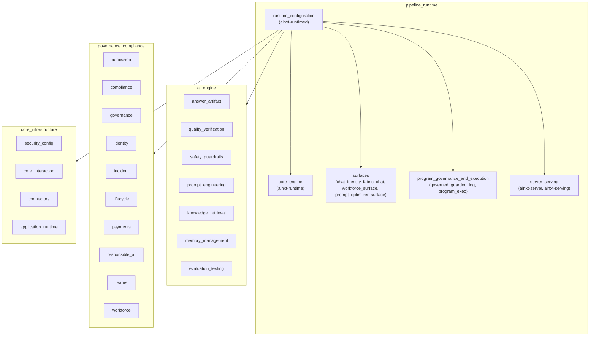
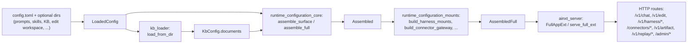

# Runtime Configuration Module

## Purpose

The `runtime_configuration` module is the **composition root** of the served AiNxt daemon. It declares every deployment-tunable setting, loads the knowledge base, assembles the long-lived runtime organs (engine, session manager, serving gate, governance surfaces, audit/event logs), and mounts the governed surfaces that `ainxt_server` exposes over HTTP.

In other words, this module turns static `config.toml` (plus optional file trees for prompts, skills, KB documents, etc.) into a live, shareable `AssembledFull` object that the transport layer can serve. It is intentionally the **single place** where cross-cutting concerns such as:

* shared exactly-once capability ledgers,
* shared answer caches and memory backends,
* shared connector token vaults and key rings,
* shared incident registers, control planes, and transparency logs,
* shared serving gates, placement actuators, and rollout surfaces,

are instantiated once and then threaded into every consumer, eliminating the "second disjoint instance" bugs that the codebase repeatedly calls out (e.g. R16, GAP-FIX memory, GAP-FIX connectors, GAP-FIX regulated-fi-responsible-lifecycle).

## Where It Sits

`runtime_configuration` depends on nearly every other module in the system but is depended on primarily by the top-level `server_serving` module (which receives an `AssembledFull` / `FullAppExt` from here) and by the binary entry point that calls `assemble_full`.

## High-Level Responsibilities

1. **Declarative configuration loading** — implemented in [`runtime_configuration_core`](runtime_configuration_core.md).
   * `ServerConfig`, `SessionSettings`, `KbConfig`, `ServingConfig`, `LoadedConfig`, etc.
   * Optional file-backed overrides: `prompt_dir`, `skill_dir`, `edit_workspace_dir`, `edit_journal_dir`, `chat_sessions_dir`, `eval_durable_dir`, `lsp_rust_analyzer_path`.

2. **Knowledge-base seeding** — implemented in [`runtime_configuration_kb_loader`](runtime_configuration_kb_loader.md).
   * `KbDocument` and `KbConfig` define the static corpus.
   * `kb_loader` populates documents from `.jsonl`, `.md`, and `.txt` files on disk, merging them with inline config entries.

3. **Runtime assembly** — implemented in [`runtime_configuration_core`](runtime_configuration_core.md).
   * `Assembled` captures the surface-specific engine/session manager plus shared handles (answer cache, memory backend, outsourcing register, MCP admin, skill runtime, serving gate, etc.).
   * `AssembledFull` is the daemon-wide singleton: event log, graph, ledger schema, serving gate, incident register, control plane, transparency log, connector surfaces, harness mounts, replay store, erasure organ, retention store, quality breaker, vault, feedback engine, and so on.

4. **Shipped-surface mounting** — implemented in [`runtime_configuration_mounts`](runtime_configuration_mounts.md).
   * `mounts` builds every governed surface the transport can serve: harness invoke/run, connector OAuth/use path, artifact generation, replay step/re-execution, DSAR erasure, record store, and the SR-11-7 quality circuit breaker.

## Sub-Modules

| Sub-module | File(s) | Responsibility | Documentation |
|---|---|---|---|
| `runtime_configuration_core` | `crates/ainxt-runtimed/src/lib.rs` | Configuration structs, assembly logic, `Assembled`/`AssembledFull`, shared-organ threading. | [runtime_configuration_core.md](runtime_configuration_core.md) |
| `runtime_configuration_kb_loader` | `crates/ainxt-runtimed/src/kb_loader.rs` | File-system loader for the live knowledge base. | [runtime_configuration_kb_loader.md](runtime_configuration_kb_loader.md) |
| `runtime_configuration_mounts` | `crates/ainxt-runtimed/src/mounts.rs` | Builders that mount harness, connector, artifact, replay, erasure, retention, and quality-breaker surfaces. | [runtime_configuration_mounts.md](runtime_configuration_mounts.md) |

## Data Flow: From Config to Served Surface

## Key Cross-Cutting Guarantees

* **Single-instance sharing**: every shared organ (capability ledger, answer cache, memory backend, connector key ring, outsourcing register, MCP registry, serving gate, etc.) is created once in `Assembled`/`AssembledFull` and handed to all consumers. This prevents double-execution, vacuous erasure, and stale-register bugs.
* **Fail-closed defaults**: unconfigured optional surfaces mount but refuse real work (e.g. `OfflineTransport`, empty connector registry, in-memory default stores). A deployment enables them by providing config + real backends, not by code changes.
* **Audit and tamper-evidence**: the daemon event log is opened through `open_guarded_event_log`, which wraps `JsonlEventLog` with `GuardedEventLog` and a governed chain hasher so cardholder data is redacted before durable write.
* **Governance lifecycle integration**: harness registration goes through `register_governed_harness`, which only admits definitions that have reached `GovernanceState::Production`.

## Related Module Documentation

* [core_engine.md](core_engine.md) — the underlying `Engine`, `TurnHandler`, and dispatch primitives that `runtime_configuration` assembles surfaces over.
* [surfaces.md](surfaces.md) — chat, workforce, and prompt-optimizer surface builders consumed by `runtime_configuration`.
* [program_governance_and_execution.md](program_governance_and_execution.md) — program/team execution and governance wiring.
* [server_serving.md](server_serving.md) — the HTTP transport and serving infrastructure that receives `AssembledFull`.
* [knowledge_retrieval.md](../ai_engine/knowledge_retrieval.md) — the retrieval and context-fabric modules fed by `KbConfig`.
* [memory_management.md](../ai_engine/memory_management.md) — the durable memory store whose backend is threaded through `Assembled`.
* [connectors.md](../core_infrastructure/connectors.md) — connector runtime and OAuth gateway mounted by `runtime_configuration_mounts`.
* [governance_compliance.md](../governance_compliance/governance_compliance.md) — admission, identity, incident, lifecycle, and responsible-AI organs wired into `AssembledFull`.
