# runtime_configuration_core

## 1. Introduction

`runtime_configuration_core` is the **daemon composition root** of the AiNxt runtime. It lives in `crates/ainxt-runtimed/src/lib.rs` and is responsible for turning a static TOML deployment configuration into a fully wired, live object graph that the HTTP server can mount.

Its primary jobs are:

1. **Define the configuration schema** that operators edit (`LoadedConfig`, `ServerConfig`, `ServingConfig`, `KbConfig`, etc.).
2. **Assemble a surface-specific engine** (`Assembled`) that combines a `ChatSurface`/engine, model router, capability registry, memory backend, and serving attestor.
3. **Promote that surface into a daemon-wide composition** (`AssembledFull`) that adds the event log, serving gate, incident register, control plane, connectors, DSAR/erasure organs, quality circuit-breaker, regression vault, and every other cross-cutting subsystem.
4. **Guarantee shared-instance correctness**: the same `Arc`/`Mutex` handles used by the engine are also handed to admin routes and background sweeps, so a reload, erasure, or outsourcing registration affects the live runtime immediately.

This module does not implement the underlying algorithms (routing, retrieval, memory, serving, etc.). It is the **wiring layer** that selects, configures, and connects them. For the internals of those subsystems, follow the references in [§9 References](#9-references).

---

## 2. Position in the System

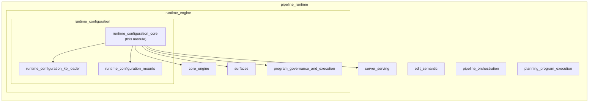

`runtime_configuration_core` sits between:

- **Upstream config loading** — [`security_config`](../core_infrastructure/security_config.md) (`ainxt-config::Loader`) parses `config.toml` into [`RuntimeConfig`](../core_infrastructure/security_config.md).
- **Downstream engine execution** — [`core_engine`](core_engine.md) (`ainxt-runtime::Engine`) runs turns.
- **Downstream surfaces** — [`surface_conversation`](../core_infrastructure/surface_conversation.md) / `chat_identity` / `workforce_surface` provide profiled chat, identity-governed chat, and workforce studio surfaces.
- **Downstream server & serving** — [`server_serving_core`](server_serving_core.md) mounts routes; [`serving_infrastructure`](serving_infrastructure.md) provides the GPU/node pool machinery.
- **Cross-cutting subsystems** — [`memory_management`](../ai_engine/memory_management.md), [`knowledge_retrieval`](../ai_engine/knowledge_retrieval.md), [`governance_compliance`](../governance_compliance/governance_compliance.md), and [`ai_engine`](../ai_engine/ai_engine.md).

---

## 3. Core Responsibilities

### 3.1 Configuration schema

The module owns the top-level daemon configuration structs. These are deserialized from TOML with `serde`, use `#[serde(default)]` heavily, and are designed to be **fail-closed**: omitting a section keeps the air-gapped default behavior, while enabling a feature requires explicit, validated input.

Key config types:

| Type | Purpose |
|------|---------|
| `LoadedConfig` | Top-level container: `runtime`, `server`, `session`, `kb`, `serving`, `surfaces`, `harness`, `mcp`, `payments`. |
| `ServerConfig` | HTTP bind address, event-log directory, authenticator (`trusted-gateway` or `jwt-sso`), durable directories for edit workspace/journal, prompt/skill trees, eval durable store, LSP path. |
| `SessionSettings` | Session capacity, inbox size, idle/TTL, turn timeout. |
| `KbConfig` / `KbDocument` | Static knowledge-base documents, RAG toggle, RLS department isolation, per-row ACL attributes. |
| `ServingConfig` | Node pool, QoS fairness/preemption, WFQ, attestation, autoscale, disaggregated prefill/decode, placement, rollout, health. |
| `HarnessConfig` | Pre-registered custom renderer ids for the harness `/run` bridge. |
| `McpConfig` / `McpServerConfigEntry` | MCP servers to spawn at boot. |
| `PaymentsConfig` | Dual-council governed settlement policy override. |
| `SurfacesConfig` | Per-surface deployment layer overrides. |

### 3.2 Surface assembly (`Assembled`)

`Assembled` is the **per-surface** output. It captures every shared handle that must survive being erased behind `Arc<dyn TurnHandler>`:

- `SessionManager` — the concurrency/backpressure spine for `/v1/chat`.
- `capability_tools` — the unified `ToolRuntime` + exactly-once ledger.
- `memory_backend` — the engine's durable memory reader/writer pair.
- `shared_answer_cache` — the live answer cache used by `ChatSurface`.
- `outsourcing_register` — the FI-03 outsourcing register handle from the router.
- `mandate_registry` — the payment-adjacent mandate ledger.
- `mcp_admin` — the MCP registry + pin-store handle.
- `skill_runtime` — the hot-reloadable skill registry.
- `serving` — the `ServingHandle` attached to the engine via `Engine::with_node_attestor`.
- `workforce_surface` / `workforce_kernel` / `workforce_invocation_ledger` — workforce-specific live handles.

`assemble_surface` builds a profile-enforced surface: it applies `[surfaces.<id>]` overrides, selects the retrieval scope, builds the corpus, enforces `SurfaceScopedAuthorizer`, and calls `build_chat_surface_wired_authz`.

### 3.3 Daemon-wide composition (`AssembledFull`)

`AssembledFull` is the **daemon-level** object graph. It takes an `Assembled` surface and adds all the cross-cutting organs that the HTTP server mounts:

- `event_log` — tamper-evident hash-chained audit log.
- `serving` / `disagg` — the Stage-1 serving gate and optional disaggregated pools.
- `incidents` — statutory incident register.
- `control_plane` — kill-switch / revocation plane.
- `transparency` — chat-run credential transparency log.
- `connectors` / `connector_invoker` / `connector_key_ring` — OAuth gateway, USE-path invoker, and rotatable token encryption ring.
- `harness` — harness invoke/run surfaces.
- `artifact` — document-generation runtime.
- `replay_store` / `reexec_executor` — durable session store and replay re-execution.
- `erasure` — tiered cache erasure for DSAR.
- `quality_breaker` / `vault` / `vault_store` — SR-11-7 circuit breaker and regression vault.
- `retention` / `retention_sweeper` / `dsar` / `breakglass` — data lifecycle controls.
- `feedback_engine` / `eval_staging` — continuous-learning flywheel.
- `telemetry` / `behavior_history` — per-turn observability and UEBA history.
- `auth` / `edit` / `approval_coordinator` — transport authenticator, edit pipeline, and wire-level approval gate.
- `kb_*` fields — KB corpus snapshot, index state, recall monitor, and RLS corpus.

### 3.4 Shared-handle correctness

A recurring theme in the code comments is **"the SAME instance"**. Many historical bugs were caused by the admin path constructing a second copy of a registry/store/cache. `runtime_configuration_core` fixes this by capturing handles at assembly time and threading them into both the engine path and the server path.

Examples:

- The answer cache used by `ChatSurface` is the same one purged by DSAR erasure.
- The `ToolRuntime` used by the engine is the same one used by the harness `/run` bridge.
- The outsourcing register used by the router is the same one mutated by `POST /admin/outsourcing/register`.
- The MCP registry/pin store used at boot is the same one acted on by `POST /admin/mcp/approve`.
- The memory backend used by `read_for_turn` is the same one written by `POST /memory/remember`.

### 3.5 Background cadences

`AssembledFull` exposes tick methods that `main.rs` drives on async timers:

- `run_attestation_refresh_tick`
- `run_health_sweep_tick`
- `run_autoscale_tick`
- `run_autoscale_and_placement_tick`
- `run_batch_step_tick`
- `run_retention_sweep_tick`
- `run_feedback_flywheel_tick`
- `run_kb_maintenance_tick`
- `spawn_breach_clock`
- `spawn_supervisory_cadence`
- `spawn_reconciler_sweep`

These are all **opt-in** via config sections; missing config leaves the corresponding organ as `None` and the timer as a no-op.

---

## 4. Key Components

### 4.1 Configuration types

#### `LoadedConfig`

```rust
pub struct LoadedConfig {
    pub runtime: RuntimeConfig,
    pub server: ServerConfig,
    pub session: SessionConfig,
    pub kb: KbConfig,
    pub serving: ServingConfig,
    pub surfaces: SurfacesConfig,
    pub harness: HarnessConfig,
    pub mcp: McpConfig,
    pub payments: PaymentsConfig,
}
```

The root object produced by the config loader and consumed by the assembly functions.

#### `ServerConfig`

Controls how the daemon binds, authenticates, and persists state:

- `host` / `port`
- `event_log_dir` — durable hash-chained event log.
- `authenticator` / `jwt_hs256_secret` — route authentication mode.
- `edit_workspace_dir` / `edit_journal_dir` — durable edit workspace and sealed journal.
- `prompt_dir` / `skill_dir` — git-native prompt/skill trees.
- `chat_sessions_dir` — durable conversation history.
- `eval_durable_dir` — durable regression vault backing.
- `lsp_rust_analyzer_path` — optional LSP driver for semantic edits.

#### `KbConfig` / `KbDocument`

`KbDocument` carries the document text, source label, `DataClass`, retrieval scope, namespace/repo, department ACL, seniority level, allow/deny groups, and row-level security attributes. `KbConfig` wraps the document list plus the `rls_department_isolation` and `rag_enabled` toggles.

#### `ServingConfig`

The most complex config section. It declares:

- `nodes: Vec<ServingNodeConfig>` — advertised serving nodes with optional `golden_hash`.
- QoS: `qos_queue_depth`, `fairness_capacity`, `fairness_min_share`, `scheduler_capacity`.
- `wfq: Option<ServingWfqConfig>` — weighted fair queuing.
- Attestation: `attestation_refresh_interval`, `attestation_refresh_lead`, `attestation_manifest`.
- `health: ServingHealthConfig` — shard-group health monitor defaults.
- `autoscale: Option<ServingAutoscaleConfig>` — demand-EWMA autoscale.
- `chunked_prefill: Option<u32>` — chunked-prefill interleaving.
- `disagg: Option<ServingDisaggConfig>` — disaggregated prefill/decode pools.
- `placement: Option<ServingPlacementConfig>` — GPU bin-packing actuator.
- `rollout: Option<ServingRolloutConfig>` — signed weight-rollout surface.

### 4.2 Assembly types

#### `Assembled`

The surface-level assembly result. Every field is a captured shared handle so that `assemble_full` can thread the same instances into the daemon-wide composition and the HTTP transport.

#### `AssembledFull`

The daemon-wide composition result. It is the single object passed to `ainxt_server::FullAppExt` via `to_full_app_ext` (implemented in this module). It contains roughly 60 fields, each documented with the gap/fix it closes.

#### `ProfiledSurface`

Wraps a `SurfaceCatalog`, a hot-reloadable `SkillRuntime`, guard prompts, and an inner `TurnHandler`. It is what `SessionManager` actually drives for profile-enforced surfaces.

### 4.3 Compliance & data-lifecycle helpers

| Component | Role |
|-----------|------|
| `open_guarded_event_log` | Opens a `JsonlEventLog` wrapped in `GuardedEventLog` with a `GovernedChainHasher` (crypto-agile SHA-256 by default) and a strong redactor. |
| `StrongMemoryRedactor` | CHD redactor applied before durable memory writes. |
| `DurableMemoryReader` | Long-lived durable memory store reader used by the Context-Fabric `read_for_turn` path. |
| `MemoryHandle` | Pair of `MemorySqlBackend` + `MemoryWriter`; the same instance is read and written by the engine and served routes. |
| `StoreServedTurnRecorder` | Records served turns into the durable `SessionStore` with retention-store integration. |
| `BehaviorFeedingTelemetry` | Telemetry sink that also feeds per-actor `ActivitySample`s into the UEBA behavior history. |
| `EvalStagingSink` | Stages flywheel-produced `EvalCase` candidates into the eval staging set. |

### 4.4 Serving-ops helpers

| Component | Role |
|-----------|------|
| `PlacementActuator` | GPU bin-packing actuator: `BinPool` + model catalog + `InMemoryPlacementBinder` + rate-limited reconciler. |
| `RolloutSurface` | Signed weight-rollout surface: verifier, weight loader, thresholds, and per-model `WeightRollout`s. |

---

## 5. Architecture

### 5.1 High-level data flow

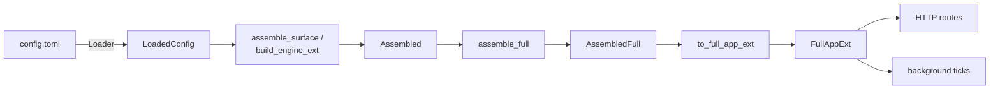

### 5.2 Configuration hierarchy

```mermaid
flowchart TD
    LoadedConfig --> runtime["runtime: RuntimeConfig"]
    LoadedConfig --> server["server: ServerConfig"]
    LoadedConfig --> session["session: SessionConfig"]
    LoadedConfig --> kb["kb: KbConfig"]
    LoadedConfig --> serving["serving: ServingConfig"]
    LoadedConfig --> surfaces["surfaces: SurfacesConfig"]
    LoadedConfig --> harness["harness: HarnessConfig"]
    LoadedConfig --> mcp["mcp: McpConfig"]
    LoadedConfig --> payments["payments: PaymentsConfig"]

    ServerConfig --> event_log_dir
    ServerConfig --> authenticator
    ServerConfig --> edit_workspace_dir
    ServerConfig --> edit_journal_dir
    ServerConfig --> prompt_dir
    ServerConfig --> skill_dir
    ServerConfig --> chat_sessions_dir
    ServerConfig --> eval_durable_dir
    ServerConfig --> lsp_rust_analyzer_path

    ServingConfig --> nodes["nodes: ServingNodeConfig"]
    ServingConfig --> qos["qos / fairness / scheduler"]
    ServingConfig --> wfq["wfq: ServingWfqConfig"]
    ServingConfig --> attestation["attestation manifest / refresh"]
    ServingConfig --> health["health: ServingHealthConfig"]
    ServingConfig --> autoscale["autoscale: ServingAutoscaleConfig"]
    ServingConfig --> chunked_prefill
    ServingConfig --> disagg["disagg: ServingDisaggConfig"]
    ServingConfig --> placement["placement: ServingPlacementConfig"]
    ServingConfig --> rollout["rollout: ServingRolloutConfig"]

    KbConfig --> documents["documents: KbDocument"]
    KbConfig --> rls_department_isolation
    KbConfig --> rag_enabled
```

### 5.3 Assembly layers

```mermaid
flowchart TB
    subgraph surface["Surface layer: Assembled"]
        SM["SessionManager"]
        CL["ChatSurface / Engine"]
        RT["ToolRuntime + ledger"]
        MB["Memory backend"]
        SAC["Shared answer cache"]
        OR["Outsourcing register"]
        MR["Mandate registry"]
        MA["MCP admin handle"]
        SR["Skill runtime"]
        SH["Serving handle"]
    end

    subgraph daemon["Daemon layer: AssembledFull"]
        EL["Event log"]
        SG["Serving gate + nodes"]
        DIS["Disaggregated pools"]
        INC["Incident register"]
        CP["Control plane"]
        CONN["Connectors / invoker"]
        HARN["Harness mounts"]
        ART["Artifact runtime"]
        REP["Replay store"]
        ERA["Erasure organ"]
        QB["Quality breaker"]
        VAULT["Regression vault"]
        RET["Retention / DSAR"]
        FB["Feedback engine"]
        TEL["Telemetry"]
        AUTH["Authenticator"]
        EDIT["Edit engine"]
    end

    SM --> EL
    CL --> SG
    RT --> HARN
    MB --> RET
    SAC --> ERA
    OR --> CONN
    MR --> CONN
    MA --> CONN
    SR --> AUTH
    SH --> SG
```

### 5.4 Shared-handle pattern

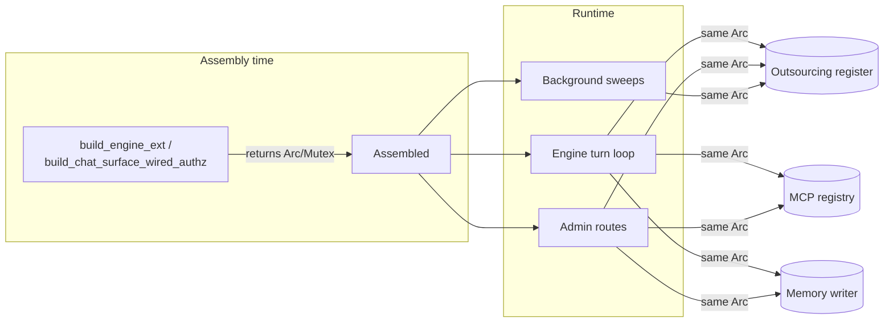

### 5.5 Serving-ops subsystem

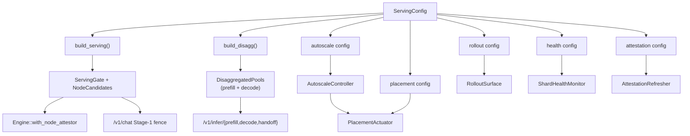

### 5.6 Compliance & data-lifecycle subsystem

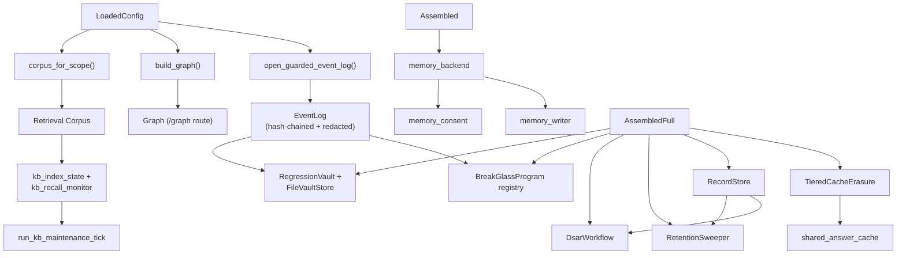

---

## 6. Process Flows

### 6.1 Daemon boot

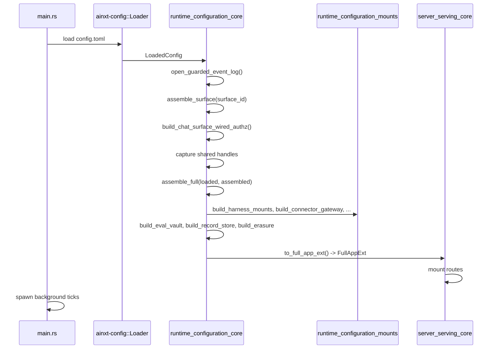

Steps:

1. `Loader` deserializes `config.toml` into `LoadedConfig`.
2. `open_guarded_event_log` creates the tamper-evident, redacted audit log.
3. `assemble_surface` builds the profile-enforced chat surface (or `build_engine_ext` for bare/program/team).
4. Shared handles (`ToolRuntime`, memory, outsourcing register, MCP admin, skill runtime, serving handle) are captured before the surface is erased behind `Arc<dyn TurnHandler>`.
5. `assemble_full` constructs `AssembledFull`, adding all daemon-wide organs.
6. `to_full_app_ext` converts `AssembledFull` into `FullAppExt`, which `ainxt-server` mounts as HTTP routes.
7. `main.rs` starts async timers for every configured background cadence.

### 6.2 Served chat turn

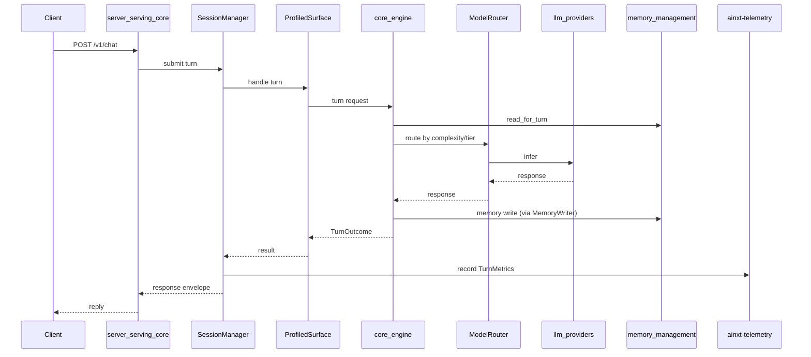

### 6.3 Admin skill/prompt reload

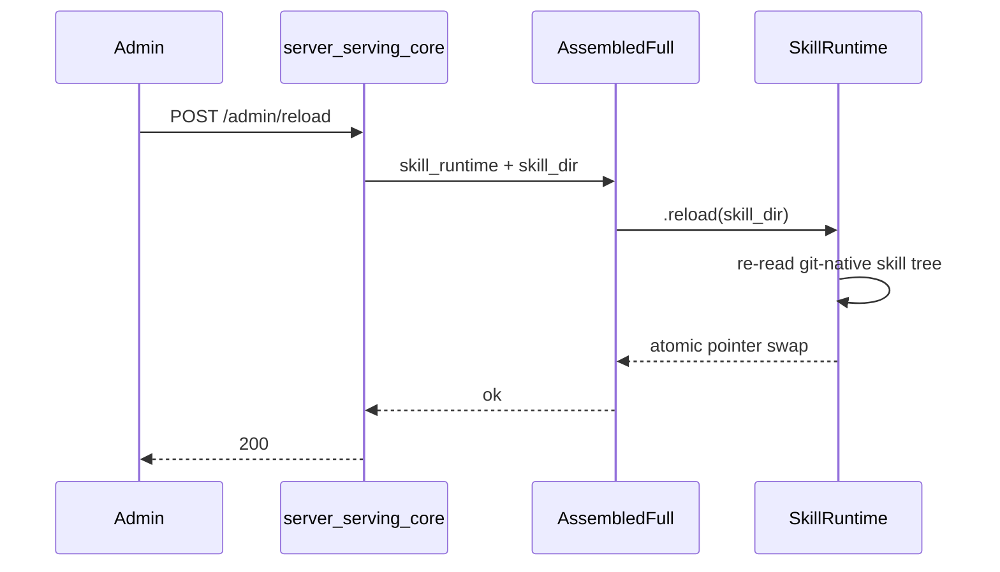

The same `Arc<SkillRuntime>` captured in `Assembled` is stored in `AssembledFull::skill_runtime`, so the reload affects every subsequent turn.

### 6.4 Quality circuit-breaker trip → vault + incident

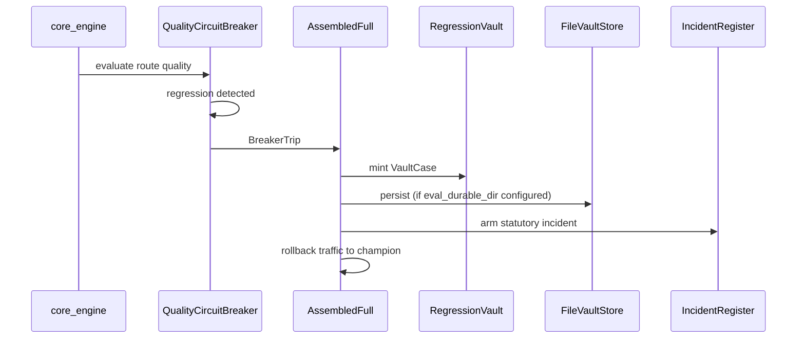

### 6.5 DSAR / right-to-erasure

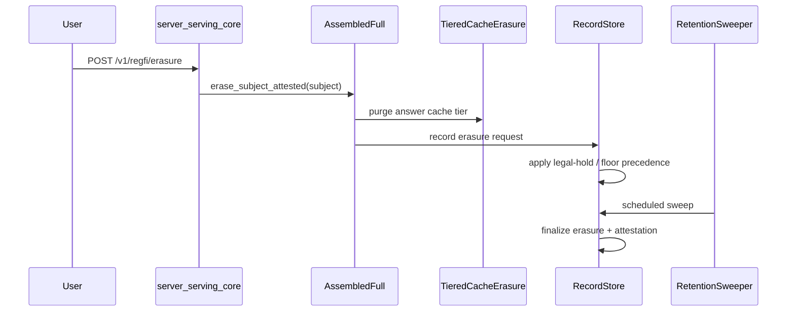

---

## 7. Security, Fail-Closed Defaults, and Compliance

- **Authentication**: `ServerConfig::authenticator` defaults to owner-deferred `trusted-gateway`; selecting `jwt-sso` requires a non-empty `jwt_hs256_secret` or assembly fails.
- **Event log**: `open_guarded_event_log` always redacts records through `StrongRedactor` before durable write; the hash-chain algorithm is resolved via the crypto-agility policy.
- **Router outsourcing gate**: `build_router` installs the FI-03 outsourcing register as a **non-overridable, fail-closed** eligibility input. Cloud providers are treated as external unless explicitly exempted; the air-gapped `offline` provider remains exempt.
- **Quality guard**: `build_router` also installs the SR-11-7 quality guard as a non-overridable eligibility step.
- **Memory**: The served memory consent/export/erasure route opens over the same durable backend the engine reads from; `memory_writer` is the same long-lived instance.
- **Serving**: Attestation, health monitoring, autoscale, placement, and rollout are all opt-in. Missing config leaves the mechanism off rather than fabricating defaults.
- **Edit pipeline**: The default `EditEngine` uses `IdentityCoder` (no model), deterministic AST verification, architecture review, regression detection, and performance analysis. Model/infra seams are intentionally left unwired on the air-gapped default.

---

## 8. Extension Points

Adding a new cross-cutting concern to the daemon generally follows this pattern:

1. **Add config** — extend `LoadedConfig` or an existing sub-config with an `Option<NewConfig>` section.
2. **Build the organ** — add a `build_new_organ()` helper (often in `runtime_configuration_mounts` if it is large).
3. **Capture shared handles in `Assembled`** — if the engine or surface needs to share state with admin routes, return the handle from the surface builder.
4. **Add a field to `AssembledFull`** — store the `Arc`/`Mutex` so the server and background ticks can reach it.
5. **Wire the server route** — update `to_full_app_ext` to populate the corresponding `FullAppExt` field.
6. **Add a tick method** — if the organ needs periodic driving, add `run_new_organ_tick` and start it in `main.rs`.

---

## 9. References

- **Configuration loading & base types**: [security_config](../core_infrastructure/security_config.md)
- **Core turn engine**: [core_engine](core_engine.md)
- **Profiled chat surfaces**: [surface_conversation](../core_infrastructure/surface_conversation.md)
- **Identity-governed chat**: chat_identity
- **Workforce studio surface**: workforce_surface
- **Prompt optimizer surface**: prompt_optimizer_surface
- **Program/team execution**: [program_governance_and_execution](program_governance_and_execution.md)
- **KB loading helpers**: [runtime_configuration_kb_loader](runtime_configuration_kb_loader.md)
- **Mount/build helpers**: [runtime_configuration_mounts](runtime_configuration_mounts.md)
- **HTTP server & routes**: [server_serving_core](server_serving_core.md)
- **Serving infrastructure (GPU pools, attestation, QoS)**: [serving_infrastructure](serving_infrastructure.md)
- **Memory management**: [memory_management](../ai_engine/memory_management.md)
- **Knowledge retrieval & RAG**: [knowledge_retrieval](../ai_engine/knowledge_retrieval.md)
- **AI engine (prompts, guardrails, providers, judges)**: [ai_engine](../ai_engine/ai_engine.md)
- **Governance & compliance (incident, lifecycle, payments, identity)**: [governance_compliance](../governance_compliance/governance_compliance.md)
- **Connectors & MCP**: [connectors](../core_infrastructure/connectors.md)
- **Semantic editing & code-review pipeline**: [edit_semantic](edit_semantic.md), [pipeline_orchestration](pipeline_orchestration.md)
