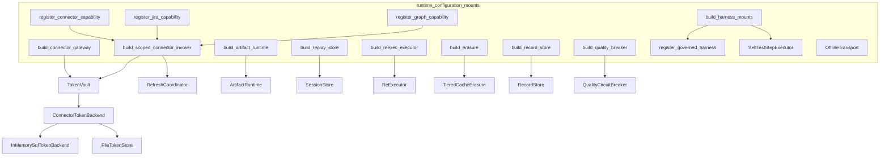
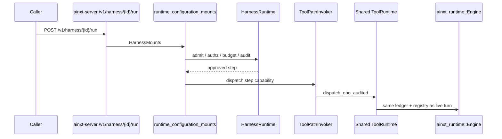
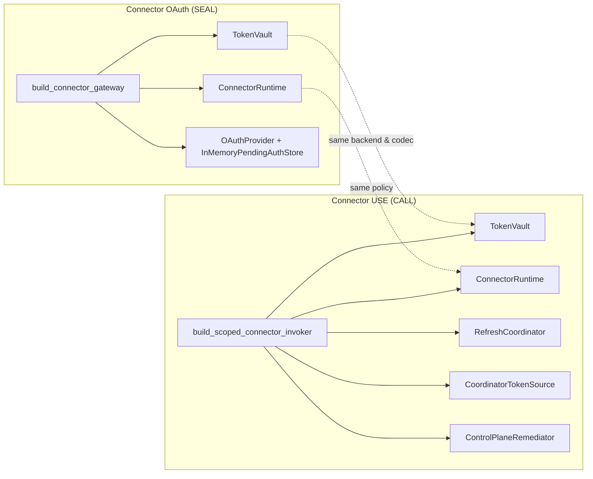
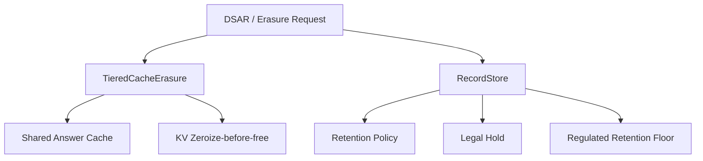
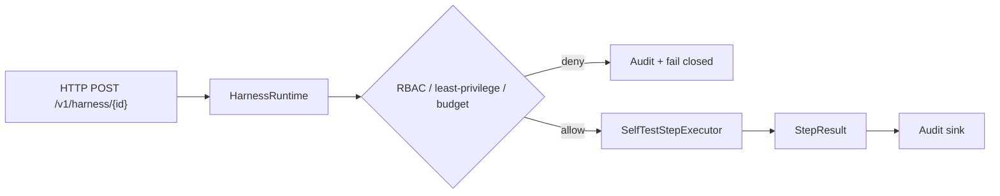
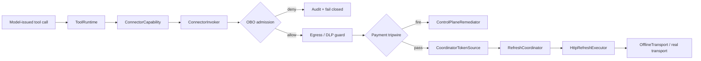
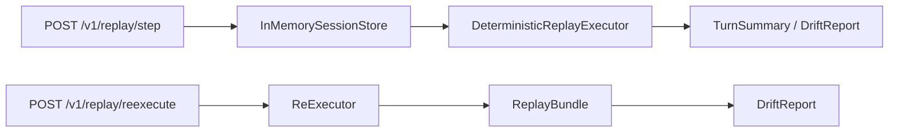
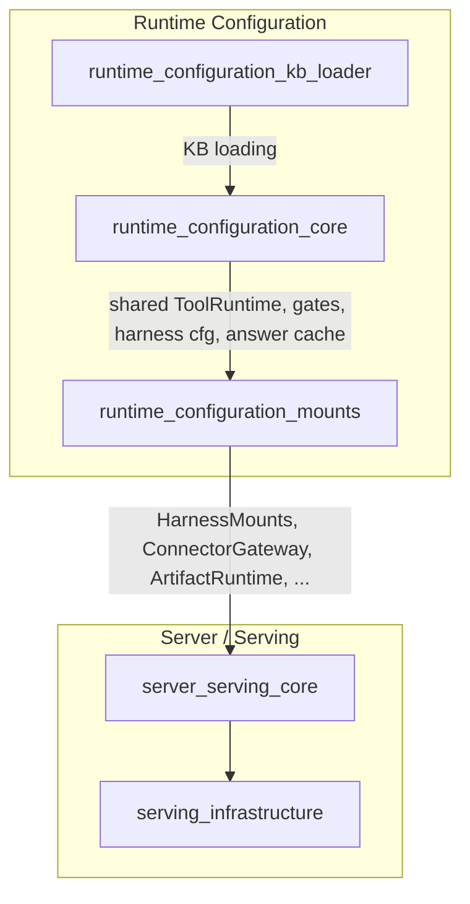

# runtime_configuration_mounts

The `runtime_configuration_mounts` module is the **composition root** inside `ainxt-runtimed` that mounts every additional governed surface the `ainxt-server` transport can serve beyond the core engine/chat path. While [`runtime_configuration_core`](runtime_configuration_core.md) assembles the engine, chat surfaces, and shared registries, this module supplies the real, offline-safe backings for harness invocation, connector OAuth, artifact generation, replay, erasure, data lifecycle, and the SR-11-7 quality circuit breaker.

It lives in `crates/ainxt-runtimed/src/mounts.rs` and is invoked by the top-level `assemble_full` / `assemble_full_with_control_plane` composition functions in `ainxt-runtimed`.

---

## Purpose and Core Functionality

Before this module was introduced, the daemon populated only `manager/auth/event_log/serving/graph/ledger_schema` and left `harness = None`, serving through `serve_full` (never `serve_full_ext`). As a result, routes such as `/v1/harness/*`, `/connectors/*`, `/v1/artifact`, and `/v1/replay/step` were reachable only from `ainxt-server`'s own tests. This module closes that gap by:

1. **Mounting harness invoke/run surfaces** (`/v1/harness/{id}` and `/v1/harness/{id}/run`) with a real `HarnessRuntime`, a built-in `diag.selftest` harness, and a unified capability registry shared with the served engine.
2. **Mounting connector OAuth and USE paths** (`/connectors/*`) with an encrypted `TokenVault`, a fail-closed `OfflineTransport` for air-gapped defaults, and real dispatchable connector capabilities (`gitlab.get_project`, `jira.get_issue`, `graph.send_mail`, etc.).
3. **Mounting artifact generation** (`/v1/artifact`) with built-in renderers and a content scanner.
4. **Mounting replay surfaces** (`/v1/replay/step`, `/v1/replay/reexecute`, `/v1/replay/drift`) over a durable `SessionStore`.
5. **Mounting data-lifecycle organs** (`TieredCacheErasure` and `RecordStore`) for DSAR / right-to-erasure and statutory retention.
6. **Mounting the SR-11-7 quality circuit breaker** so a regulated model route trips when live monitoring drops below the quality bar.

A recurring design theme is **fail-closed honesty**: every air-gapped default refuses work rather than fabricating success, while the wiring is real so a deployment can swap in live backends behind the same seams.

---

## Architecture

### Component Overview

### Key Types and Functions

| Name | Kind | Responsibility |
|------|------|----------------|
| `SelfTestStepExecutor` | struct | Synchronous `StepExecutor` that executes the built-in `diag.selftest` harness step. |
| `OfflineTransport` | struct | `HttpTransport` that returns `TransportError::Unavailable` for every request — the honest air-gapped default. |
| `register_governed_harness` | function | Bridge from `ainxt_governance::GovernanceState` to `HarnessRegistry::register`; only `Production` definitions become live. |
| `GovernedRegisterError` | enum | Why a governed harness registration was refused. |
| `ConnectorTokenBackend` | enum | Selectable token persistence backend: `Memory` (dev/test) or `File` (durable OSS default). |
| `build_vault_from_backend` | function | The single place that maps `ConnectorTokenBackend` to a `TokenVault`. |
| `build_harness_mounts` | function | Assembles the harness registry, runtime, executor, and shared-tool invoker. |
| `build_connector_gateway` | function | Builds the OAuth callback/seal path at `/connectors/*`. |
| `build_scoped_connector_invoker` | function | Builds the connector USE path with OBO admission, egress/DLP, payment tripwire, and audit. |
| `build_connector_invoker` | function | GitLab-scoped wrapper over `build_scoped_connector_invoker`. |
| `register_connector_capability` | function | Registers `gitlab.get_project` into the unified `ToolRuntime`. |
| `register_jira_capability` | function | Registers `jira.get_issue` and `jira.add_comment`. |
| `register_graph_capability` | function | Registers `graph.get_me`, `graph.list_messages`, and `graph.send_mail`. |
| `build_artifact_runtime` | function | Builds the `/v1/artifact` runtime. |
| `build_replay_store` | function | Builds the durable session store for `/v1/replay/step`. |
| `build_reexec_executor` | function | Builds the replay re-execution / drift oracle. |
| `build_erasure` | function | Builds the DSAR cache-erasure cascade, sharing the live answer cache. |
| `build_record_store` | function | Builds the data-lifecycle `RecordStore` with retention floors and legal-hold support. |
| `build_quality_breaker` | function | Builds the SR-11-7 quality circuit breaker. |

---

## Component Relationships

### Harness Surface

The harness surface is the most security-sensitive mount because it allows external callers to invoke governed steps. The module ensures:

- The built-in `diag.selftest` harness is registered **through** `register_governed_harness`, not by calling `HarnessRegistry::register` directly. This connects the git-native governance lifecycle (Draft → PendingApproval → Approved → Production → Deprecated) to the live harness registry.
- The built-in harness computes its `Production` state by replaying the valid governance transitions (`OpenPr`, `MergeApproved`, `PromoteSignedTag`) rather than hardcoding a literal.
- The `/run` bridge dispatches Tool/Skill steps through the **same** shared `ToolRuntime` handle the served engine uses, avoiding a second disjoint exactly-once ledger that could double-execute idempotent operations such as payment settlement.

### Connector Surface

The connector surface has two distinct paths:

1. **OAuth seal path** (`build_connector_gateway`): handles authorize/callback, seals tokens into a `TokenVault`, and stores pending auth state.
2. **USE path** (`build_scoped_connector_invoker`): actually calls an authorized connector API on behalf of the caller, running OBO admission, egress/DLP, payment-boundary tripwire, and audit on every call.

Both paths share the same `ConnectorTokenBackend` and `Arc<AeadCodec>` so that a token sealed by the OAuth path is resolvable (and refreshable under lock) by the USE path, and so that key rotation is visible to both paths in the same call.

### Data Lifecycle and Erasure

Two organs cover different tiers of a DSAR / right-to-erasure request:

- `build_erasure` operates on the **cache tier** (`PartitionedCache` answer cache + prompt-prefix + KV zeroize-before-free). It receives the live `shared_answer_cache` from the chat surface so erasure actually purges entries the served `/v1/chat` path reads.
- `build_record_store` operates on the **durable record tier**, enforcing per-data-class retention TTLs, statutory retention floors, and legal-hold freezes.

---

## Data Flows

### Harness Invoke Flow

### Connector Capability Dispatch Flow

### Replay and Drift Flow

---

## How It Fits into the Overall System

`runtime_configuration_mounts` sits at the boundary between the **runtime configuration** subtree and the **server/serving** subtree of the module tree:

- It consumes shared resources built by [`runtime_configuration_core`](runtime_configuration_core.md): the served `ToolRuntime`, gates config, harness config, and the chat surface's answer-cache handle.
- It produces `HarnessMounts`, `ConnectorGateway`, `ArtifactRuntime`, `SessionStore`, `ReExecutor`, `TieredCacheErasure`, `RecordStore`, and `QualityCircuitBreaker`.
- These products are handed to [`server_serving_core`](server_serving_core.md) (`ainxt-server`) which wires them into HTTP routes, WebSocket handlers, and admin endpoints.

The module also pulls in cross-cutting concerns from several other subtrees:

- **Governance & compliance**: [`admission`](../governance_compliance/admission.md) (`HarnessRegistry`, `HarnessRuntime`), [`governance`](../governance_compliance/governance.md) (`GovernanceState`), [`lifecycle`](../governance_compliance/lifecycle.md) (`RecordStore`), and [`responsible_ai`](../governance_compliance/responsible_ai.md) (`QualityCircuitBreaker`).
- **Security & identity**: [`security_config`](../core_infrastructure/security_config.md) (`TokenVault`, `AeadCodec`, `Principal`), [`identity`](../governance_compliance/identity.md) (`ControlPlane`, `ControlPlaneRemediator`), and [`incident`](../governance_compliance/incident.md) (`IncidentRegister`).
- **Connectors**: [`connectors`](../core_infrastructure/connectors.md) (`ConnectorRuntime`, `ConnectorRegistry`) and the HTTP-specific adapters in `ainxt-connector-http`.
- **AI engine**: [`answer_artifact`](../ai_engine/answer_artifact.md) (`ArtifactRuntime`) and [`evaluation_testing/replay`](../ai_engine/replay.md) (`SessionStore`, `ReExecutor`).

---

## Configuration and Environment

Several behaviors are selectable via environment variables or config sections:

| Selector | Effect |
|----------|--------|
| `AINXT_TOKEN_STORE` | Chooses `ConnectorTokenBackend::Memory` (default) vs `File` (durable). |
| `AINXT_CONNECTOR_DEPT_RULES` | Least-privilege department/org scoping for connectors; unset/empty default-denies. |
| `AINXT_GITLAB_OAUTH_*` | GitLab OAuth endpoints, client id, redirect URI. |
| `AINXT_JIRA_OAUTH_*` / `AINXT_JIRA_BASE_URL` | Jira Cloud OAuth and API base. |
| `AINXT_GRAPH_OAUTH_*` / `AINXT_GRAPH_BASE_URL` | Microsoft Entra ID OAuth and Graph base. |
| `[harness] registered_renderers` | Enables fail-closed `RegisteredRendererResolver` for custom harness renderers. |
| `[gates] audit` | Durability level for the harness `/run` OBO audit sink. |

---

## Testing Strategy

The module includes inline `#[cfg(test)]` suites that prove the critical fail-closed properties:

- `governed_registration_tests`: verifies that only `GovernanceState::Production` definitions are published, and that every earlier state (Draft, PendingApproval, Approved, Deprecated) is refused.
- `token_durability_tests`: proves that a connector token sealed through `build_connector_gateway` with `FileTokenStore` survives a simulated daemon restart, while the in-RAM default does not.

These tests exercise the real composition-root functions rather than isolated crate internals, so they guard against the exact integration gaps the module was written to close.

---

## See Also

- [`runtime_configuration_core`](runtime_configuration_core.md) — engine, chat surfaces, and shared registries.
- [`runtime_configuration_kb_loader`](runtime_configuration_kb_loader.md) — knowledge-base loading.
- [`server_serving_core`](server_serving_core.md) — HTTP route wiring.
- [`serving_infrastructure`](serving_infrastructure.md) — admission, scheduling, placement, caching, erasure.
- [`admission`](../governance_compliance/admission.md) — harness registry, runtime, and governance.
- [`connectors`](../core_infrastructure/connectors.md) — connector runtime and registry.
- [`answer_artifact`](../ai_engine/answer_artifact.md) — artifact generation runtime.
- [`replay`](../ai_engine/replay.md) — deterministic replay and drift detection.
- [`lifecycle`](../governance_compliance/lifecycle.md) — retention, legal hold, and DSAR record-tier erasure.
- [`responsible_ai`](../governance_compliance/responsible_ai.md) — quality circuit breaker and model-risk scoreboard.
