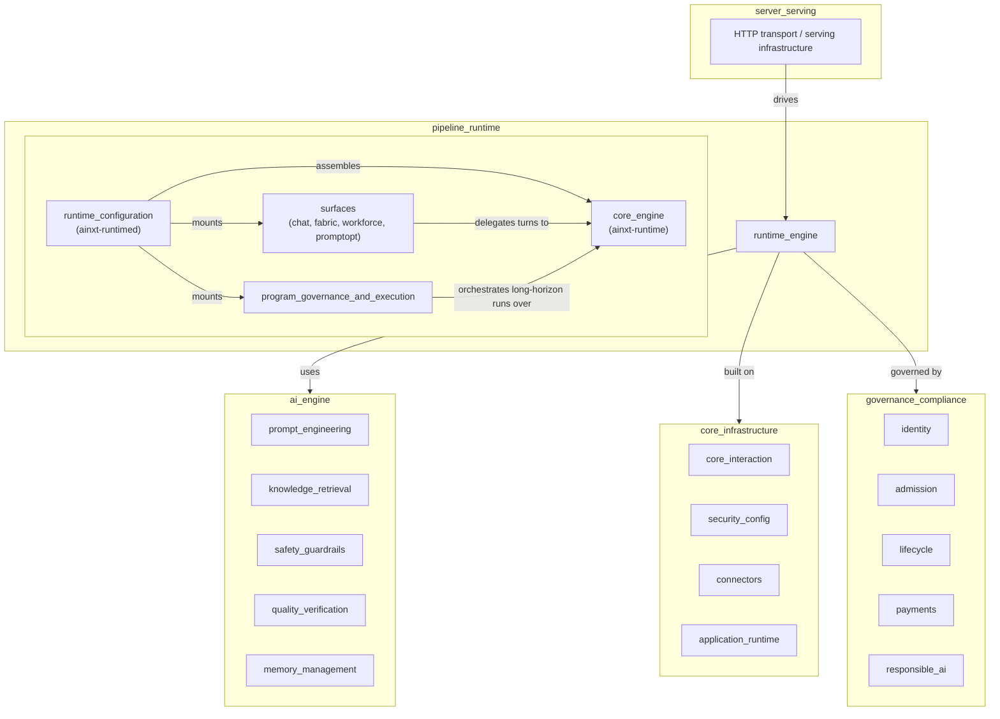
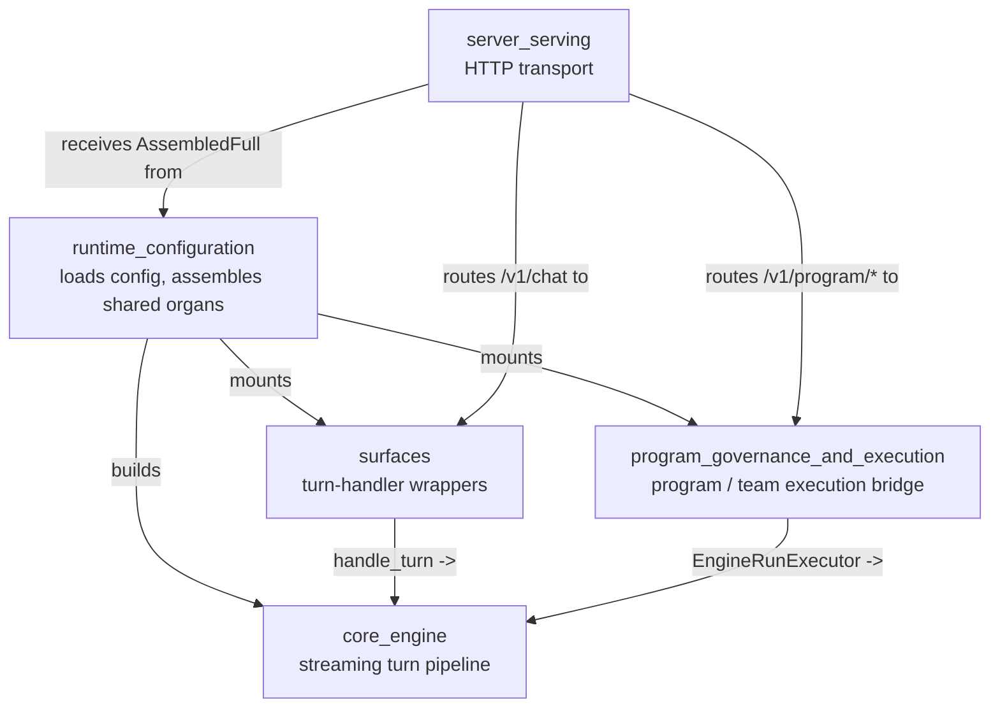
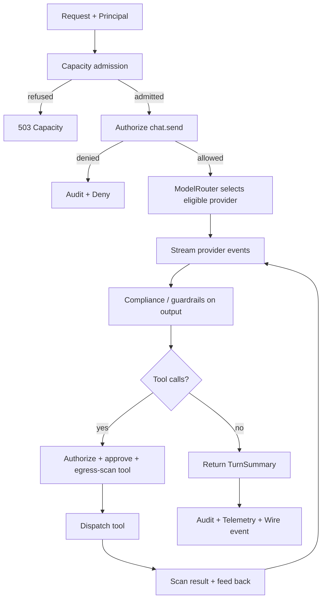

# `runtime_engine` Module Overview

## Purpose

The `runtime_engine` module (located under `pipeline_runtime`) is the **served execution layer** of the system. It turns static configuration and governance policy into live, streaming AI turns. The module has two primary responsibilities:

1. **Core turn execution** (`core_engine`) — the canonical, fail-closed pipeline that accepts an authenticated request, enforces compliance / authorization / audit, selects an eligible model, streams the provider response, dispatches and audits tool calls, and returns a `TurnSummary`.
2. **Daemon composition root** (`runtime_configuration`, `surfaces`, `program_governance_and_execution`) — loads deployment configuration, assembles long-lived shared organs (engine, session manager, serving gate, memory, connectors, governance surfaces), and mounts higher-level surfaces such as chat, workforce, program execution, and prompt optimization.

In short, `runtime_engine` is where the AI engine, governance, infrastructure, and transport layers are wired together into a runnable service.

---

## Repository Structure

```
pipeline_runtime/
└── runtime_engine/
    ├── core_engine/
    │   └── crates/ainxt-runtime/src/lib.rs
    │       Engine, ModelRouter, TurnOutcome, TurnSummary, TurnWire,
    │       QualityGuard, AdmissionPermit, RbacAuthorizer, InMemoryAudit, ...
    ├── runtime_configuration/
    │   └── crates/ainxt-runtimed/src/lib.rs
    │       LoadedConfig, Assembled, AssembledFull, ServingConfig, KbConfig, ...
    │   └── crates/ainxt-runtimed/src/kb_loader.rs
    │       KbDocument, TextMeta
    │   └── crates/ainxt-runtimed/src/mounts.rs
    │       SelfTestStepExecutor, OfflineTransport
    ├── surfaces/
    │   └── crates/ainxt-runtimed/src/chat_identity.rs
    │       GovernedChatSurface, ChatIdentityPolicy, SessionIdentity
    │   └── crates/ainxt-runtimed/src/fabric_chat.rs
    │       FabricGroundedChatSurface
    │   └── crates/ainxt-runtimed/src/workforce_surface.rs
    │       WorkforceSurface, WorkforceTurnSurface, RoleInvocationLedger, ...
    │   └── crates/ainxt-runtimed/src/prompt_optimizer_surface.rs
    │       PromptSweepSpec, SbsModel, ProviderModelSeam, ...
    └── program_governance_and_execution/
        └── crates/ainxt-runtimed/src/program_exec.rs
            ProgramRuntime, ProgramSurface, TeamSurface, EngineRunExecutor, ...
        └── crates/ainxt-runtimed/src/governed.rs
            FederatedQueryTool, StructuredQueryTool, NamedFabricQueryTool, ...
        └── crates/ainxt-runtimed/src/guarded_log.rs
            GuardedEventLog
```

---

## Architecture

### `runtime_engine` in the system context



### Internal submodule relationships



### Simplified turn pipeline (core_engine)



---

## Core Components

| Component | Crate / File | Role |
|-----------|--------------|------|
| `Engine` | `ainxt-runtime/src/lib.rs` | Central streaming turn pipeline. |
| `ModelRouter` | `ainxt-runtime/src/lib.rs` | Selects eligible providers using data-class, outsourcing, quality, and steerability gates. |
| `RbacAuthorizer` | `ainxt-runtime/src/lib.rs` | Capability-based authorization seam. |
| `InMemoryAudit` | `ainxt-runtime/src/lib.rs` | Default audit sink; every turn writes one `AuditRecord`. |
| `QualityGuard` / `OutsourcingGuard` | `ainxt-runtime/src/lib.rs` | Non-overridable routing gates (FI-03 / FI-07). |
| `TurnSummary` / `TurnOutcome` | `ainxt-runtime/src/lib.rs` | Final turn result types. |
| `LoadedConfig` / `Assembled` / `AssembledFull` | `ainxt-runtimed/src/lib.rs` | Configuration and daemon-wide singleton assembly. |
| `KbDocument` / `kb_loader` | `ainxt-runtimed/src/kb_loader.rs` | File-system knowledge-base seeding. |
| `GovernedChatSurface` | `ainxt-runtimed/src/chat_identity.rs` | Identity-governed chat turn handler. |
| `FabricGroundedChatSurface` | `ainxt-runtimed/src/fabric_chat.rs` | Context-fabric grounded chat handler. |
| `WorkforceSurface` / `WorkforceTurnSurface` | `ainxt-runtimed/src/workforce_surface.rs` | Digital-workforce factory surface. |
| `ProgramRuntime` / `EngineRunExecutor` | `ainxt-runtimed/src/program_exec.rs` | Long-horizon program/team execution over the real engine. |
| `GuardedEventLog` | `ainxt-runtimed/src/guarded_log.rs` | Redacts cardholder data before durable event-log write. |

---

## References to Core Component Documentation

- **[core_engine](core_engine.md)** — detailed documentation of the `ainxt-runtime` turn pipeline, mandatory gates, model routing, tool dispatch, memory injection, and wire/telemetry seams.
- **[runtime_configuration](runtime_configuration.md)** — configuration loading, KB seeding, `Assembled` / `AssembledFull`, and cross-cutting shared-organ assembly.
- **[surfaces](surfaces.md)** — chat identity, fabric grounding, workforce, and prompt-optimizer turn-handler surfaces.
- **[program_governance_and_execution](program_governance_and_execution.md)** — program/team execution bridge, governed data-surface wrappers, and compliance logging.

Related upstream/downstream modules:

- [server_serving](server_serving.md) — HTTP transport that receives the assembled runtime.
- [serving_infrastructure](serving_infrastructure.md) — serving gate, placement, health, attestation consumed by the runtime.
- [memory_management](../ai_engine/memory_management.md) — governed memory backends used by the engine.
- [safety_guardrails](../ai_engine/safety_guardrails.md) — input/output rails and injection defense.
- [prompt_engineering](../ai_engine/prompt_engineering.md) — prompt assembly, complexity classification, and steerability.
- [tools_cli](../tools_cli/tools_cli.md) — `ToolRuntime`, OBO dispatch, and tool schema validation.
- [core_infrastructure](../core_infrastructure/core_infrastructure.md) — protocol types, session, telemetry, and caching primitives.
- [ai_engine](../ai_engine/ai_engine.md) — quality verification and synthesis feeding live quality scores.
- [governance_compliance](../governance_compliance/governance_compliance.md) — identity, outsourcing, incident, lifecycle, and responsible-AI governance.