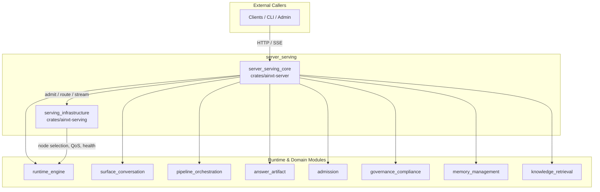
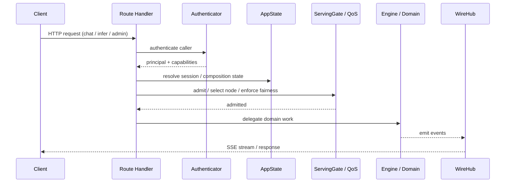

# `server_serving` Module Overview

## Purpose

`server_serving` is the network-facing boundary and operational control plane of the system. It is composed of two crates:

- **`crates/ainxt-server`** (`server_serving_core`) — the HTTP transport daemon and API surface that exposes the runtime's capabilities as an authenticated, observable, and governable network service.
- **`crates/ainxt-serving`** (`serving_infrastructure`) — a deterministic, policy-only control plane for operating a fleet of inference nodes, covering admission, scheduling, placement, health, rollout, caching, erasure, and attestation.

Together, these crates turn internal engine primitives into served HTTP endpoints while enforcing trust, capacity, fairness, and compliance.

## Architecture

### Request Lifecycle

## Core Components Documentation

- **[server_serving_core.md](server_serving_core.md)** — HTTP facade, composition roots (`AppState`, `FullApp`, `FullAppExt`), authentication schemes (`TrustedGatewayAuth`, `BearerSecretAuth`, `JwtSsoAuth`), request/response DTOs, route handlers, wire event streaming (`WireHub`, `WireTail`, `WireDuplex`), approval coordination (`ApprovalCoordinator`, `WireApprovalGate`), cancellation (`CancelRegistry`), and command idempotency.
- **[serving_infrastructure.md](serving_infrastructure.md)** — Deterministic serving control plane, divided into:
  - **[admission_scheduling.md](admission_scheduling.md)** — `ServingGate`, `SloAdmissionController`, `PreemptionScheduler`, `WfqScheduler`, `IdempotencyLedger`, `FairnessLimiter`, `LoadShedder`.
  - **[placement_lifecycle.md](placement_lifecycle.md)** — `PlacementController`, `AutoscaleController`, `ShardHealthMonitor`, `WeightRollout`, `DisaggregatedPools`.
  - **[caching_erasure.md](caching_erasure.md)** — `KvCacheIsolation`, `TieredCacheErasure`, `KvRelay`.
  - **[attestation.md](attestation.md)** — `AttestationGate`, `AttestationRefresher`, `AllowListVerifier`, `ReferenceValues`.

## Design Principles

- **Thin HTTP facade** — business logic lives in sibling runtime and domain modules.
- **Fail-closed** — optional surfaces return 404 when their backing organ is not configured.
- **Deterministic policy** — physical side effects are injected through testable seams.
- **Priority-aware fairness** — higher-priority work can preempt lower-priority work while per-tenant fairness prevents starvation.
- **Exactly-once semantics** — the idempotency ledger ensures commands are billed and applied once.