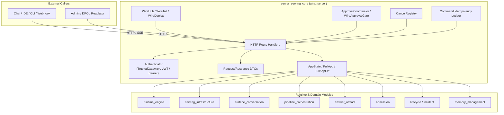
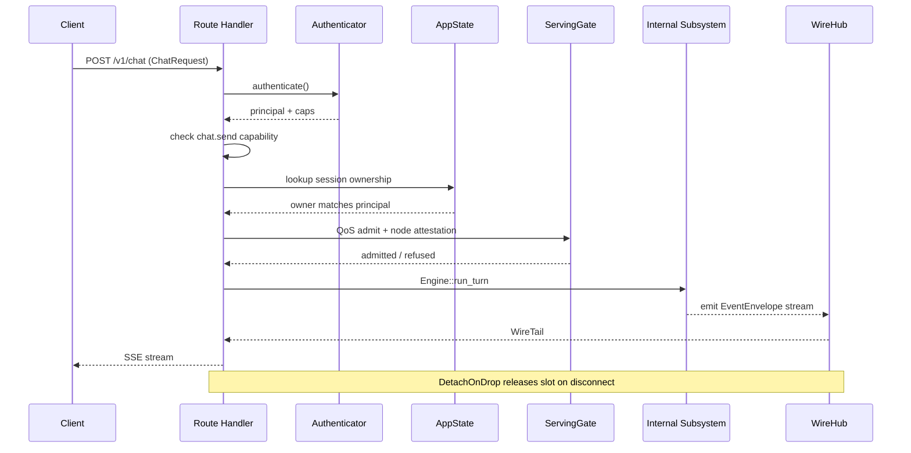
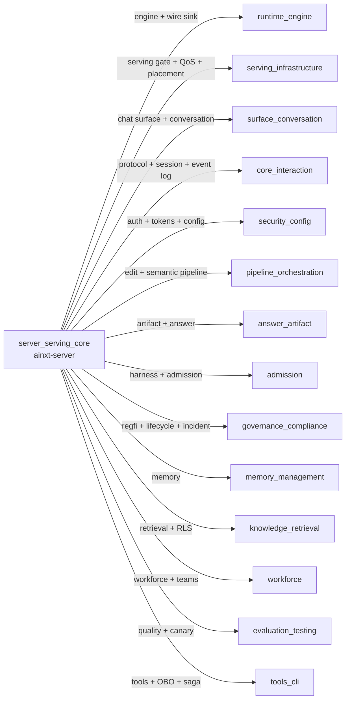
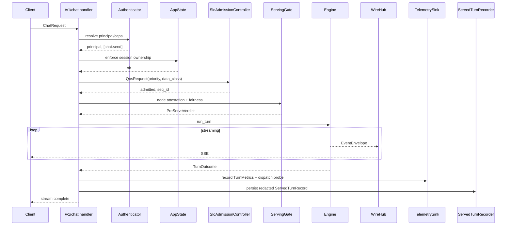
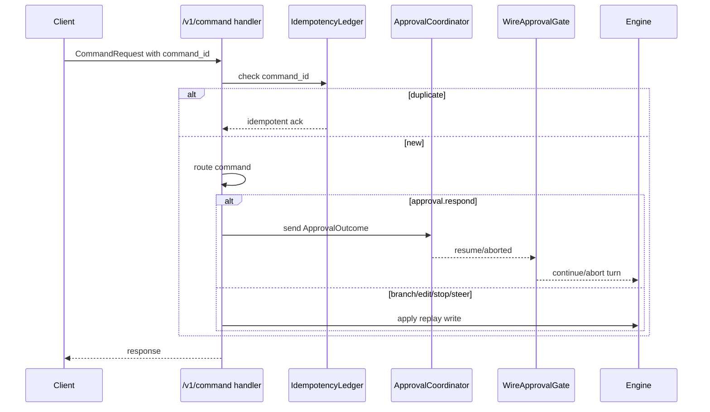
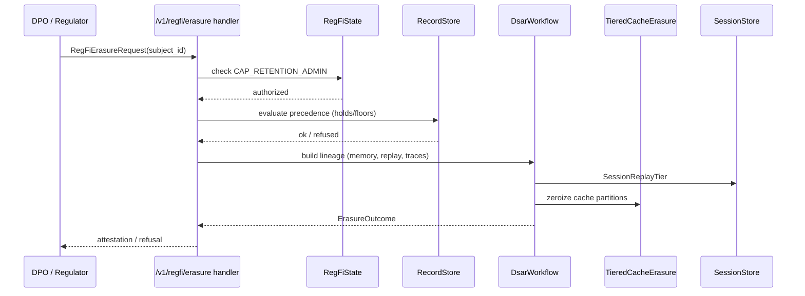
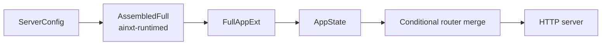

# server_serving_core

## Brief Introduction

`server_serving_core` is the HTTP transport daemon and API surface of the system. It is implemented in `crates/ainxt-server/src/lib.rs` and is responsible for exposing the runtime's capabilities as a served network API. The module wires together authentication, request routing, composition roots, streaming event delivery, approval coordination, and administrative endpoints. It sits at the boundary between external callers and the internal runtime, turning local engine primitives into authenticated, observable, and governable HTTP surfaces.

The core purpose of this module is to:

- Mount all public capability surfaces (`/v1/chat`, `/v1/infer`, `/v1/edit`, `/v1/artifact`, `/v1/replay`, `/v1/harness`, `/v1/regfi`, `/v1/memory`, `/v1/workforce`, `/admin/*`, etc.).
- Provide the composition roots (`AppState`, `FullApp`, `FullAppExt`) that assemble the engine, serving infrastructure, and governance organs into a runnable daemon.
- Enforce transport-level authentication and session ownership independently of the event log.
- Stream typed wire events, handle approvals, cancellations, idempotency, and QoS admission.
- Bridge internal runtime types into caller-facing DTOs while preserving auditability and fail-closed behavior.

This module does not implement the inference engine, the serving scheduler, or the domain logic for chat/edit/artifact/harness/regfi. It depends on those modules and mounts them onto HTTP routes. For details on those subsystems, see the linked module documentation.

---

## Architecture

### High-level role

`server_serving_core` is the outermost layer of the served stack. It receives HTTP requests, authenticates the caller, validates DTOs, delegates to the appropriate internal subsystem, and returns streamed or synchronous responses. It is intentionally thin: business logic lives in the engine and domain crates; transport concerns live here.

### Composition roots

The module exposes three primary composition roots:

- **`AppState`** — the per-request state used by route handlers. It holds the `SessionManager`, authenticator, cancel registry, optional serving admission, optional wire hub, telemetry sink, replay store, approval coordinator, and handles for MCP admin, skill runtime, key rotation, RLS break-glass, outsourcing register, control plane, and incident register.
- **`FullApp`** — the legacy high-level composition root. It bundles the session manager, authenticator, event log, control-plane SHA, optional serving gate + node candidates, optional graph, optional ledger schema, and optional harness mounts.
- **`FullAppExt`** — the extended composition root used by the shipped daemon. It adds every optional surface and admin organ: connectors, key rotation, wire events, artifact, replay store, re-execution executor, telemetry, erasure, harness pre-receive, edit engine, regfi organs, served-turn recorder, dispatch probe, feedback engine, break-glass programs, report templates, memory consent backing + writer, release controller, outsourcing register, control plane, disaggregated pools, MCP admin, skill runtime, transparency log, RLS break-glass, and workforce surface.

Each field is `Option<...>` so the same daemon binary can be composed with different subsets of surfaces. A `None` value causes the corresponding route to fail closed (typically 404) rather than silently no-op.

### Request lifecycle

A typical request flows through the following stages:

1. **Routing** — Axum (or equivalent) matches the path and method.
2. **Extraction** — Request DTOs are deserialized and validated.
3. **Authentication** — The configured `Authenticator` resolves the caller principal and capabilities.
4. **Authorization** — Route handlers check capabilities (e.g., `chat.send`, `CAP_EDIT_APPLY`, `AUDITOR_CAP`, `CAP_RETENTION_ADMIN`).
5. **Admission** — For `/v1/chat` and `/v1/infer`, the request passes through the SLO-aware QoS pre-serve scheduler and the node-level serving gate.
6. **Delegation** — The handler calls into the relevant internal subsystem (`Engine`, `EditEngine`, `ArtifactRuntime`, `HarnessRuntime`, `TieredCacheErasure`, etc.).
7. **Response** — The result is serialized. Streaming endpoints use `WireHub`/`WireTail` to push `EventEnvelope`s to the client.
8. **Cleanup** — `DetachOnDrop` releases QoS slots and cancels in-flight work when the connection drops.

---

## Core Components

### Authentication

The module supports multiple authentication schemes through the `Authenticator` trait:

- **`TrustedGatewayAuth`** — default trusted-gateway mode; identity is asserted by the reverse proxy.
- **`BearerSecretAuth`** — simple bearer-token authentication for tests and internal services.
- **`JwtSsoAuth`** — JWT-based SSO with injectable clock for deterministic testing.

Authentication is transport-level and independent of session ownership. The resolved principal and capabilities are passed into the engine and domain gates. For token and OAuth internals, see [security_config.md](../core_infrastructure/security_config.md).

### Request DTOs

The module defines caller-facing DTOs that are kept separate from internal protocol types:

- **`ChatRequest`** — input for `/v1/chat`. Carries `session`, `turn`, `input`, `data_class`, optional provider pin, capabilities, SLO `priority`, and a Stage-1 document-generation affordance (`ui_generate_document`).
- **`InferHttpRequest`** — input for `/v1/infer`. Carries `seq_id`, `model_id`, `priority`, `data_class`, `total_units`, and `kv_pages`.
- **`HandoffHttpRequest`** — KV-block handoff between disaggregated prefill/decode pools.
- **`CommandRequest`** — generic command envelope for session-level ops (`branch`, `edit`, `stop`, `steer`, `approval.respond`). Includes client-minted `command_id` for idempotency.
- **`ReplayRequest` / `ReplayStepRequest` / `ReplayReexecuteRequest` / `ReplayDriftRequest`** — replay read and re-execution surfaces.
- **`MemoryRememberRequest` / `MemoryQueryHttpRequest` / `SubjectQuery`** — memory write, query, and subject-erasure DTOs.
- **`FeedbackRequest`** — explicit user feedback captured into the improvement engine.
- **`ErasureHttpRequest`** / **`RegFiErasureRequest`** / **`RegFiDsarRequest`** / **`RegFiHoldRequest`** / **`RegFiEvidenceRequest`** / **`RegFiAuditorRequest`** / **`RegFiReportRequest`** / **`RegFiDowngradeRequest`** — regulated-FI supervisory endpoints.
- **`BreakGlassOpenRequest` / `BreakGlassProgramRequest` / `BreakGlassTargetDto`** — break-glass redaction campaigns.
- **`HarnessRunRequest` / `HarnessInvokeRequest` / `HarnessPreflightRequest`** — harness execution and pre-receive gates.
- **`OutsourcingRegisterRequest`** — FI-03 outsourcing arrangement registration.
- **`WorkforcePublishRequest` / `WorkforceShadowCaseInput`** — governed workforce role publishing.
- **`KillSwitchPullRequest` / `KillSwitchReleaseRequest` / `RevokeRunRequest` / `RevokeUserRequest`** — identity control-plane admin actions.
- **`McpApproveRequest` / `KeysRotateRequest` / `KeysRetireRequest` / `RlsBreakGlassRequest`** — MCP, key rotation, and RLS break-glass admin routes.
- **`SagaRunRequest` / `SagaStepPayload`** — multi-step composite tool actions with compensation.

### State structs

Each route group is backed by a focused state struct:

- **`ServingState`** — serving gate, node candidates, inference executor, authenticator.
- **`DisaggState`** — disaggregated prefill/decode pools, KV relay transport, executor.
- **`EditState`** — edit engine, authenticator, durable workspace root, journal store, journal signer.
- **`ArtifactState`** — artifact runtime + authenticator.
- **`ReplayStepState` / `ReplayReexecState`** — replay store + authenticator (+ re-execution executor).
- **`MemoryState`** — consent backing, retention store, optional session seam, optional memory writer, authenticator.
- **`FeedbackState`** — improvement engine + authenticator.
- **`ErasureState`** — tiered cache erasure + authenticator.
- **`RegFiState`** — retention store, incident register, DSAR workflow, event log, memory backing, replay store, authenticator.
- **`ReportState`** — incident report templates + incident register + authenticator.
- **`BreakGlassState`** — break-glass program map + authenticator + event log.
- **`HarnessState` / `HarnessRunState` / `HarnessPrereceiveState`** — harness registry, runtime, executor, invoker, compliance gate, authenticator.
- **`ConnectorState`** — connector gateway + authenticator.
- **`TransparencyState`** — transparency log + authenticator.
- **`WorkforceState`** — governed workforce surface + authenticator.
- **`EvalState`** — online release controller + authenticator.
- **`QueryLedgerState`** — NL→SQL ledger schema + authenticator.
- **`GraphState`** — knowledge graph + authenticator.

### Wire event delivery

The module implements a typed event-streaming fabric:

- **`WireHub`** — fan-out hub for per-turn subscribers and session-level observers. It can resync lagging subscribers from the durable event log.
- **`WireSubQueue`** — bounded queue for a single subscriber.
- **`WireTail`** — handle returned to a client; dropping it closes the queue.
- **`WireDuplex`** — bundles cancellation registry, approval coordinator, and wire hub for handlers that need bidirectional control.

When a `wire_hub` is installed, `/v1/chat` serializes the engine's real `EventEnvelope` stream (including `turn.completed{capped}`, `compliance.notice`, and `usage{model,cost}`). Without it, the daemon falls back to the legacy lossy `Event` projection.

For the underlying protocol and event-log primitives, see [core_interaction.md](../core_infrastructure/core_interaction.md).

### Approval and cancellation

- **`ApprovalCoordinator`** — correlates client `approval.respond` commands with blocked engine `WireApprovalGate` instances, keyed by session.
- **`WireApprovalGate`** — timeout-aware gate that blocks a turn until a human approve/reject decision arrives.
- **`CancelRegistry`** — maps `(session, turn)` to a `CancelToken` so a client or admin can abort in-flight work.
- **`DetachOnDrop`** — ties QoS slot release and cancellation cleanup to the response-stream lifetime, preventing fleet-capacity leaks on disconnect.

### Idempotency

`AppState` holds a `command_ledger` (`ainxt_serving::idempotency::IdempotencyLedger`) keyed by the client-minted `command_id` in `CommandRequest`. Replayed commands short-circuit to a generic idempotent-replay ack instead of being re-applied. Requests without a `command_id` retain the pre-existing behavior.

For the underlying idempotency primitive, see [serving_infrastructure.md](serving_infrastructure.md).

---

## Dependencies

`server_serving_core` depends on nearly every major subsystem. The diagram below shows the most important relationships.

### Direct crate dependencies visible in the code

| Crate | Role in this module |
|-------|---------------------|
| `ainxt-runtime` | Core `Engine`, `TurnOutcome`, `CancelToken`, `DispatchProbe`, `WireEvent`, `ModelRouter`, `RbacAuthorizer`, `QualityGuard`, compliance gate seam. |
| `ainxt-runtimed` | `Assembled`, `AssembledFull`, `ServingConfig`, surface assembly, `GovernedChatSurface`, `WorkforceSurface`, `McpAdminHandle` adapter. |
| `ainxt-serving` | `ServingGate`, `InferRequest`, `NodeCandidate`, `QosRequest`, `TieredCacheErasure`, `DisaggregatedPools`, `IdempotencyLedger`. |
| `ainxt-session` | `SessionManager`, `SnapshotState`, session errors. |
| `ainxt-protocol` | `Command`, `CommandEnvelope`, `EventEnvelope`, `TurnInput`, `TurnOverrides`. |
| `ainxt-eventlog` | `EventLog`, `LogRecord` for audit trail and replay resync. |
| `ainxt-replay` | `SessionStore`, `LinearRecord`, replay step/reexec/drift primitives. |
| `ainxt-telemetry` | `TelemetrySink`, `TurnMetrics`, `NullTelemetry`. |
| `ainxt-types` | `Principal`, `DataClass`. |
| `ainxt-convo` | Chat surface and Stage-1 document-generation signal. |
| `ainxt-pipeline` | `EditEngine`, `EditRequest`, `Journal`, `JournalStore`, `CAP_EDIT_APPLY`. |
| `ainxt-artifact` | `ArtifactRuntime`, `ArtifactRequest`. |
| `ainxt-nl2sql` | `Schema`, `QueryIntent` for safe NL→SQL. |
| `ainxt-graph` | `Graph` for `/graph` surface. |
| `ainxt-admission` | `HarnessRegistry`, `HarnessRuntime`, `ComplianceGate`, `CapabilityInvoker`. |
| `ainxt-client` | `CapabilityInvoker`, `ClientConfig`, SDK bridge. |
| `ainxt-tools` | `ToolRuntime`, `SagaStepRequest`, OBO policy/sink. |
| `ainxt-connector-http` | `ConnectorGateway` for OAuth connector surface. |
| `ainxt-memory` | `ConsentBacking`, `MemoryWriter`, `ImprovementEngine`, `SessionSeam`. |
| `ainxt-lifecycle` | `RecordStore`, `DsarWorkflow`, `BreakGlassProgram`, retention commands. |
| `ainxt-incident` | `IncidentRegister`, `TemplateStore`, evidence export. |
| `ainxt-identity` | `ControlPlane`, `TransparencyLog`, kill-switch/revocation. |
| `ainxt-responsibleai` | `OutsourcingRegister`. |
| `ainxt-quality` | `OnlineReleaseController` for canary status. |
| `ainxt-mcp` | `McpRegistry`, `AuthProvider`, `PinStore`. |
| `ainxt-skill` | `SkillRuntime` for hot-reload. |
| `ainxt-token` | `AeadCodec` for key rotation. |
| `ainxt-retrieval` | `Corpus` for RLS break-glass. |
| `ainxt-workforce` | `GovernedWorkforce` surface. |

---

## Data Flow

### Chat turn flow

### Command / approval flow

### Regulated-FI erasure flow

---

## Component Interaction

The following diagram shows how the major internal pieces of `server_serving_core` interact with each other and with sibling modules.

```mermaid
flowchart TB
    subgraph SSC["ainxt-server"]
        AppState["AppState"]
        FullApp["FullApp"]
        FullAppExt["FullAppExt"]
        Auth["Authenticator impls"]
        DTOs["Request DTOs"]
        Handlers["Route handlers"]
        WireHub["WireHub"]
        ApprovalCoord["ApprovalCoordinator"]
        CancelReg["CancelRegistry"]
        CommandLedger["command_ledger"]
    end

    subgraph SiblingModules["Sibling / child modules"]
        Runtime[runtime_engine]
        Serving[serving_infrastructure]
        Conversation[surface_conversation]
        Edit[pipeline_orchestration]
        Artifact[answer_artifact]
        Harness[admission]
        RegFi[lifecycle / incident]
        Memory[memory_management]
        Retrieval[knowledge_retrieval]
        Workforce[workforce]
    end

    FullAppExt -->|builds| AppState
    FullApp -->|builds| AppState
    AppState -->|provides| Handlers
    DTOs -->|deserialized by| Handlers
    Auth -->|resolves identity| Handlers
    Handlers -->|stream events| WireHub
    Handlers -->|await approvals| ApprovalCoord
    Handlers -->|register/cancel| CancelReg
    Handlers -->|dedup| CommandLedger
    Handlers -->|delegate| Runtime
    Handlers -->|admit| Serving
    Handlers -->|chat| Conversation
    Handlers -->|edit| Edit
    Handlers -->|render| Artifact
    Handlers -->|run/preflight| Harness
    Handlers -->|erasure/evidence/auditor| RegFi
    Handlers -->|remember/query/erase| Memory
    Handlers -->|query_ledger / rls_break_glass| Retrieval
    Handlers -->|publish roles| Workforce
```

---

## Process Flows

### Daemon startup and composition

1. The binary reads `ServerConfig` / `ServingConfig`.
2. It builds the `SessionManager`, `EventLog`, `Authenticator`, and optional surfaces via `Assembled`/`AssembledFull` in `ainxt-runtimed`.
3. `FullAppExt` is populated with all configured organs.
4. `AppState` is derived from `FullAppExt`.
5. Routers are conditionally merged based on which `Option` fields are `Some`.
6. The HTTP server starts and serves the merged router.

### Hot reload (`POST /admin/reload`)

1. Handler checks that `skill_runtime` and `skill_dir` are configured.
2. It re-reads the skill directory from disk.
3. It calls `SkillRuntime::reload` on the shared instance.
4. Subsequent turns resolve skill refs through the updated runtime.

### Key rotation (`POST /admin/keys/rotate`)

1. Handler checks that `key_rotation` is configured.
2. It calls `AeadCodec::rotate` on the shared codec instance.
3. The same instance is used by connector OAuth seal/open paths, so the rotation is visible immediately.

### Kill-switch pull (`POST /admin/killswitch/pull`)

1. Handler checks that `control_plane` is configured.
2. It forwards the request to `ControlPlane::pull_kill_switch`.
3. The same control plane is locked by every dispatch admission check, so the pull affects the next admission.

---

## Integration with sibling modules

### runtime_engine

`server_serving_core` does not run turns itself. It delegates to `Engine` from [runtime_engine.md](runtime_engine.md). The engine produces `TurnOutcome` and `WireEvent` envelopes; the server serializes them into HTTP responses. `ManagerInferExecutor` wraps the `SessionManager` as an `InferExecutor` for the `/v1/infer` path.

### serving_infrastructure

Admission, QoS, preemption, placement, health, rollout, disaggregation, and cache erasure are implemented in [serving_infrastructure.md](serving_infrastructure.md). `server_serving_core` holds `ServingGate`, `NodeCandidate`s, `QosRequest`, `DisaggregatedPools`, and `TieredCacheErasure` handles and calls them at the right moments.

### surface_conversation

The chat conversation surface (intent classification, message handling, prompt deployment) lives in [surface_conversation.md](../core_infrastructure/surface_conversation.md). The server's `/v1/chat` handler is the HTTP binding for that surface.

### pipeline_orchestration

The semantic code-review pipeline (`/v1/edit`) is implemented in [pipeline_orchestration.md](pipeline_orchestration.md). `server_serving_core` holds the `EditEngine`, durable workspace root, and journal store, and routes edit requests into the pipeline.

### answer_artifact

Document generation (`/v1/artifact`) is implemented in [answer_artifact.md](../ai_engine/answer_artifact.md). The server holds an `ArtifactRuntime` and routes `ArtifactRequest`s to it.

### admission

Harness execution and pre-receive gating are implemented in [admission.md](../governance_compliance/admission.md). The server holds `HarnessMounts` and routes harness run/invoke/preflight requests.

### governance_compliance

Regulated-FI organs (DSAR, erasure, evidence, auditor, incident register, break-glass, report drafting) are implemented in [lifecycle.md](../governance_compliance/lifecycle.md) and [incident.md](../governance_compliance/incident.md). The server mounts these as `/v1/regfi/*` and `/v1/breakglass/*` routes.

### memory_management

Memory consent, export, erasure, explicit remember, and feedback are implemented in [memory_management.md](../ai_engine/memory_management.md). The server mounts `/memory/*` and `/feedback` routes.

### knowledge_retrieval

The knowledge graph (`/graph`) and safe NL→SQL (`/v1/query_ledger`) are implemented in [knowledge_retrieval.md](../ai_engine/knowledge_retrieval.md). The server holds `Graph` and `Schema` handles.

### workforce

Governed workforce role publishing is implemented in [workforce.md](../governance_compliance/workforce.md). The server mounts `/v1/workforce/roles` when a `GovernedWorkforce` surface is configured.

---

## Fail-closed design

A recurring theme in `server_serving_core` is that optional surfaces fail closed rather than silently no-op:

- Missing `serving` → `/v1/infer` is not mounted.
- Missing `edit` → `/v1/edit` returns 404.
- Missing `regfi` → all `/v1/regfi/*` routes return 404.
- Missing `approval_coordinator` → `approval.respond` is only shape-validated.
- Missing `control_plane` → kill-switch/revoke admin routes return 404.
- Missing `key_rotation` → key-rotation route returns 404.
- Missing `rls_break_glass` → RLS break-glass route returns 404.
- Missing `mcp_admin` → MCP approval routes return 404.
- Missing `skill_runtime` → skill hot-reload returns 404.

This ensures operators cannot mistakenly believe an action succeeded when the backing organ was never wired.

---

## Testing and mocking

The module includes a large set of test-only providers and executors:

- **`MockProvider`**, **`ReasoningMockProvider`**, **`BlockProvider`**, **`OutsourcedProvider`**, **`NeverDoneProvider`**, **`DriftingStuckProvider`**, **`PricedProvider`** — deterministic model behaviors for tests.
- **`AlwaysAmbiguousClassifier`** — forces ambiguous intent classification.
- **`AlwaysApprove`** — auto-approves approval gates.
- **`QuietReviewer`**, **`SilentReviewer`**, **`TokenJudge`** — stub review/judge behaviors.
- **`FixedExecutor`** — deterministic harness step executor.
- **`NoopTool`**, **`NoopStepExecutor`** — no-op tool/executor stubs.
- **`PgQueryTool`**, **`SettlePayment`**, **`VerifiedNoCaps`** — scenario-specific test doubles.
- **`SpacedSecretDetector`** — test detector for spaced/entropy secrets in harness pre-receive tests.

These live in the same crate so integration tests can build a fully wired `AppState` without external dependencies.

---

## Summary

`server_serving_core` is the HTTP facade and composition root of the entire system. It is responsible for:

- Authenticating callers and enforcing session ownership.
- Mounting all public capability and admin surfaces.
- Bridging internal runtime types into external HTTP contracts.
- Streaming typed events, coordinating approvals, and managing cancellations.
- Delegating domain work to the engine and sibling modules.
- Failing closed when optional surfaces are not configured.

It is intentionally thin: the real intelligence lives in [runtime_engine.md](runtime_engine.md), [serving_infrastructure.md](serving_infrastructure.md), and the domain modules it wires together.
