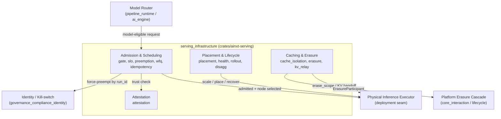
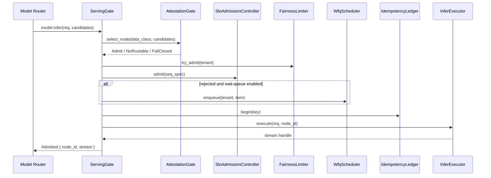

# `serving_infrastructure` Module Overview

## Purpose

The `serving_infrastructure` module is the deterministic, policy-only control plane for operating a fleet of GPU inference nodes. It answers the question: *given a model-eligible request, which node can run it safely, fairly, and within capacity, and how is the fleet kept healthy over time?*

The module lives in `crates/ainxt-serving` and is intentionally pure: it contains no GPU code, no async runtime, no wall-clock reads, and no live crypto. All physical side effects (VRAM allocation, inference execution, attestation quote fetching, weight staging, routing-table updates) are injected through named seams, making the admission, placement, health, rollout, caching, and attestation policies fully unit-testable.

## Architecture

`serving_infrastructure` is divided into four subsystems:

| Subsystem | Responsibility | Key Source Files |
|-----------|----------------|------------------|
| **Admission & Scheduling** | Flow control, priority preemption, fairness, weighted-fair queuing, idempotency | `lib.rs`, `gate.rs`, `slo.rs`, `preemption.rs`, `wfq.rs`, `idempotency.rs` |
| **Placement & Lifecycle** | GPU bin-packing, autoscale, shard health, weight rollout, prefill/decode disaggregation | `placement.rs`, `health.rs`, `rollout.rs`, `disagg.rs` |
| **Caching & Erasure** | Cross-tier cache isolation, tiered erasure, KV relay between pools | `cache_isolation.rs`, `erasure.rs`, `kv_relay.rs` |
| **Attestation** | Hardware-root node trust, quote verification, refresh scheduling | `attestation.rs` |

### Typical Request Flow

## Core Components Documentation

The detailed documentation for each subsystem is available in the following files:

- **[admission_scheduling.md](admission_scheduling.md)** — Flow-control primitives (`AdmissionController`, `TokenBucket`, `Batcher`, `LoadShedder`, `FairnessLimiter`), SLO-aware admission with preemption (`SloAdmissionController`, `PreemptionScheduler`), the node-level `ServingGate`, weighted-fair queuing (`WfqScheduler`), and the `IdempotencyLedger` for exactly-once billing.
- **[placement_lifecycle.md](placement_lifecycle.md)** — GPU bin-packing and autoscale (`PlacementController`, `AutoscaleController`, `ParkingRegistry`), shard health monitoring and drain-the-group recovery (`ShardHealthMonitor`), signed weight rollout (`WeightRollout`), and disaggregated prefill/decode pools (`DisaggregatedPools`, `KvRelay`).
- **[caching_erasure.md](caching_erasure.md)** — Uniform cache isolation via `PartitionKey`, tiered erasure across answer, prompt-prefix, and KV caches (`TieredCacheErasure`), and credit-bounded KV relay (`KvRelay`).
- **[attestation.md](attestation.md)** — Hardware-root node trust with `AttestationGate`, `AttestationRefresher`, `ReferenceValues`, `AllowListVerifier`, and deterministic quote verification seams.

## Design Principles

1. **Fail-closed on trust and capacity.** Regulated requests are denied if no attested node is available; admission rejects rather than queues without bound.
2. **Pure policy, gated infrastructure.** All decision logic is deterministic; physical actions live behind testable seams.
3. **Priority-aware fairness.** Higher-priority work can preempt lower-priority work at chunk boundaries, while per-tenant fairness prevents starvation.
4. **Exactly-once semantics.** The idempotency ledger ensures a logical request is billed once and detects divergent replays.
5. **Structural isolation.** Prefill and decode pools are independent, and cache tiers share a uniform partition key to prevent cross-tenant leaks.