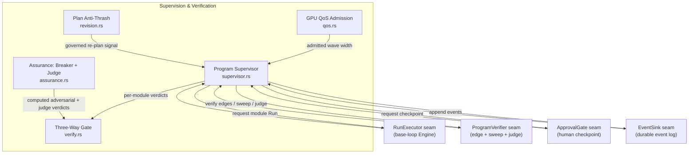
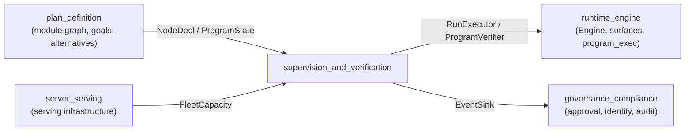
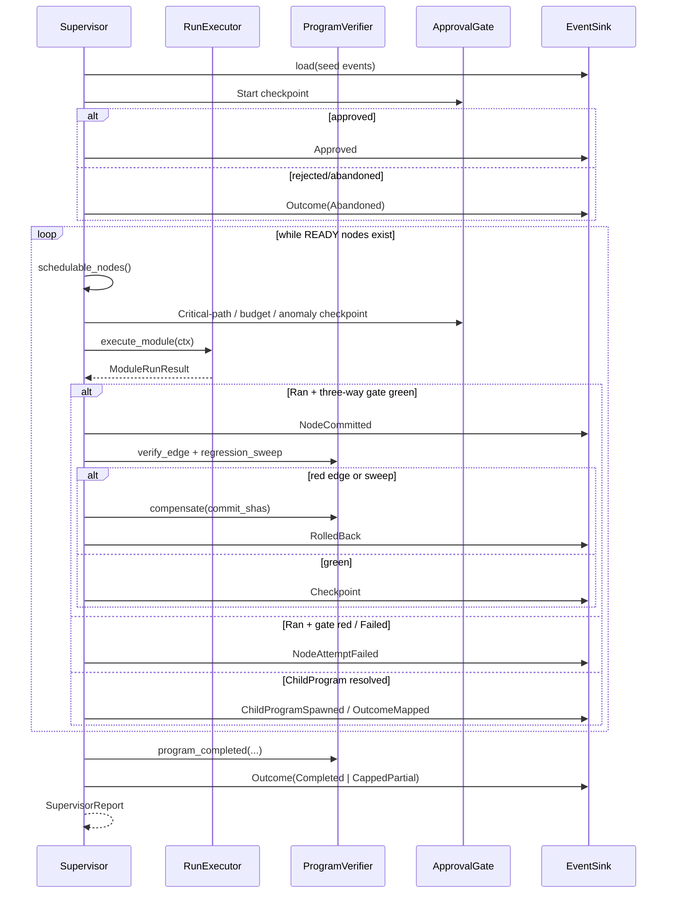

# Supervision and Verification

The **supervision_and_verification** module is the governance layer inside the long-horizon program planner (`ainxt-planner`). It makes sure that a multi-step, multi-module program is executed, verified, and admitted only when independent proofs agree that the work is correct. The module does not perform the actual model inference or code edits itself; instead, it orchestrates the seams that do — the base-loop Run executor, the adversarial breaker, the semantic judge, the human approval gate, the durable event log, and the GPU-fleet admission policy.

## Purpose

Long-horizon programs decompose large objectives into a graph of dependent modules. Left unsupervised, each module could self-report success, commit broken code, exceed budget, or churn its plan forever. This module closes those gaps by:

1. **Driving the program to completion** — scheduling READY modules, running them through the base-loop executor, and folding the results into a durable event log.
2. **Enforcing three-way verification** — never marking work complete on a self-report; instead requiring a deterministic gate, an adversarial gate, and a cross-model semantic judge to all pass.
3. **Governing cost and human checkpoints** — tracking aggregate program cost against a hard budget and staging human approvals at start, critical-path, budget-threshold, and anomaly gates.
4. **Isolating failure and rolling back** — re-opening nodes whose integration edges or regression sweeps fail, compensating real-world side effects, and quarantining persistently failing nodes so independent branches can still ship.
5. **Admitting work to a shared GPU fleet** — deciding how wide a wave of independent modules may run, given workload class, interactive reserve, and higher-priority traffic.
6. **Preventing plan thrash** — requiring every structural plan change to carry a triggering signal, recording revisions append-only, and freezing the plan when churn exceeds a threshold.

## Architecture Overview

The module sits at the boundary between **planning** (which produces the module graph and goals) and **execution** (which runs the base-loop Engine, serves inference, and persists the event log). All runtime dependencies are injected as traits, so the Supervisor loop is fully testable with fakes while the production deployment wires in the real Engine, event log, approval gate, and GPU fleet telemetry.

## Module Placement in the System

- **Upstream**: [`plan_definition`](plan_definition.md) supplies the `ProgramState`, `NodeDecl` graph, and `Plan` structures that the Supervisor consumes.
- **Downstream**: [`runtime_engine`](runtime_engine.md) provides the base-loop Engine behind `RunExecutor`, and the real model/verification backends behind `ProgramVerifier`. [`server_serving`](server_serving.md) provides the live GPU fleet capacity readings that feed `ElasticFanoutPolicy`.
- **Cross-cutting**: [`governance_compliance`](../governance_compliance/governance_compliance.md) provides the durable event log, approval gate, identity, and audit infrastructure that the Supervisor relies on for human checkpoints and resumability.

## Sub-Modules

| Sub-module | File | Responsibility |
|------------|------|----------------|
| [Program Supervisor](supervision_and_verification_program_supervisor.md) | `supervisor.rs` | The main execution loop: schedule modules, run them, verify them, govern budget, stage checkpoints, handle failure isolation, and produce a terminal `SupervisorReport`. |
| [Three-Way Gate](supervision_and_verification_three_way_gate.md) | `verify.rs` | Pure combinatorics for the deterministic, adversarial, and semantic-judge proofs; also the program-level `COMPLETED` gate and regression attribution. |
| [Assurance](supervision_and_verification_assurance.md) | `assurance.rs` | Real offline implementations of the adversarial Breaker and the rubric Judge that inspect produced artifacts and return computed verdicts. |
| [GPU QoS Admission](supervision_and_verification_qos.md) | `qos.rs` | Workload classes and elastic fan-out policy that admit waves of independent modules onto a shared GPU fleet without starving interactive traffic. |
| [Plan Anti-Thrash](supervision_and_verification_plan_anti_thrash.md) | `revision.rs` | Change-justification, append-only revision history, and freeze-on-thrash cooldown for structural plan mutations. |

## High-Level Data Flow

## Key Design Principles

1. **Never self-declared done** — A module reaches `Committed` only after deterministic, adversarial, and cross-model semantic proofs are green. The program reaches `Completed` only after every leaf is committed, every edge is green, the regression sweep is green, and an independent program-level judge agrees.
2. **Durable log is authoritative** — Every state change is appended to the `EventSink` before the in-memory projection advances. A fresh projection of the log equals the live state, and re-running the Supervisor on the same log resumes exactly where it left off.
3. **Honest partials** — Cancellation, budget exhaustion, and iteration-guard stops leave the program in `Paused` with a deployable `CappedPartial` report, never a silent `Completed`.
4. **Injectable seams** — `RunExecutor`, `ProgramVerifier`, `ApprovalGate`, and `EventSink` are traits. The Supervisor contains only pure, deterministic scheduling logic; all non-determinism and side effects live in the injected implementations.
5. **Failure isolation** — A node that fails past the poison cap is quarantined (`FailedIsolated`), its dependents are gated, and independent branches continue so the program can still produce a useful partial outcome.
6. **Cross-model review** — Both per-module and program-level judges structurally reject a verdict where the producer and judge models are the same, closing systematic blind spots.

## Sub-Module Documentation Index

Detailed documentation for each sub-module is available in the following files:

- [supervision_and_verification_program_supervisor.md](supervision_and_verification_program_supervisor.md) - the program execution loop, scheduling, budget governance, checkpoints, and failure isolation.
- [supervision_and_verification_three_way_gate.md](supervision_and_verification_three_way_gate.md) - the deterministic, adversarial, and semantic-judge proofs and the program `COMPLETED` gate.
- [supervision_and_verification_assurance.md](supervision_and_verification_assurance.md) - the offline adversarial Breaker and rubric Judge that inspect produced artifacts.
- [supervision_and_verification_qos.md](supervision_and_verification_qos.md) - workload classes and elastic fan-out admission for the shared GPU fleet.
- [supervision_and_verification_plan_anti_thrash.md](supervision_and_verification_plan_anti_thrash.md) - change-justification, append-only revisions, and freeze-on-thrash cooldown.

## Related Documentation

- [plan_definition](plan_definition.md) — how the module graph and goals are created.
- [program_execution](program_execution.md) — how programs are driven and their state managed.
- [runtime_engine](runtime_engine.md) — the base-loop Engine and served surfaces that implement the runtime seams.
- [server_serving](server_serving.md) — the GPU fleet, admission, and placement infrastructure that feeds QoS decisions.
- [governance_compliance](../governance_compliance/governance_compliance.md) — durable event log, approval gates, identity, and audit.
