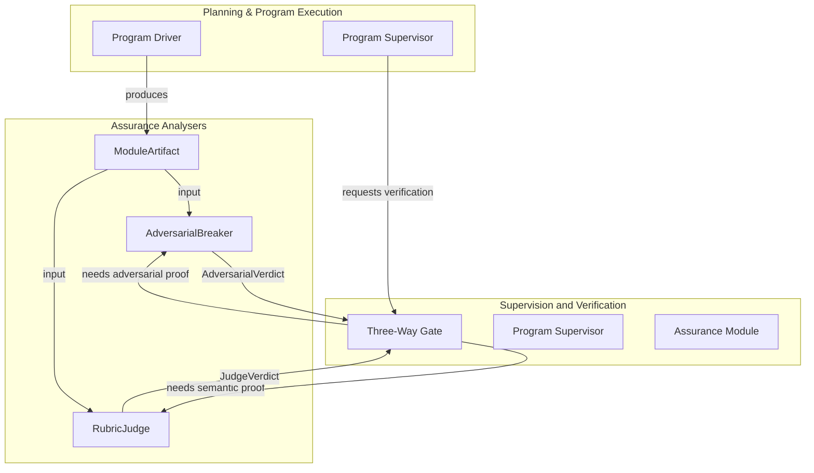
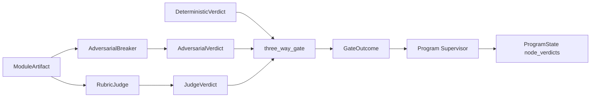
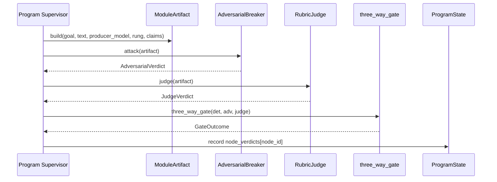
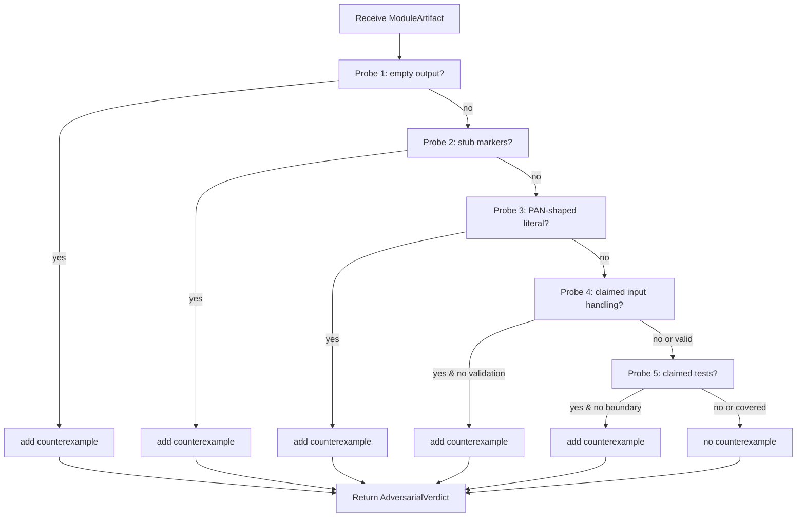
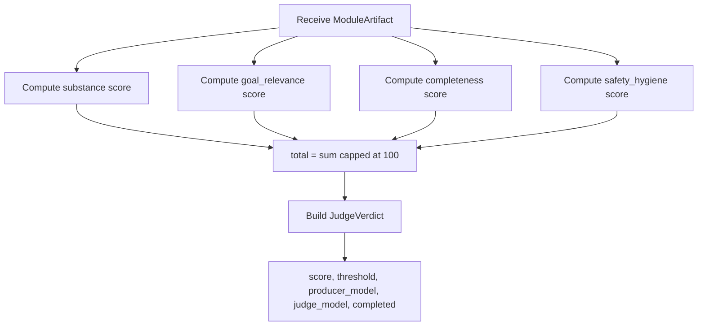

# Supervision and Verification Assurance

The `supervision_and_verification_assurance` module provides the **offline, deterministic backing** for two of the three proofs used by the planner's three-way verification gate: the **adversarial Breaker** and the **semantic rubric Judge**. It lives in `crates/ainxt-planner/src/assurance.rs` and is part of the larger [`supervision_and_verification`](supervision_and_verification.md) subsystem within [`pipeline_runtime`](pipeline_runtime.md).

## Brief Introduction

Long-horizon program execution in the planner relies on a `three_way_gate` that combines three independent proofs before a module can be committed:

1. A **deterministic gate** (compile, tests, SAST findings).
2. An **adversarial gate** that attempts to find counterexamples in the produced artifact.
3. A **semantic Judge** that scores the artifact against a rubric, cross-model.

Historically, the served program driver fabricated the second and third proofs by always returning green. This module closes that gap by supplying real, content-inspecting analysers that can actually block a bad module. Both analysers are pure, deterministic, and unit-testable; they are the OSS offline defaults that deployments can later hot-wire to live exploratory attack loops and cross-model LLM judges.

## Core Components

### `ModuleArtifact`

`ModuleArtifact` is the value type passed to both the Breaker and the Judge. It intentionally carries only what a fresh-context reviewer may see:

- `goal`: the module goal the artifact must satisfy.
- `text`: the produced artifact text (code, diff, report).
- `producer_model`: the model that produced the artifact.
- `edit_rung`: the Semantic-Editing rung the artifact was authored at.
- `claims_input_handling`: whether the producer claimed input validation.
- `claims_tests`: whether the producer claimed tests were written.

The builder-style helpers (`new`, `with_edit_rung`, `claiming_input_handling`, `claiming_tests`) make it easy to construct artifacts for both production and test paths.

### `AdversarialBreaker`

`AdversarialBreaker` runs a battery of five deterministic attack probes over a `ModuleArtifact` and returns an [`AdversarialVerdict`](supervision_and_verification_three_way_gate.md). Any surviving counterexample hard-blocks the commit in `three_way_gate`.

Probes:

1. **Empty output** — the artifact produced no committable content.
2. **Unfinished stub/placeholder markers** — detects `todo`, `fixme`, `unimplemented`, `placeholder`, etc.
3. **PCI-DSS leak** — a card-number-shaped (13–19 digit, Luhn-valid) literal embedded in the artifact.
4. **Unhandled input claim** — claims input handling but no validation/error path is visible.
5. **Shallow tests claim** — claims tests but no boundary/edge-case coverage is visible.

The Breaker is stateless (`Default`) and reports `attempts = PROBE_COUNT` plus the list of `counterexamples`.

### `RubricScore`

`RubricScore` is a transparent four-dimension rubric, 0–25 points each, totaling 0–100:

- `substance`: non-trivial length.
- `goal_relevance`: overlap between artifact tokens and goal keywords.
- `completeness`: absence of stub/placeholder markers.
- `safety_hygiene`: absence of card-number-shaped literals.

The `total()` method computes the aggregate score and caps it at 100.

### `RubricJudge`

`RubricJudge` scores a `ModuleArtifact` using the four-dimension rubric and emits a cross-model [`JudgeVerdict`](supervision_and_verification_three_way_gate.md). It is configured with:

- `judge_model`: a distinct model label that must differ from the producer model.
- `threshold`: the minimum acceptable total score (default 80).
- `min_len`: the minimum substantive length for full substance credit (default 40 chars).

The Judge is deterministic and content-varying: a stubbed or off-goal artifact scores below threshold and blocks, unlike a fabricated `pass(95, …)`.

## Architecture

## Component Relationships

The assurance module sits at the bottom of the verification stack. It is consumed by the [`three_way_gate`](supervision_and_verification_three_way_gate.md) combiner, which is in turn invoked by the [`Program Supervisor`](supervision_and_verification_program_supervisor.md) when deciding whether a node is `Verified`/`Committed`.

## Data Flow

When a program node produces an artifact, the supervisor packages it as a `ModuleArtifact` and feeds it to both analysers. The resulting verdicts flow into `three_way_gate` alongside the deterministic verdict.

## Process Flow: Adversarial Analysis

## Process Flow: Rubric Judging

## Integration with the Wider System

- **Planning**: The artifact's `edit_rung` is checked against the node contract's `edit_ladder_floor` in `ProgramState`. A below-floor artifact is refused even with a green three-way proof.
- **Verification**: The [`three_way_gate`](supervision_and_verification_three_way_gate.md) enforces cross-model judging (`producer_model != judge_model`) structurally, preventing same-model self-review.
- **Supervision**: The [`Program Supervisor`](supervision_and_verification_program_supervisor.md) folds the gate outcome into durable `node_verdicts` so that `Verified`/`Committed` states are replayable and tamper-evident.
- **Quality of Service**: [`FleetCapacity`](supervision_and_verification_qos.md) and [`ElasticFanoutPolicy`](supervision_and_verification_qos.md) influence how many verification attempts can run concurrently, but they do not change the deterministic outcome of the assurance analysers.
- **Plan Anti-Thrash**: [`RevisablePlan`](supervision_and_verification_plan_anti_thrash.md) may trigger replans when verification repeatedly fails; the assurance module provides the concrete failure signals that feed that logic.

## Deployment Seams

The module is designed as the **offline default**. The design documents (ADR-027 §6 and LOOP_AND_AGENT_TEAMS.md §7) describe how a deployment can hot-wire:

- The `AdversarialBreaker` slot with a real exploratory attack loop or property fuzzer (requires a live executor).
- The `RubricJudge` slot with a cross-model LLM judge (requires a live model).

Both replacements keep the same `AdversarialVerdict` and `JudgeVerdict` shapes, so `three_way_gate` and the supervisor remain unchanged.

## Key Design Properties

- **Pure and deterministic**: no clock, RNG, or I/O inside the analysers; every rule is a unit-test property.
- **Content-inspecting**: verdicts vary with the artifact text, not with producer self-narrative.
- **Anti-sycophancy**: the Breaker checks producer claims (`claims_input_handling`, `claims_tests`) against the actual artifact.
- **Cross-model by construction**: the Judge carries distinct `producer_model` and `judge_model` labels; the gate rejects same-model pairs.
- **Hard-blocking**: any surviving counterexample or below-threshold score produces a `GateOutcome::Blocked`.

## References

- [supervision_and_verification](supervision_and_verification.md) — parent module.
- [supervision_and_verification_program_supervisor](supervision_and_verification_program_supervisor.md) — consumes assurance verdicts.
- [supervision_and_verification_three_way_gate](supervision_and_verification_three_way_gate.md) — combines deterministic, adversarial, and judge proofs.
- [supervision_and_verification_qos](supervision_and_verification_qos.md) — fleet capacity and fanout policies.
- [supervision_and_verification_plan_anti_thrash](supervision_and_verification_plan_anti_thrash.md) — replanning on repeated verification failure.
- planning_program_execution_program_execution_state — durable node verdicts and edit-rung floors.
- [pipeline_runtime](pipeline_runtime.md) — top-level runtime documentation.
