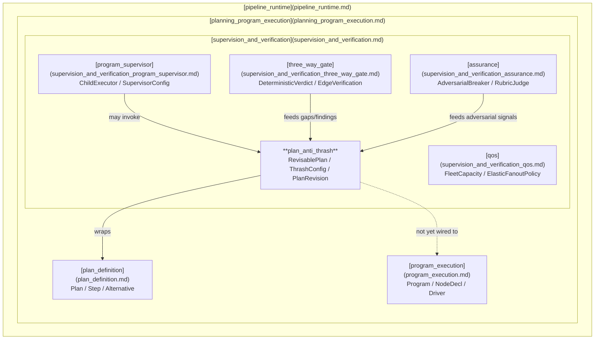
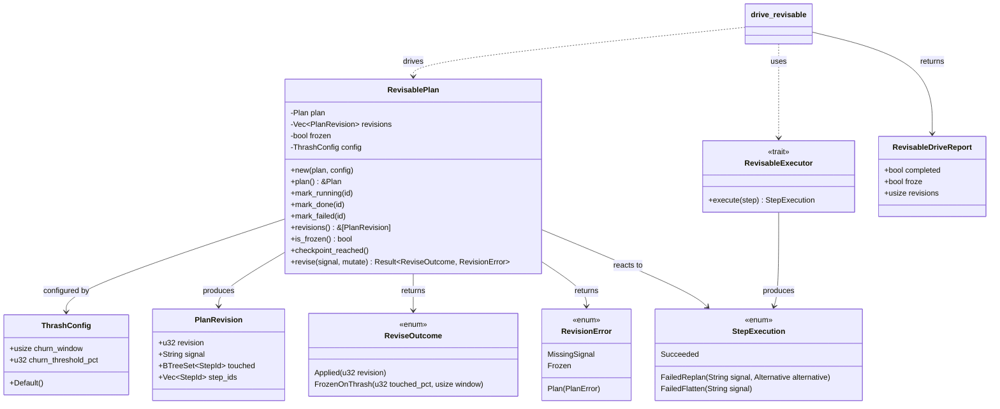
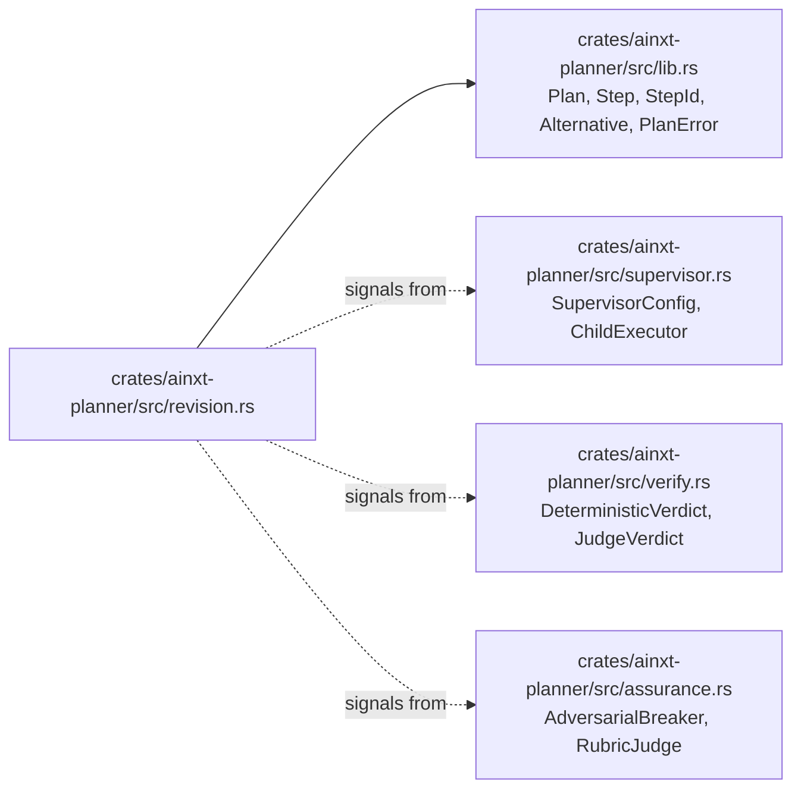
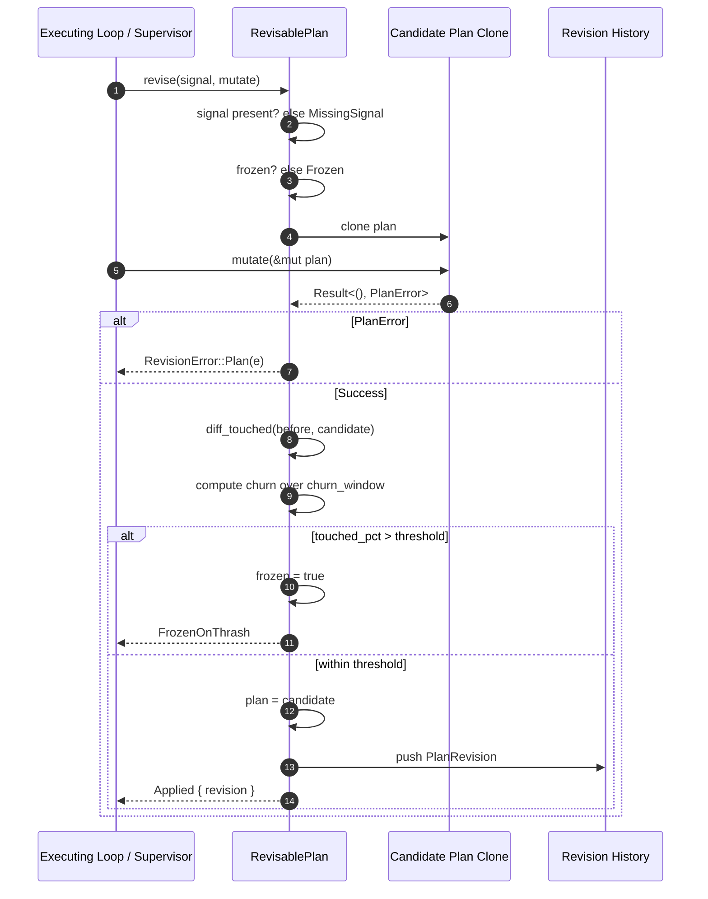
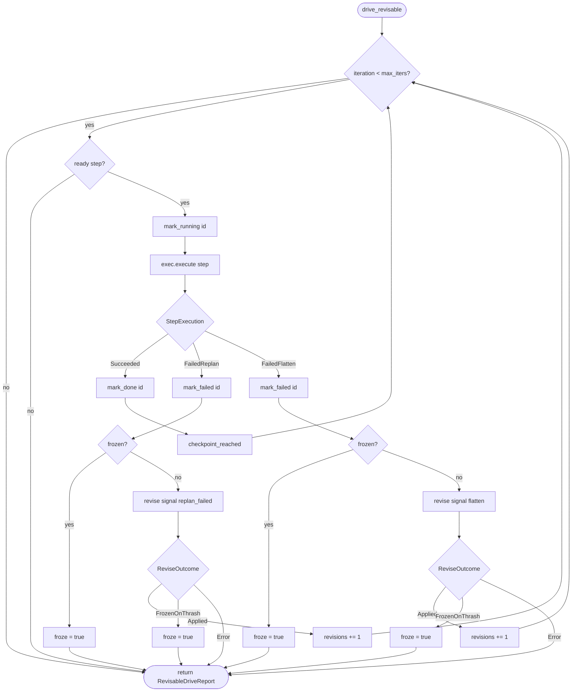
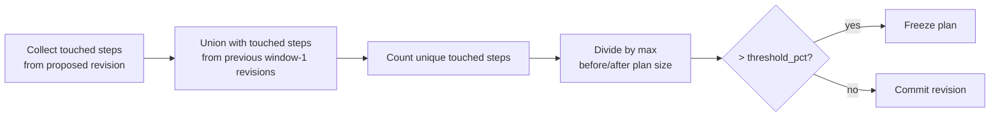
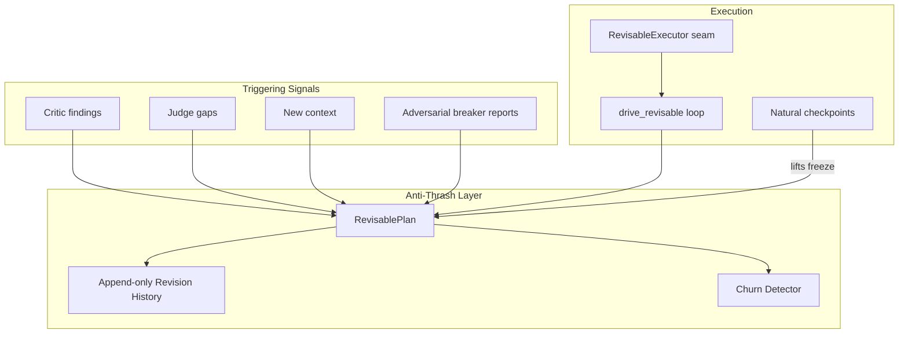

# Plan Anti-Thrash (`supervision_and_verification_plan_anti_thrash`)

## Brief Introduction

The **Plan Anti-Thrash** module provides a deterministic, audit-friendly stability layer around the planner's structural replanning primitives. It enforces three disciplines on every plan mutation:

1. **Change-justification** — every replan must name the critic finding, judge gap, or context change that triggered it.
2. **Append-only revision history** — the plan's shape is never overwritten in place; every accepted mutation records a `PlanRevision`.
3. **Freeze-on-thrash cooldown** — when structural churn across the recent revision window exceeds a configurable threshold, further replanning is frozen until the runtime reaches a natural checkpoint.

The module lives in `crates/ainxt-planner/src/revision.rs` and is part of the larger [supervision_and_verification](supervision_and_verification.md) subsystem within [planning_program_execution](planning_program_execution.md). It wraps the low-level `Plan` type from [plan_definition](plan_definition.md) and is designed to be driven by an executing loop such as `drive_revisable`.

> **Current status:** The `RevisablePlan` wrapper is built around the LOOP-era `Plan`/`Step`/`Alternative` model. The served daemon currently drives the LONG_HORIZON-era `Program`/`NodeDecl` graph, which uses a different retry/quarantine mechanism (bounded attempts on a fixed node). As a result, `RevisablePlan` is not yet wired into the served path; it is ready for the day a real Plan-shaped (add/remove/reorder-step) replanning loop is introduced.

---

## Core Concepts

| Concept | Description |
|---------|-------------|
| `ThrashConfig` | Tunable detector parameters: `churn_window` (how many revisions to look back) and `churn_threshold_pct` (percentage of touched steps that triggers a freeze). |
| `PlanRevision` | One append-only snapshot of the plan after a mutation. Records the revision number, triggering signal, touched step ids, and the full step-id snapshot. |
| `RevisablePlan` | A `Plan` wrapper that gates every structural mutation through the anti-thrash disciplines. Execution-state transitions (`mark_running`, `mark_done`, `mark_failed`) bypass the gate because they are progress, not churn. |
| `ReviseOutcome` | Result of a mutation attempt: either `Applied { revision }` or `FrozenOnThrash { touched_pct, window }`. |
| `RevisionError` | Why a revision was rejected: `MissingSignal`, `Frozen`, or an underlying `PlanError`. |
| `StepExecution` / `RevisableExecutor` | The seam through which an executing loop drives the plan. A step can succeed, fail-with-replan, or fail-with-flatten. |
| `RevisableDriveReport` | Terminal summary from `drive_revisable`: whether the run completed, whether it froze, and how many revisions were applied. |

---

## Architecture

### High-level placement



### Component structure



---

## Dependencies

The module depends on the planner's core plan model and, conceptually, on the supervision/verification subsystems that supply triggering signals.



For details on the underlying plan model, see [plan_definition](plan_definition.md). For the program graph that the served daemon actually drives, see [program_execution](program_execution.md). For the supervisor that would orchestrate a `RevisablePlan` in a LOOP-era runtime, see [supervision_and_verification_program_supervisor](supervision_and_verification_program_supervisor.md).

---

## Data Flow: A Single `revise()` Call



Key properties of this flow:

- **Clone-before-mutate**: a failing mutation leaves the original plan untouched.
- **Signal required at the API boundary**: `None` returns `RevisionError::MissingSignal` before any work is done.
- **Freeze is pre-commit**: a thrashing mutation is rolled back; only the `frozen` flag changes.
- **Append-only history**: successful mutations push a new `PlanRevision`; nothing is ever overwritten.

---

## Process Flow: `drive_revisable`

`drive_revisable` is the reference executing loop that wires the anti-thrash detector into live execution. It repeatedly picks a ready step, executes it through the `RevisableExecutor` seam, and routes the outcome.



Important distinctions:

- `mark_running` / `mark_done` / `mark_failed` are **execution transitions** and bypass `revise()` because they represent progress, not structural churn.
- A successful step is a **natural checkpoint** and lifts any thrash freeze.
- `FailedReplan` and `FailedFlatten` are **structural mutations** and must pass through `revise()` with a signal.
- `FailedFlatten` implements LOOP §3: when a materialized independence assumption is proven wrong, the plan is flattened back to a sequential list through the same governed seam.

---

## Churn Calculation

Churn is the percentage of unique step ids touched across the current proposed revision plus the previous `churn_window - 1` revisions, relative to the larger of the before/after plan sizes.



Default values (configurable via `ThrashConfig`):

- `churn_window = 3`
- `churn_threshold_pct = 40`

A step counts as "touched" if it was added, removed, or had its description or dependencies changed.

---

## How It Fits into the Overall System

The anti-thrash module sits at the intersection of **planning**, **supervision**, and **execution**:



In the broader [pipeline_runtime](pipeline_runtime.md):

- [plan_definition](plan_definition.md) defines the shape of a plan.
- [program_execution](program_execution.md) defines the `Program` graph that the served daemon actually executes.
- [supervision_and_verification_program_supervisor](supervision_and_verification_program_supervisor.md) would be the natural orchestrator for a `RevisablePlan` run.
- [supervision_and_verification_three_way_gate](supervision_and_verification_three_way_gate.md) and [supervision_and_verification_assurance](supervision_and_verification_assurance.md) supply the critic/judge/adversarial signals that justify revisions.

---

## API Overview

### Creating and inspecting a revisable plan

```rust
let rp = RevisablePlan::new(plan, ThrashConfig::default());
let plan: &Plan = rp.plan();
let history: &[PlanRevision] = rp.revisions();
let frozen: bool = rp.is_frozen();
```

### Execution-state transitions (bypass anti-thrash gate)

```rust
rp.mark_running(&id)?;
rp.mark_done(&id)?;
rp.mark_failed(&id)?;
```

### Structural mutation (gated)

```rust
let outcome = rp.revise(Some("critic: s0 needs a prereq"), |p| {
    p.replan_failed(&id, Alternative::replace("new route", vec![]))
        .map(|_| ())
})?;
```

### Driving the loop

```rust
let report = drive_revisable(&mut rp, &mut executor, max_iters);
```

---

## Configuration

`ThrashConfig` is pure data and cloneable:

```rust
pub struct ThrashConfig {
    pub churn_window: usize,      // default: 3
    pub churn_threshold_pct: u32, // default: 40
}
```

These defaults are illustrative. Real workloads are expected to tune them based on plan size, task granularity, and observed churn patterns.

---

## Determinism and Testability

The module is designed to be deterministic given:

- a fixed initial `Plan`,
- a fixed `ThrashConfig`,
- a deterministic `RevisableExecutor` seam.

All state is in-memory and cloneable. The test suite covers:

- rejection of signal-less mutations,
- append-only revision recording with signals,
- freeze-on-thrash behavior and checkpoint recovery,
- no-op behavior for failing mutations.

---

## References

- [supervision_and_verification](supervision_and_verification.md) — parent module.
- [supervision_and_verification_program_supervisor](supervision_and_verification_program_supervisor.md) — orchestrates child executors and would drive a revisable plan.
- [supervision_and_verification_three_way_gate](supervision_and_verification_three_way_gate.md) — deterministic/judge verification that can supply replan signals.
- [supervision_and_verification_assurance](supervision_and_verification_assurance.md) — adversarial assurance and rubric judging.
- [supervision_and_verification_qos](supervision_and_verification_qos.md) — fleet capacity and fan-out policies.
- [plan_definition](plan_definition.md) — `Plan`, `Step`, `StepId`, `Alternative`, and `PlanError`.
- [program_execution](program_execution.md) — the `Program`/`NodeDecl` graph that the served daemon currently uses.
- [pipeline_runtime](pipeline_runtime.md) — top-level runtime module.
