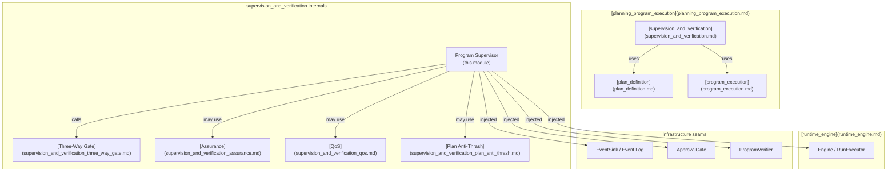
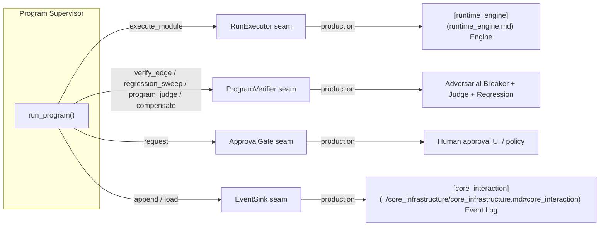
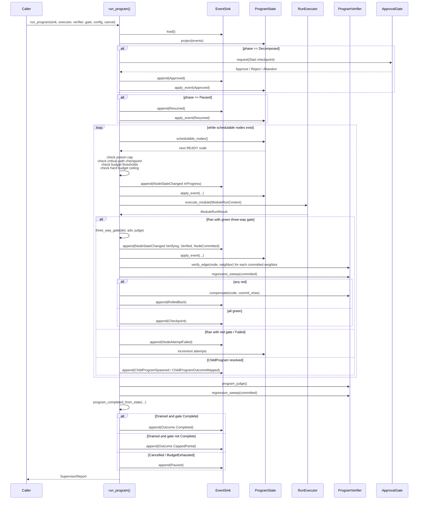
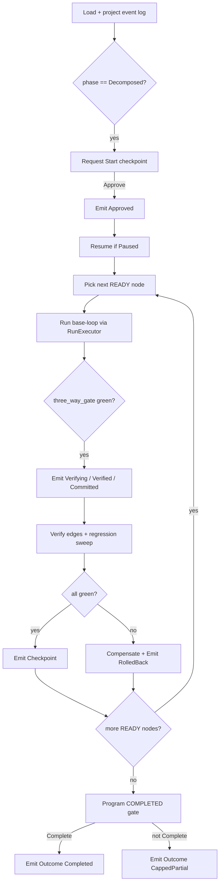
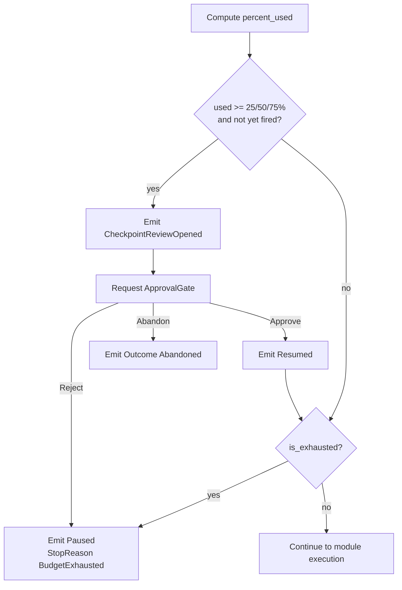
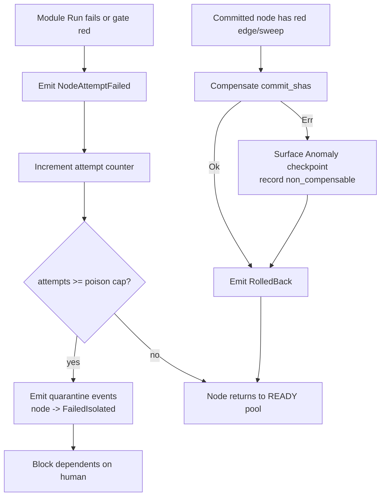

# Program Supervisor

The **Program Supervisor** is the execution driver for long-horizon, multi-module programs in the `ainxt-planner` crate. It takes a decomposed program (a Module Transition Graph, or MTG), schedules READY modules one at a time, invokes the base-loop runtime through an injected seam, and applies a multi-layer verification gate before any work is considered committed. It is the bridge between the pure, event-sourced [`program`](supervision_and_verification_program_supervisor.md#related-modules) state machine and the real-world runtime, persistence, human approval, and verification services.

The Supervisor is designed around a small set of injectable seams so that the orchestration logic itself remains deterministic and fully testable. The real Engine, durable event log, approval gate, and verification proofs are all supplied by the caller. This lets the same loop run end-to-end against fakes in unit tests and against production services in deployment.

## Core responsibilities

- **Schedule and drive to completion**: pick the next READY module in deterministic order, run it, and fold the result back into the program state.
- **Enforce the three-way gate**: no module self-declares "done"; completion requires independent deterministic, adversarial, and cross-model judge verdicts (see [Three-Way Gate](supervision_and_verification_three_way_gate.md)).
- **Program-level verification**: after each commit, verify integration edges against already-committed neighbors and run a regression sweep over all committed work.
- **Budget governance**: roll up per-module costs into a program aggregate; force human checkpoint reviews at 25/50/75% and hard-pause at 100%.
- **Staged human checkpoints**: gate program start, budget thresholds, and critical-path modules through an injected approval seam.
- **Failure isolation and route-around**: quarantine modules that fail past a poison cap while letting independent branches continue, producing a deployable partial result.
- **Durable, resumable execution**: append every event to a durable log; resume from the log after crashes or cancellation without re-committing already-done work.

## Where it fits

The Supervisor lives inside the `supervision_and_verification` sub-module of `planning_program_execution`. It depends on:

- **[plan_definition](plan_definition.md)** for the MTG, node declarations, goals, and plan structure.
- **[program_execution](program_execution.md)** for the pure `ProgramState`, `ProgramEvent`, and projection logic.
- **[Three-Way Gate](supervision_and_verification_three_way_gate.md)** for per-module and program-level completion verdicts.
- **[runtime_engine](runtime_engine.md)** (via the `RunExecutor` seam) for the actual base-loop Run execution.

## Architecture

### Injectable seams

The Supervisor never depends directly on `ainxt-runtime`. Instead, it defines four traits that the production harness wires in:

| Seam | Trait | Purpose |
|------|-------|---------|
| Base-loop execution | `RunExecutor` | Runs one module-scoped base-loop Run and returns deterministic results. |
| Program verification | `ProgramVerifier` | Provides per-edge integration verdicts, regression sweep, program-level judge, and rollback compensation. |
| Human checkpoint | `ApprovalGate` | Decides whether to approve, reject, or abandon a checkpoint. |
| Durability | `EventSink` | Appends every `ProgramEvent` to a durable log and loads it for resume/projection. |

These seams make the Supervisor loop deterministic and testable: the tests in `supervisor.rs` drive the entire loop with `HappyExecutor`, `GreenVerifier`, `AutoApprove`, and `VecEventSink`.

### Cost and budget model

`ProgramCost` tracks tokens, tool calls, and micro-dollars. Costs are rolled up with `saturating_add` so the aggregate can never wrap and silently defeat the budget.

`ProgramBudget` defines token and dollar ceilings. It reports the consumed percentage as the tighter of the two ceilings. A zero ceiling is treated as already-full (100%) to avoid division-by-zero surprises.

`BUDGET_THRESHOLDS` at 25%, 50%, and 75% trigger `CheckpointReviewOpened` events and force an `ApprovalGate` request before further spending. Crossing 100% is a hard pause (`Paused` state, `StopReason::BudgetExhausted`) and never silent continuation.

### State machine integration

The Supervisor does not own the state machine; it owns the *driver loop*. The state machine lives in [`program_execution`](program_execution.md) (`program.rs`). The Supervisor:

1. Loads all events from the `EventSink`.
2. Projects them into a `ProgramState` via `project()`.
3. Appends each new event to the sink **before** applying it to the in-memory state.
4. On exit, returns a `SupervisorReport` with the terminal outcome, gate verdict, cost, and partial report.

Because every decision is durably logged first, a fresh projection of the log equals the live state, and re-running `run_program` on the same log resumes exactly where the previous call stopped.

## Data flow

## Component reference

### Cost and budget

- **`ProgramCost`** — Aggregate cost in tokens, tool calls, and micro-dollars. Provides `saturating_add`.
- **`ProgramBudget`** — Hard ceiling above the per-Run budget. Computes `percent_used` and `is_exhausted`.
- **`BUDGET_THRESHOLDS`** — Constant `[25, 50, 75]` triggering staged checkpoint reviews.

### Seams

- **`ModuleRunContext`** — Context passed to `RunExecutor` for one module: program id, node id, class, goal, attempt counter, and whether a child-program node has already resolved.
- **`ModuleRunResult`** — Result of one module Run:
  - `Ran { det, adv, judge, commit_shas, ledger_key, by_model, cost }`
  - `Failed { reason, cost }`
  - `ChildProgram { child_program_id, outcome, cost }`
- **`RunExecutor`** — Trait with `execute_module(&mut self, ctx: &ModuleRunContext) -> ModuleRunResult`.
- **`ProgramVerifier`** — Trait providing `verify_edge`, `regression_sweep`, `program_judge`, and optional `compensate` for rollback side effects.
- **`Checkpoint`** / **`CheckpointReason`** — Staged human checkpoint reasons: `Start`, `Budget(u32)`, `CriticalPath`, `Anomaly`.
- **`ApprovalDecision`** — `Approve`, `Reject`, `Abandon`.
- **`ApprovalGate`** — Trait with `request(&mut self, checkpoint: &Checkpoint) -> ApprovalDecision`.
- **`AutoApprove`** — Approval gate that always approves; for tests and fully autonomous runs.
- **`EventSink`** — Durable persistence trait: `append` and `load`.
- **`VecEventSink`** — In-memory `EventSink` for tests and out-of-band persistence.

### Configuration and reporting

- **`SupervisorConfig`** — Caps: `ProgramBudget`, `PoisonPolicy`, and `max_iterations`.
- **`StopReason`** — Why the loop stopped: `Drained`, `BudgetExhausted`, `Cancelled`, `Abandoned`, `IterationGuard`.
- **`SupervisorReport`** — Terminal report: program id, outcome, gate verdict, stop reason, total cost, final state, and partial completion report.

### Driver

- **`run_program`** — The main execution loop. Loads the log, drives scheduling, verification, budget governance, checkpoints, and emits terminal or paused outcomes.
- **`program_completed_from_state`** — Builds the program `COMPLETED` gate input from the final committed state, edge verdicts, regression sweep, and program judge.
- **`finish`** — Helper that constructs the final `SupervisorReport` for terminal phases.

## Process flows

### Happy path

### Budget governance

### Failure isolation and rollback

## Integration with other modules

- **[program_execution](program_execution.md)** — The Supervisor projects and advances the pure `ProgramState` defined here. All state transitions are validated by the state machine.
- **[supervision_and_verification_three_way_gate](supervision_and_verification_three_way_gate.md)** — The Supervisor calls `three_way_gate` for per-module completion and `program_completed` for the final gate.
- **[supervision_and_verification_assurance](supervision_and_verification_assurance.md)** — Provides adversarial breaking and rubric-based assurance that may back the `ProgramVerifier` seam.
- **[supervision_and_verification_qos](supervision_and_verification_qos.md)** — Fleet capacity and fan-out policies that can influence scheduling or checkpoint timing.
- **[supervision_and_verification_plan_anti_thrash](supervision_and_verification_plan_anti_thrash.md)** — Plan revision and thrash detection for long-horizon replanning.
- **[runtime_engine](runtime_engine.md)** — The production `RunExecutor` implementation lives here.
- **[core_interaction](../core_infrastructure/core_infrastructure.md#core_interaction)** — The production `EventSink` is typically backed by the hash-chained event log (`ainxt-eventlog`).

## Testing strategy

The module includes extensive end-to-end tests that exercise the Supervisor loop against fakes:

- `gap_loop_02_supervisor_runs_a_program_to_completion` — happy path through a three-node chain.
- `gap_loop_06_projecting_the_sink_equals_live_state_and_resume_is_noop` — durable log equals live state; terminal resume is a no-op.
- `gap_loop_06_a_cancelled_program_resumes_from_its_checkpoint` — cooperative cancellation and resume.
- `gap_loop_07_crossing_the_hard_budget_ceiling_pauses_the_program` — 100% budget hard pause.
- `gap_loop_07_a_budget_threshold_forces_a_checkpoint_review_gate` — 25/50/75% staged gates.
- `gap_loop_07_critical_path_node_rejected_by_human_is_blocked` — critical-path human checkpoint.
- `gap_loop_14_red_integration_edge_reopens_introducer_and_blocks_completion` — rollback on red edge.
- `gap_loop_14_poison_module_quarantined_and_program_routes_around` — poison cap and route-around.
- `gap_loop_02_child_program_node_resolves_then_parent_runs_own_work` — nested child-program composition.

These tests are the executable specification of the guarantees listed in the module doc comment.
