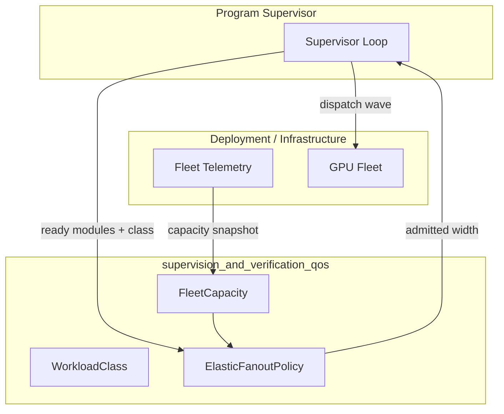
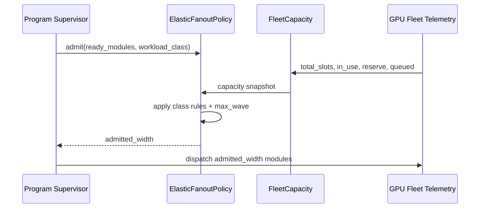
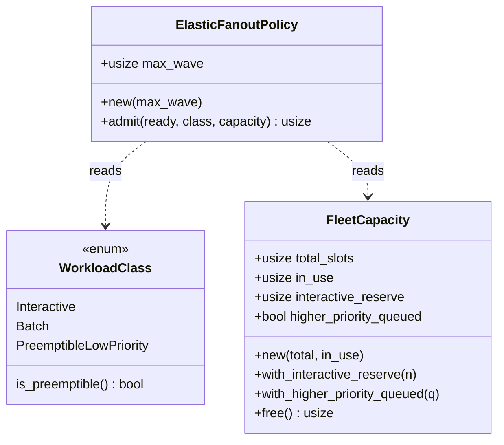
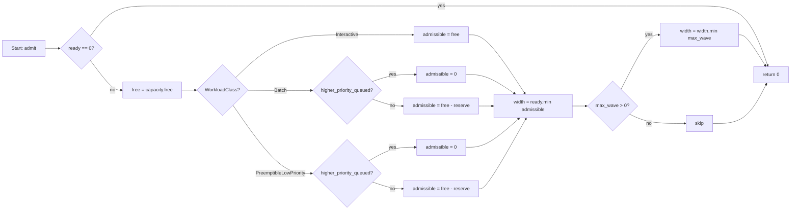

# Supervision and Verification QoS

The `supervision_and_verification_qos` module provides the **GPU-fleet Quality-of-Service (QoS) admission policy** used by the planner's program supervisor when dispatching waves of independent modules. It closes the gap between long-horizon, fan-out program execution and the shared, finite GPU fleet that also serves latency-sensitive interactive traffic. The module is intentionally pure and deterministic: it decides *how many* ready modules may be admitted in a single wave, given a workload class and a live fleet-capacity snapshot, but it does not interact with the actual fleet, scheduler, or clock.

For the broader planning and supervision context, see [supervision_and_verification_program_supervisor](supervision_and_verification_program_supervisor.md), [supervision_and_verification_three_way_gate](supervision_and_verification_three_way_gate.md), and [planning_program_execution](planning_program_execution.md).

---

## Purpose and Core Functionality

Long-horizon programs (for example, a 1M-LOC batch migration) decompose into many independent modules that can run in parallel. Without regulation, the fan-out width is either a fixed ceiling that leaves the fleet idle, or an unbounded burst that starves interactive chat/edit traffic. This module introduces:

1. **Workload classes** — `Interactive`, `Batch`, and `PreemptibleLowPriority` — that express priority and preemption semantics.
2. **Fleet capacity snapshots** — a simple, testable model of total slots, in-use slots, interactive headroom, and queued higher-priority work.
3. **Elastic fan-out policy** — a deterministic `admit(ready, class, capacity)` function that computes the wave width for the current instant.

The result is a number between `0` and `ready`. The driver uses this value to bound the next wave of module dispatches.

---

## Architecture



The QoS module sits between the supervisor loop and the live fleet. The supervisor supplies the number of dependency-satisfied modules and the run's workload class. The deployment supplies a `FleetCapacity` snapshot derived from fleet telemetry. The policy returns an admission count, and the supervisor dispatches no more than that many modules in the next wave.

---

## Core Components

### `WorkloadClass`

An ordered enum that defines three priority tiers. The derived `Ord` instance encodes the shed priority: `Interactive < Batch < PreemptibleLowPriority`.

| Variant | Priority | Preemptible | Behavior |
|---------|----------|-------------|----------|
| `Interactive` | Highest | No | May use all free capacity, including the interactive reserve. |
| `Batch` | Medium | No | Uses free capacity minus the interactive reserve; yields its *next* wave when higher-priority work is queued. |
| `PreemptibleLowPriority` | Lowest | Yes | Uses only spare capacity; yields entirely when higher-priority work is queued. |

The `is_preemptible()` helper returns `true` only for `PreemptibleLowPriority`. Actual in-flight preemption is the infrastructure half of the contract; the policy half simply refuses to admit new waves for preemptible work when higher-priority work is waiting.

### `FleetCapacity`

A snapshot of the shared GPU fleet at a single instant. All counts are in units of concurrent module Runs.

| Field | Meaning |
|-------|---------|
| `total_slots` | Maximum concurrent Runs the fleet can serve. |
| `in_use` | Runs currently occupying slots. |
| `interactive_reserve` | Headroom reserved for interactive traffic; never consumed by `Batch` or lower. |
| `higher_priority_queued` | Whether higher-priority work is waiting; causes lower classes to yield. |

Builder methods `with_interactive_reserve` and `with_higher_priority_queued` allow tests and callers to construct snapshots declaratively. The `free()` method returns `total_slots - in_use` saturated at zero.

### `ElasticFanoutPolicy`

The admission policy itself. It carries one tunable:

| Field | Meaning |
|-------|---------|
| `max_wave` | Hard per-wave ceiling. `0` means "no explicit ceiling" (bounded only by capacity and ready width). |

The `admit(ready, class, capacity)` method applies the class-specific rules and returns:

```text
min(ready, admissible_capacity, max_wave?)
```

The class rules are:

- **Interactive** — `admissible = free` (may consume the reserve).
- **Batch** — `admissible = free - interactive_reserve`, or `0` if `higher_priority_queued`.
- **PreemptibleLowPriority** — same arithmetic as Batch, but also the first to be shed.

The function is pure: no I/O, no randomness, no clock access. Every branch is a unit-test property.

---

## Data Flow



1. The supervisor determines how many modules are ready to run.
2. The deployment populates a `FleetCapacity` snapshot from live telemetry.
3. The policy computes the admissible wave width.
4. The supervisor dispatches at most that many modules.

---

## Component Interactions



---

## Process Flow: Admitting a Wave



---

## Relationship to the System

This module is one piece of the [supervision_and_verification](supervision_and_verification_program_supervisor.md) subsystem inside [planning_program_execution](planning_program_execution.md). It is used by the program supervisor to regulate the parallel fan-out of module execution.

- The [supervision_and_verification_program_supervisor](supervision_and_verification_program_supervisor.md) owns the run loop and decides *which* modules are ready.
- The [supervision_and_verification_three_way_gate](supervision_and_verification_three_way_gate.md) verifies each module's outcome before commit.
- The [supervision_and_verification_assurance](supervision_and_verification_assurance.md) provides adversarial and rubric-based judging.
- The [supervision_and_verification_plan_anti_thrash](supervision_and_verification_plan_anti_thrash.md) prevents replanning loops.
- This QoS module decides *how many* ready modules may run at once, protecting interactive traffic from batch migrations.

The module also relates to the serving infrastructure described in [server_serving](server_serving.md) and [runtime_engine](runtime_engine.md), because the actual GPU fleet, autoscaling, preemption, and batching live there. The QoS policy is the planner-side admission rule that those serving systems enforce against.

---

## Design Notes

- **Pure policy, no infra**: The module deliberately does not touch vLLM, GPU counts, KV-cache state, or autoscale controllers. Those are `needs_hot_wiring` infrastructure concerns.
- **Deterministic and testable**: Every rule is expressed as saturating arithmetic and boolean checks, making it easy to unit-test offline.
- **Ordered enum semantics**: `WorkloadClass`'s `Ord` instance means "cheaper to shed" as the value increases, which is useful for priority comparisons elsewhere.
- **Blast-radius cap**: `max_wave` bounds cost even when the fleet is huge and a program has thousands of ready modules.

---

## Testing

The module includes unit tests covering:

- Interactive traffic may consume the full free capacity, including the reserve.
- Batch traffic leaves the interactive headroom.
- Batch yields when higher-priority work is queued.
- Preemptible low-priority traffic uses only slack and yields first.
- `max_wave` caps admission even on a large fleet.
- Admission never exceeds `ready` and returns `0` when the fleet is full.
- Class ordering reflects shed priority.

These tests run without any infrastructure dependencies.
