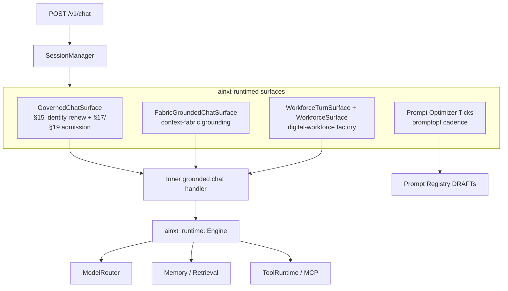
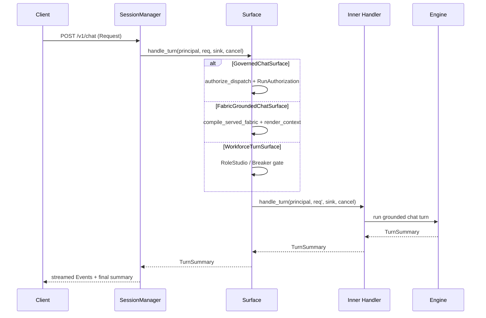

# Surfaces Module

The **surfaces** module lives inside the `ainxt-runtimed` daemon and provides the *composition-root* turn handlers ("surfaces") that can be mounted on the served chat path (`POST /v1/chat`). Each surface is a [`TurnHandler`](runtime_engine.md) wrapper that adds a specific cross-cutting concern—identity governance, multi-graph context grounding, digital-workforce role governance, or prompt-engineering optimization—before delegating to the real chat handler.

All surfaces are **additive and config-selectable** via the daemon's `--surface` selector. They do not change the default `/v1/chat` surface; instead, they layer new behavior on top of it while preserving byte-identical behavior when the new feature is not engaged (empty fabric, offline default, etc.).

## Architecture Overview

The surfaces sit between the transport/session layer (`ainxt_session::SessionManager`) and the grounded chat engine. Each surface implements [`TurnHandler`](runtime_engine.md) so the session manager can drive it uniformly. Internally, a surface may:

1. Inspect or transform the [`Request`](../core_infrastructure/core_interaction.md).
2. Run a pre-delegate gate (identity admission, fabric routing, workforce governance).
3. Forward to an inner `TurnHandler` (usually the default chat surface).
4. Stream events back through the same `mpsc::Sender<Event>` channel.

## Sub-modules

| Sub-module | File | Responsibility | Documentation |
|---|---|---|---|
| Chat Identity | `chat_identity.rs` | §15 short-TTL JIT renew-and-re-attest + §17/§19 in-flight admission for every chat turn. | [surfaces_chat_identity.md](surfaces_chat_identity.md) |
| Fabric Chat | `fabric_chat.rs` | Ground every turn through a populated Context-Fabric (`MultiGraphFabric`) before chat handling. | [surfaces_fabric_chat.md](surfaces_fabric_chat.md) |
| Workforce Surface | `workforce_surface.rs` | Expose the AiNxt-OS digital-workforce factory (Role Studio, Breaker gate, kernel process model) on the served path. | [surfaces_workforce.md](surfaces_workforce.md) |
| Prompt Optimizer Surface | `prompt_optimizer_surface.rs` | Drive live `ainxt-promptopt` sweeps on a recurring cadence and bridge winners into Registry DRAFTs. | [surfaces_prompt_optimizer.md](surfaces_prompt_optimizer.md) |

> Each row links to a dedicated sub-module document with component-level details, data-flow diagrams, and hot-wiring notes.

## Key Design Principles

- **Fail-closed:** Every gate (identity, OBO authorization, Breaker, fabric eligibility) denies the turn rather than silently proceeding when a check fails.
- **Additive:** Surfaces are layered via `Arc<dyn TurnHandler>` wrappers; the default chat path is unchanged unless explicitly selected.
- **Deterministic offline defaults:** Each surface ships with an air-gapped-safe default (`CompliantExecutor`, empty fabric, logical turn clock) and can be hot-wired to live infrastructure.
- **Shared state:** Live surfaces share the same `ModelRouter`, control plane, kernel tables, and registries that the rest of the daemon uses, avoiding disconnected copies.

## Relationship to Other Modules

- **[runtime_engine](runtime_engine.md):** Surfaces are `TurnHandler` implementations consumed by `SessionManager` and the runtime `Engine`.
- **[core_interaction](../core_infrastructure/core_interaction.md):** Surfaces operate on `Request`/`Event`/`TurnSummary` protocol types.
- **[knowledge_retrieval](../ai_engine/knowledge_retrieval.md):** `FabricGroundedChatSurface` consumes `MultiGraphFabric` and `compile_served_fabric` from the context/retrieval stack.
- **[governance_compliance](../governance_compliance/governance_compliance.md):** `GovernedChatSurface` drives `ControlPlane::authorize_dispatch` and `RunAuthorization`; `WorkforceSurface` integrates governance, CODEOWNERS, and Marketplace TOFU pinning.
- **[ai_engine/prompt_engineering](../ai_engine/prompt_engineering.md):** The prompt optimizer surface bridges `ainxt-promptopt` into the live `Registry`.
- **[governance_compliance/workforce](../governance_compliance/workforce.md):** `WorkforceSurface` re-exports and composes the workforce factory, kernel, and controls.

## Data Flow

## Configuration & Mounting

Surfaces are selected at daemon startup via `--surface <name>` (see `ainxt-runtimed::main`). The composition root (`assemble_selected`) constructs the requested surface and threads it onto `Assembled::manager` through a `SessionManager`. Live wiring (real model router, real control repo, real cron) is explicitly marked `needs_hot_wiring` in each surface's documentation and remains a deployment responsibility.
