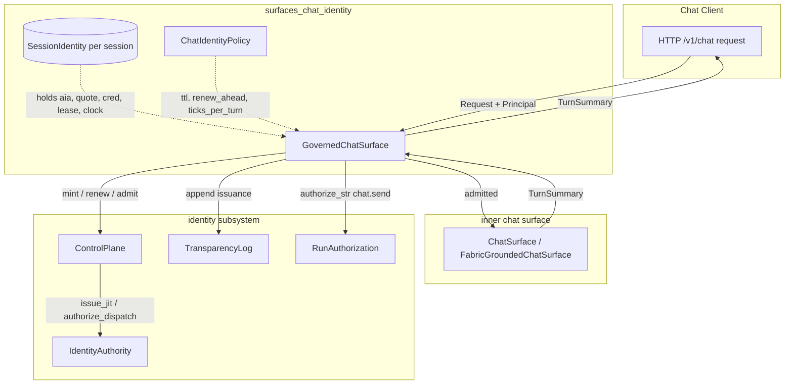
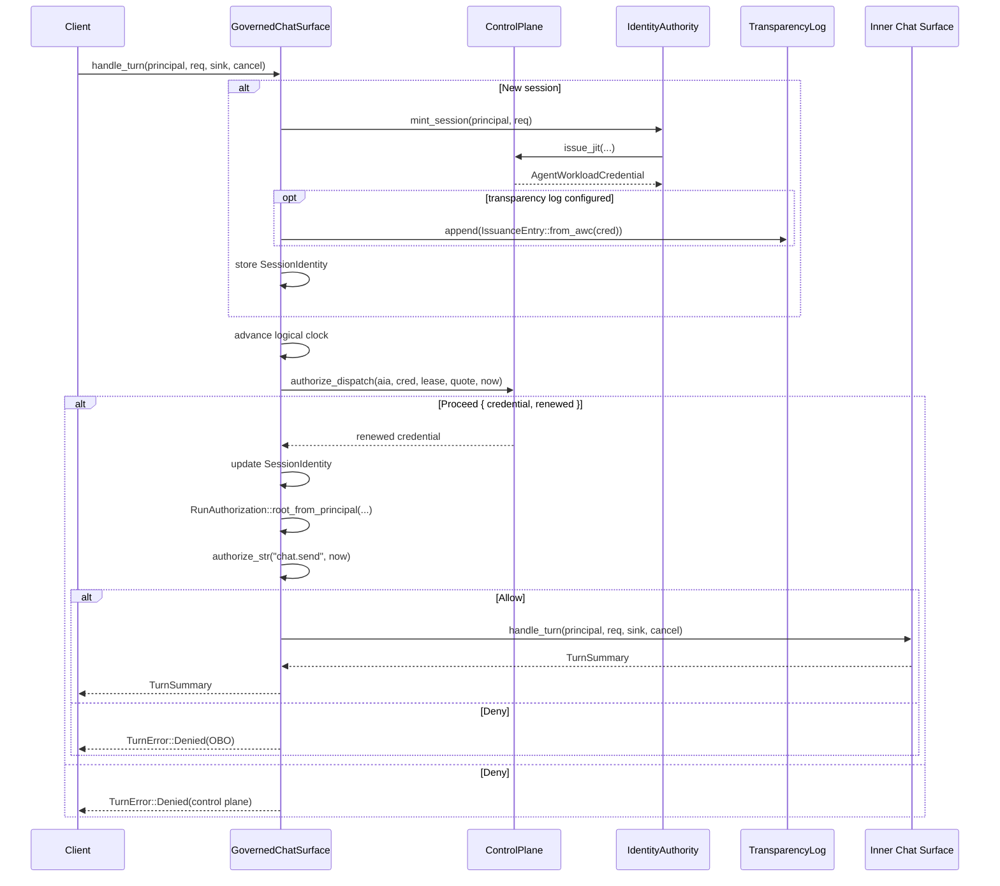
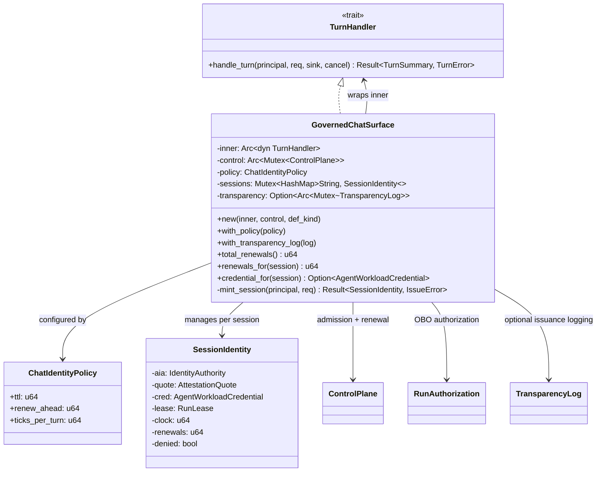
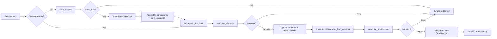

# surfaces_chat_identity

## Brief Introduction

The `surfaces_chat_identity` module implements **governed identity admission for the chat surface**. It wraps the ordinary grounded chat handler (`ChatSurface`) inside a `GovernedChatSurface` that, on **every turn of a chat run**, enforces short-TTL credential renewal, re-attestation, in-flight admission, and OBO (on-behalf-of) confused-deputy authorization. This closes the gap where long-running multi-turn chat sessions previously held a single standing identity grant that was never re-attested or revoked mid-run.

The module is additive and config-selectable: it does not change the default `/v1/chat` surface or authenticator. It is located in `crates/ainxt-runtimed/src/chat_identity.rs` and is part of the `runtime_engine` → `surfaces` subsystem under `pipeline_runtime`.

---

## Core Functionality

### 1. Per-Turn Identity Admission

`GovernedChatSurface` is a [`TurnHandler`](core_engine.md) decorator. Before delegating to the inner chat handler, it performs two identity gates on every turn:

- **JIT renew-and-re-attest (§15).** A fresh short-TTL `AgentWorkloadCredential` is minted or renewed as the run's logical clock approaches expiry. The credential is re-attested against reference values and re-checked against the shared deny-state.
- **In-flight admission (§17/§19).** A kill-switch, run-revocation, or OBO-revocation pulled on the shared control plane denies the next turn immediately (fail-closed).

### 2. OBO Confused-Deputy Authorization

Once admitted, the turn constructs a [`RunAuthorization`](../governance_compliance/identity.md) rooted at the real authenticated principal and the just-admitted credential. It then authorizes the `chat.send` action. A structurally invalid delegation chain (reserved payment-initiation verb, expiry, cycle) denies the turn fail-closed.

### 3. Transparency Logging

Optionally, every newly minted chat-run credential is appended to the same HMAC-signed issuance transparency log used by the Program and Team surfaces. This provides external-auditor inclusion-proof-verifiable records for chat-run issuance.

### 4. Deterministic Logical Clock

The identity crate reads no wall clock. The surface advances a per-session logical turn clock, making renewal cadence deterministic and testable.

---

## Core Components

### `ChatIdentityPolicy`

Renew cadence knobs for a chat run's short-TTL credential:

| Field | Meaning |
|-------|---------|
| `ttl` | Short TTL in logical ticks for each minted credential. |
| `renew_ahead` | Renew when `now` is within this many ticks of expiry. |
| `ticks_per_turn` | Logical ticks the run clock advances per turn. |

Defaults are small logical values (`ttl=3`, `renew_ahead=1`, `ticks_per_turn=1`) so multi-turn chat runs exercise the renew chain in tests; deployments tune them to match the deployed AWC TTL.

### `SessionIdentity`

Per-session identity state for a chat run:

- `aia`: the minting `IdentityAuthority`.
- `quote`: the attestation quote reused for re-attestation on each renewal.
- `cred`: the current `AgentWorkloadCredential`.
- `lease`: the `RunLease` tracking renew-ahead state.
- `clock`: the run's logical turn clock.
- `renewals` / `denied`: observability counters.

### `GovernedChatSurface`

A `TurnHandler` that wraps an inner grounded chat handler. Key behaviors:

- `new(inner, control, def_kind)` — wrap the inner handler and bind it to a shared `ControlPlane`.
- `with_policy(policy)` — override the default renew cadence.
- `with_transparency_log(log)` — wire an issuance transparency log.
- `mint_session(principal, req)` — JIT-mint the first credential at run start, gated on the shared control plane.
- `handle_turn(...)` — per-turn identity gate + delegation to the inner handler.
- `total_renewals()`, `renewals_for(session)`, `credential_for(session)` — observability helpers.

---

## Architecture



---

## Data Flow



---

## Component Relationships



---

## Process Flow: Single Turn



---

## How It Fits into the Overall System

`surfaces_chat_identity` sits in the **runtime engine's surface layer**, between the HTTP server and the grounded chat implementation:

- It is one of four runtime surfaces under `runtime_engine` → `surfaces`:
  - [`surfaces_chat_identity`](surfaces_chat_identity.md) — identity-governed chat.
  - [`surfaces_fabric_chat`](surfaces_fabric_chat.md) — fabric-grounded chat.
  - [`surfaces_workforce`](surfaces_workforce.md) — workforce/role-invocation surface.
  - [`surfaces_prompt_optimizer`](surfaces_prompt_optimizer.md) — prompt-optimization surface.
- It consumes the shared [`ControlPlane`](../governance_compliance/identity.md) from the governance/identity subsystem for admission, renewal, and revocation.
- It relies on the [`TurnHandler`](core_engine.md) abstraction from the core runtime engine so it can wrap any chat handler without changing its interface.
- It uses [`Principal`](../core_infrastructure/security_config.md) from the types/config layer and [`Request`](../core_infrastructure/core_interaction.md) / [`Event`](../core_infrastructure/core_interaction.md) from the protocol layer.
- It is assembled selectively via `assemble_chat_governed` in the runtime configuration layer; the default `/v1/chat` path remains unchanged when the governed surface is not enabled.

---

## Dependencies

| Dependency | Module | Purpose |
|------------|--------|---------|
| `ainxt_identity::authority` | [identity](../governance_compliance/identity.md) | `IdentityAuthority`, `AttestationQuote`, `IssueRequest`, `ReferenceValueVerifier` |
| `ainxt_identity::authz` | [identity](../governance_compliance/identity.md) | `RunAuthorization`, `AuthzDecision` |
| `ainxt_identity::control` | [identity](../governance_compliance/identity.md) | `ControlPlane`, `DispatchOutcome`, `RunLease` |
| `ainxt_identity::transparency` | [identity](../governance_compliance/identity.md) | `TransparencyLog`, `IssuanceEntry`, `Sha256Hasher` |
| `ainxt_protocol` | [core_interaction](../core_infrastructure/core_interaction.md) | `Event`, `Request` |
| `ainxt_runtime` | [core_engine](core_engine.md) | `TurnHandler`, `TurnSummary`, `TurnError`, `CancelToken` |
| `ainxt_types` | [security_config](../core_infrastructure/security_config.md) | `Principal` |

---

## Configuration & Usage

A governed chat surface is constructed by wrapping an existing chat handler:

```rust
let governed = GovernedChatSurface::new(
    Arc::new(inner_chat_surface),
    Arc::new(Mutex::new(control_plane)),
    "my-product",
)
.with_policy(ChatIdentityPolicy {
    ttl: 60,
    renew_ahead: 10,
    ticks_per_turn: 1,
})
.with_transparency_log(transparency_log);
```

The surface is then registered as the chat `TurnHandler` in the runtime. Because it implements `TurnHandler`, the rest of the runtime engine treats it identically to the ungoverned chat surface.

---

## Security & Compliance Notes

- **Fail-closed.** Any issuance failure, renewal failure, control-plane denial, or OBO authorization denial returns `TurnError::Denied`; the model turn never starts.
- **No clock dependency.** Logical time is supplied by the surface, making behavior deterministic and testable.
- **Transparency parity.** Chat-run credential issuance can be logged in the same transparency log as Program/Team surfaces, satisfying ADR-022 §13.
- **OBO confused-deputy closure.** The real principal's actual capabilities are checked against reserved payment-initiation verbs on every turn.

---

## See Also

- [core_engine](core_engine.md) — `TurnHandler`, `TurnSummary`, runtime engine abstractions.
- [identity](../governance_compliance/identity.md) — `ControlPlane`, `IdentityAuthority`, `RunAuthorization`, transparency logging.
- [security_config](../core_infrastructure/security_config.md) — `Principal`, types, and configuration primitives.
- [core_interaction](../core_infrastructure/core_interaction.md) — `Request`, `Event`, session protocol.
- [surfaces_fabric_chat](surfaces_fabric_chat.md) — fabric-grounded chat surface.
- [surfaces_workforce](surfaces_workforce.md) — workforce role-invocation surface.
- [surfaces_prompt_optimizer](surfaces_prompt_optimizer.md) — prompt-optimization surface.
