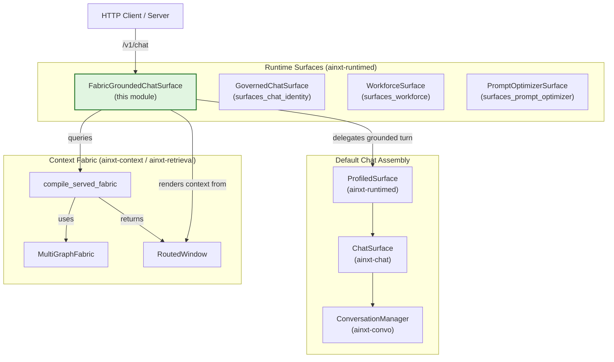
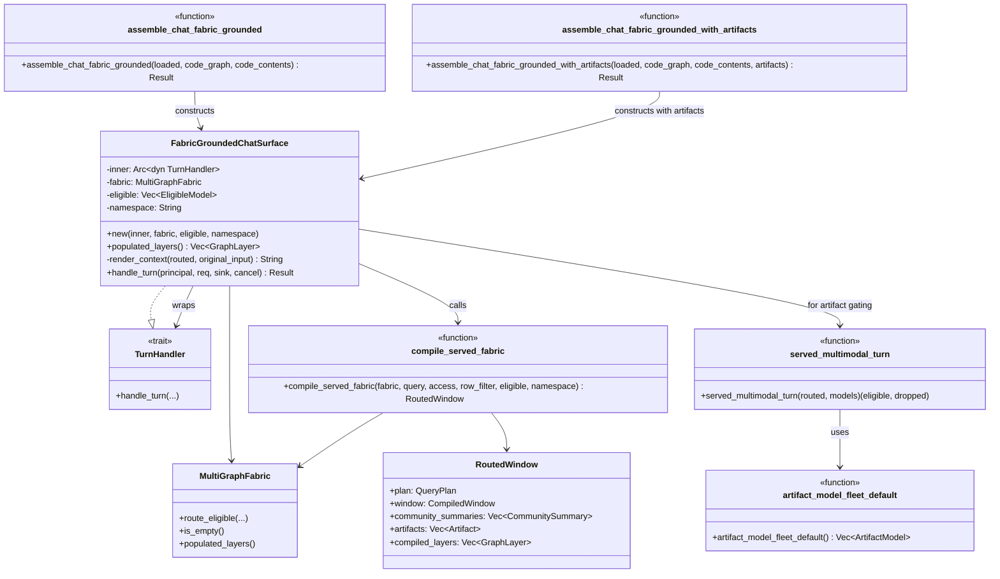
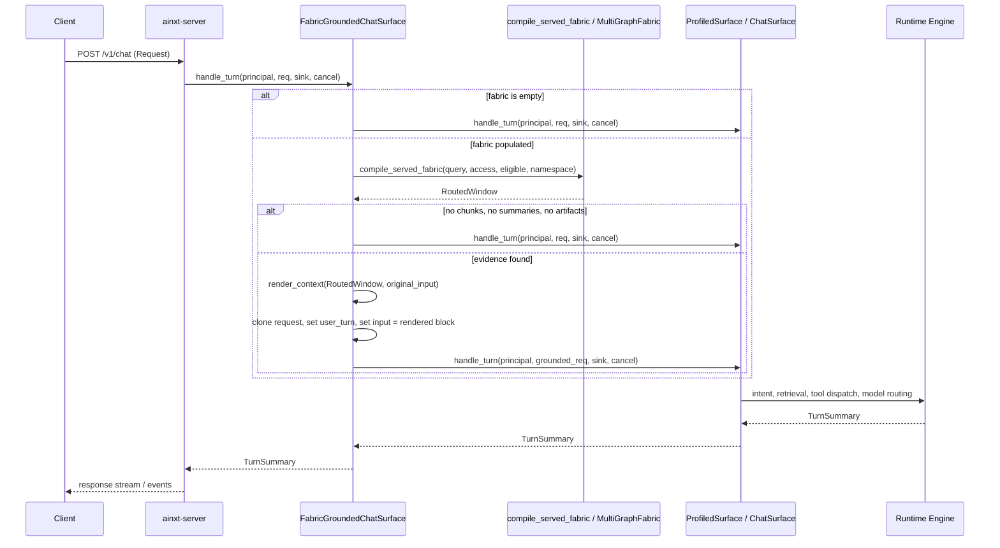
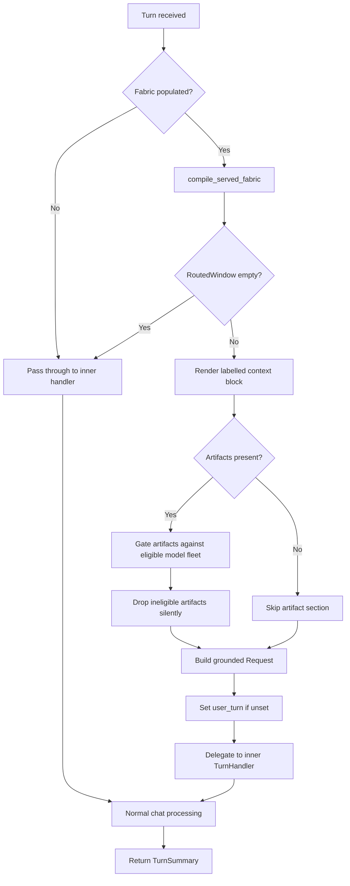

# `surfaces_fabric_chat` — Fabric-Grounded Chat Surface

## Brief Introduction

`surfaces_fabric_chat` is a runtime surface module in `crates/ainxt-runtimed` that closes the gap between the **Context-Fabric** multi-graph retrieval system and the served `/v1/chat` turn path.

The context-fabric compiler (`governed::compile_served_fabric`) was already capable of routing a turn across many layered graphs (enterprise docs, code corpora, knowledge graphs, multimodal artifacts), ranking evidence with PageRank fusion, and fitting results to the per-turn eligible model set. However, it was deliberately not wired into the live chat surface. The default `ChatSurface` instead grounded turns through a flat, single-corpus `compile_window` path, limiting real traffic to one graph layer.

`FabricGroundedChatSurface` is the wire: a [`TurnHandler`](runtime_engine.md) wrapper that, on every turn, routes the query through a populated [`MultiGraphFabric`](../ai_engine/knowledge_retrieval.md) and prepends the routed, layer-labelled evidence onto the turn as an explicit context block. It is:

- **Additive and config-selectable** — it does not replace the default surface assembly.
- **Transparent over an empty fabric** — an unpopulated fabric is a byte-identical no-op.
- **Never a turn-admission gate** — if the fabric routes to nothing for a turn, the inner handler runs unchanged.
- **Raw-turn preserving** — the original user input is kept in `Request::user_turn` so intent classification and referent resolution still operate on the user's own words.

This module lives under the [`pipeline_runtime` → `runtime_engine` → `surfaces`](runtime_engine.md) branch of the system, alongside [`surfaces_chat_identity`](surfaces_chat_identity.md), [`surfaces_workforce`](surfaces_workforce.md), and [`surfaces_prompt_optimizer`](surfaces_prompt_optimizer.md).

---

## Core Concepts

| Concept | Description |
|--------|-------------|
| `FabricGroundedChatSurface` | A `TurnHandler` decorator that grounds every turn through the context fabric before delegating to an inner handler. |
| `MultiGraphFabric` | The populated fabric-of-graphs maintained by the context/routing layer. See [`knowledge_retrieval`](../ai_engine/knowledge_retrieval.md). |
| `compile_served_fabric` | The served-path fabric compiler: routes a query through eligible fabric layers, applies RBAC/RLS pre-ranking, and returns a fitted `RoutedWindow`. |
| `RoutedWindow` | The compiled result containing chunks, community summaries, artifacts, and the list of layers actually compiled. |
| `EligibleModel` | The per-deployment eligible model set the fabric compiler uses to fit the window. |
| `artifact_model_fleet_default` | The default offline multimodal model fleet used to gate which routed artifacts may be surfaced. |
| `served_multimodal_turn` | Eligibility gate that splits routed artifacts into eligible vs. dropped based on the artifact model fleet. |
| `assemble_chat_fabric_grounded` / `assemble_chat_fabric_grounded_with_artifacts` | Composition-root helpers that build the fabric-grounded chat surface, optionally attaching an artifact store. |

---

## Architecture

### How It Fits

- The server (`ainxt-server`) dispatches a chat request to the assembled surface.
- When the deployment opts into fabric grounding, the outermost handler is `FabricGroundedChatSurface`.
- It wraps the normal profiled chat surface (`ProfiledSurface` → `ChatSurface` → `ConversationManager`).
- Before the inner handler sees the turn, the fabric is compiled and the evidence is rendered as a labelled context block.
- The inner handler then performs intent classification, tool dispatch, model routing, and response generation exactly as it would for any other grounded turn.

---

## Component Relationships

### Key Components

#### `FabricGroundedChatSurface`
The decorator. It owns:
- `inner`: the real chat handler (e.g., `ProfiledSurface`).
- `fabric`: the populated `MultiGraphFabric`.
- `eligible`: the deployment's eligible model set.
- `namespace`: the default multimodal-artifact namespace.

#### `compile_served_fabric`
Thin wrapper around `MultiGraphFabric::route_eligible`. It applies the query, principal access context, optional row filter, eligible model set, and namespace to produce a `RoutedWindow`.

#### `render_context`
Builds the explicit context block that is prepended to the turn. It includes:
- A header showing how many layers were compiled and which ones.
- Labelled chunks with their source layer.
- Community summaries with member lists.
- Eligible multimodal artifacts, each labelled with modality and eligible model.

The original user input is appended after a separator so the model still sees the user's words, while the inner classifier can use `Request::user_turn` for intent resolution.

---

## Data Flow

### Step-by-Step Flow

1. **Receive turn** — `FabricGroundedChatSurface::handle_turn` is invoked with the original `Request`.
2. **Empty-fabric short-circuit** — If `fabric.is_empty()`, the request is passed through unchanged. This preserves byte-identical behavior when no indexer has populated a fabric.
3. **Compile fabric** — `compile_served_fabric` routes the query through the fabric, applying access control and model eligibility.
4. **Empty-window short-circuit** — If the routed window has no chunks, no community summaries, and no artifacts, the request is passed through unchanged. The fabric is a read-filter, not an admission gate.
5. **Render context** — Evidence is formatted into a labelled block. Multimodal artifacts are gated through `served_multimodal_turn` against the default artifact fleet; ineligible artifacts are silently dropped.
6. **Preserve raw turn** — `Request::user_turn` is set to the original input if not already set.
7. **Delegate** — The grounded request is handed to the inner handler, which continues with normal chat processing.

---

## Process Flow

---

## Security, Compliance, and Transparency

### Retrieval as a Read-Filter

The fabric is strictly a retrieval read-filter. It can **narrow** what evidence is shown to the model, but it cannot **deny** the turn. If routing returns nothing, the inner handler receives the original request and the conversation continues.

### RBAC and RLS

The fabric compiler receives an `AccessContext` derived from the caller's `Principal`. The fabric's own routing applies RBAC and RLS pre-ranking, so a caller whose clearance or department scope admits no fabric node simply sees an empty window for that turn.

### Artifact Eligibility Gate

When the fabric carries an attached `ArtifactStore` and the plan routes to `GraphLayer::MultimodalArtifact`, the rendered context block includes only artifacts that match an eligible model in the default offline fleet (`artifact_model_fleet_default`). Ineligible artifacts are dropped silently — their existence is not leaked. This mirrors the department-RBAC "no leak" invariant already applied to chunks and community summaries.

### Secret-Scanner Safety

Artifact labels are rendered with a space after the colon (e.g., `eligible model: inhouse-vision-v1`) to avoid producing a single long, mixed-class token that the compliance high-entropy secret scanner might redact. This keeps the eligible model identity visible in the evidence block.

---

## Integration with the Wider System

### Upstream Callers

- [`surfaces_chat_identity`](surfaces_chat_identity.md) — provides identity-governed chat surfaces; `FabricGroundedChatSurface` can wrap the same inner handlers.
- [`runtime_engine`](runtime_engine.md) — supplies the `TurnHandler` trait, `Engine`, model routing, and `CancelToken` semantics.
- [`server_serving`](server_serving.md) — `ainxt-server` assembles the final surface graph and dispatches HTTP requests to it.

### Downstream Dependencies

- [`knowledge_retrieval`](../ai_engine/knowledge_retrieval.md) — owns `MultiGraphFabric`, `RoutedWindow`, `FabricGraph`, and the routing/optimization logic.
- [`application_runtime` / `surface_conversation`](../core_infrastructure/application_runtime.md) — provides `ChatSurface`, `ConversationManager`, `TurnPlan`, and `SurfaceScopedAuthorizer`.
- [`core_interaction`](../core_infrastructure/core_interaction.md) — defines the `Request`, `Event`, `Principal`, and session protocols used across the turn boundary.
- [`security_config`](../core_infrastructure/security_config.md) — provides principal identity, access tokens, and configuration loading used when building the access context and eligible model set.

### Composition Roots

The module exposes two assembly helpers in `ainxt-runtimed::lib`:

- `assemble_chat_fabric_grounded` — builds a fabric-grounded chat surface from the KB plus optional code graph/content. No artifact tier is attached (air-gapped default).
- `assemble_chat_fabric_grounded_with_artifacts` — same, but attaches an `ArtifactStore` to enable the multimodal artifact tier.

These are **not** the default `/v1/chat` surface; the default remains `assemble_surface` (the profile-enforced, flat-corpus chat surface). Fabric grounding is opt-in via configuration.

---

## Testing and Regression Coverage

The module's behavior is covered by:

- `r19_fabric_grounded_chat_served.rs` in `crates/ainxt-runtimed/tests/`
  - Proves **transparency over an empty fabric** — byte-identical no-op.
  - Proves **live-wiring** — a populated fabric actually routes evidence onto the served turn.
- Underlying unit tests for `compile_served_fabric` in `ainxt-context` and `r13_context_fabric_served.rs`.

---

## References

- [`runtime_engine`](runtime_engine.md) — core turn execution, `TurnHandler`, `Engine`, model routing.
- [`surfaces_chat_identity`](surfaces_chat_identity.md) — identity-governed chat surface sibling.
- [`surfaces_workforce`](surfaces_workforce.md) — workforce/role-invocation surface sibling.
- [`surfaces_prompt_optimizer`](surfaces_prompt_optimizer.md) — prompt-optimization surface sibling.
- [`knowledge_retrieval`](../ai_engine/knowledge_retrieval.md) — context fabric, routing, retrieval, and artifact stores.
- [`application_runtime`](../core_infrastructure/application_runtime.md) — chat surface, conversation manager, turn planning, surface profiles.
- [`core_interaction`](../core_infrastructure/core_interaction.md) — protocol types: `Request`, `Event`, `Principal`, sessions.
- [`security_config`](../core_infrastructure/security_config.md) — principal, access context, and runtime configuration.
- [`server_serving`](server_serving.md) — HTTP server assembly and request dispatch.
