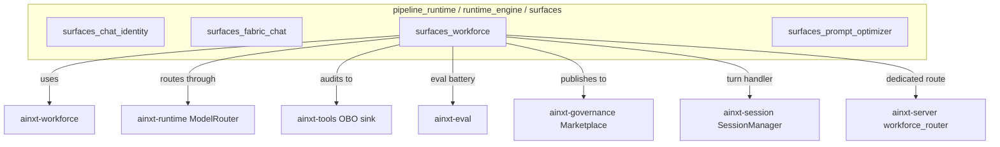
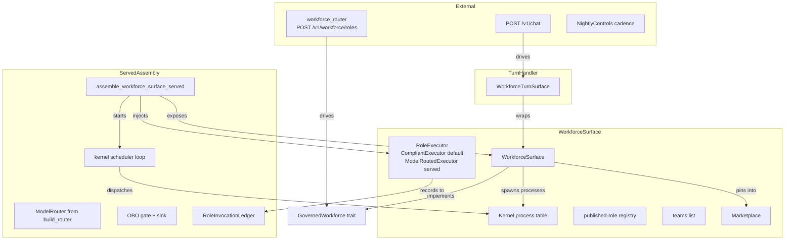
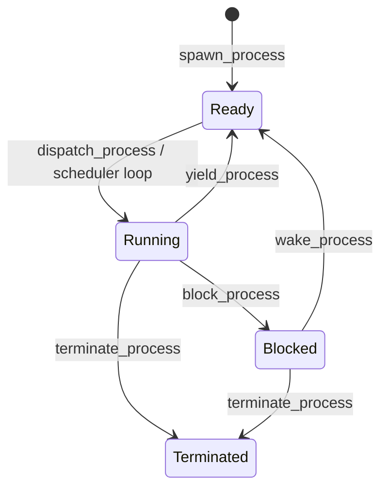
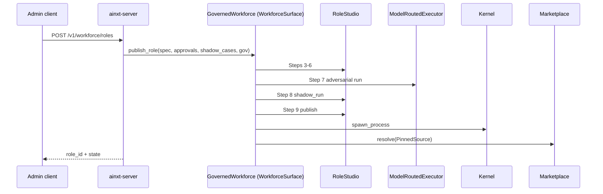

# surfaces_workforce

The **workforce surface** is the served runtime entrypoint for the AiNxt-OS digital-workforce factory. It exposes the `ainxt-workforce` role-authoring, governance, and execution pipeline over the live protocol path (`POST /v1/chat`) and over a dedicated admin-gated HTTP route (`POST /v1/workforce/roles`). The surface turns an authored `RoleSpec` into a governed, published digital worker — running validation, an un-forgeable adversarial Breaker gate, shadow-run evidence, git-native lifecycle publish, and kernel admission — without allowing any step to be silently skipped.

This module lives in `crates/ainxt-runtimed/src/workforce_surface.rs` and is mounted when the daemon is started with `--surface workforce`.

---

## 1. Purpose and Core Functionality

The workforce surface closes a long-standing integration gap: the `ainxt-workforce` crate implemented every gate of the digital-worker lifecycle (Steps 0–10), but those gates were reachable only from the crate's own unit tests. The surface wires them into the served daemon composition root so that:

- A creator can turn a plain-language job description into a draft `RoleSpec`.
- A governed publish route can drive the full `RoleStudio` state machine (Steps 3–9) with real evidence, not just spec validation + Breaker.
- The Step-7 adversarial run exercises the **same live `ModelRouter`** that real chat turns route through.
- A published role is immediately admitted as a `Ready` process on the workforce kernel and transitioned to `Running` by a live scheduler loop.
- Teams, deprecation, decoy generation, nightly controls, and monitoring evaluation become reachable from the served composition root.

The surface is intentionally **fail-closed**: missing approvals, sub-floor knowledge quality, insufficient shadow-run evidence, a failing Breaker, or a refused governed publish all return explicit errors rather than silently accepting the role.

---

## 2. Architecture

### 2.1 High-level placement

The workforce surface is one of the runtime surfaces assembled by `ainxt-runtimed`. It sits alongside the chat, fabric-chat, and prompt-optimizer surfaces under `pipeline_runtime → runtime_engine → surfaces`.

### 2.2 Core types

| Type | Responsibility |
|------|----------------|
| [`WorkforceSurface`](surfaces_workforce.md#workforcesurface) | The concrete surface: holds the executor, kernel, published-role registry, teams, and marketplace. Implements the governed publish/team-assembly seam. |
| [`WorkforceTurnSurface`](surfaces_workforce.md#workforceturnsurface) | Implements [`TurnHandler`](runtime_engine.md#turnhandler) so the workforce factory can be mounted on `POST /v1/chat`. |
| [`ModelRoutedExecutor`](surfaces_workforce.md#modelroutedexecutor) | Live, model-backed [`RoleExecutor`](../governance_compliance/workforce.md#roleexecutor) that drives the Step-7 adversarial run through the daemon's real `ModelRouter`. |
| [`RoleInvocationLedger`](surfaces_workforce.md#roleinvocationledger) | In-process telemetry ledger that records real role invocations for the §6.1 decay sweep. |
| [`StudioTurn`](surfaces_workforce.md#studiturn) / [`ShadowCaseInput`](surfaces_workforce.md#shadowcaseinput) / [`CollaborationInput`](surfaces_workforce.md#collaborationinput) | Wire shapes for the Studio dispatch path inside a `POST /v1/chat` turn. |

### 2.3 Component diagram

---

## 3. The Governed Publish Pipeline

[`WorkforceSurface::publish_role`](surfaces_workforce.md#publish_role) is the central entrypoint. It drives the `RoleStudio` state machine end-to-end:

```mermaid
flowchart LR
    A[RoleSpec from caller] --> B[Step 3: govern_with_approvals]
    B --> C[Step 4: set_autonomy]
    C --> D[Step 5: check_knowledge_from_spec]
    D --> E[Step 6: define_kpis]
    E --> F[Step 7: run_breaker via RoleExecutor]
    F --> G[Step 8: shadow_run via run_shadow_observation]
    G --> H[Step 9: publish via GovernedPublishRequest]
    H --> I[spawn_process on Kernel]
    I --> J[pin into Marketplace]
```

Key invariants:

- **Step 3** requires every `requires_approval` capability to appear in `approved_capabilities`. A role cannot self-approve sensitive grants.
- **Step 5** reads the role's own `KnowledgeScope::retrieval_quality`. `None` is treated as `0.0` (fail-closed); a low score is refused.
- **Step 7** runs the real Breaker: a static battery plus an actual adversarial run through the configured `RoleExecutor`.
- **Step 8** runs real shadow observations through the **same executor** and compares the role's action to recorded human decisions. Caller-fabricated `ShadowResult`s are not accepted.
- **Step 9** consumes the sealed `BreakerPass` minted at Step 7 and performs the git-native ADR-026 publish.

On success the role is admitted to the kernel as `Ready` and the scheduler loop will dispatch it to `Running`.

---

## 4. Model-Routed Adversarial Execution

[`ModelRoutedExecutor`](surfaces_workforce.md#modelroutedexecutor) is the live executor used on the served path. It is a critical gap-close: previously the only executor was the offline `CompliantExecutor`, so the Step-7 adversarial run never exercised a real model.

### 4.1 Routing

The executor resolves the role's primary agent `allowed_providers` against the daemon's `ModelRouter`, respecting the role's derived `max_data_class`. If no allowed provider is eligible it falls back to the router's default pick; if nothing is eligible it returns `RoleOutput::escalation` (fail-closed).

### 4.2 Prompt construction

The prompt is built from the role's real charter, persona, responsibilities, escalation rules, and the adversarial case input — not a generic assistant template.

### 4.3 Output classification

The executor classifies the model's response from its own words:

- Refusal markers → `Refused`
- Escalation markers → `Escalated`
- Hedge/uncertainty markers → `Escalated` if the role's `AutonomyModel::should_escalate` threshold is crossed
- Otherwise → `Answered`

PII leakage is detected with [`ainxt_compliance::StrongRedactor`](../governance_compliance/compliance.md#strongredactor), the same DLP gate used on every other served output.

### 4.4 OBO authority binding

When assembled via `assemble_workforce_surface_served`, the executor is wired with a real three-layer OBO policy (`ThreeLayerPolicy` over `MapAbac`) and the same audit sink the chat-engine OBO gate uses. A role that declares `obo_authority: true` must actually clear `policy.authorize` before any model is called; a denial fails closed to escalation. See [tools_cli](../tools_cli/tools_cli.md) and [runtime_engine](runtime_engine.md) for the general OBO pattern.

### 4.5 Invocation ledger

The executor records one real invocation per `execute` call into a shared [`RoleInvocationLedger`](surfaces_workforce.md#roleinvocationledger). The ledger derives `invocations_30d` and `invocation_trend` from genuine observed activity, feeding the §6.1 `DefinitionTelemetry` input that `NightlyControls` previously had to fabricate. It deliberately does **not** fabricate `kpi_trend_90d` or `days_since_last_commit`, which require external eval-outcome and git-host data sources.

---

## 5. Kernel Process Model

The workforce surface exposes the `ainxt-workforce` kernel as a live process table:

- [`spawn_process`](surfaces_workforce.md#spawn_process) admits a `PublishedRole` as `Ready`.
- [`spawn_kernel_scheduler`](surfaces_workforce.md#spawn_kernel_scheduler) starts a real `tokio::time::interval` loop that dispatches every `Ready` pid every 500 ms.
- Direct primitives (`dispatch_process`, `block_process`, `wake_process`, `yield_process`, `terminate_process`, `runnable_processes`, `process_state`, `live_process_count`) remain available for live event-bus integration.

The kernel handle is captured on `Assembled::workforce_kernel` so served callers observe the exact same table the scheduler ticks over.

---

## 6. Served Turn Dispatch

[`WorkforceTurnSurface`](surfaces_workforce.md#workforceturnsurface) implements [`TurnHandler`](runtime_engine.md#turnhandler). It supports two input shapes:

1. **Studio turn** — JSON body with `"studio_action"`:
   - `"draft_role_from_job"` — Steps 0–2: template + job description → draft `RoleSpec` + eval battery.
   - `"publish"` — Steps 3–9: full governed publish.
   - `"assemble_team"` — assemble a `DigitalTeam` from published roles on this surface.
2. **Gate turn** — JSON `RoleSpec` or plain text:
   - An authored `RoleSpec` is gated through `RoleSpec::validate` + `Breaker::gate`.
   - Plain text falls back to the canonical golden-path `l1-support` probe role.

The Studio dispatch is checked first with an untyped probe so malformed Studio turns are refused explicitly rather than falling through to the gate path.

---

## 7. Dedicated HTTP Route

`ainxt-server` mounts `POST /v1/workforce/roles` via [`workforce_router`](server_serving_core.md#workforce_router). The route receives the same `Arc<dyn GovernedWorkforce>` that the chat turn handler uses, so a role published through either route is immediately visible to the other. The handler requires an admin role and fail-closes on any governance refusal.

---

## 8. Auxiliary Governance Seams

The surface also re-exports or thinly wraps several `ainxt-workforce` controls that previously had no callers outside their own crate tests:

| Function | Purpose |
|----------|---------|
| [`run_workforce_nightly_tick`](surfaces_workforce.md#run_workforce_nightly_tick) | One pass of `NightlyControls` (decay, orphan, recert, oversight). |
| [`validate_succession_pr`](surfaces_workforce.md#validate_succession_pr) | Validate that an ownership-transfer PR changes only the owner. |
| [`should_inject_decoy`](surfaces_workforce.md#should_inject_decoy) / [`evaluate_decoy`](surfaces_workforce.md#evaluate_decoy) / [`competency_after`](surfaces_workforce.md#competency_after) / [`competency_route`](surfaces_workforce.md#competency_route) | §7.2/§7.3 decoy/competency logic. |
| [`route_workforce_decoy_incident`](surfaces_workforce.md#route_workforce_decoy_incident) | Route a failed decoy approval to the manager + event log. |
| [`evaluate_role_monitoring`](surfaces_workforce.md#evaluate_role_monitoring) | Step-10 KPI/cost monitoring decision (`Continue` / `PauseForReview` / `Rollback`). |
| [`generate_eval_battery`](surfaces_workforce.md#generate_eval_battery) | Generate one runnable `ainxt_eval::EvalCase` per KPI from the role's own charter. |

---

## 9. Assembly

Two assembly functions are provided:

- [`assemble_workforce_surface()`](surfaces_workforce.md#assemble_workforce_surface) — offline-safe default with `CompliantExecutor`.
- [`assemble_workforce_surface_served(loaded, def_kind)`](surfaces_workforce.md#assemble_workforce_surface_served) — served assembly that:
  1. Builds the daemon's real `ModelRouter` from `[models]` config.
  2. Captures the outsourcing-register handle.
  3. Builds the OBO gate + sink.
  4. Creates the invocation ledger + wall day-clock.
  5. Constructs `ModelRoutedExecutor` with both.
  6. Wraps `WorkforceSurface` and starts the kernel scheduler loop.
  7. Exposes the surface as `Arc<dyn GovernedWorkforce>` on `Assembled::workforce_surface`.
  8. Returns an `Assembled` with `SessionManager`, shared ledger/kernel handles, and a surface report.

The function is selected by `assemble_selected` when the daemon is started with `--surface workforce`.

---

## 10. Error Model

[`WorkforceError`](surfaces_workforce.md#workforceerror) surfaces every failure mode explicitly:

- `Invalid(Vec<String>)` — `RoleSpec::validate` violations.
- `Breaker(GateError)` — static or adversarial Breaker failure.
- `Publish(PublishError)` — git-native publish refusal.
- `UnknownRole(String)` — looked-up role not in this surface's registry.
- `Deprecate(DeprecateError)` — §6.5 forced-review deprecation refusal.
- `Studio(StudioError)` — out-of-order Studio transition or any Step 3–8 refusal.
- `InvalidStudioTurn(String)` — malformed Studio-turn JSON or team-consistency refusal.

All paths are fail-closed: a role that cannot clear every gate is refused with a concrete reason.

---

## 11. Dependencies and Related Modules

- **[workforce](../governance_compliance/workforce.md)** — the underlying `ainxt-workforce` crate: `RoleStudio`, `Breaker`, `Kernel`, `RoleSpec`, `PublishedRole`, `DigitalTeam`, controls, lifecycle, oversight.
- **[runtime_engine](runtime_engine.md)** — `TurnHandler`, `ModelRouter`, `Engine`, `CancelToken`, `TurnSummary`.
- **[server_serving_core](server_serving_core.md)** — `workforce_router`, `WorkforceState`, `WorkforcePublishRequest`.
- **[tools_cli](../tools_cli/tools_cli.md)** — OBO policy (`ThreeLayerPolicy`, `MapAbac`, `OboContext`, `OboDecisionSink`).
- **[ai_engine/evaluation_testing/eval_cases](../ai_engine/eval_cases.md)** — `EvalCase` generation for the Step-6 eval battery.
- **[governance_compliance/governance](../governance_compliance/governance.md)** — `Marketplace`, `PinnedSource`, `AuthoringContext`, CODEOWNERS approvals.
- **[governance_compliance/compliance](../governance_compliance/compliance.md)** — `StrongRedactor` used for PII detection in `ModelRoutedExecutor`.
- **[core_infrastructure/security_config](../core_infrastructure/security_config.md)** — `DataClass` routing and residency decisions.
- **[core_infrastructure/core_interaction](../core_infrastructure/core_interaction.md)** — `SessionManager`, `Request`, `Event` streaming.

---

## 12. Operational Notes

- The surface is only mounted when the daemon starts with `--surface workforce`.
- The default executor is `CompliantExecutor` (offline, deterministic, no model calls). The served assembly replaces it with `ModelRoutedExecutor`.
- The git-native ADR-026 publish step still requires a real control-repo to be hot-wired; the surface does not fabricate a publish.
- The kernel scheduler loop runs at 500 ms by default. A deployment that wants event-reactive or priority scheduling can replace the default loop while keeping the same kernel handle.
- The invocation ledger is in-process memory. A deployment that wants durable telemetry should feed `DefinitionTelemetry` from its own eval store and git host for the fields the ledger cannot compute.
