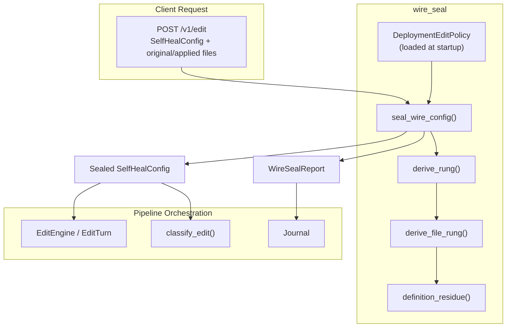
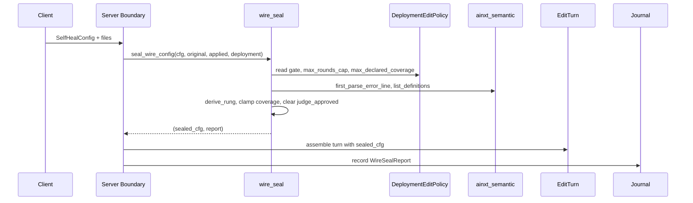
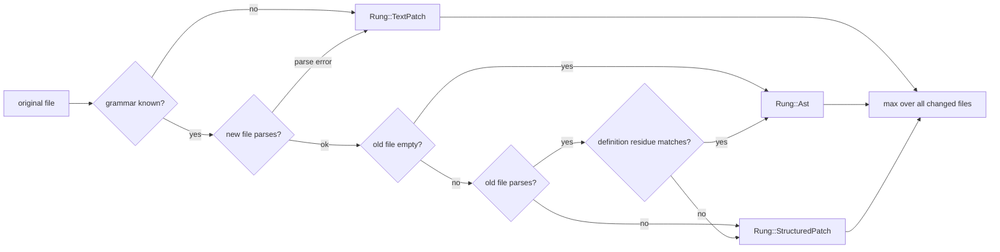
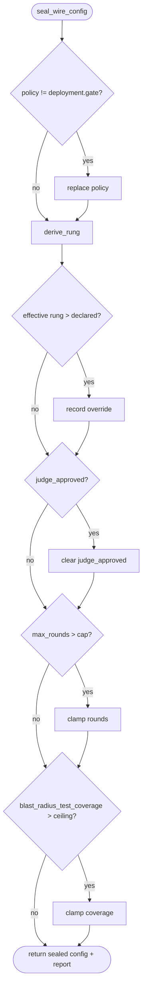

# Wire Seal

The `wire_seal` module is the trust boundary that makes the Commit Gate's edit policy **server-derived and unforgeable by the client**. It lives inside the [`pipeline_orchestration`](pipeline_orchestration.md) subsystem and is invoked at the HTTP boundary (`POST /v1/edit`) before an [`edit_turn`](edit_turn_execution.md) is assembled or any pipeline stage runs.

Because [`SelfHealConfig`](self_healing.md) is deserialized verbatim from the request body, several of its fields must not be controlled by the caller. `wire_seal` sanitizes the incoming configuration against a deployment-owned [`DeploymentEditPolicy`], producing an auditable [`WireSealReport`] that records every override. The operation is pure, deterministic, and offline: it performs no I/O, uses no clock, and calls no model.

---

## Purpose and Core Functionality

When a client submits an edit request, it also sends a [`SelfHealConfig`] that contains both *request parameters* (language, declared tier, applied files) and *policy-sensitive values* (gate thresholds, edit rung, judge verdict, spend budget). A caller with `CAP_EDIT_APPLY` could otherwise forge those sensitive values to bypass review. `wire_seal` resolves this by:

1. **Replacing the caller's [`GatePolicy`] with the deployment's policy.** Thresholds such as `auto_complete_threshold` are runtime policy, not request fields.
2. **Deriving the actual edit rung from the diff.** The declared rung is treated as a floor only; the effective rung is the least-trusted of the declared and derived values. [`Rung::Lsp`] is structurally unreachable from this path because a `POST /v1/edit` body carries already-resolved file contents, not a live language-server refactor.
3. **Clearing any wire-asserted judge approval.** Only a real, context-isolated [`JudgePanel`](../ai_engine/quality_verification_judge.md) may set `judge_approved`.
4. **Capping self-heal rounds and declared blast-radius coverage.** These are spend-control and measurement fields, not caller assertions.
5. **Preserving the declared tier as a floor.** Tier escalation is handled downstream by [`classify_edit`](classification_and_risk_edit_classification.md), which can only raise the tier.

The result is a sealed [`SelfHealConfig`] plus a [`WireSealReport`] that is journaled and returned, making every override transparent to both the caller and a regulator.

---

## Core Components

### `DeploymentEditPolicy`

The deployment-side half of [`SelfHealConfig`]. Constructed at surface startup from configuration files and passed to [`EditEngine::with_edit_policy`](edit_turn_execution.md). It is **never** deserialized from a request body.

| Field | Purpose |
|-------|---------|
| `gate: GatePolicy` | Commit Gate thresholds that replace any wire-declared policy. |
| `max_rounds_cap: u8` | Hard ceiling on `max_rounds` to prevent runaway self-heal spend. |
| `max_declared_coverage: f64` | Ceiling on caller-declared blast-radius test coverage; defaults to `1.0` for backward compatibility. |

### `WireSealReport`

An audit record of what the seal changed. Each overridden field produces a human-readable rationale, and the rung-derivation rationale is captured separately. The report is returned to the caller and included in the tamper-evident journal.

| Field | Purpose |
|-------|---------|
| `overrides: Vec<String>` | One line per field that was replaced or clamped. |
| `rung_rationale: Vec<String>` | Per-file reasons for the derived rung. |

### `RungDerivation`

The evidence-backed rung for the submitted diff, plus the auditable rationale. The rung is computed from the actual `original → applied` file pairs, never from the request's declared value.

| Field | Purpose |
|-------|---------|
| `rung: Rung` | The least-trusted rung evidenced across the edit set. |
| `rationale: Vec<String>` | Per-file explanation of why that rung was assigned. |

---

## Architecture

### Component Interaction

---

## Data Flow and Process

### Rung Derivation

The rung is derived independently for each changed file, then the worst (least trusted) rung across the edit set is selected:

The derivation intentionally degrades on missing information:

- Unknown grammar → `TextPatch`.
- Post-edit parse error → `TextPatch`.
- Pre-edit parse error → `StructuredPatch` (cannot compute an AST diff, but the patch is still anchored).
- Change confined to whole top-level definitions → `Ast`.
- Change touches scaffolding outside definitions → `StructuredPatch`.

`Rung::Lsp` is never returned because the input is already-resolved file contents, not a live LSP operation.

### Seal Process

---

## Module Boundaries and Dependencies

`wire_seal` is a pure function module. It depends only on:

- [`crate::capability::Language`](pipeline_orchestration.md) — the pipeline's language enum.
- [`crate::gate::GatePolicy`](pipeline_stages_and_tools.md) — Commit Gate thresholds.
- [`crate::selfheal::SelfHealConfig`](self_healing.md) — the wire-deserialized configuration.
- [`crate::classify::code_signature`](classification_and_risk_edit_classification.md) — normalizes code scaffolding for residue comparison.
- [`ainxt_semantic::ladder::Rung`](edit_semantic_edit_ladder.md) and semantic helpers — AST parsing and definition listing.

It is called from the server boundary (see [`server_serving_core`](server_serving_core.md)) before any turn execution, and its report flows into the [`Journal`](journaling.md) for audit.

---

## How It Fits into the System

`wire_seal` sits at the intersection of three concerns:

1. **Security / trust boundary.** It prevents clients from forging policy values that would short-circuit the Commit Gate.
2. **Pipeline orchestration.** It is the first step in processing an edit request, feeding the sanitized config into [`EditEngine`](edit_turn_execution.md) and downstream classification.
3. **Audit / compliance.** Every override is explicit and journaled, supporting regulator reconstruction of why a particular threshold or rung was used.

Within the broader [`pipeline_runtime`](pipeline_runtime.md), `wire_seal` is a sibling to:

- [`edit_turn_execution`](edit_turn_execution.md) — consumes the sealed config.
- [`classification_and_risk`](classification_and_risk.md) — escalates the tier using the sealed rung and other signals.
- [`self_healing`](self_healing.md) — uses the sealed `max_rounds` and rung.
- [`journaling`](journaling.md) — stores the [`WireSealReport`].

---

## Post-conditions and Invariants

The following invariants are asserted by tests and maintained on every call to `seal_wire_config`:

1. `out.policy == deployment.gate` — caller thresholds are always discarded.
2. `out.rung == max(declared, derive_rung(..))` — worse-or-equal; `Lsp` unreachable.
3. `out.judge_approved.is_none()` — only a real panel run may set it.
4. `out.max_rounds <= deployment.max_rounds_cap`.
5. `out.blast_radius_test_coverage <= deployment.max_declared_coverage`.
6. `out.tier == in.tier` — declared tier remains a floor for downstream classification.

---

## References

- [`pipeline_orchestration`](pipeline_orchestration.md) — parent module.
- [`edit_turn_execution`](edit_turn_execution.md) — consumes the sealed configuration.
- [`classification_and_risk_edit_classification`](classification_and_risk_edit_classification.md) — downstream tier escalation.
- [`self_healing`](self_healing.md) — the configuration being sealed.
- [`edit_semantic_edit_ladder`](edit_semantic_edit_ladder.md) — rung semantics and LSP/AST distinction.
- [`journaling`](journaling.md) — tamper-evident record keeping.
- [`server_serving_core`](server_serving_core.md) — HTTP boundary where the seal is invoked.
