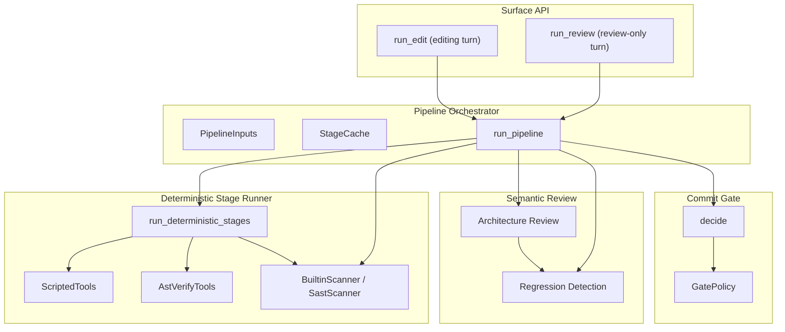

# Pipeline Stages and Tools

## Purpose

The **pipeline stages and tools** module is the deterministic backbone of the code-review pipeline. It defines the twelve canonical pipeline stages, runs the Phase-A deterministic checks (compile, lint, type-check, test, SAST), computes architecture and regression signals from the edited code itself, and feeds every result into the Commit Gate. The module's central invariant is **honesty over green**: a missing tool or unsupported language is reported as `Skipped` and penalized, never silently treated as a pass.

This module sits inside [`pipeline_orchestration`](pipeline_orchestration.md) and is called by the higher-level editing and review surfaces. It does not shell out to LLMs or perform self-heal loops itself; instead, it exposes typed seams that [`pipeline_orchestration_edit_turn_execution`](pipeline_orchestration_edit_turn_execution.md) and the runtime surfaces wire into complete turns.

## Architecture Overview

### Data Flow

```mermaid
sequenceDiagram
    participant Surface as Surface API
    participant Runner as Stage Runner
    participant SAST as SAST Scanner
    participant Semantic as Semantic Review
    participant Gate as Commit Gate
    participant Journal as Journal

    Surface->>Runner: StageContext + StageTools
    Runner->>Runner: Compile → Lint → TypeCheck → Test (fail-fast)
    Runner->>SAST: scan every file
    SAST-->>Runner: SastFinding[]
    Runner-->>Surface: StageRunOutput
    Surface->>Semantic: baseline + current files
    Semantic-->>Surface: SemanticGateReport
    Surface->>Gate: GateContext + ConfidenceScore
    Gate-->>Surface: GateDecision
    Surface->>Journal: PipelineEvent[]
```

## Sub-modules

### Stage Model and Verdicts

[`pipeline_stages_and_tools_stage_model`](pipeline_stages_and_tools_stage_model.md) defines the [`Stage`](pipeline_stages_and_tools_stage_model.md) enum (the twelve canonical stages), [`StageVerdict`](pipeline_stages_and_tools_stage_model.md), and [`StageReport`](pipeline_stages_and_tools_stage_model.md). It encodes the honesty rule: `Skipped` is a first-class verdict, never a pass.

### Stage Execution and Tooling

[`pipeline_stages_and_tools_stage_execution`](pipeline_stages_and_tools_stage_execution.md) implements the deterministic stage runner. It runs compile, lint, type-check, and test in fail-fast order, auto-runs SAST on every file, and honours the per-language capability matrix. It provides:

- [`StageTools`](pipeline_stages_and_tools_stage_execution.md) — the production toolchain seam.
- [`ScriptedTools`](pipeline_stages_and_tools_stage_execution.md) — an offline test stand-in.
- [`AstVerifyTools`](pipeline_stages_and_tools_stage_execution.md) — a real offline parse gate plus pluggable lint/test/type-check hooks with flaky-test discipline.

### Pipeline Orchestrator

[`pipeline_stages_and_tools_pipeline_orchestrator`](pipeline_stages_and_tools_pipeline_orchestrator.md) composes stage reports, SAST findings, confidence inputs, and gate policy into a typed [`PipelineOutcome`](pipeline_orchestration_classification_and_risk.md). It also owns [`StageCache`](pipeline_stages_and_tools_pipeline_orchestrator.md), the content-hash cache that lets self-heal re-enter at the earliest invalidated stage rather than re-running everything.

### Surface API

[`pipeline_stages_and_tools_surface_api`](pipeline_stages_and_tools_surface_api.md) exposes the two public entrypoints:

- [`run_edit`](pipeline_stages_and_tools_surface_api.md) — an editing turn that can self-heal and commit.
- [`run_review`](pipeline_stages_and_tools_surface_api.md) — a review-only turn that returns findings and a verdict without writing anything.

These surfaces are the only code paths product integrations should call. They delegate self-heal loops to [`pipeline_orchestration_edit_turn_execution`](pipeline_orchestration_edit_turn_execution.md) and model review to [`ai_engine_quality_verification_judge`](ai_engine_quality_verification_judge.md).

### Semantic Review

[`pipeline_stages_and_tools_semantic_review`](pipeline_stages_and_tools_semantic_review.md) computes Architecture Review (stage 7) and Regression Detection (stage 8) from the code itself rather than from caller-invented scalars. It loads a checked-in `.arch.json` manifest, diffs import edges against the layering contract, and computes blast-radius test coverage using the co-change graph from [`edit_semantic`](edit_semantic.md).

### SAST Security

[`pipeline_stages_and_tools_sast`](pipeline_stages_and_tools_sast.md) implements the SAST stage. A `critical` or `high` finding hard-blocks the commit regardless of the Confidence Score. It provides the [`SastScanner`](pipeline_stages_and_tools_sast.md) trait and [`BuiltinScanner`](pipeline_stages_and_tools_sast.md), which detects PAN logging, hard-coded secrets, private-key literals, and AWS keys.

### Breaker Differential

[`pipeline_stages_and_tools_breaker`](pipeline_stages_and_tools_breaker.md) is the optional Tier-3 differential/invariant oracle. It compares the edited code against a reference implementation and is consulted only for [`RiskTier::HighRisk`](pipeline_orchestration_classification_and_risk.md) edits. Below Tier 3 it returns `None` so the absence of a differential run is not misreported as clean.

### Commit Gate

[`pipeline_stages_and_tools_commit_gate`](pipeline_stages_and_tools_commit_gate.md) is the final policy decision. It enforces the ordering: Phase-A failures → SAST critical/high → architecture violations → score bands → Tier-3 human hand-off. It also requires a context-isolated independent Judge panel for Tier-2+ edits, as described in [`ai_engine_quality_verification_judge`](ai_engine_quality_verification_judge.md).

## Relationships to Other Modules

| Concern | Owned By | Cross-reference |
|---|---|---|
| Risk tier, confidence score, classification | [`pipeline_orchestration_classification_and_risk`](pipeline_orchestration_classification_and_risk.md) | Consumed by the Commit Gate and Pipeline Orchestrator |
| Self-heal loops, edit turns, coders | [`pipeline_orchestration_edit_turn_execution`](pipeline_orchestration_edit_turn_execution.md) | Calls the Surface API and Stage Runner |
| Performance benchmarks | [`pipeline_orchestration_performance`](pipeline_orchestration_performance.md) | Optional Phase-A stage input |
| Hash-chained journaling | [`pipeline_orchestration_journaling`](pipeline_orchestration_journaling.md) | Every pipeline event is written here |
| Wire policy sealing | [`pipeline_orchestration_wire_seal`](pipeline_orchestration_wire_seal.md) | Protects route-ready request boundaries |
| Semantic graph, AST parsing, workspace sinks | [`edit_semantic`](edit_semantic.md) | Used by AstVerifyTools and Semantic Review |
| Independent Judge panel, LLM Review | [`ai_engine_quality_verification_judge`](ai_engine_quality_verification_judge.md) | Required for Tier-2+ commits |

## Key Design Invariants

1. **Deterministic-first ordering**: compile → lint → type-check → test → SAST. The first gating failure stops the expensive later stages.
2. **Anti-fake honesty**: a stage with no wired tool returns `Skipped`, scored as a penalty, never a fabricated `Pass`.
3. **SAST hard-block**: critical/high findings block before the Confidence Score is consulted.
4. **Context-isolated Judge**: Tier-2+ edits require a genuine independent panel verdict; self-asserted approval is not committable.
5. **Content-hash caching**: self-heal re-runs only the stages invalidated by a fix, while compile/test/lint/type-check always re-run for touched files.

## Sub-module Documentation Index

- [Stage Model and Verdicts](pipeline_stages_and_tools_stage_model.md)
- [Stage Execution and Tooling](pipeline_stages_and_tools_stage_execution.md)
- [Pipeline Orchestrator](pipeline_stages_and_tools_pipeline_orchestrator.md)
- [Surface API](pipeline_stages_and_tools_surface_api.md)
- [Semantic Review](pipeline_stages_and_tools_semantic_review.md)
- [SAST Security](pipeline_stages_and_tools_sast.md)
- [Breaker Differential](pipeline_stages_and_tools_breaker.md)
- [Commit Gate](pipeline_stages_and_tools_commit_gate.md)
