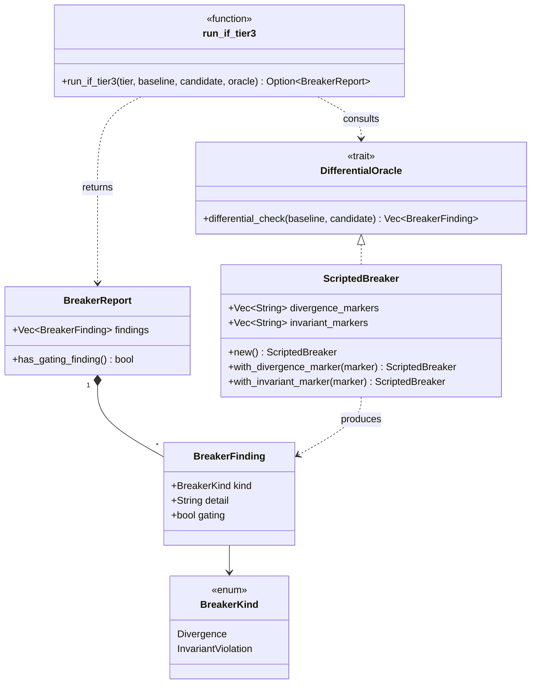
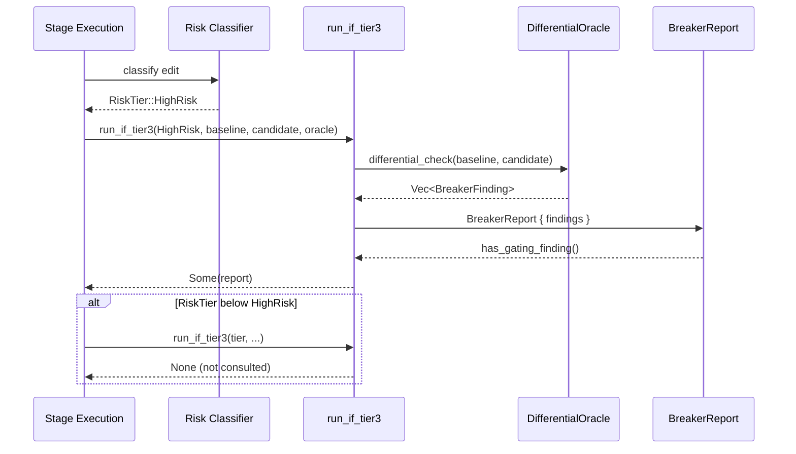
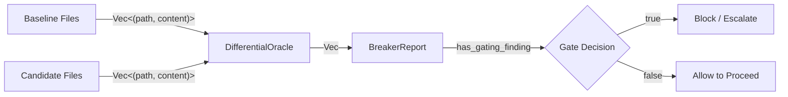
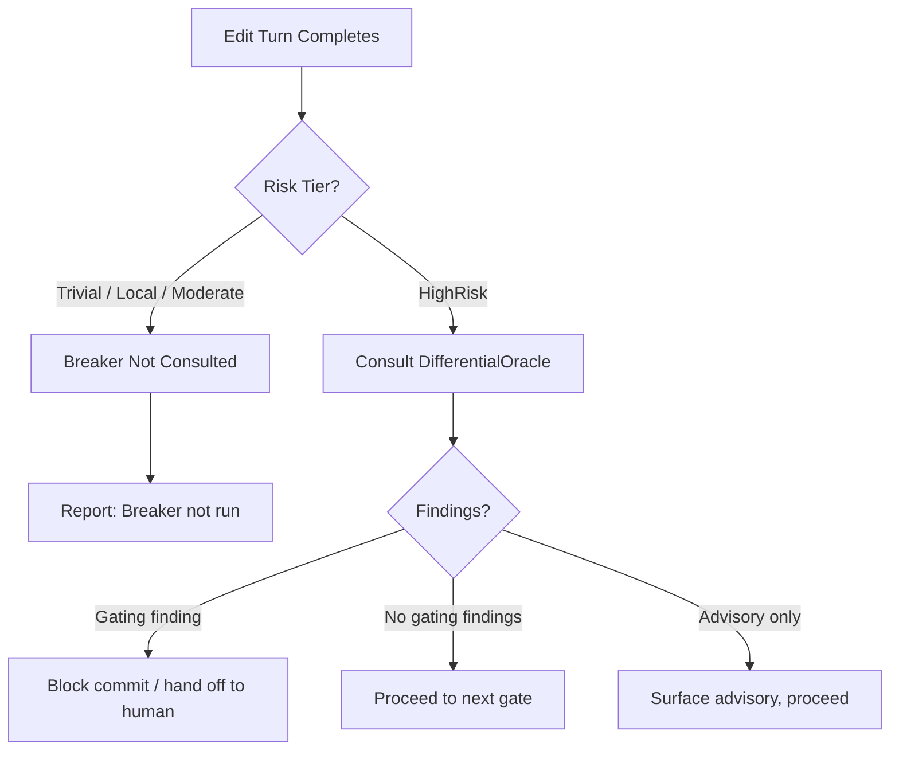
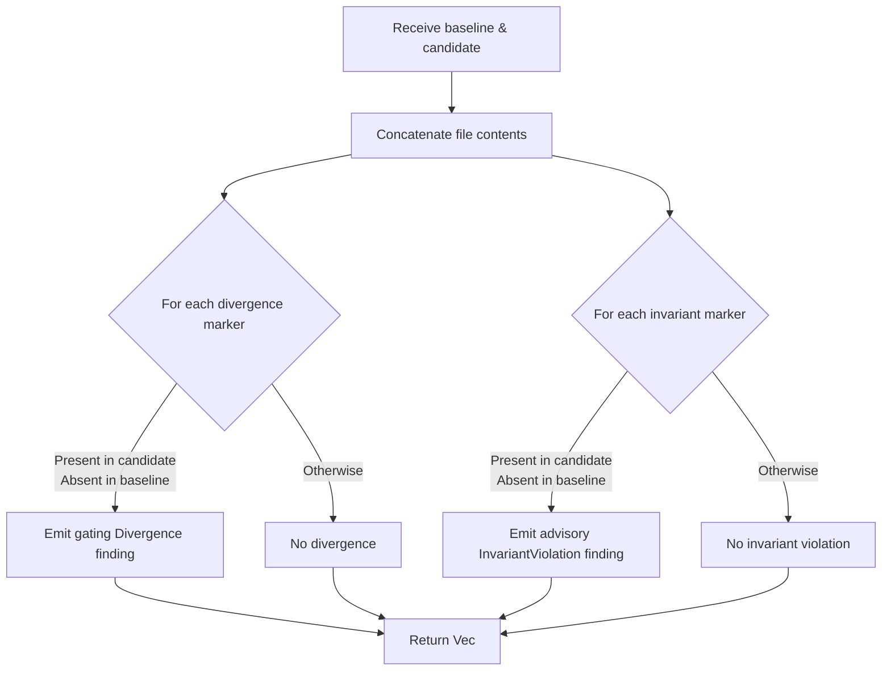

# Pipeline Stages and Tools — Breaker

## Introduction

The **Breaker** (`pipeline_stages_and_tools_breaker`) is an optional, Tier-3-only differential and invariant oracle within the [pipeline orchestration](pipeline_orchestration.md) subsystem. It lives in `crates/ainxt-pipeline/src/breaker.rs` and provides a scoped escalation path for the highest-risk edits — typically critical-path modules or public-API breaks — by comparing the edited code's behavior against a reference implementation.

The Breaker is deliberately **not** a universal gate. It runs only when the preceding [classification and risk](pipeline_stages_and_tools_classification_and_risk.md) stage assigns a `RiskTier::HighRisk` verdict. For lower-risk edits, the Breaker is *not consulted*, and the absence of a result is reported honestly as "not run" rather than a false clean.

## Purpose and Core Functionality

The Breaker module serves three primary purposes:

1. **Differential Regression Oracle**: Detect behavioral divergences between a candidate edit and a trusted baseline/reference implementation.
2. **Invariant Checker**: Validate metamorphic or algebraic relations that must hold across the edited code.
3. **Honest Offline Stand-in**: Provide `ScriptedBreaker`, a deterministic, marker-based oracle for environments where the full differential infrastructure (sandbox + reference impl + input corpus) is unavailable.

### Core Components

| Component | Type | Responsibility |
|-----------|------|----------------|
| `BreakerKind` | Enum | Classifies a finding as either `Divergence` or `InvariantViolation`. |
| `BreakerFinding` | Struct | One concrete finding, including kind, human-readable detail, and whether it is `gating`. |
| `BreakerReport` | Struct | Aggregates all findings for a candidate and reports whether any are gating. |
| `DifferentialOracle` | Trait | The seam implemented by real differential/invariant infrastructure. |
| `ScriptedBreaker` | Struct | Offline, deterministic `DifferentialOracle` that flags markers newly present in the candidate. |
| `run_if_tier3` | Function | Guards execution so the oracle is only consulted for `RiskTier::HighRisk` edits. |

## Architecture

### Component Overview

### Component Interaction

## Data Flow

The Breaker consumes two file sets — the `baseline` and the `candidate` — each represented as a `Vec<(String, String)>` of `(path, content)` pairs. The oracle collapses each file set into a single searchable string and compares marker presence.

For the real infrastructure oracle, the same `(path, content)` shape is used, but the comparison is behavioral: both implementations are executed on generated or recorded inputs and their outputs are diffed.

## Process Flows

### Tier-3 Breaker Execution

### ScriptedBreaker Differential Check

## Integration with the Pipeline

The Breaker is one of several specialized gates in the [pipeline stages and tools](pipeline_stages_and_tools.md) family:

- [pipeline_stages_and_tools_stage_execution](pipeline_stages_and_tools_stage_execution.md) — executes individual pipeline stages.
- [pipeline_stages_and_tools_classification_and_risk](pipeline_stages_and_tools_classification_and_risk.md) — produces the `RiskTier` that gates Breaker execution.
- [pipeline_stages_and_tools_semantic_review](pipeline_stages_and_tools_semantic_review.md) — lightweight semantic gate; the Breaker is its high-risk escalation.
- [pipeline_stages_and_tools_sast](pipeline_stages_and_tools_sast.md) — static security scanning.
- [pipeline_stages_and_tools_commit_gate](pipeline_stages_and_tools_commit_gate.md) — final commit approval, which may consume `BreakerReport::has_gating_finding()`.
- [edit_turn_execution](edit_turn_execution.md) — the edit turn that produces the candidate file set fed into the Breaker.

There is also a conceptual relationship with [scenario_service_breaker](scenario_service_breaker.md), which provides chaos-style adversarial testing infrastructure. While the scenario Breaker focuses on *inducing* failures to validate resilience, the pipeline Breaker focuses on *detecting* behavioral divergences from a reference.

## Key Design Principles

1. **Scoped to High Risk**: `run_if_tier3` explicitly returns `None` for `Trivial`, `Local`, and `Moderate` tiers. This prevents wasting differential runs on low-risk changes.
2. **Honest Absence**: A `None` result means "not consulted," never "clean." A `Some(report)` with empty findings means the oracle was consulted and found nothing.
3. **Gating vs. Advisory**: `BreakerFinding::gating` distinguishes blocking divergences from informational invariant advisories.
4. **Infra-Ready Seam**: `DifferentialOracle` is a trait so real infrastructure (sandbox + reference implementation + input corpus) can replace `ScriptedBreaker` without changing the pipeline integration.
5. **Deterministic Offline Behavior**: `ScriptedBreaker` is marker-based and reproducible, making tests and local development predictable.

## References

- [pipeline_orchestration](pipeline_orchestration.md)
- [pipeline_stages_and_tools](pipeline_stages_and_tools.md)
- [pipeline_stages_and_tools_stage_execution](pipeline_stages_and_tools_stage_execution.md)
- [pipeline_stages_and_tools_classification_and_risk](pipeline_stages_and_tools_classification_and_risk.md)
- [pipeline_stages_and_tools_semantic_review](pipeline_stages_and_tools_semantic_review.md)
- [pipeline_stages_and_tools_sast](pipeline_stages_and_tools_sast.md)
- [pipeline_stages_and_tools_commit_gate](pipeline_stages_and_tools_commit_gate.md)
- [edit_turn_execution](edit_turn_execution.md)
- [scenario_service_breaker](scenario_service_breaker.md)
