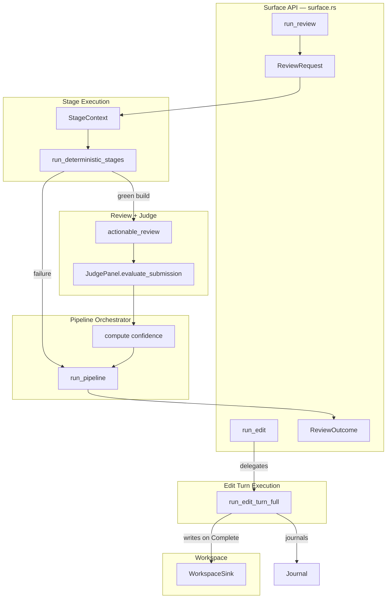
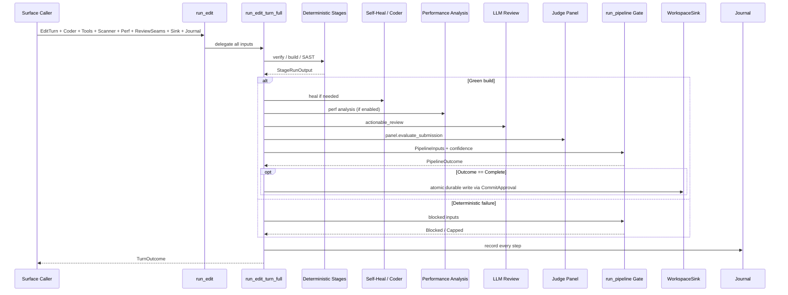
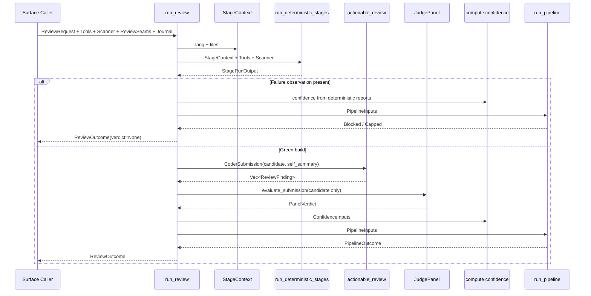
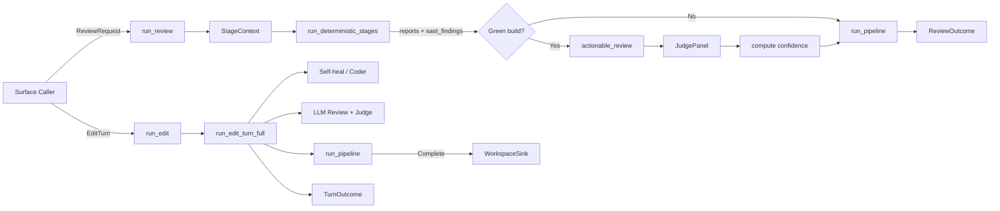

# Pipeline Stages and Tools — Surface API

## Brief Introduction

The **Surface API** module (`crates/ainxt-pipeline/src/surface.rs`) is the single, typed entry point through which external products and services interact with the Code-Review Pipeline and semantic-edit engine. It deliberately exposes only two operations:

- **`run_edit`** — execute a full editing turn (verify → self-heal → review → judge → commit gate → durable write).
- **`run_review`** — execute a read-only review turn over a candidate change set and return findings, the independent judge panel verdict, and a typed pipeline outcome.

By funneling every surface interaction through these two functions, the module enforces two critical system invariants:

1. **Durable writes are reachable only through a `CommitApproval` produced by a `Complete` pipeline outcome.** No caller can short-circuit the gate.
2. **Anti-sycophancy is structurally preserved.** The LLM review finder may see the coder's self-summary, while the independent judge panel never does.

This module belongs to the [`pipeline_stages_and_tools`](pipeline_stages_and_tools.md) subsystem, which sits inside [`pipeline_orchestration`](pipeline_orchestration.md) in the broader [`pipeline_runtime`](pipeline_runtime.md) domain.

---

## Core Components

### `ReviewRequest`

A route-ready, serializable request for a **review-only** turn. It carries:

| Field | Purpose |
|-------|---------|
| `edit_id` | Correlation identifier for the review request. |
| `files` | Candidate file set as `(path, source)` pairs. |
| `config` | A [`SelfHealConfig`](pipeline_stages_and_tools_self_heal.md) that encodes language, risk tier, rung, gate policy, and scoring parameters. `max_rounds` and `stuck` are ignored because a review is a single pass. |

The struct uses `#[serde(deny_unknown_fields)]` to reject smuggled keys at the wire boundary, mirroring the policy applied to [`EditRequest`](pipeline_stages_and_tools_edit_turn_execution.md).

### `ReviewOutcome`

The typed, serializable result of a review-only turn:

| Field | Purpose |
|-------|---------|
| `outcome` | [`PipelineOutcome`](pipeline_stages_and_tools_pipeline_orchestrator.md) (`Complete`, `Capped`, or `Blocked`). `Complete` is advisory because no sink is written. |
| `findings` | Actionable LLM review findings from stage 9. |
| `verdict` | Optional independent judge panel verdict. `None` when the candidate failed a deterministic stage. |
| `confidence` | The full confidence score consumed by the commit gate. |

`ReviewOutcome::would_complete()` provides a convenience predicate for surfaces that only need to know whether the change would clear the gate.

### `run_edit`

The public editing entry point. It delegates to [`run_edit_turn_full`](pipeline_stages_and_tools_edit_turn_execution.md), forwarding the supplied `EditTurn`, coder, stage tools, SAST scanner, optional performance config, optional review seams, workspace sink, and journal. The function is the only supported path for a surface to *change* code.

### `run_review`

The public review-only entry point. It:

1. Builds a [`StageContext`](pipeline_stages_and_tools_stage_execution.md) from the request.
2. Runs deterministic Phase-A stages and SAST via [`run_deterministic_stages`](pipeline_stages_and_tools_stage_execution.md).
3. On a green build, invokes the LLM review finder and the context-isolated judge panel.
4. Computes a [`ConfidenceScore`](pipeline_stages_and_tools_classification_and_risk.md) that exactly matches the score the gate would consume.
5. Runs the commit gate via [`run_pipeline`](pipeline_stages_and_tools_pipeline_orchestrator.md) and returns a `ReviewOutcome`.

Because there is no sink and no coder, a review can never mutate code, even when the outcome is `Complete`.

---

## Architecture

The Surface API sits at the outer edge of the pipeline. It does not implement stages, tools, or gate logic itself; it composes them and enforces the public contract.

---

## Dependencies

### Internal Pipeline Components

| Dependency | Module Doc | Role in this Module |
|------------|------------|---------------------|
| `crate::edit_turn::{run_edit_turn_full, EditTurn, TurnOutcome}` | [Edit Turn Execution](pipeline_stages_and_tools_edit_turn_execution.md) | Full editing turn orchestration and outcome types. |
| `crate::stages::{run_deterministic_stages, StageContext, StageTools}` | [Stage Execution](pipeline_stages_and_tools_stage_execution.md) | Deterministic Phase-A stage runner and tool abstraction. |
| `crate::stage::{Stage, StageReport, StageVerdict}` | [Stage Model](pipeline_stages_and_tools_stage_model.md) | Stage taxonomy and per-stage reports. |
| `crate::pipeline::{run_pipeline, PipelineInputs}` | [Pipeline Orchestrator](pipeline_stages_and_tools_pipeline_orchestrator.md) | Commit gate evaluation and outcome typing. |
| `crate::outcome::PipelineOutcome` | [Pipeline Orchestrator](pipeline_stages_and_tools_pipeline_orchestrator.md) | Typed gate outcome. |
| `crate::gate::GatePolicy` | [Commit Gate](pipeline_stages_and_tools_commit_gate.md) | Gate policy carried in `SelfHealConfig`. |
| `crate::sast::SastScanner` | [SAST](pipeline_stages_and_tools_sast.md) | Static analysis scanner used in deterministic stages. |
| `crate::selfheal::{Coder, ReviewSeams, SelfHealConfig}` | [Self Healing](pipeline_stages_and_tools_self_heal.md) | Coder abstraction, review seams, and review configuration. |
| `crate::confidence::{compute, ConfidenceInputs, ConfidenceScore}` | [Classification and Risk](pipeline_stages_and_tools_classification_and_risk.md) | Confidence computation consumed by the gate. |
| `crate::risk::RiskTier` | [Classification and Risk](pipeline_stages_and_tools_classification_and_risk.md) | Risk tier used in default review config. |
| `crate::perf::PerfConfig` | [Performance](pipeline_stages_and_tools_performance.md) | Optional performance analysis configuration. |
| `crate::journal::Journal` | [Journaling](pipeline_stages_and_tools_journaling.md) | Hash-chained audit journal. |

### External Crates

| Dependency | Module Doc | Role in this Module |
|------------|------------|---------------------|
| `ainxt_judge::{actionable_review, CoderSubmission, PanelVerdict, ReviewFinding}` | [Quality Verification Judge](quality_verification_judge.md) | LLM review finder and independent judge panel. |
| `ainxt_semantic::ladder::Rung` | [Edit Semantic](edit_semantic.md) | Semantic rung level for default review config. |
| `ainxt_semantic::workspace::WorkspaceSink` | [Edit Semantic](edit_semantic.md) | Durable workspace sink for editing turns. |

---

## Data Flow

### Editing Turn (`run_edit`)

### Review-Only Turn (`run_review`)

---

## Component Interaction

The Surface API is intentionally thin. It validates nothing beyond serde deserialization; all policy enforcement (gate policy, rung caps, confidence thresholds, context isolation) is delegated to the specialized subsystems it calls.

---

## Process Flows

### How a Review Reaches the Judge Panel

1. `run_review` constructs a `StageContext` from `ReviewRequest.files` and `ReviewRequest.config.lang`.
2. `run_deterministic_stages` executes Phase-A stages and SAST.
3. If `run.failure_observation` is `None`, the candidate is considered green.
4. A `CoderSubmission` is built from the joined file contents and the review seams' `self_summary`.
5. `actionable_review` (the finder) receives the full submission, including the self-summary.
6. `seams.judges.evaluate_submission` receives only the `.candidate` field and the criteria, preserving context isolation.
7. The panel's `consensus_pass` becomes `judge_approved`, and `context_isolation_confirmed` becomes `judge_independent`.
8. Confidence is computed with the deterministic reports, SAST findings, review findings, skipped stages, and rung.
9. `run_pipeline` consumes the assembled `PipelineInputs` and produces the final `PipelineOutcome`.

### How an Edit Commits

1. `run_edit` forwards all inputs to `run_edit_turn_full`.
2. The full turn runs deterministic stages, self-heal loops, optional performance analysis, LLM review, and the judge panel.
3. If the gate returns `Complete`, `run_edit_turn_full` materializes a `CommitApproval`.
4. The approval is the only token that authorizes the `WorkspaceSink` to perform an atomic durable write.
5. Every step is recorded in the hash-chained `Journal`.

---

## Integration with the Broader System

The Surface API is the boundary between the pipeline runtime and product surfaces such as:

- The HTTP server routes in [`server_serving_core`](server_serving_core.md) (e.g., `POST /v1/edit/review`).
- The CLI and client SDKs in [`tools_cli`](tools_cli.md).
- The workforce and role surfaces in [`workforce_runtime_teams`](workforce_runtime_teams.md) and [`teams`](teams.md).

It relies on the semantic-edit engine in [`edit_semantic`](edit_semantic.md) for workspace writes and rung levels, and on the quality verification subsystem in [`quality_verification_judge`](quality_verification_judge.md) for the LLM review finder and judge panel.

---

## Key Design Invariants

| Invariant | Enforcement |
|-----------|-------------|
| No durable write without a `Complete` gate | `run_edit` delegates to `run_edit_turn_full`, which only writes after receiving a `CommitApproval`. |
| No model judgment on broken builds | `run_review` skips the LLM review and judge panel when `failure_observation` is present, setting `verdict = None`. |
| Context isolation between finder and judge | The finder receives `CoderSubmission { candidate, self_summary }`; the panel receives only `candidate`. |
| Route-ready wire safety | `ReviewRequest` uses `deny_unknown_fields` to prevent key smuggling. |
| Auditability | Both `run_edit` and `run_review` journal every step to the supplied `Journal`. |

---

## See Also

- [Pipeline Stages and Tools](pipeline_stages_and_tools.md) — parent subsystem overview.
- [Edit Turn Execution](pipeline_stages_and_tools_edit_turn_execution.md) — full editing turn implementation.
- [Stage Execution](pipeline_stages_and_tools_stage_execution.md) — deterministic stages and tool abstraction.
- [Pipeline Orchestrator](pipeline_stages_and_tools_pipeline_orchestrator.md) — commit gate and `PipelineOutcome`.
- [Self Healing](pipeline_stages_and_tools_self_heal.md) — coder, self-heal config, and review seams.
- [SAST](pipeline_stages_and_tools_sast.md) — static analysis integration.
- [Classification and Risk](pipeline_stages_and_tools_classification_and_risk.md) — confidence scoring.
- [Journaling](pipeline_stages_and_tools_journaling.md) — hash-changed audit journal.
- [Quality Verification Judge](quality_verification_judge.md) — `ainxt-judge` finder and panel.
- [Edit Semantic](edit_semantic.md) — workspace sink and semantic rungs.
