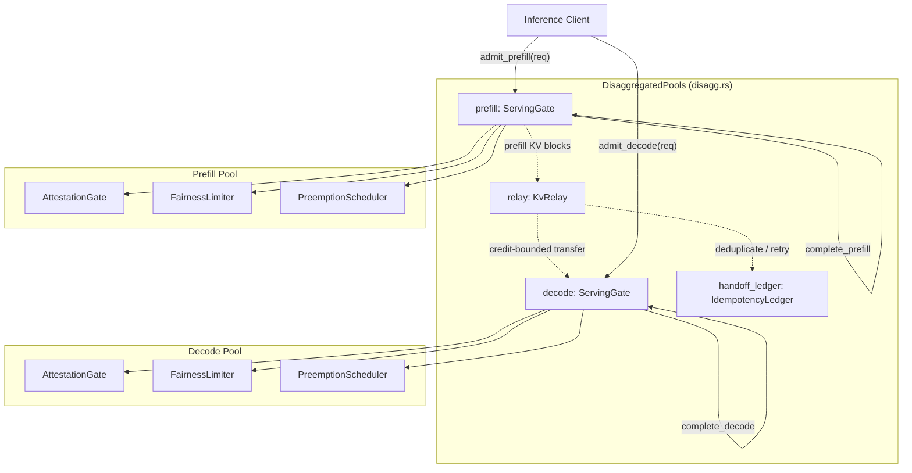
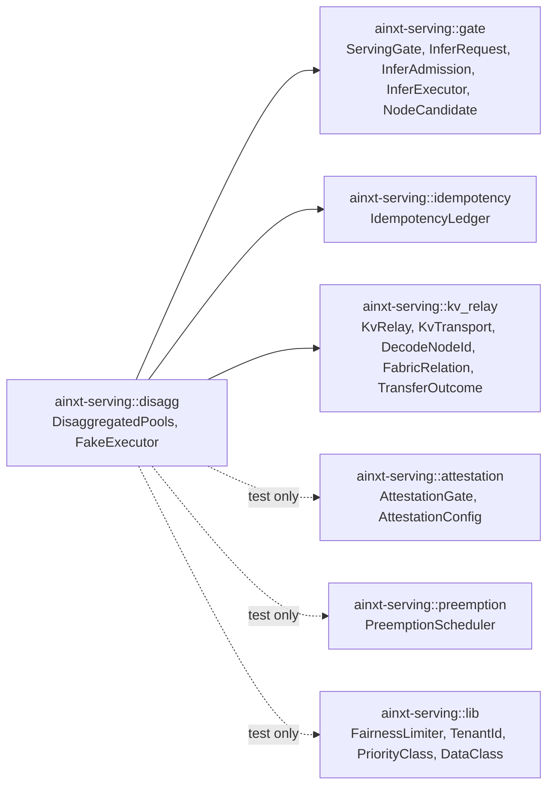
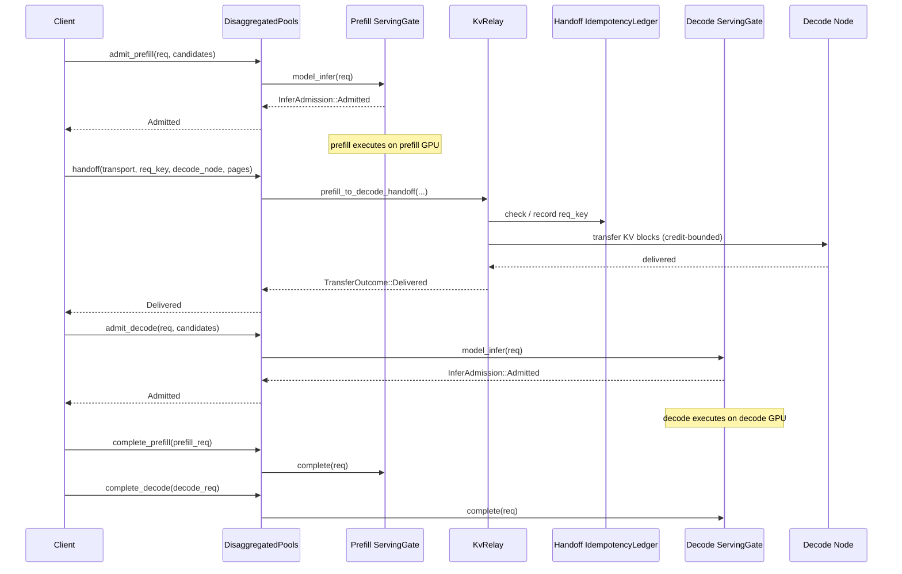
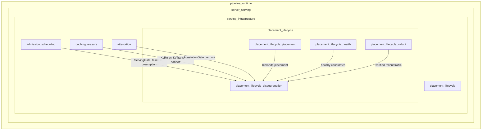

# placement_lifecycle_disaggregation

## Brief Introduction

The `placement_lifecycle_disaggregation` module implements the **structural interference-elimination mechanism** for LLM serving by physically separating *prefill* and *decode* execution into two independent pools. While chunked-prefill scheduling (see [admission_scheduling](admission_scheduling.md)) mitigates interference within a single pool by interleaving work, this module closes the interference class entirely by removing the shared GPU resource: a request's decode phase never waits on another request's prefill phase because they execute on different hardware pools connected only by a credit-bounded KV relay fabric.

The module is defined in `crates/ainxt-serving/src/disagg.rs` and exposes [`DisaggregatedPools`](./disagg.rs::DisaggregatedPools), which composes two independent [`ServingGate`](admission_scheduling.md#servinggate)s with a [`KvRelay`](caching_erasure.md#kvrelay) and a dedicated handoff idempotency ledger. This composition makes "decode admission is never gated by prefill saturation" a checkable property rather than an operational convention.

---

## Core Functionality

### Disaggregated Pool Composition

[`DisaggregatedPools`](./disagg.rs::DisaggregatedPools) owns:

- **`prefill: ServingGate`** — admission, fairness, preemption, and attestation state for the compute-bound prefill pool.
- **`decode: ServingGate`** — a completely independent gate for the memory-bandwidth-bound decode pool.
- **`relay: KvRelay`** — the only channel connecting the two pools, responsible for handing finished prefill KV blocks to a decode node.
- **`handoff_ledger: IdempotencyLedger`** — retry-safety ledger for the physical KV block transfer, distinct from either pool's own inference-billing ledger.

The two gates are constructed independently and share no mutable state. A deployment typically sizes them differently: the decode pool holds many concurrent low-compute sequences, while the prefill pool handles fewer, heavier bursts.

### Admission APIs

- [`admit_prefill`](./disagg.rs::DisaggregatedPools::admit_prefill) admits a prefill-phase request against only the prefill gate.
- [`admit_decode`](./disagg.rs::DisaggregatedPools::admit_decode) admits a decode-phase request against only the decode gate. Because it touches a separate [`ServingGate`](admission_scheduling.md#servinggate) instance, it is structurally independent of prefill-pool saturation.
- [`complete_prefill`](./disagg.rs::DisaggregatedPools::complete_prefill) and [`complete_decode`](./disagg.rs::DisaggregatedPools::complete_decode) free slots in their respective pools without cross-pool side effects.

### KV Handoff

[`handoff`](./disagg.rs::DisaggregatedPools::handoff) moves finished prefill KV blocks to a decode node via [`prefill_to_decode_handoff`](caching_erasure.md#prefill_to_decode_handoff). The handoff is:

- **Credit-bounded** — decode nodes grant credits up front; a handoff cannot OOM the decode pool.
- **Idempotent** — the handoff ledger deduplicates retries; a link drop refunds credits and is safely retryable.
- **The only cross-pool channel** — no admission, scheduling, or attestation state leaks between pools.

---

## Architecture

### Component Diagram

### Dependency Diagram

### Data Flow: Prefill → Handoff → Decode

---

## Component Relationships

### Within `placement_lifecycle_disaggregation`

| Component | Role | Collaborators |
|-----------|------|---------------|
| [`DisaggregatedPools`](./disagg.rs::DisaggregatedPools) | Composes two independent gates and the KV relay | `ServingGate`, `KvRelay`, `IdempotencyLedger` |
| [`FakeExecutor`](./disagg.rs::FakeExecutor) | Test-only stub implementing `InferExecutor` | `InferRequest`, `StreamHandle` |

### With Sibling Modules

| Related Module | Relationship |
|----------------|--------------|
| [placement_lifecycle_placement](placement_lifecycle_placement.md) | `placement.rs` decides which bins/nodes host model replicas; `disagg.rs` assumes that decision and splits admitted work into prefill vs. decode phases on physically separate pools. |
| [placement_lifecycle_health](placement_lifecycle_health.md) | `health.rs` monitors fleet/router state and drain/replace outcomes; healthy node candidates are passed into `admit_prefill` / `admit_decode`. |
| [placement_lifecycle_rollout](placement_lifecycle_rollout.md) | `rollout.rs` manages weight artifacts and soak signals across traffic windows; disaggregated pools receive traffic only after rollout artifacts are verified. |
| [admission_scheduling](admission_scheduling.md) | Provides `ServingGate`, `InferRequest`, fairness limiting, preemption, and idempotency primitives consumed by both pools. |
| [caching_erasure](caching_erasure.md) | Provides `KvRelay`, `KvTransport`, and the handoff semantics that bridge the two pools, plus cache isolation and erasure support. |
| [attestation](attestation.md) | Each pool has its own `AttestationGate`; attestation state is not shared between prefill and decode pools. |

---

## How It Fits into the Overall System

The module sits in the **serving infrastructure** layer under `pipeline_runtime` → `server_serving`:

At runtime, the disaggregation module is typically driven by the runtime engine ([runtime_engine](runtime_engine.md)) or the server surface ([server_serving_core](server_serving_core.md)). An incoming turn is split into:

1. **Prefill phase** — large prompt context is processed in parallel on the prefill pool.
2. **KV handoff** — computed KV blocks are relayed to a decode node.
3. **Decode phase** — token-by-token generation runs on the decode pool without interference from concurrent prefills.

This design directly addresses SERVING_OPS.md §1 gap 7: *structural elimination of prefill/decode interference* rather than scheduling around it.

---

## Key Invariants

The module's test suite encodes two critical properties:

1. **`admit_decode_is_never_gated_by_prefill_saturation`** — Even when the prefill pool is fully saturated, decode admissions proceed normally because they consult a separate `ServingGate`.
2. **`handoff_moves_kv_blocks_between_the_two_pools_under_credit`** — The KV relay is the sole cross-pool channel; transfers are credit-bounded and idempotent.

These invariants are only expressible because `DisaggregatedPools` makes the separation a first-class composition, not a deployment convention.

---

## References

- [admission_scheduling](admission_scheduling.md) — `ServingGate`, fairness, preemption, and idempotency primitives.
- [caching_erasure](caching_erasure.md) — `KvRelay`, `KvTransport`, and KV block handoff semantics.
- [attestation](attestation.md) — Per-pool attestation gates.
- [placement_lifecycle_placement](placement_lifecycle_placement.md) — Model replica binning and placement decisions.
- [placement_lifecycle_health](placement_lifecycle_health.md) — Fleet health monitoring and candidate readiness.
- [placement_lifecycle_rollout](placement_lifecycle_rollout.md) — Traffic weight rollout and soak verification.
- [runtime_engine](runtime_engine.md) — Core engine that orchestrates turns and surfaces.
- [server_serving_core](server_serving_core.md) — HTTP/server surface that submits inference requests.
