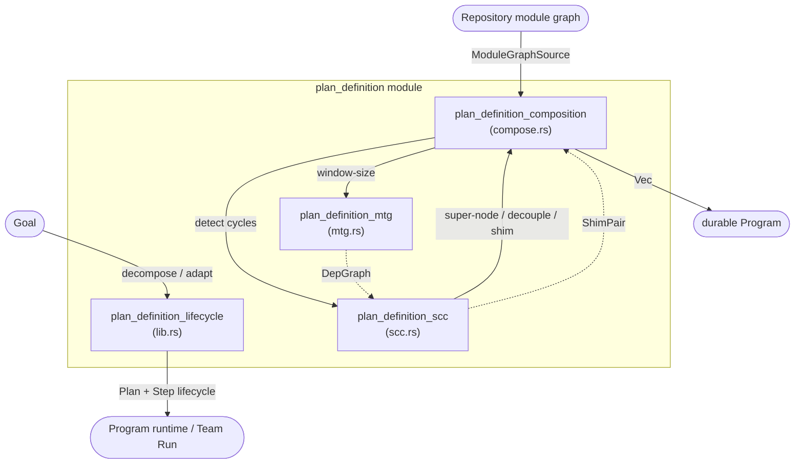
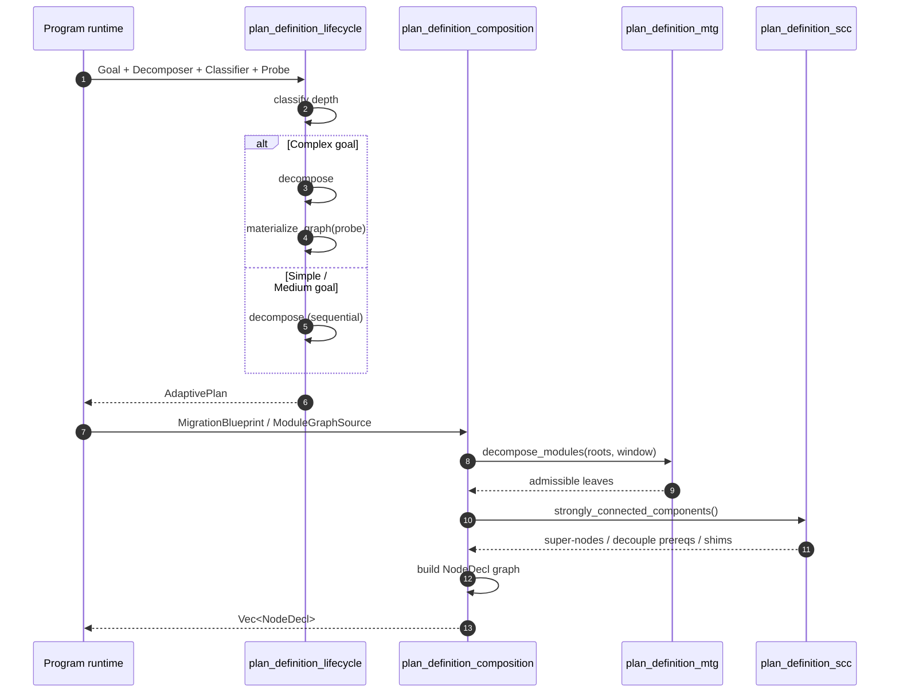

# plan_definition

The `plan_definition` module is the pure, deterministic core of the long-horizon **Program** subsystem (ADR-027). It sits inside `pipeline_runtime::planning_program_execution` and is responsible for turning a high-level goal into a dependency-ordered, adaptable plan that can survive step failures without thrashing, and for composing a repository module graph into a schedulable set of migration nodes.

A normal AI Run is minutes-to-hours, single-window, and transient — its task graph is discarded when the Run ends. Real engineering work (a 1M-LOC migration, a multi-service refactor) outlives any single Run. `plan_definition` closes that gap by introducing the **plan lifecycle** altitude above a Run: goals are decomposed into steps, steps are executed in topological order, failures are isolated to their transitive dependents, and bounded replanning keeps the program moving forward. The module also provides the **Module Task Graph (MTG)** machinery that guarantees no single migration node ever overflows a model context window, regardless of repository size.

## Key responsibilities

- **Goal decomposition** — turn a [`Goal`](plan_definition_lifecycle.md#goal) into a [`Plan`](plan_definition_lifecycle.md#plan) of dependency-ordered [`Step`](plan_definition_lifecycle.md#step)s via a pluggable [`Decomposer`](plan_definition_lifecycle.md#decomposer) seam.
- **Topological execution readiness** — expose exactly the steps whose dependencies are all `Done`, so a runtime can never start work out of order.
- **Failure isolation and replanning** — mark only transitive dependents of a failed step as `Blocked`; allow a bounded number of alternative approaches per step; escalate to a human when a step keeps failing (plan-thrash detection).
- **Adaptive planning depth** — classify goals as `Simple`, `Medium`, or `Complex` and only pay the cost of a structure probe / graph materialization when genuine independence exists.
- **Window-sized module task graphs** — auto-split repository modules until every migration leaf fits a configured fraction of the target model's context window.
- **Cycle handling** — detect strongly-connected components in the module dependency graph and resolve them as either a migration super-node or a human-checkpointed decoupling prerequisite.
- **Strangler-fig shim planning** — insert compatibility shims and cleanup nodes for reverse-order edges where a consumer must migrate before its provider.

## Architecture overview

The module is deliberately **pure**: no I/O, no threads, no clock, no randomness. Every decision is a function of explicit inputs, which makes every invariant a unit-testable property on concrete values.

## Sub-modules

| Sub-module | File | Responsibility | Documentation |
|------------|------|----------------|---------------|
| `plan_definition_lifecycle` | `lib.rs` | Goal / step / plan lifecycle, adaptive planning depth, decomposition seams | [plan_definition_lifecycle.md](plan_definition_lifecycle.md) |
| `plan_definition_composition` | `compose.rs` | Compose a repository module graph into a validated `Vec<NodeDecl>` for the durable Program | [plan_definition_composition.md](plan_definition_composition.md) |
| `plan_definition_scc` | `scc.rs` | Tarjan SCC detection, cycle resolution, strangler-fig shim planning | [plan_definition_scc.md](plan_definition_scc.md) |
| `plan_definition_mtg` | `mtg.rs` | Module Task Graph window-sizing and auto-split invariant | [plan_definition_mtg.md](plan_definition_mtg.md) |

## How it fits into the system

`plan_definition` is one of four children under `pipeline_runtime::planning_program_execution`. Its siblings handle the durable Program driver, program execution, and supervision/verification. The plan produced here is consumed by the runtime engine and team execution layers:

- [`program_execution`](program_execution.md) drives the durable Program built from the node declarations emitted by `plan_definition_composition`.
- [`runtime_engine`](runtime_engine.md) executes individual turns and routes them to the right models.
- [`ai_engine::prompt_engineering`](prompt_engineering.md) supplies the LLM-backed decomposers and structure probes that live behind the pure seams defined here.
- [`ai_engine::knowledge_retrieval`](knowledge_retrieval.md) provides the real repository import/call graph behind `ModuleGraphSource`.

## Data flow

## Core invariants

1. **Topological readiness** — `ready_steps()` returns exactly the `Pending` steps whose every dependency is `Done`.
2. **Bulkhead failure isolation** — `mark_failed()` only blocks the failed step's transitive dependents; independent branches keep running.
3. **Bounded replanning** — `replan_failed()` only tries up to `PlanConfig::max_replans_per_step` alternatives per step, then escalates without mutating the plan.
4. **Step budget** — a plan never exceeds `PlanConfig::step_budget`, at construction or after any replan.
5. **Schedulable graph, always** — duplicate ids, self-dependencies, dangling dependencies, and cycles are rejected at construction and at every replan.
6. **Window-sized nodes** — every emitted MTG leaf has `working_set_estimate <= window.ceiling()`; total repo size only changes node count, not per-node context.
7. **Cycles surfaced, not linearized** — multi-member SCCs become either a migration super-node or a human-checkpointed decoupling prerequisite.

## See also

- [plan_definition_lifecycle.md](plan_definition_lifecycle.md) — plan lifecycle and adaptive depth
- [plan_definition_composition.md](plan_definition_composition.md) — module-graph composition
- [plan_definition_scc.md](plan_definition_scc.md) — SCC cycle handling
- [plan_definition_mtg.md](plan_definition_mtg.md) — window-sized module task graphs
- [program_execution.md](program_execution.md) — durable Program driver and execution
- [supervision_and_verification.md](supervision_and_verification.md) — verification gates and supervision
