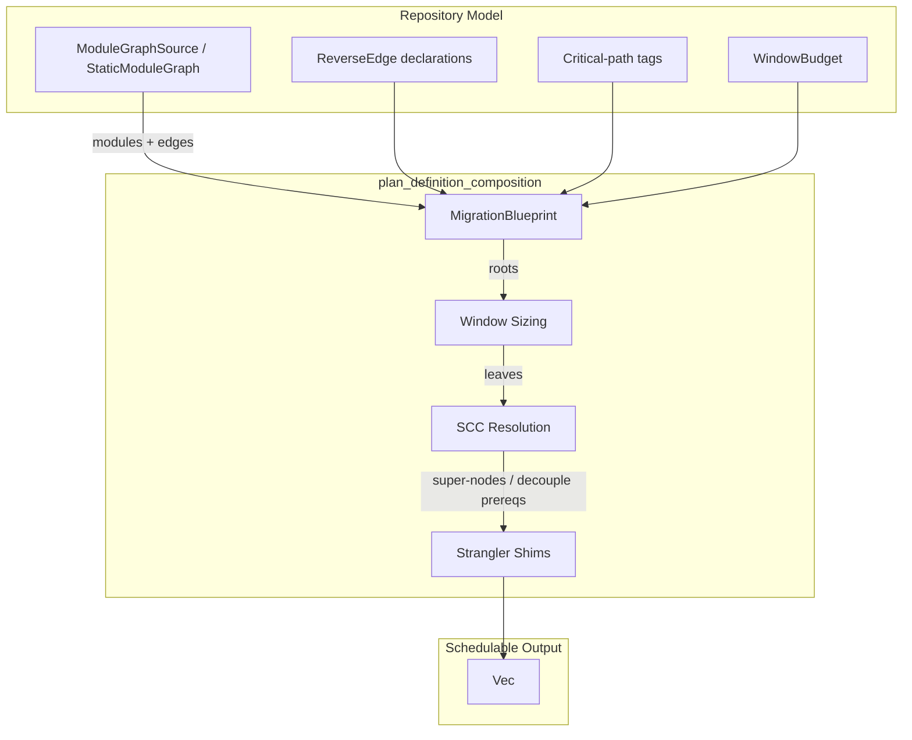
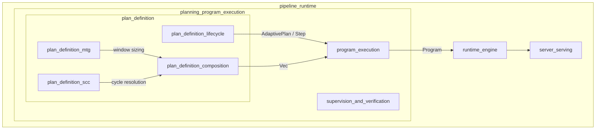
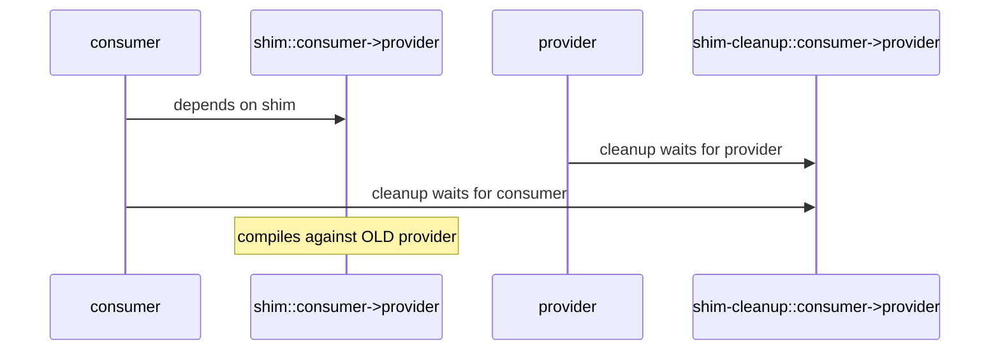
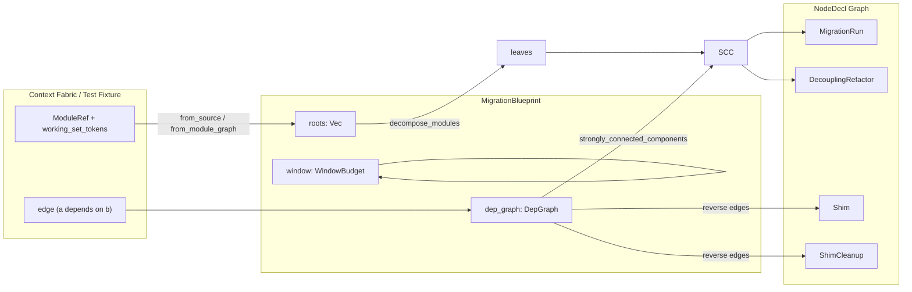

# plan_definition_composition

The **plan_definition_composition** module is the single, deterministic entrypoint that turns a repository module model into the validated `Vec<NodeDecl>` graph consumed by the durable [`Program`](program_execution.md) executor. It closes the gap between isolated window-sizing, cycle-resolution, and shim-planning algorithms by composing them into one pure function: the same blueprint always yields byte-identical node declarations.

---

## 1. Purpose & Core Functionality

Long-horizon migrations over large codebases cannot be planned as one monolithic edit. The planner must split work into context-window-admissible units, resolve cyclic dependencies, and schedule strangler-fig shims when the target order reverses a natural dependency. Before this module existed, the served path hard-coded a single `NodeDecl`, so real repositories never reached any of those capabilities.

`plan_definition_composition` provides:

1. **A unified composition API** — [`MigrationBlueprint::compose`](#migrationblueprint) runs window-sizing, SCC resolution, and shim planning in one deterministic call.
2. **A Context-Fabric seam** — [`ModuleGraphSource`](#modulegraphsource) lets the served path decompose from the live repository import/call graph instead of a fabricated node set.
3. **Critical-path governance** — modules on settlement/ledger/compliance paths are lifted to human checkpoints with an AST edit floor.
4. **Deterministic output** — no clock, RNG, or I/O; emitted nodes are sorted by id so repeated composition is byte-identical.

---

## 2. Architecture

### 2.1 High-level component diagram



### 2.2 Module placement in the system



`plan_definition_composition` sits between the lower-level graph primitives ([`plan_definition_mtg`](plan_definition_mtg.md) for window sizing and [`plan_definition_scc`](plan_definition_scc.md) for cycle resolution) and the durable [`program_execution`](program_execution.md) layer that schedules and runs nodes.

---

## 3. Core Components

### 3.1 `FabricModule`

A migration unit surfaced by the Context Fabric: a module reference plus the measured token size of its working set (module body + 1-hop interface context). This is the unit that [`MigrationBlueprint::from_source`](#migrationblueprint) turns into an [`MtgNode`](plan_definition_mtg.md).

```rust
pub struct FabricModule {
    pub module: ModuleRef,
    pub working_set_tokens: u64,
}
```

### 3.2 `ModuleGraphSource`

The Context-Fabric module-graph seam. Implementations supply the real repository module set and import/call dependency graph. Cycles are permitted and resolved by the SCC phase.

```rust
pub trait ModuleGraphSource {
    fn modules(&self) -> Vec<FabricModule>;
    fn edges(&self) -> Vec<(ModuleRef, ModuleRef)>;
}
```

A deployment backs this trait with the live `ainxt-context` retrieval layer; tests use [`StaticModuleGraph`](#staticmodulegraph).

### 3.3 `StaticModuleGraph`

The offline, dependency-free [`ModuleGraphSource`](#modulegraphsource) default. It stores an explicit module list and edge list, making it ideal for tests and fixed migration shapes.

```rust
pub struct StaticModuleGraph {
    modules: Vec<FabricModule>,
    edges: Vec<(ModuleRef, ModuleRef)>,
}
```

### 3.4 `ReverseEdge`

A strangler-fig reverse-order edge: a `consumer` that must migrate *before* the `provider` it depends on. The natural `consumer → provider` dependency is replaced by a compatibility shim so the consumer can migrate first.

```rust
pub struct ReverseEdge {
    pub consumer: ModuleRef,
    pub provider: ModuleRef,
}
```

### 3.5 `MigrationBlueprint`

The repository model a [`Program`](program_execution.md) is composed from. It aggregates roots, the dependency graph, the window budget, reverse edges, and critical-path tags.

```rust
pub struct MigrationBlueprint {
    pub roots: Vec<MtgNode>,
    pub dep_graph: DepGraph,
    pub window: WindowBudget,
    pub reverse_edges: Vec<ReverseEdge>,
    pub critical_paths: BTreeSet<ModuleRef>,
}
```

Key methods:

- `from_module_graph` — build a blueprint from raw module refs, token sizes, and edges.
- `from_source` — build a blueprint from any [`ModuleGraphSource`](#modulegraphsource).
- `with_reverse_edge` — declare a reverse-order edge.
- `with_critical_path` — tag a module as critical-path.
- `compose` — run the three-phase composition and return `Vec<NodeDecl>`.

### 3.6 `SuperNode` & `DecouplePrereq`

Internal structures produced during SCC resolution:

- **`SuperNode`** — a fits-window strongly-connected component collapsed into a single migration node whose id is the joined member names.
- **`DecouplePrereq`** — an oversized strongly-connected component transformed into a human-checkpointed `DecouplingRefactor` prerequisite that breaks the cycle.

### 3.7 `ComposeError`

The single failure mode currently surfaced by composition: a module that cannot be made to fit the context window even after auto-splitting.

```rust
pub enum ComposeError {
    Split(SplitError),
}
```

---

## 4. Composition Pipeline

`MigrationBlueprint::compose` runs three deterministic phases in order:


### 4.1 Phase 1 — Window sizing

[`decompose_modules`](plan_definition_mtg.md) auto-splits every root until every leaf's working set fits the window ceiling. An irreducible over-budget leaf returns [`ComposeError::Split`](#composeerror).

### 4.2 Phase 2 — SCC resolution

Tarjan SCC detection runs over the dependency graph. Each multi-member cluster is resolved by [`resolve_scc`](plan_definition_scc.md):

- **Fits window** → collapse to one migration `SuperNode`.
- **Too big** → emit a `DecouplingRefactor` prerequisite with a `CriticalPath` checkpoint; members depend on the prerequisite instead of each other, breaking the cycle.

The emitted graph is always acyclic.

### 4.3 Phase 3 — Strangler shims

Each declared [`ReverseEdge`](#reverseedge):

1. Drops the `consumer → provider` dependency.
2. Adds a `Shim` node that the consumer depends on.
3. Adds a `ShimCleanup` node scheduled after both provider and consumer migrate.



---

## 5. Data Flow



---

## 6. Dependencies on Other Modules

| Dependency | Module Doc | Role in Composition |
|------------|------------|---------------------|
| `crate::mtg` | [plan_definition_mtg](plan_definition_mtg.md) | Window-sizing / auto-splitting of roots into admissible leaves. |
| `crate::scc` | [plan_definition_scc](plan_definition_scc.md) | Tarjan SCC detection, super-node collapse, decoupling prerequisites, and strangler-shim planning. |
| `crate::program::NodeDecl` | [program_execution](program_execution.md) | The output node contract consumed by the durable `Program`. |
| `crate::driver::Program` | [program_execution](program_execution.md) | Validates and schedules the emitted `Vec<NodeDecl>`. |
| `ainxt-context` (live source) | [context_retrieval_routing_core](context_retrieval_routing_core.md) | Provides the real import/call graph behind `ModuleGraphSource` in deployments. |

---

## 7. Critical Path Handling

Modules tagged via `with_critical_path` are on the settlement/ledger/compliance path. Composition lifts them to:

- `CheckpointClass::CriticalPath` — requires human approval.
- `EditRung::Ast` — forbids low-fidelity `TextPatch` edits.

This applies both to plain leaves and to members of a super-node.

---

## 8. Determinism & Testability

`compose` is pure: it takes no clock, RNG, or I/O. Output nodes are sorted by id, so the same blueprint always produces byte-identical declarations. The module's test suite exercises:

- Window-sizing expansion and irreducible-module errors.
- Acyclic dependency propagation.
- Small-cycle super-node collapse.
- Oversized-cycle decoupling prerequisites.
- Reverse-edge shim/cleanup insertion.
- Critical-path gating.
- Output determinism and id sorting.

---

## 9. How It Fits Into the Overall System

The served path no longer hard-codes a single `NodeDecl`. Instead it:

1. Retrieves the real repository module graph from the Context Fabric (`ainxt-context`).
2. Builds a [`MigrationBlueprint`](#migrationblueprint) via [`from_source`](#migrationblueprint).
3. Calls `compose` to obtain a validated, acyclic, window-admissible `Vec<NodeDecl>`.
4. Hands the result to [`Program::decompose`](program_execution.md) for scheduling and execution.

By centralizing composition in this module, window-sizing, cycle handling, and shim planning become reachable through one clean call rather than scattered ad-hoc logic.
