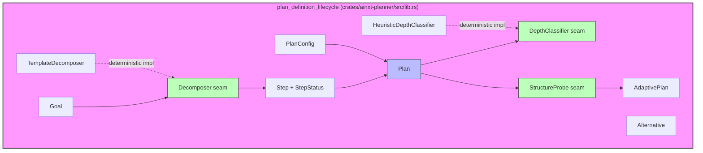
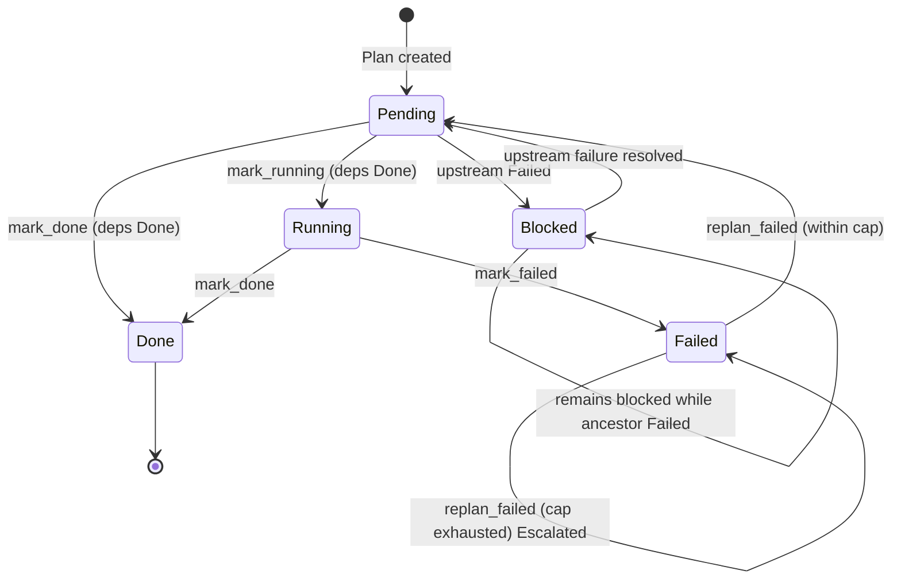
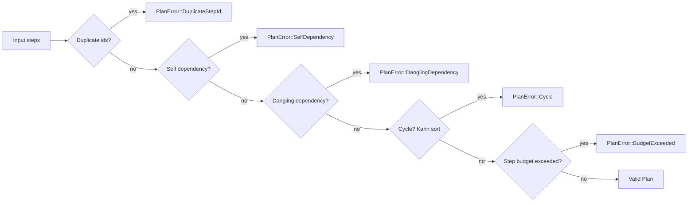
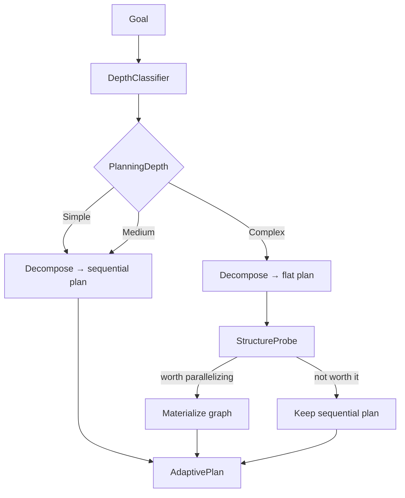
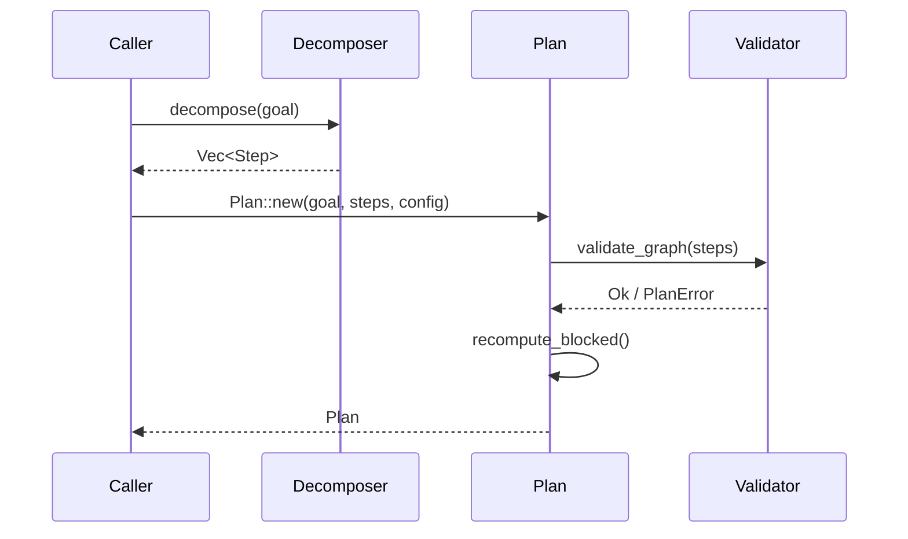
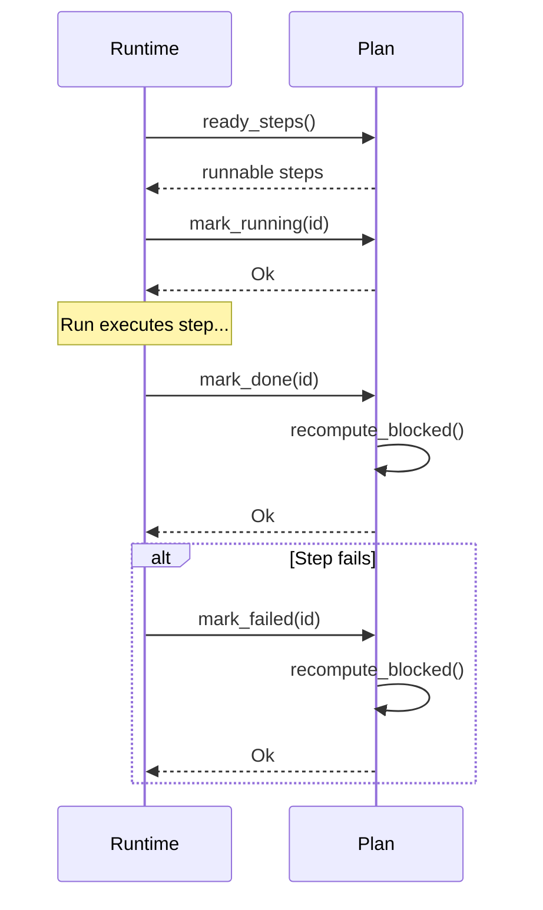
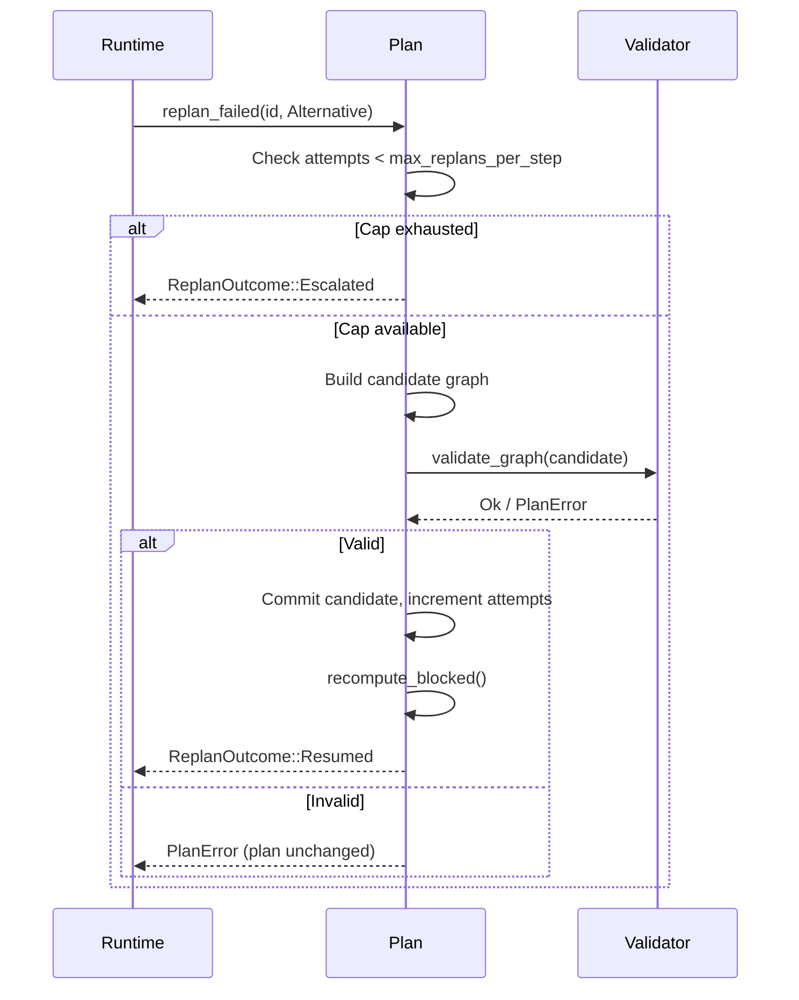
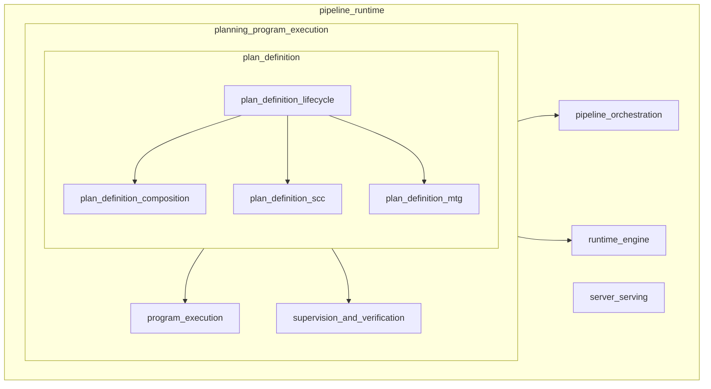

# plan_definition_lifecycle

The **plan_definition_lifecycle** module is the pure, deterministic core of long-horizon program planning in the `ainxt-planner` crate. It owns the *plan itself over time*: how a high-level [`Goal`](plan_definition_lifecycle.md#goal) becomes a dependency-ordered graph of [`Step`](plan_definition_lifecycle.md#step)s, how that plan adapts when steps fail, and when the runtime must stop retrying and escalate to a human.

This module deliberately performs **no I/O**, spawns no threads, reads no clock, and draws no randomness. Every decision is a function of explicit inputs, making every lifecycle guarantee a unit-testable property on concrete values rather than an operational hope.

---

## Purpose and Core Functionality

In the broader system, a single Run is minutes-to-hours, single-window, and transient — its task graph is discarded at Run end. Real multi-step work (for example, a large migration) requires a durable, adaptable **Program** that survives step failures without thrashing. The `plan_definition_lifecycle` module closes that gap by providing the in-memory, adaptable plan lifecycle.

> **Scope boundary:** This module is distinct from [`ainxt-teams`](teams.md), which schedules role/handoff DAGs for a single Run. A planner step is executed *by* a team Run, but the lifecycle logic — decomposition, failure isolation, replanning, and escalation — lives here.

The module provides six core guarantees, each backed by explicit invariants and tests:

1. **Topological readiness** — only `Pending` steps whose every dependency is `Done` are runnable.
2. **Bulkhead failure isolation** — a failed step blocks only its transitive dependents; independent branches continue.
3. **Bounded replanning** — a failed step can be replanned with an alternative up to a per-step cap.
4. **Plan-thrash escalation** — once the replan cap is exhausted, the plan escalates instead of looping forever.
5. **Step budget** — a plan may never exceed a configured maximum number of steps.
6. **A schedulable graph, always** — cycles, self-dependencies, dangling references, and duplicate ids are rejected at construction and at every replan.

---

## Architecture

### High-level component map

### Key abstractions

| Component | Responsibility |
|-----------|----------------|
| [`Goal`](plan_definition_lifecycle.md#goal) | The high-level objective the plan is decomposed from. May carry a data classification (via the `ainxt-types` feature) for compliance-aware routing. |
| [`Step`](plan_definition_lifecycle.md#step) | One node in the plan graph: an id, description, dependency list, lifecycle status, and replan-attempt counter. |
| [`StepStatus`](plan_definition_lifecycle.md#stepstatus) | `Pending`, `Running`, `Done`, `Failed`, or `Blocked`. `Blocked` is derived from upstream `Failed` steps. |
| [`Plan`](plan_definition_lifecycle.md#plan) | The adaptable, dependency-ordered plan. Enforces graph validity, step budget, and all lifecycle transitions. |
| [`Decomposer`](plan_definition_lifecycle.md#decomposer) | The goal→steps seam. The live runtime backs this with an Architect-role LLM invocation; [`TemplateDecomposer`](plan_definition_lifecycle.md#templatedecomposer) is the deterministic implementation for tests and fixed shapes. |
| [`DepthClassifier`](plan_definition_lifecycle.md#depthclassifier) | Classifies a goal into [`PlanningDepth`](plan_definition_lifecycle.md#planningdepth) (`Simple`, `Medium`, `Complex`). |
| [`StructureProbe`](plan_definition_lifecycle.md#structureprobe) | Decides whether a flat plan should be promoted to a parallel graph and supplies genuine dependency edges. |
| [`PlanConfig`](plan_definition_lifecycle.md#planconfig) | Tunable caps: `max_replans_per_step` and `step_budget`. |
| [`Alternative`](plan_definition_lifecycle.md#alternative) | A replacement approach for a failed step, possibly introducing new prerequisite steps. |
| [`AdaptivePlan`](plan_definition_lifecycle.md#adaptiveplan) | The result of [`plan_adaptively`](plan_definition_lifecycle.md#plan_adaptively): the final plan, the depth chosen, and whether a graph was materialized. |

---

## Component Relationships

### Plan lifecycle state machine

### Dependency graph validation

Every plan construction and every replan runs the same validation pipeline:

### Adaptive depth decision

---

## Data Flow

### Creating a plan

### Executing and failing a step

### Replanning a failed step

---

## Process Flows

### `plan_adaptively` — the composed entrypoint

[`plan_adaptively`](plan_definition_lifecycle.md#plan_adaptively) chains classification, decomposition, and optional graph materialization into a single deterministic call:

1. Classify the goal's [`PlanningDepth`](plan_definition_lifecycle.md#planningdepth).
2. Decompose the goal into a plan.
3. **Only** for the `Complex` tier, run the [`StructureProbe`](plan_definition_lifecycle.md#structureprobe) and call [`Plan::materialize_graph`](plan_definition_lifecycle.md#planmaterialize_graph).
4. Return an [`AdaptivePlan`](plan_definition_lifecycle.md#adaptiveplan) recording the depth and whether parallelism was materialized.

This keeps the simple/medium majority case cheap while earning parallel tracks only when genuine independence is detected.

### Failure isolation and recovery

When a step fails:

1. [`Plan::mark_failed`](plan_definition_lifecycle.md#planmark_failed) sets the step to `Failed`.
2. [`Plan::recompute_blocked`](plan_definition_lifecycle.md#planrecompute_blocked) marks every transitive dependent as `Blocked`.
3. Independent branches remain `Pending`/`Running` and can complete.
4. The runtime may call [`Plan::replan_failed`](plan_definition_lifecycle.md#planreplan_failed) with an [`Alternative`](plan_definition_lifecycle.md#alternative).
5. A successful replan returns the failed step to `Pending`, adds any new prerequisite steps, unblocks dependents, and increments the replan-attempt counter.
6. If the cap is reached, the plan returns [`ReplanOutcome::Escalated`](plan_definition_lifecycle.md#replanoutcome) and leaves the plan unchanged.

---

## How It Fits into the Overall System

### Within `pipeline_runtime`

The `plan_definition_lifecycle` module sits under the [`planning_program_execution`](planning_program_execution.md) subsystem of [`pipeline_runtime`](pipeline_runtime.md):

### Sibling modules

| Sibling | Role | How it composes with lifecycle |
|---------|------|-------------------------------|
| [`plan_definition_composition`](plan_definition_composition.md) | Module composition, migration blueprints, static module graphs (`compose.rs`). | Supplies higher-level program structure that the lifecycle plan decomposes into steps. |
| [`plan_definition_scc`](plan_definition_scc.md) | Strongly-connected-component detection (`scc.rs`). | Used to detect cycles and dependency clusters in program graphs. |
| [`plan_definition_mtg`](plan_definition_mtg.md) | Module Task Graph window-sizing invariant (`mtg.rs`). | Ensures each plan step's working set fits a context window fraction. |
| [`program_execution`](program_execution.md) | Program driver and durable aggregate (`driver.rs`, `program.rs`). | Executes the plan produced by the lifecycle module and persists progress. |
| [`supervision_and_verification`](supervision_and_verification.md) | Supervisor, verification gates, QoS (`supervisor.rs`, `verify.rs`, `assurance.rs`, `qos.rs`, `revision.rs`). | Verifies step outcomes and decides when to rollback, retry, or escalate. |

### Downstream consumers

- [`runtime_engine`](runtime_engine.md) — the core [`Engine`](runtime_engine.md#engine) and [`TurnOutcome`](runtime_engine.md#turnoutcome) machinery executes individual Runs that carry out plan steps.
- [`pipeline_orchestration`](pipeline_orchestration.md) — higher-level pipeline stages (edit turns, self-heal, SAST, performance) consume plan state to drive stage execution.
- [`server_serving`](server_serving.md) — the HTTP server and serving infrastructure expose program progress and accept external replan/escalation requests.
- [`ai_engine`](ai_engine.md) — prompt engineering and LLM provider modules supply the live implementations behind the [`Decomposer`](plan_definition_lifecycle.md#decomposer) and [`StructureProbe`](plan_definition_lifecycle.md#structureprobe) seams.

---

## Configuration

[`PlanConfig`](plan_definition_lifecycle.md#planconfig) controls the lifecycle bounds:

| Field | Default | Meaning |
|-------|---------|---------|
| `max_replans_per_step` | `3` | How many alternatives may be tried for a single failed step before escalation. |
| `step_budget` | `4096` | Maximum number of steps a plan may contain, including steps added by replans. |

These defaults are illustrative; production deployments tune them per program.

---

## Error Handling

All plan operations return [`PlanError`](plan_definition_lifecycle.md#planerror), a deterministic, cloneable enum covering:

- `EmptyPlan` — a plan must have at least one step.
- `DuplicateStepId` — two steps share an id.
- `SelfDependency` — a step depends on itself.
- `DanglingDependency` — a dependency references a missing step.
- `Cycle` — the dependency graph contains a cycle.
- `BudgetExceeded` — the plan would exceed `step_budget`.
- `UnknownStep` — an operation referenced a non-existent step.
- `InvalidTransition` — a state transition is illegal from the current `StepStatus`.
- `NotFailed` — `replan_failed` was called on a step that is not `Failed`.
- `Decompose` — the injected decomposer failed.

A key design property: **invalid replans are rejected without mutating the plan**. The candidate graph is built and validated separately; only a valid candidate is committed.

---

## Testing Strategy

Because the module is pure and deterministic, its guarantees are expressed as unit-test properties on concrete values:

- Ready steps respect dependencies in a diamond graph.
- Failure blocks only transitive dependents, not independent branches.
- Replanning resumes a failed step and unblocks dependents.
- Replanning can introduce new prerequisite steps.
- The thrash detector escalates after the configured cap.
- Successful completion resets the replan counter.
- Step budget is enforced at construction and on replan, leaving the plan unchanged on rejection.
- Cycles, self-dependencies, dangling dependencies, duplicate ids, and empty plans are rejected.
- Plan state survives JSON round-trips and remains consistent.
- Adaptive depth classification and graph materialize/flatten round-trips behave correctly.

---

## References

- Parent subsystem: [`planning_program_execution`](planning_program_execution.md)
- Sibling plan-definition modules:
  - [`plan_definition_composition`](plan_definition_composition.md)
  - [`plan_definition_scc`](plan_definition_scc.md)
  - [`plan_definition_mtg`](plan_definition_mtg.md)
- Execution and supervision siblings:
  - [`program_execution`](program_execution.md)
  - [`supervision_and_verification`](supervision_and_verification.md)
- Runtime consumers:
  - [`runtime_engine`](runtime_engine.md)
  - [`pipeline_orchestration`](pipeline_orchestration.md)
  - [`server_serving`](server_serving.md)
- AI/model seams:
  - [`prompt_engineering`](prompt_engineering.md)
  - [`llm_providers`](llm_providers.md)
- Team execution (distinct from plan lifecycle):
  - [`teams`](teams.md)
