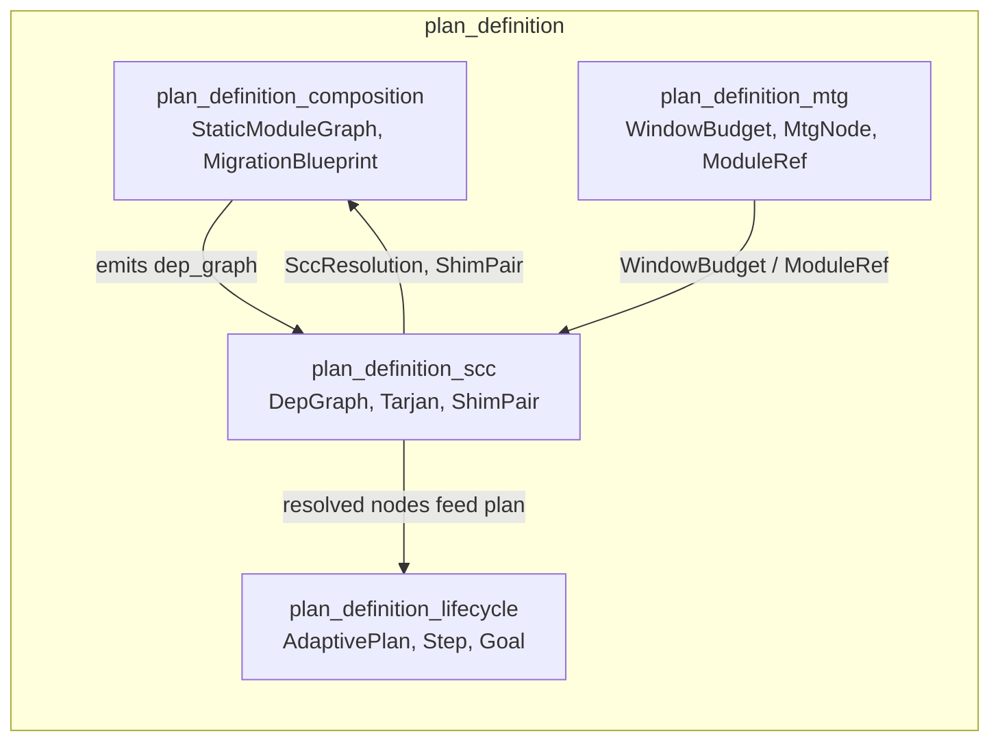
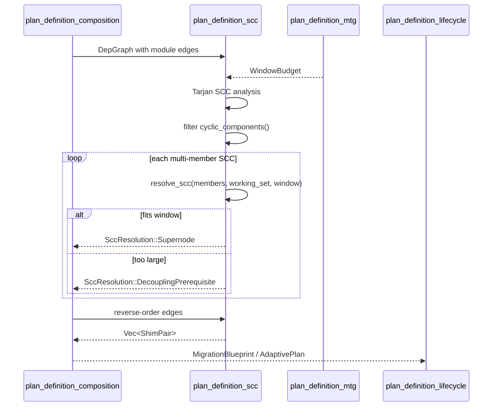
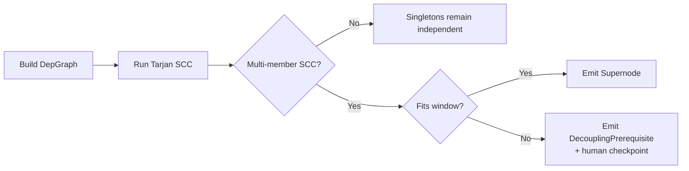
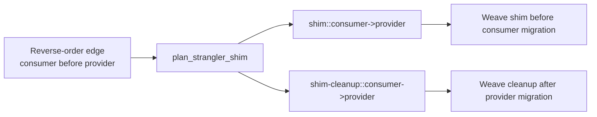
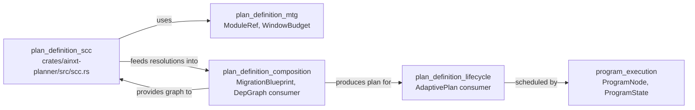

# plan_definition_scc

## Brief Introduction

`plan_definition_scc` is the strongly-connected-component (SCC) analysis layer inside the AI-native transformation planner. It takes a module dependency graph, surfaces circular coupling with Tarjan's algorithm, and resolves each cycle according to ADR-027 §3.3 and §3.4: small cycles become migration super-nodes, oversized cycles become human-checkpointed decoupling prerequisites, and reverse-order edges receive strangler-fig shim/cleanup pairs. The module is pure, deterministic, and unit-testable — it contains no I/O, clocks, or randomness.

---

## Comprehensive Documentation

### 1. Purpose and Scope

Real legacy monoliths contain mutual imports. A planner that simply rejects cyclic decompositions would be unusable for these codebases, yet a planner that silently linearizes cycles would schedule partial, unsafe migrations. `plan_definition_scc` closes that gap by:

1. **Detecting** all strongly-connected components in a module dependency graph.
2. **Resolving** each multi-member SCC into either a single migration super-node or a human-checkpointed decoupling prerequisite.
3. **Planning** strangler-fig compatibility shims for reverse-order edges where a consumer must migrate before its provider.

This module sits under [`plan_definition`](plan_definition.md) alongside [`plan_definition_lifecycle`](plan_definition_lifecycle.md), [`plan_definition_composition`](plan_definition_composition.md), and [`plan_definition_mtg`](plan_definition_mtg.md). While `plan_definition_composition` builds the static module graph and `plan_definition_mtg` models migration-time budgets, `plan_definition_scc` makes the graph schedulable without hiding circular coupling.

### 2. Core Concepts

| Concept | Description |
|--------|-------------|
| `DepGraph` | A directed graph where edge `a → b` means "module `a` depends on module `b`". Stored as sorted `BTreeMap`/`BTreeSet` for determinism. |
| Tarjan SCC | Classic linear-time algorithm adapted here to produce sorted components in a deterministic order. |
| `SccResolution` | The outcome of resolving one SCC: either `Supernode` (migrate together) or `DecouplingPrerequisite` (human checkpoint first). |
| `ShimPair` | A `shim` node inserted with the consumer and a `cleanup` node inserted after the provider, used for strangler-fig reverse-order edges. |
| Window budget | The admissible context-window budget from [`plan_definition_mtg`](plan_definition_mtg.md); decides whether an SCC fits as a super-node. |

### 3. Architecture



`plan_definition_scc` consumes the dependency graph produced by [`plan_definition_composition`](plan_definition_composition.md) and the budget model from [`plan_definition_mtg`](plan_definition_mtg.md). It returns resolutions and shim pairs that are woven back into the migration-time graph and ultimately into the [`AdaptivePlan`](plan_definition_lifecycle.md).

### 4. Component Reference

#### 4.1 `DepGraph`

`DepGraph` is the public entry point for graph construction and SCC analysis.

```rust
pub struct DepGraph {
    deps: BTreeMap<ModuleRef, BTreeSet<ModuleRef>>,
}
```

Key methods:

- `add_module(m)` — registers an isolated module so it appears as a singleton SCC.
- `add_edge(from, to)` — adds `from → to` and registers both endpoints.
- `deps_of(m)` — returns sorted dependencies of `m`.
- `modules()` — returns all modules sorted.
- `strongly_connected_components()` — returns all SCCs, each sorted, ordered by smallest member.
- `cyclic_components()` — returns only multi-member SCCs.

The use of `BTreeMap`/`BTreeSet` guarantees that traversal, component membership, and output ordering are deterministic across runs.

#### 4.2 `Tarjan`

`Tarjan` is an internal struct that holds the algorithm state:

```rust
struct Tarjan<'a> {
    graph: &'a DepGraph,
    index: u64,
    indices: BTreeMap<ModuleRef, u64>,
    low: BTreeMap<ModuleRef, u64>,
    on_stack: BTreeSet<ModuleRef>,
    stack: Vec<ModuleRef>,
    out: Vec<Vec<ModuleRef>>,
}
```

`strongconnect(v)` implements the recursive Tarjan step. After the algorithm completes, `DepGraph::strongly_connected_components` normalizes the output by sorting each component and ordering components by their smallest member.

#### 4.3 `SccResolution`

```rust
pub enum SccResolution {
    Supernode { members: Vec<ModuleRef> },
    DecouplingPrerequisite {
        members: Vec<ModuleRef>,
        prerequisite: ModuleRef,
        requires_human_checkpoint: bool,
    },
}
```

`resolve_scc(members, combined_working_set, window)` decides the fate of one SCC:

- If `combined_working_set <= window.ceiling()`, the SCC becomes a `Supernode` and is migrated as one unit.
- Otherwise, a `DecouplingPrerequisite` is generated with a deterministic name (`decouple::{a}+{b}+...`) and `requires_human_checkpoint` is `true`.

This rule directly implements ADR-027 §3.3: cycles are **surfaced**, never arbitrarily linearized.

#### 4.4 `ShimPair`

```rust
pub struct ShimPair {
    pub shim: ModuleRef,
    pub cleanup: ModuleRef,
    pub consumer: ModuleRef,
    pub provider: ModuleRef,
}
```

`plan_strangler_shim(consumer, provider)` creates:

- `shim::consumer->provider` — inserted with the consumer so it compiles against the old provider.
- `shim-cleanup::consumer->provider` — scheduled after the provider migrates to remove the shim.

This implements the strangler-fig pattern from ADR-027 §3.4 for reverse-order edges.

### 5. Data Flow



### 6. Process Flows

#### 6.1 Detecting and Resolving Cycles



#### 6.2 Planning a Strangler-Fig Shim



### 7. Dependencies



- [`plan_definition_mtg`](plan_definition_mtg.md): supplies `ModuleRef` identifiers and `WindowBudget` for admissibility checks.
- [`plan_definition_composition`](plan_definition_composition.md): supplies the `DepGraph` input and consumes `SccResolution`/`ShimPair` outputs.
- [`plan_definition_lifecycle`](plan_definition_lifecycle.md): receives the final `AdaptivePlan` that includes resolved SCCs.
- [`program_execution`](program_execution.md): executes the scheduled program nodes derived from the plan.

### 8. Determinism and Testability

The module is intentionally pure:

- No `std::time`, no RNG, no I/O.
- All collections are `BTreeMap`/`BTreeSet`.
- Components and output vectors are sorted.
- Every rule is exercised by unit tests with concrete graphs.

This makes the SCC analysis reproducible and property-testable, which is important because migration plans may be replayed or audited in [`evaluation_testing`](evaluation_testing.md) and [`governance_compliance`](governance_compliance.md) contexts.

### 9. Relationship to the Overall System

`plan_definition_scc` is one piece of the larger [`planning_program_execution`](planning_program_execution.md) subsystem within [`pipeline_runtime`](pipeline_runtime.md). It enables the planner to handle real-world legacy codebases that contain circular dependencies, without compromising safety:

- It prevents the runtime from silently running a partial subset of a cyclic decomposition (which [`program_execution`](program_execution.md) would reject anyway).
- It gives human operators a clear checkpoint when a cycle is too large to migrate atomically.
- It supports incremental migration through strangler-fig shims, a pattern also relevant to [`connectors`](connectors.md) and [`application_runtime`](application_runtime.md) when evolving interfaces.

### 10. Design References

- ADR-027 §3.3 — Tarjan SCC → migration super-node or decoupling prerequisite.
- ADR-027 §3.4 — strangler-fig reverse-order shim + shim-cleanup node.
- `docs/architecture/LONG_HORIZON_PROGRAMS.md` cited in the source file header.

### 11. See Also

- [`plan_definition`](plan_definition.md) — parent module overview.
- [`plan_definition_lifecycle`](plan_definition_lifecycle.md) — plan structure (`AdaptivePlan`, `Step`, `Goal`).
- [`plan_definition_composition`](plan_definition_composition.md) — static module graph and migration blueprint.
- [`plan_definition_mtg`](plan_definition_mtg.md) — migration-time graph budgets and node model.
- [`program_execution`](program_execution.md) — program state machine that runs the resolved plan.
- [`pipeline_runtime`](pipeline_runtime.md) — top-level orchestration subsystem.
