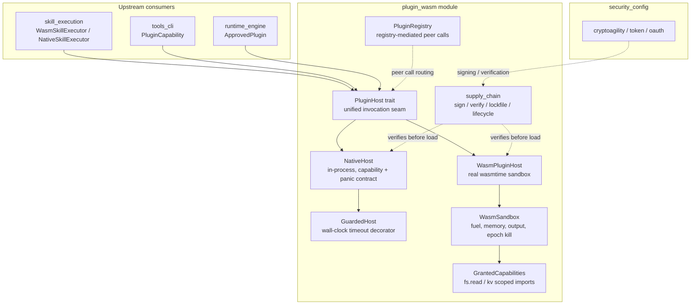
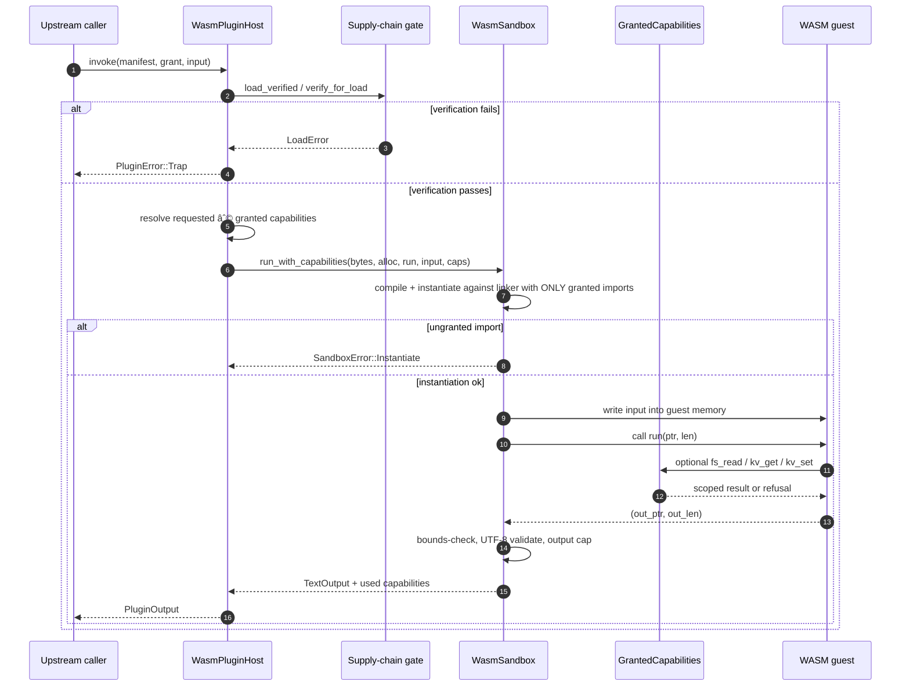

# plugin_wasm — Capability-Confined Plugin & WASM Sandbox Runtime

## Purpose

The `plugin_wasm` module is the system's **untrusted-code execution boundary**. It provides the infrastructure to load, confine, and invoke third-party or machine-generated plugins without giving them ambient authority over the host process, the filesystem, the network, or sensitive platform resources.

The module is built on two core ideas:

1. **Capability-based confinement** — a plugin receives only the intersection of what its manifest requests and what governance grants (`requested ∩ granted`). There is no global namespace, no automatic access to syscalls, and no way for a plugin to reach a resource it was not explicitly given.
2. **Hard runtime isolation** — untrusted code runs inside a WebAssembly sandbox with deterministic fuel, memory, output, and wall-clock ceilings enforced by the runtime, not by guest cooperation.

`plugin_wasm` sits inside the larger [`application_runtime`](application_runtime.md) subsystem and is consumed by [`skill_execution`](skill_execution.md) (which dispatches to `WasmSkillExecutor` / `NativeSkillExecutor`) and by the tool runtime in [`tools_cli`](tools_cli.md). It also depends on [`security_config`](security_config.md) for identity and cryptographic primitives used during plugin supply-chain verification.

---

## Architecture Overview

### Key design decisions

| Decision | Rationale |
|----------|-----------|
| Single `PluginHost` trait for native and WASM | Lets the rest of the system treat both trusted first-party plugins and untrusted third-party plugins identically. The security-boundary composition (`GuardedHost<H>`) is unchanged when swapping `NativeHost` for `WasmPluginHost`. |
| `requested ∩ granted` effective capabilities | Least-privilege by construction. A plugin cannot use a capability merely because it was granted by governance if it did not also declare a need for it in its manifest. |
| Zero ambient authority in WASM | Modules instantiate against an empty import set by default. Any ungranted import (host function, memory, global, table) causes instantiation to fail before guest code runs. |
| Fuel + epoch interruption | `fuel` bounds executed wasm instructions; `max_wall_clock_ms` uses wasmtime epoch interruption to kill calls that burn little fuel but block inside granted host functions. |
| Supply-chain verification on every load | `control.lock` hash pins, detached signatures, publisher allow-lists, and lifecycle stages are checked each time a plugin is loaded, not only at install time. |
| Registry-mediated peer calls | Plugins never hold direct references to each other. Inter-plugin calls are capability-named and routed through `PluginRegistry`, with bounded call depth to prevent cycles or runaway fan-out. |

---

## Sub-modules

`plugin_wasm` is implemented by two crates that together form the complete isolation stack:

| Sub-module | Crate | Responsibility | Documentation |
|------------|-------|----------------|---------------|
| `plugin_wasm_plugin` | `ainxt-plugin` | Capability model, `PluginHost` seam, in-process `NativeHost`, wall-clock `GuardedHost`, registry-mediated peer calls, and supply-chain signing/verification/lifecycle. | [plugin_wasm_plugin.md](plugin_wasm_plugin.md) |
| `plugin_wasm_sandbox` | `ainxt-wasm` | Real WebAssembly sandbox using `wasmtime`: fuel, memory, output, and wall-clock limits, zero-ambient-authority instantiation, and scoped host imports (`fs.read`, `kv`). | [plugin_wasm_sandbox.md](plugin_wasm_sandbox.md) |

---

## Data Flow: Invoking a WASM Plugin

---

## Integration with the rest of the system

- **Parent module**: [`application_runtime`](application_runtime.md) orchestrates plugins alongside skills, surfaces, and conversation managers.
- **Consumer**: [`skill_execution`](skill_execution.md) uses `WasmSkillExecutor` and `NativeSkillExecutor` to run skills that may be backed by the plugin hosts documented here.
- **Consumer**: [`runtime_engine`](runtime_engine.md) carries `ApprovedPlugin` and the served plugin registration path; it passes the same `PluginHost` trait object to the tool runtime.
- **Dependencies**: [`security_config`](security_config.md) provides the cryptographic primitives (hash agility, token storage, OAuth) that the supply-chain subsystem relies on for signing, verification, and publisher identity.

---

## Security Invariants

1. **No ambient authority.** A plugin can only import host functions that were explicitly granted for that invocation. Ungranted imports fail at instantiation.
2. **Least privilege.** Effective authority is always `requested_capabilities` intersected with `grant.granted`.
3. **Isolation.** Guest traps, panics, infinite loops, and out-of-bounds accesses are contained; the host process survives and the sandbox remains reusable.
4. **Bounded resources.** Fuel, memory, output size, and wall-clock time are capped and enforced by the runtime.
5. **Verifiable provenance.** Every load re-verifies publisher allow-list, detached signature, artifact hash, and `control.lock` pin.
6. **Bounded peer calls.** Inter-plugin calls are registry-routed and depth-limited; cycles cannot hang or overflow the host.

---

## Related Documentation

- [plugin_wasm_plugin.md](plugin_wasm_plugin.md) — capability model, `PluginHost` seam, `NativeHost`, `GuardedHost`, `PluginRegistry`, and supply-chain verification.
- [plugin_wasm_sandbox.md](plugin_wasm_sandbox.md) — `WasmSandbox`, `WasmPluginHost`, fuel/epoch resource limits, and scoped host imports (`fs.read`, `kv`).
