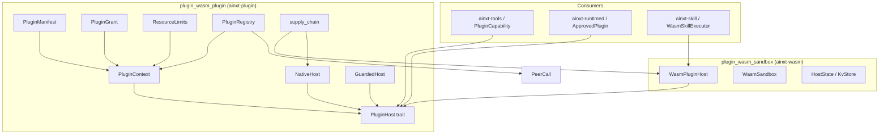
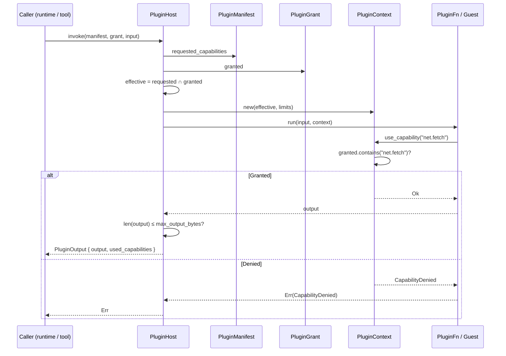
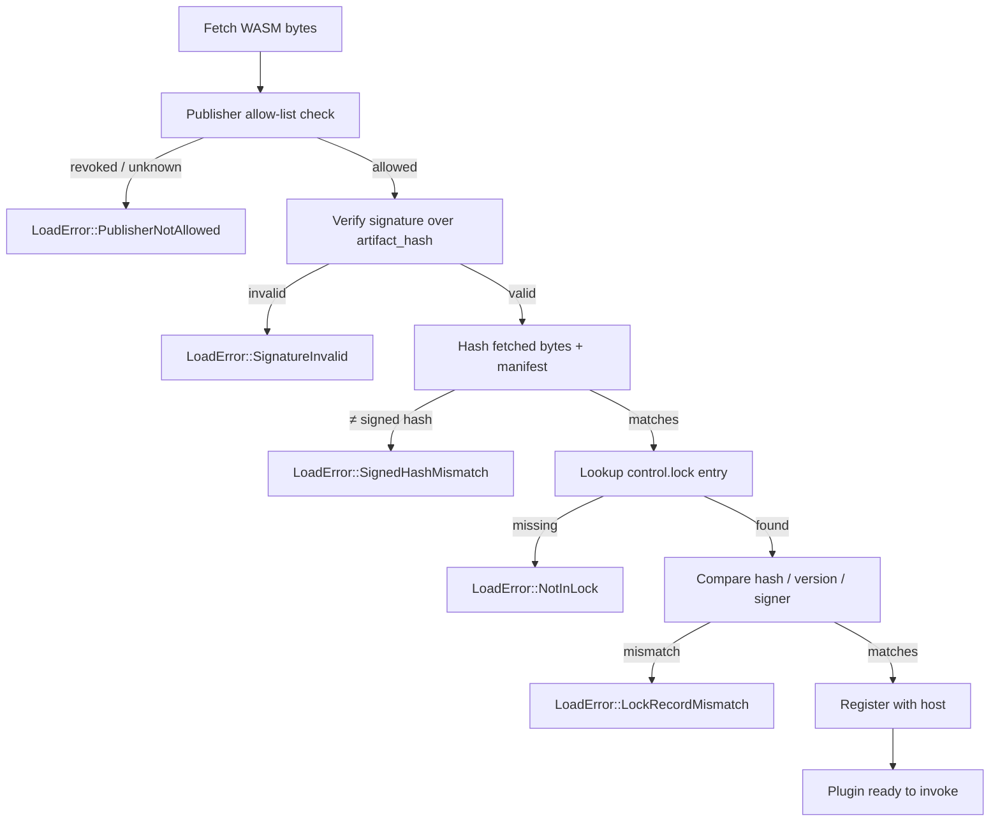
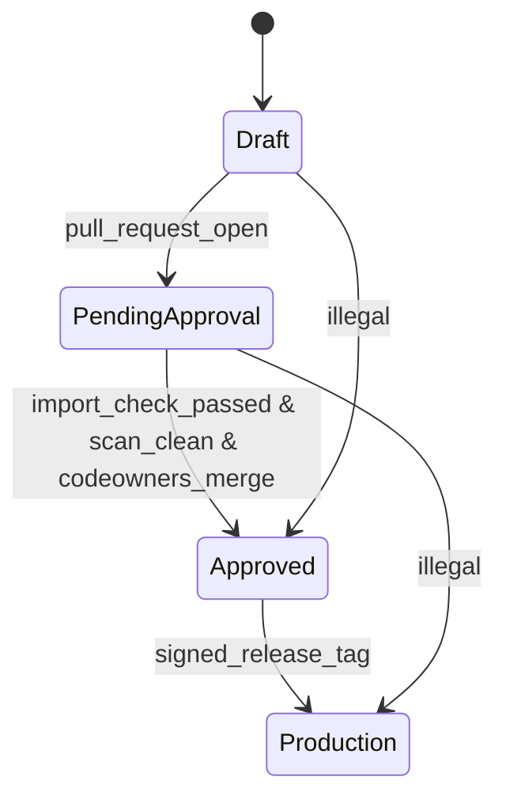
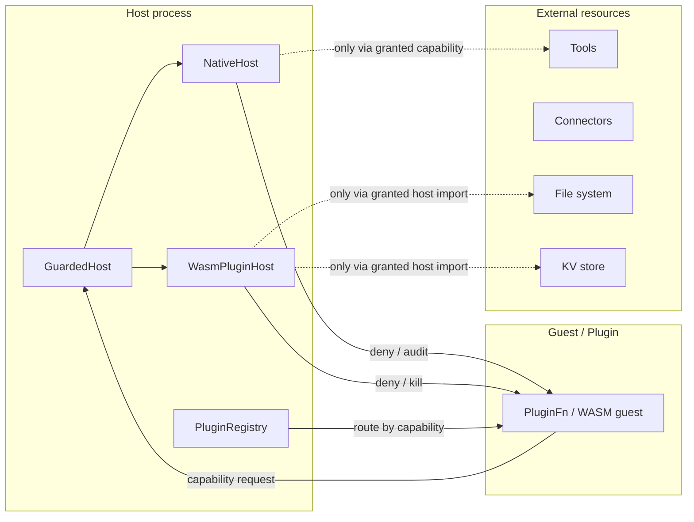

# plugin_wasm_plugin

## Introduction

`plugin_wasm_plugin` (the `ainxt-plugin` crate) is the capability-based plugin isolation layer of the AiNxt system. It defines the contract by which untrusted code — whether a native Rust closure or a WebAssembly (WASM) guest — is confined, dispatched, and loaded safely. The crate itself contains no WASM engine; instead it exposes a host seam ([`PluginHost`]) that is implemented by [`plugin_wasm_sandbox`](plugin_wasm_sandbox.md) (`ainxt-wasm`) for real third-party sandboxing and by `NativeHost` for in-process tests and trusted first-party plugins.

The module's security model is built on **capability-based confinement**: a plugin receives only the intersection of the capabilities it requests and the capabilities governance grants (`requested ∩ granted`). It has no ambient authority, cannot access tools or connectors it was not granted, and every use of a capability is recorded for audit. On top of that, the host enforces output-size limits, panic/trap isolation, wall-clock timeouts, and bounded inter-plugin call depth.

This crate also implements the **plugin supply-chain gate** (§3.3/§3.4): content hashing, detached-signature verification, publisher allow-listing, `control.lock` hash-pinning, import-vs-declared-need checks, dependency-advisory scanning, and a git-native lifecycle state machine from `Draft` to `Production`.

---

## Core Responsibilities

| Responsibility | Description |
| -------------- | ----------- |
| **Capability confinement** | Each plugin invocation receives a [`PluginContext`] or [`PeerCall`] exposing exactly `requested ∩ granted` capabilities. |
| **Host abstraction** | [`PluginHost`] is the isolation seam; [`NativeHost`] runs in-process, while [`plugin_wasm_sandbox`](plugin_wasm_sandbox.md) supplies the WASM implementation. |
| **Resource governance** | Enforces `max_output_bytes`, `max_millis`, and `max_memory_bytes` limits; [`GuardedHost`] adds a wall-clock timeout decorator. |
| **Fault isolation** | Plugin panics/traps are caught and converted to [`PluginError::Trap`]; the host survives. |
| **Inter-plugin routing** | [`PluginRegistry`] provides registry-mediated, capability-named peer calls with bounded call depth. |
| **Supply-chain gating** | [`supply_chain`] verifies signatures, publisher allow-lists, lockfile pins, import justifications, advisory scans, and lifecycle promotions on every load. |

---

## Architecture

### High-level component diagram



### Capability confinement data flow



### Plugin load verification flow



### Lifecycle promotion state machine



---

## Key Components

### `PluginManifest`, `PluginGrant`, and `ResourceLimits`

- [`PluginManifest`] declares the plugin's `id`, the capabilities it requests, and its resource limits.
- [`PluginGrant`] is the governance decision: the list of capabilities actually granted to this plugin.
- [`ResourceLimits`] declares `max_output_bytes`, `max_millis`, and `max_memory_bytes`. Defaults are 64 KiB output, 5 s wall-clock, and 16 MiB memory.

Effective authority is always computed as `requested ∩ granted`, enforcing least privilege.

### `PluginContext`

[`PluginContext`] is the only door from a plugin to the outside world. It exposes:

- `use_capability(&str)` — records a capability use or returns [`PluginError::CapabilityDenied`].
- `has_capability(&str)` — read-only membership test.
- `limits` — the plugin's resource budget.

No ambient authority exists: a plugin cannot reach a tool, connector, file, or KV entry unless the capability is in the effective set.

### `PluginHost` and `NativeHost`

[`PluginHost`] is the isolation seam. Every implementation must enforce:

1. Effective capabilities = `requested ∩ granted`.
2. No ambient authority.
3. Output size limit.
4. Trap/panic isolation.

[`NativeHost`] is the in-process implementation. It registers Rust closures (`PluginFn`) and catches panics via `catch_unwind`. It does **not** provide hard memory/time isolation; that is the responsibility of the WASM host.

### `GuardedHost`

[`GuardedHost<H>`] is a decorator that adds a host-side wall-clock timeout. It spawns the wrapped host invocation on a worker thread and abandons it if `max_millis` elapses, returning [`PluginError::WallClockExceeded`]. It can wrap both `NativeHost` and `WasmPluginHost`, and supports type-erased `Arc<dyn PluginHost + Send + Sync>` via `from_arc`.

> **Note:** A native host cannot forcibly kill a guest thread. Hard CPU/memory kill is performed by `ainxt_wasm::WasmPluginHost` using wasmtime epoch interruption and store limits. See [`plugin_wasm_sandbox`](plugin_wasm_sandbox.md) for details.

### `PluginRegistry` and inter-plugin calls

[`PluginRegistry`] extends the host contract with §3.2 dependency isolation. Plugins register the capabilities they **expose**; peers invoke them by capability name through [`PeerCall::call`]. The registry:

- Routes calls without giving the caller any reference to the provider's state.
- Rejects duplicate capability exposers at registration.
- Bounds inter-plugin call depth (default 8) to prevent cycles or runaway fan-out.
- Resets call depth for each top-level invocation.

> **Current deployment note:** The served runtime path (`ainxt_tools::plugin_bridge`) invokes a single plugin per dispatch and does not currently expose inter-plugin calls to guests. `PluginRegistry` is the seam to reach for when that capability is needed; it is fully unit-tested but not wired into the served composition root today.

### `supply_chain`

The [`supply_chain`] module implements the load-time and publish-time gates:

| Type / Function | Purpose |
| --------------- | ------- |
| `artifact_hash` | Canonical SHA-256 over length-prefixed WASM bytes + manifest fields. |
| `Signer` / `Verifier` | Detached-signature seam; offline reference impls are `HmacSigner` / `HmacVerifier`. |
| `PublisherAllowList` | Set of publishers permitted to sign loadable plugins. |
| `SignedPlugin` | Manifest + artifact hash + publisher + version + signature. |
| `ControlLock` / `LockEntry` | Per-environment hash/version/signer pin. |
| `load_verified` | Closes the load gap: registers with the host **only if** every check passes. |
| `verify_for_load` | Publisher → signature → signed hash → lock entry → lock match. |
| `import_check` | Publish-time check that every requested capability is justified. |
| `DependencyScanner` / `AdvisoryScanner` | Scan declared dependencies against known advisories. |
| `Stage` / `PromotionEvidence` / `promote` | Git-native lifecycle: Draft → PendingApproval → Approved → Production. |

---

## Error Model

[`PluginError`] enumerates the failure modes the host surfaces:

- `CapabilityDenied` — plugin tried to use a capability outside `requested ∩ granted`.
- `OutputTooLarge` — plugin output exceeded `max_output_bytes`.
- `Trap` — plugin panicked, trapped, or returned a typed trap.
- `NotFound` — no plugin with the requested id is registered.
- `CapabilityUnavailable` — a granted capability has no registered exposer (registry path).
- `CallDepthExceeded` — inter-plugin call chain exceeded `max_depth`.
- `WallClockExceeded` — plugin exceeded its wall-clock budget.

[`supply_chain::LoadError`] enumerates hard load-time refusals: publisher not allowed, invalid signature, not in lockfile, hash mismatch, signed hash mismatch, and lock record mismatch. Every load failure is a hard failure; the runtime never executes an unverified binary.

[`supply_chain::RegisterError`] and [`supply_chain::PromoteError`] cover registry registration conflicts and illegal lifecycle transitions, respectively.

---

## Integration with the System

`plugin_wasm_plugin` sits in the **application runtime** layer under `plugin_wasm`. It is consumed by:

- **[`plugin_wasm_sandbox`](plugin_wasm_sandbox.md)** — implements `PluginHost` for WASM/WASI guests using wasmtime, providing hard memory and CPU isolation.
- **[`skill_execution`](skill_execution.md)** — `ainxt-skill` uses `WasmSkillExecutor` and `WasmSkillModule` to run skills inside the WASM sandbox.
- **[`tools_cli`](tools_cli.md)** — `ainxt-tools` exposes `PluginCapability`, bridging tool dispatch into the plugin host.
- **[`runtime_engine`](runtime_engine.md)** — `ainxt-runtimed` registers `ApprovedPlugin` instances and mixes `NativeHost` and `WasmPluginHost` behind a single trait object.

The crate depends on lower-level infrastructure such as [`security_config`](security_config.md) (cryptographic primitives via `sha2`) and is governed by configuration from [`core_infrastructure`](core_infrastructure.md), but it does not directly interact with retrieval, memory, or prompt-engineering modules.

---

## Security Boundaries



The boundary is enforced at two levels:

1. **Capability gate** — the context refuses ungranted capability requests.
2. **Host import gate** — the WASM host links only a fixed, capability-scoped set of host imports (`fs_read`, `kv_get`, `kv_set`, etc.) and never exposes a direct peer-call or ambient-system import.

---

## Configuration and Defaults

`ResourceLimits` defaults are suitable for lightweight plugins:

```rust
ResourceLimits {
    max_output_bytes: 64 * 1024,      // 64 KiB
    max_millis: 5_000,                // 5 seconds
    max_memory_bytes: 16 * 1024 * 1024, // 16 MiB
}
```

These defaults can be overridden per plugin via `PluginManifest`. The WASM host enforces `max_memory_bytes` and hard CPU limits; the native host relies on `GuardedHost` for wall-clock enforcement.

---

## References

- **[`plugin_wasm_sandbox`](plugin_wasm_sandbox.md)** — WASM/WASI host implementation that realizes hard sandboxing for this crate's `PluginHost` trait.
- **[`skill_execution`](skill_execution.md)** — executes skills as WASM plugins via `WasmSkillExecutor`.
- **[`tools_cli`](tools_cli.md)** — tool runtime that bridges `PluginCapability` to the plugin host.
- **[`runtime_engine`](runtime_engine.md)** — served runtime that registers and dispatches approved plugins.
- **[`security_config`](security_config.md)** — cryptographic primitives and identity infrastructure that underpin supply-chain verification.
- **[`core_infrastructure`](core_infrastructure.md)** — system-wide configuration and shared types.
