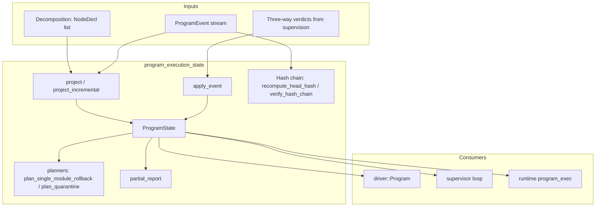
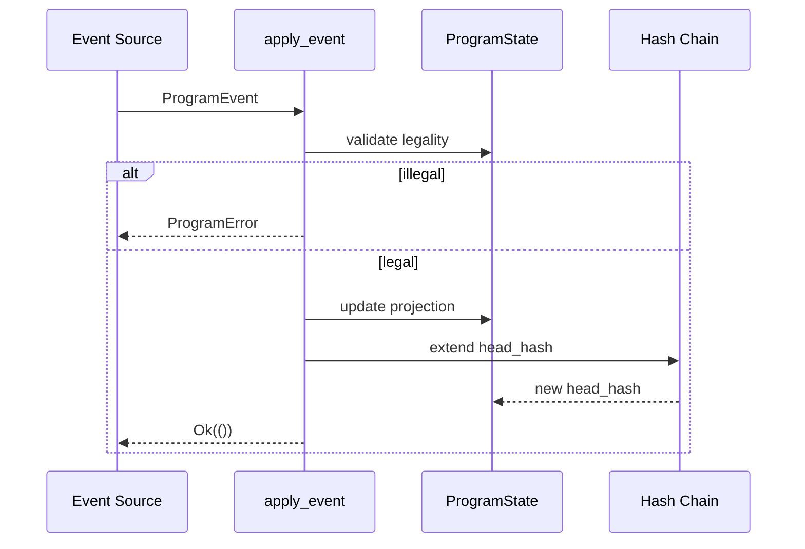
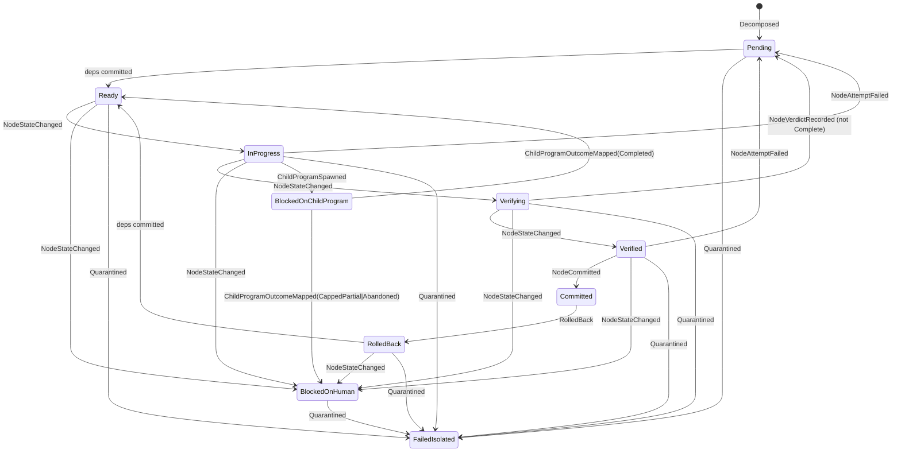
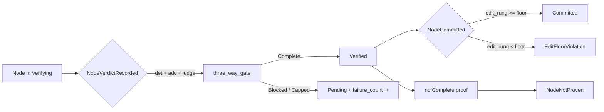
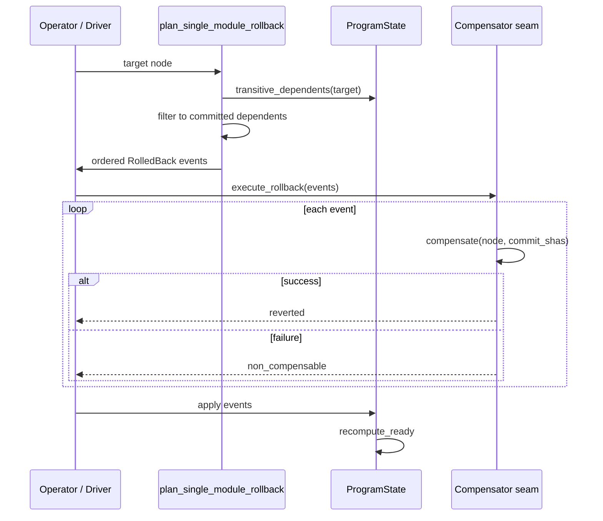
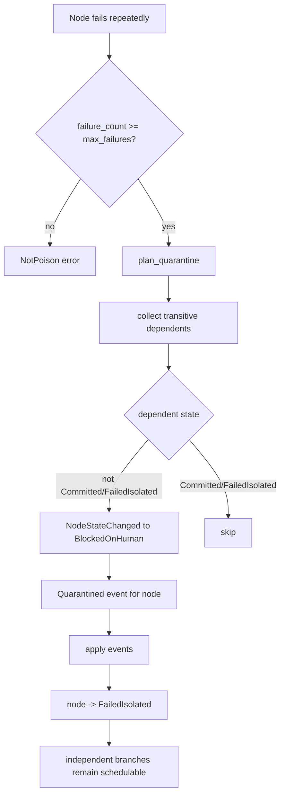
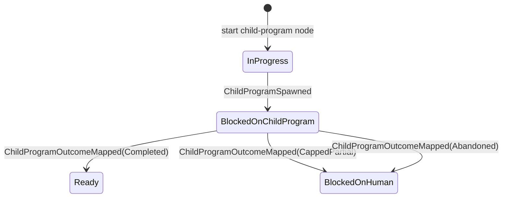
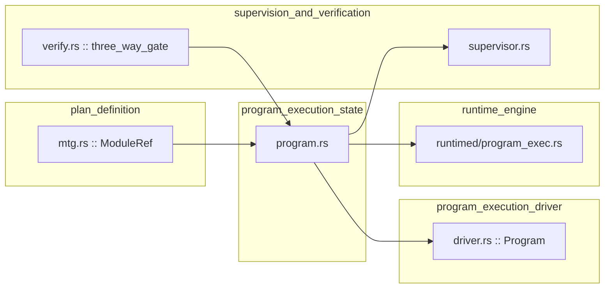

# Program Execution State

The **program execution state** module (`crates/ainxt-planner/src/program.rs`) implements the durable, event-sourced aggregate that represents a long-horizon program above an individual [Run](runtime_engine.md). While a [Plan](plan_definition.md) is an adaptable, in-memory plan lifecycle, a **Program** is the layer above it: a pure, deterministic state machine whose entire state is a projection of an append-only, hash-chained event stream. This design lets programs survive restarts, model swaps, and multi-week wall-clock execution without losing consistency or auditability.

The module is intentionally free of clock, I/O, and threading concerns. State is never mutated in place from the outside; it is **folded from events** via [`project`](program_execution_state.md#projection-and-hash-chain), and every helper that "does" something returns the events that would be appended. The event log is therefore the single source of truth, enabling point-in-time replay, incremental resume, and tamper-evident audit.

---

## Core Concepts

| Concept | Description |
|---------|-------------|
| **Program** | A durable aggregate composed of migration-unit nodes, driven through phases from `Draft` to terminal outcomes (`Completed`, `CappedPartial`, `Abandoned`). |
| **Node** | A single migration unit identified by a [`ModuleRef`](plan_definition.md). Each node carries a contract: class, dependencies, dependents (blast radius), verification plan, working-set estimate, and edit-ladder floor. |
| **Event Stream** | An append-only sequence of [`ProgramEvent`](program_execution_state.md#programevent) values. Every event extends a deterministic hash chain. |
| **Projection** | [`ProgramState`](program_execution_state.md#programstate) is produced by folding events through [`project`](program_execution_state.md#projection-and-hash-chain). |
| **Three-Way Gate** | A node is only considered `Verified` when deterministic, adversarial Breaker, and cross-model Judge verdicts all yield `Complete`. See [supervision and verification](supervision_and_verification.md). |
| **Edit-Ladder Floor** | A node contract may forbid low-safety edit rungs (e.g. raw `TextPatch` on a critical-path module). The floor is enforced at the commit gate. |
| **Poison Node** | A node that fails past a configured cap is quarantined (`FailedIsolated`) so the program can route around it and complete independent branches. |
| **Single-Module Rollback** | Reverts one committed node and re-opens its committed transitive dependents, leaving the remaining committed set dependency-closed and deployable. |

---

## Architecture

The module sits at the center of the planning-and-execution pipeline. It receives node declarations from the [plan definition](plan_definition.md) layer, verification verdicts from the [supervision and verification](supervision_and_verification.md) layer, and event streams from the [program execution driver](program_execution_driver.md). Its outputs—projected state, rollback plans, quarantine plans, and partial-completion reports—feed back into the driver, supervisor, and runtime governance surfaces.

---

## Component Reference

### `ProgramId`
Stable string identity of a Program.

### `NodeId`
Alias for [`ModuleRef`](plan_definition.md); a node is identified by its migration-unit reference.

### `NodeClass`
Classifies the migration unit:
- `MigrationRun`, `Shim`, `ShimCleanup`, `Integration`, `CharacterizationTest`, `DecouplingRefactor`, `DeterministicCodemod`
- `ChildProgram`: spawns a nested Program rather than a single Run.

### `CheckpointClass`
Drives human-gate behavior: `None`, `PhaseBoundary`, `CriticalPath`, `Anomaly`.

### `EditRung`
Ordered safety levels for semantic editing: `TextPatch` < `StructuredPatch` < `Ast` < `Lsp`. The node contract's `edit_ladder_floor` is enforced with `>=` semantics.

### `NodeState`
Per-node state machine:
- `Pending`, `Ready` (derived from committed dependencies)
- `InProgress`, `Verifying`, `Verified`
- `Committed`
- `RolledBack`
- `BlockedOnHuman`
- `FailedIsolated` (poison-node quarantine)
- `BlockedOnChildProgram`

### `ProgramPhase`
Per-program lifecycle: `Draft` → `Decomposed` → `Approved` → `Running` → (`Paused` / `CheckpointReview`) → terminal (`Completed`, `CappedPartial`, `Abandoned`).

### `NodeDecl`
A node declaration supplied at decomposition time. Carries the full ADR-027 node contract:
- `id`, `node_class`, `checkpoint_class`, `deps`
- `working_set_estimate` (tokens for admissibility checks)
- `blast_radius` (dependents from call/import graph)
- `verification_plan` (tests/seams that gate the node)
- `edit_ladder_floor`

### `ProgramNode`
The live projection of a `NodeDecl` within `ProgramState`, including current `state`, `commit_shas`, `failure_count`, and optional `child_program_id`.

### `ProgramEvent`
The append-only event stream. Key events include:
- Lifecycle: `Created`, `Decomposed`, `Approved`, `Paused`, `Resumed`, `CheckpointReviewOpened`, `Outcome`
- Node work: `NodeStateChanged`, `NodeAttemptFailed`, `NodeVerdictRecorded`, `NodeCommitted`
- Child programs: `ChildProgramSpawned`, `ChildProgramOutcomeMapped`
- Recovery: `RolledBack`, `Quarantined`
- Audit: `Checkpoint`

### `ProgramError`
Every way an event can be rejected: wrong phase, duplicate node, self-dependency, dangling dependency, cycle, illegal transition, unproven commit, edit-floor violation, terminal phase, etc.

### `ProgramState`
The folded projection. Contains:
- `program_id`, `goal`, `phase`
- `nodes` and declaration `order`
- `ledger_keys` (idempotency set for commits)
- `node_verdicts` (durable three-way gate outcomes)
- `proven_edit_rung` (rung used for each verified node)
- `event_offset`, `head_hash`, `last_checkpoint_offset`

### `PoisonPolicy`
Configures how many failed attempts (`max_failures`) before a node is considered poison.

### `RollbackReport`
Honest report from executing a rollback: lists reverted nodes and non-compensable nodes.

### `PartialCompletionReport`
First-class, deployable partial-completion report: committed nodes, blocked nodes, failed-isolated nodes, completion fraction, and whether the committed subset is dependency-closed.

---

## Projection and Hash Chain

The [`project`](program_execution_state.md#projection-and-hash-chain) function folds an entire event stream into a `ProgramState`. [`project_incremental`](program_execution_state.md#projection-and-hash-chain) continues folding from a checkpoint, making Friday→Monday resume efficient and equivalent to full replay.

The hash chain is deterministic and order-sensitive:
- `recompute_head_hash(events)` recomputes the chain head without enforcing legality, so tamper detection works even on malformed logs.
- `verify_hash_chain(events, claimed_head)` returns `ChainVerdict::Intact` or `ChainVerdict::Tampered`.

The reference implementation uses FNV-1a for determinism and zero dependencies; the runtime swaps in a crypto-agility-selected hash at the real [event-log](core_interaction.md) seam.

---

## Node Lifecycle

`Ready` is always derived, never set directly. After any event that changes the committed set, `recompute_ready` updates `Pending`/`Ready`/`RolledBack` nodes based on whether all dependencies are `Committed`.

---

## Three-Way Gate and Commit Gate

A node reaches `Verified` only when a `NodeVerdictRecorded` event carries three independent verdicts whose combined outcome is `Complete`. The gate is recomputed on every replay by [`three_way_gate`](supervision_and_verification.md), so "done" is a durable proof rather than a self-report.

At the commit gate:
1. The node must be `Verified`.
2. The node must have a `Complete` proof (`NodeNotProven` otherwise).
3. The recorded `edit_rung` must be at least the node's `edit_ladder_floor` (`EditFloorViolation` otherwise).
4. The commit is idempotent on `ledger_key` to prevent double-commit on resume.

---

## Single-Module Rollback

Rolling back a committed node reverts that node and every **committed transitive dependent**, leaving independent committed nodes untouched. The resulting committed subset remains dependency-closed and deployable. The [`Compensator`](program_execution_state.md#rollbackreport) trait injects the I/O seam (git revert, MR un-create) so the pure planner can surface non-compensable steps honestly rather than hiding failures.

---

## Poison-Node Quarantine and Route-Around

When a node crosses the poison cap, it is quarantined to `FailedIsolated`. Its transitive dependents are raised to `BlockedOnHuman`, while independent branches continue to be schedulable. This lets the program complete what it can and produce an honest `CappedPartial` outcome rather than stalling forever.

---

## Child-Program Composition

A `ChildProgram` node spawns a nested Program and blocks on its terminal outcome. The mapping from `ChildOutcome` to parent `NodeState` is deterministic and is the only sanctioned exit from `BlockedOnChildProgram`:
- `Completed` → `Ready`
- `CappedPartial` / `Abandoned` → `BlockedOnHuman`

---

## Partial-Completion Report

When a program terminates with `CappedPartial` (or is inspected mid-flight), [`partial_report`](program_execution_state.md#partialcompletionreport) produces a first-class report containing:
- Committed node ids
- Blocked nodes and their states
- Failed-isolated nodes
- Completion fraction
- Whether the committed subset is dependency-closed and therefore deployable

This implements the §8 requirement that partial completion be honest and deployable, not a hidden failure mode.

---

## Module Dependencies

- **[plan_definition](plan_definition.md)** supplies `ModuleRef` (node identity) and the decomposition data model (`MtgNode` working-set estimates feed `NodeDecl`).
- **[supervision_and_verification](supervision_and_verification.md)** supplies the `three_way_gate`, `AdversarialVerdict`, `DeterministicVerdict`, `JudgeVerdict`, and `GateOutcome` types used by `NodeVerdictRecorded`.
- **[program_execution_driver](program_execution_driver.md)** wraps `ProgramState` in `driver::Program`, emits events, and enforces the commit gate through the driver API.
- **[runtime_engine / program_governance_and_execution](program_governance_and_execution.md)** consumes `ProgramState` and program outcomes to coordinate served programs, workforce surfaces, and runtime governance.

---

## Integration with the Wider System

The program execution state module is a pure kernel. All side effects are injected:

| Concern | Injected At | Related Module |
|---------|-------------|----------------|
| Clock / wall time | Runtime scheduler | [runtime_engine](runtime_engine.md) |
| Crypto hash for event log | Event-log seam | [core_interaction](core_interaction.md) via `ainxt-eventlog` |
| I/O compensation (git/MR) | `Compensator` trait | [program_execution_driver](program_execution_driver.md) |
| Model dispatch and verification | Driver / supervisor | [supervision_and_verification](supervision_and_verification.md) |
| Identity / credentials | Runtime executor | [identity_authority](identity_authority.md) |
| Serving, placement, rollout | Runtime surfaces | [server_serving](server_serving.md) |

This separation makes the aggregate fully testable offline: every invariant (idempotent commits, model-swap survival, rollback cascade, poison route-around, child-program mapping) is exercised by deterministic unit tests against mock events.

---

## Key Invariants

1. **Event-sourced, hash-chained state** — `ProgramState` is a fold of the event stream; each event extends `head_hash`.
2. **Idempotent resume** — re-applying a `NodeCommitted` event with a known `ledger_key` is a no-op.
3. **Model-swap survival** — the committed set depends only on code and contracts; `by_model` is audit-only.
4. **Never done until proven** — a node cannot commit without a `Complete` three-way proof on the log.
5. **Edit-ladder floor** — a below-floor artifact is refused at the commit gate even with a green proof.
6. **Dependency-closed committed set** — after rollback or quarantine, the committed subset remains deployable.
7. **Poison route-around** — quarantining a node gates only its dependents; independent branches continue.
8. **Honest partial completion** — `PartialCompletionReport` surfaces blocked and non-compensable nodes rather than hiding them.

---

## See Also

- [plan_definition](plan_definition.md) — plan decomposition and `ModuleRef`
- [program_execution_driver](program_execution_driver.md) — driver that emits events and wraps `ProgramState`
- [supervision_and_verification](supervision_and_verification.md) — three-way gate and supervisor loop
- [program_governance_and_execution](program_governance_and_execution.md) — runtime integration of programs
- [runtime_engine](runtime_engine.md) — core engine and turn execution
- [core_interaction](core_interaction.md) — event-log and session infrastructure
